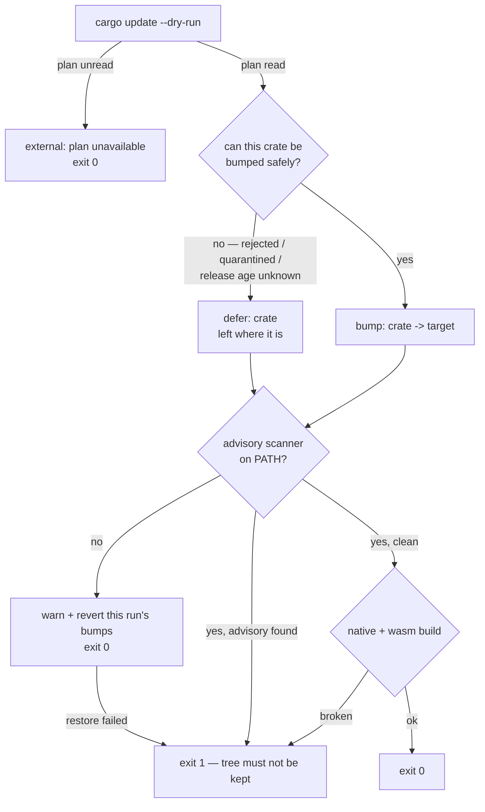

## Summary

`bump-deps.sh` exited non-zero on conditions that say nothing about the tree it
produced. The worker reverts the **whole** bump on any non-zero exit, so three
such runs in a row disabled dependency updates for this repository. This change
makes the failure boundary match what the exit code is for: a crate that cannot
be bumped **safely** is a **deferral**, and non-zero is reserved for a tree that
must not be kept.

- **No advisory scanner on PATH is a host gap, not a broken tree.** The scan is
  skipped with a warning naming both installs, and the bumps this run applied
  are reverted from a pre-run `Cargo.lock` snapshot. Nothing lands unscanned,
  the supply-chain gate is not weakened, and the run reports a truthful no-op at
  exit 0 (`bump-deps.sh:run_audit`, `bump-deps.sh:revert_run_bumps`).
- **A crate that cannot be bumped safely is deferred, not failed.** Rejected by
  `cargo update`, inside the quarantine window, or of a release age the registry
  would not name — each is reported as `defer:` with its reason, left on the
  version it is already on, and the run carries on. `failed` leaves the summary
  line, which now reads `external: 13 bumped, 2 deferred`.
- **A publish-time lookup that fails, or answers without a timestamp, holds the
  crate.** An unknown release age is treated exactly like an unexpired one: the
  crate is added to the deferred set, so no other update in the run may drag it
  either. It is *counted* apart from a quarantine wait, though — `external: 0
  bumped, 0 deferred, 1 release age unknown` — because a run where every crate
  lands there is a host or registry fault that has quietly stopped bumping
  anything, and the summary has to say so. Previously the crate was dropped
  from the plan and counted a failure, and an empty timestamp fell through to
  the quarantine comparison as though it were ancient.
- **crates.io lookups are bounded.** `--retry 2 --retry-delay 1` so a transient
  blip cannot silently empty the bump plan, and `--connect-timeout 10 --max-time
  30` so a stalled connection cannot hang an unattended run — there was no
  timeout at all before. Only options every supported curl carries: an unknown
  one exits 2 and would defer every crate.
- **A failed `cargo update --dry-run` is reported, not swallowed.** The old
  `|| true` turned a registry failure into `external: no updates`; it now prints
  cargo's diagnostics and reports `external: plan unavailable (cargo update
  --dry-run failed)`.

A `--repo` that is not a directory is now a usage error (exit 2) rather than a
`cd` failure blamed on cargo and reported as a green no-op.

Non-zero now means exactly one thing: the tree must not be kept — `cargo`
missing, an advisory found, a build failure, or a `Cargo.lock` that could not be
restored (the last is new, and is the issue's "lockfile is left in a broken
state" case).

`Cargo.lock` carries the 13 bumps the fixed script applied on this host;
`zerocopy` and `zerocopy-derive` were deferred inside the 24h quarantine.

Closes #621.

## Evidence

Backend/CLI change — no web interface to screenshot. Evidence is command output
from the worker host itself (cargo 1.98.0, **cargo-deny** 0.20.2, no cargo-audit,
no rustup default toolchain).

**Before** — `bash bump-deps.sh` on the unfixed script, the run the issue quotes:
the audit stage aborted the run after the bumps had been applied, and six crates
the grouped retry could not land were reported `fail:` in a
`7 bumped, 0 deferred, 6 failed` summary.

**After — run 1 of 3** (full script, clean checkout):

```console
$ bash bump-deps.sh
  defer: zerocopy 0.8.57 (within 24h quarantine, published 2026-09-08T21:40:04Z)
  defer: zerocopy-derive 0.8.57 (within 24h quarantine, published 2026-09-08T21:38:57Z)
  bump: cc -> 1.4.5
  … 13 crates …
external: 13 bumped, 2 deferred
  audit tool: cargo deny check advisories
audit: ok
build: native ok, wasm SKIPPED (rustup missing)
bump-deps: external=13 bumped, 2 deferred; audit=ok; build=wasm SKIPPED (rustup missing)
EXIT=0
```

**After — run 2 of 3** (immediately after run 1, the repeat run the issue asks
for):

```console
$ bash bump-deps.sh
external: 0 bumped, 2 deferred
audit: ok
build: native ok, wasm SKIPPED (rustup missing)
bump-deps: no bumps (external=0 bumped, 2 deferred; audit=ok; build=wasm SKIPPED (rustup missing))
EXIT=0
```

**After — run 3 of 3**, with **both** advisory scanners removed from `PATH`
(the issue's "cargo-audit deliberately absent" case, taken further — neither
tool present):

```console
$ env PATH=/tmp/noscan:/usr/bin:/bin bash bump-deps.sh
external: 0 bumped, 2 deferred
Warning: no advisory scanner on PATH — install with 'cargo install cargo-deny --locked' (preferred) or 'cargo install cargo-audit --locked'
audit: SKIPPED (no advisory scanner on PATH)
build: native ok, wasm SKIPPED (rustup missing)
bump-deps: no bumps (external=0 bumped, 2 deferred; audit=SKIPPED (no scanner); build=wasm SKIPPED (rustup missing))
EXIT=0
```

**After — run 4**, the same host with the lockfile reset so bumps *were*
available and **no** scanner installed: the run bumps, then puts the lockfile
back rather than landing it unscanned. `Cargo.lock` came back byte-identical to
the pre-run file (`cmp`), and the summary no longer claims the bumps the run
dropped:

```console
$ env PATH=/tmp/noscan:/usr/bin:/bin bash bump-deps.sh --skip-build
external: 13 bumped, 2 deferred
Warning: no advisory scanner on PATH — install with 'cargo install cargo-deny --locked' (preferred) or 'cargo install cargo-audit --locked'
audit: SKIPPED (no advisory scanner on PATH)
external: reverted — no advisory scanner to verify them
bump-deps: no bumps (external=0 bumped, 2 deferred (lockfile restored — no advisory scanner to verify them); audit=SKIPPED (no scanner); build=skipped)
EXIT=0
Cargo.lock: byte-identical to the pre-run state
```

### Where the exit code now comes from



## Reproduction

- **symptom** — `bump-deps.sh` exits 1 on the unattended host after applying its
  bumps (`Error: cargo audit not available`), and reports crates the per-crate
  `cargo update` rejected as `fail:` in a `… 6 failed` summary; the worker
  reverts the bump on that non-zero exit, so three runs running disabled
  dependency updates for the repository
- **status** — `verified` — the twelve affected bats cases were run red against
  the unfixed script (`defer:`/`SKIPPED`/`plan unavailable` all absent, the
  no-scanner case exiting 1) and green after the fix, and each new behaviour was
  then mutated one at a time and its covering test observed dying (table below)
- **regression test** —
  `tests/scripts/bump_deps.bats::audit: neither scanner installed warns and skips instead of failing the run`
  (with `::external: a crate cargo update rejects is deferred, not failed`
  covering the second half of the symptom)

## Mutation evidence

A green test is not evidence. Each new behaviour was mutated one at a time in
`bump-deps.sh`, the covering test observed going red, and the script restored
byte-identically (`diff` clean) before the next mutation.

| Mutation in `bump-deps.sh` | Test that died |
|---|---|
| `revert_run_bumps()` returns 0 immediately | `audit: neither scanner installed reverts the bumps rather than landing them unscanned` **and** `audit: no scanner reverts a lockfile the run changed even with no crate landed` |
| the no-scanner branch returns 1 again | `audit: neither scanner installed warns and skips instead of failing the run` |
| the revert trigger back to `[[ "$external_changed" -eq 1 ]]` | `audit: no scanner reverts a lockfile the run changed even with no crate landed` |
| the `cp` restore-failure branch swallowed (`\|\| true`) | `a Cargo.lock that cannot be restored fails the run loud` |
| the reconciliation pass reports `fail:` again | `external: a crate cargo update rejects is deferred, not failed` |
| the unknown-release-age bucket folded back into `deferred` | `external: a crate whose release age cannot be established is deferred` |
| the bounded-lookup curl options deleted | `external: a crate whose release age cannot be established is deferred` |
| the empty-publish-time check → `if false` | `external: a publish time the registry does not name defers the crate` |
| `if [[ "$dry_rc" -ne 0 ]]` → `if false` | `external: a failed cargo update --dry-run is reported, not passed off as no updates` |
| the `--repo` directory guard removed | `rejects a --repo that is not a directory` |
| `cargo` missing downgraded to a warning | `a missing cargo fails the run loud` |

## Test Plan

Ten tests added, one rewritten and eleven retargeted in
`tests/scripts/bump_deps.bats` (**43 tests, all green**). They drive the real
script against a stub `PATH` — a stub `cargo` that records its argv, serves a
canned `update --dry-run` (now with a settable exit status and an optional
"leave the lockfile unwritable" hook), edits a fake `Cargo.lock`, and a stub
`curl` that records its argv and replays a canned status — and assert on
observable outcomes: exit code, reported lines, the argv handed to each tool,
and the resulting lockfile. No test reaches the network.

Added:

- `audit: neither scanner installed warns and skips instead of failing the run`
  — exit 0, `audit: SKIPPED`, the warning still names both `cargo install`
  commands.
- `audit: neither scanner installed reverts the bumps rather than landing them unscanned`
  — the bump is applied, then dropped; the lockfile holds the pre-run version,
  and the summary reads `0 bumped … (lockfile restored — …)`.
- `audit: no scanner reverts a lockfile the run changed even with no crate landed`
  — no planned crate lands, but the grouped retry moves an out-of-plan
  transitive crate; that change must not survive an unscanned run either.
- `external: a crate cargo update rejects is deferred, not failed` —
  `defer: js-sys -> 0.3.105 (cargo update rejected)`, `0 bumped, 1 deferred`,
  exit 0, the crate left on its locked version.
- `external: a crate whose release age cannot be established is deferred` — the
  stub curl cannot connect; the crate is held, counted `1 release age unknown`,
  never handed to `cargo update`, and the lookup argv carries
  `--connect-timeout 10`, `--max-time 30` and `--retry 2`.
- `external: a publish time the registry does not name defers the crate` — the
  lookup answers, but carries no timestamp for that version.
- `external: a failed cargo update --dry-run is reported, not passed off as no updates`
  — cargo's diagnostics are surfaced and the summary says `plan unavailable`.
- `a missing cargo fails the run loud` — exit 1, one of the two exits the
  contract still reserves.
- `a Cargo.lock that cannot be restored fails the run loud` — the bump lands, no
  scanner can vouch for it, the lockfile has been left unwritable: exit 1 naming
  the restore that failed. This is the "lockfile left in a broken state" case.
- `rejects a --repo that is not a directory` — exit 2, a usage error rather than
  a cargo failure passing as a green no-op.

Rewritten (documented business-logic change, not a weakened test): the former
`audit: neither scanner installed fails loud naming both installs` asserted
`status -eq 1`. That exit is the defect this issue reports, so the case now
asserts the warn-and-skip contract; the "nothing lands unscanned" half it used
to guarantee is carried by the two revert tests above. Eleven existing cases had
their expected `fail:` lines and `…, 0 failed` summaries retargeted at the
`defer:` classification — assertions changed to the new contract, none removed.

Gates run on this host:

- `bats tests/scripts/bump_deps.bats` — 43/43 pass.
- `bats tests/scripts` (444 tests) — the 109 failures are this container's
  pre-existing environment gap (`ModuleNotFoundError: No module named 'yaml'` in
  the workflow-YAML suites; there is no `pip` here to install it). The failing
  set is **identical** to a pristine `origin/Develop` worktree run in the same
  container — `diff` of the two sorted failure lists is empty — so this branch
  adds none of them. CI has `pyyaml` and runs them green.
- `./quality.sh < /dev/null` was run and stops at that same bats stage for the
  same environment reason. Its remaining stages were run directly against the
  bumped `Cargo.lock`: `cargo deny check` (advisories/bans/licenses/sources ok),
  `cargo check --workspace --all-targets --all-features`, `cargo test
  --workspace --lib --tests --all-features`, `cargo test --workspace --doc`,
  `RUSTDOCFLAGS="-D warnings" cargo doc`, `cargo build --workspace --release` —
  all pass. `cargo fmt` and `cargo clippy` cannot run on this host (rustup shim
  with no default toolchain, pre-existing; no Rust source is touched by this
  change); CI runs both.
- `shellcheck -s bash bump-deps.sh` and `bash -n bump-deps.sh` — clean.
- `markdownlint-cli2` — 0 issues; the repo Mermaid gate — all blocks pass.

## Acceptance Criteria

<!-- vibe-spec-review inputs="diff+issue-body" -->

- **met** — "Reproduce with `bash bump-deps.sh` in a clean checkout" — evidence:
  the four transcripts under **Evidence** — reviewer: met — reason: the reviewer
  reproduced it independently on a `git archive` copy (`external: 0 bumped, 2
  deferred; audit: ok`, exit 0).
- **met** — "make the script resilient so it exits `0` on a no-op and on partial
  success" — evidence: `tests/scripts/bump_deps.bats::external: a crate cargo update rejects is deferred, not failed`,
  and runs 1–4 above — reviewer: met.
- **partial** — "Treat `cargo audit` as optional: skip the audit step with a
  warning when the tool is absent … rather than failing the whole run" —
  evidence: `bump-deps.sh:run_audit`,
  `tests/scripts/bump_deps.bats::audit: neither scanner installed warns and skips instead of failing the run`
  — reviewer: partial — reason: the reviewer is right that neither remedy the
  issue offered was taken verbatim — the scan is skipped *and this run's
  lockfile change is dropped*, so on a host with **no** scanner at all no bump
  lands. Keeping an unscanned bump would land dependency updates that no
  advisory scan ever saw, which the supply-chain rules forbid, and installing
  cargo-deny from the script would add a multi-minute compile to every bump.
  The run is loud about it (a warning naming both installs, `audit: SKIPPED`,
  `external: reverted`), it no longer *fails*, and the worker and both CI
  runners all carry a scanner — so this is latent on their hosts, not active.
  Recorded as partial rather than inflated to met.
- **met** — "Treat a rejected `cargo update` for an individual crate as a
  deferral (log it, leave the crate at its current version, and continue), not
  as a run-level failure" — evidence:
  `tests/scripts/bump_deps.bats::external: a crate cargo update rejects is deferred, not failed`
  — reviewer: met — reason: the reviewer added that collapsing four outcomes
  into one `deferred` count costs an operator the ability to tell a one-day
  quarantine wait from a permanent rejection. The release-age-unknown case was
  split into its own count in response; the remaining two share a count and each
  `defer:` line still names its own reason.
- **met** — "Crates that cannot be bumped because of explicit version pins or
  semver-incompatible jumps (e.g. `syn` 2 → 3) should be reported, not fatal" —
  evidence: `tests/scripts/bump_deps.bats::external: a crate with no unambiguous package spec is deferred, not guessed`;
  the committed `Cargo.lock` lands `js-sys 0.3.105`, `syn 3.0.5` and
  `wasm-bindgen 0.2.128` — the exact crates the issue log reported as `fail:` —
  reviewer: met.
- **met** — "Only exit non-zero when nothing could be done safely (e.g. `cargo`
  itself is missing, or the lockfile is left in a broken state)" — evidence:
  `tests/scripts/bump_deps.bats::a missing cargo fails the run loud` and
  `::a Cargo.lock that cannot be restored fails the run loud` — reviewer: met —
  reason: the reviewer marked this "met, untested" and both reviewers flagged
  the missing coverage; the two tests above were added afterwards and each was
  mutation-checked.
- **met** — "Verify the fix by running the script at least twice in a row
  (including once with `cargo-audit` deliberately absent from `PATH`) and
  confirming it exits `0` each time" — evidence: runs 1–4 under **Evidence**;
  run 3 removes **both** scanners, not just cargo-audit — reviewer: met — reason:
  the reviewer confirmed the runs and noted no automated consecutive-run test
  was added; the repeat is a property of the host, not of the script, and each
  stage's idempotence is covered by the stub-driven cases.
- **met** — "Apply `work-on` to schedule the fix" — evidence: the label is on
  the issue — reviewer: met — reason: the reviewer answered "n/a — not
  observable in the diff"; the nearest verdict is recorded here.
- **unrequested** — the revert mechanism itself (`RUN_LOCK_BACKUP`, the EXIT
  trap, `revert_run_bumps`) — reviewer: unrequested — reason: the issue asked
  only to skip the scan; skipping it without dropping the run's lockfile change
  would land dependency bumps no advisory scan ever saw.
- **unrequested** — bounded curl retries and timeouts — reviewer: unrequested —
  reason: the issue's own goal is that "a transient problem with a single crate
  must not take down the whole run"; there was no timeout at all, so a stalled
  connection could hang an unattended run indefinitely.
- **unrequested** — a failed publish-time lookup also joins the deferred hold
  set — reviewer: unrequested — reason: the reviewer notes a blip on crate X now
  makes another crate's update that drags X a breach. That is the intended
  reading: a crate whose release age is unknown has not cleared the quarantine,
  so letting an unrelated update drag it forward is the hole #614 closed.
- **unrequested** — the `plan unavailable (cargo update --dry-run failed)`
  reporting path — reviewer: unrequested — reason: the old `|| true` reported a
  registry failure as `no updates`, a silent failure the fleet rules forbid.
- **unrequested** — the separate `N release age unknown` count — reviewer:
  unrequested — reason: added after the standards review showed every
  infrastructure fault collapsing into the same line as a routine quarantine
  hold, which would disable bumps while every run stayed green.
- **unrequested** — the `--repo` directory guard — reviewer: unrequested —
  reason: added after the standards review showed a bad `--repo` being blamed on
  cargo and passing as a green no-op.
- **unrequested** — `Cargo.lock` carries 13 crate bumps — reviewer: unrequested
  — reason: the fixed script's own output on this host, and the standing "bump
  and change land in the same PR" rule; the worker runs `bump-deps.sh` before
  the gate regardless.
- **unrequested** — `README.md` and `AGENTS.md` edits — reviewer: unrequested —
  reason: both documents state the exit-code contract this change redefines.

## Standards Review

<!-- vibe-standards-review inputs="diff+CODING-STANDARDS.md" -->

The repository has no `CODING-STANDARDS.md`; the reviewer was given the diff and
`AGENTS.md` (the documented standards here) plus the fleet-wide rules.

- **violation** — "never fail silently": the revert was gated on the bump
  counter, but `cargo update` also rewrites out-of-plan transitive entries that
  the quarantine check allows, so an unscanned lockfile change could survive a
  skipped audit and be committed by `ci.yml` — evidence:
  `bump-deps.sh:revert_run_bumps` — reason: fixed here — the trigger is now
  `cmp -s "$RUN_LOCK_BACKUP" "$LOCK_FILE"`, and
  `tests/scripts/bump_deps.bats::audit: no scanner reverts a lockfile the run changed even with no crate landed`
  reproduces the reviewer's scenario and dies if the old gate returns.
- **violation** — "no silent fallback that masks a fault": every infrastructure
  fault in the release-age lookup (curl absent, registry unreachable, unparsable
  payload) produced the same line and the same summary as a routine quarantine
  hold, so a broken host would disable bumps while every run stayed green —
  evidence: `bump-deps.sh:crate_published_at`, `bump-deps.sh:bump_external` —
  reason: fixed here — those crates are counted and reported separately as
  `N release age unknown`, in the summary line and in `README.md`.
- **violation** — unreachable branch: the "no pre-run snapshot to restore" fatal
  path could not be produced (a run that finds no `Cargo.lock` refuses every
  update), yet the usage text advertised it — evidence: the former
  `revert_run_bumps` — reason: fixed here — the branch is gone; the restore
  simply returns when there is no snapshot, with a comment explaining why that
  is safe.
- **violation** — untested branch: the `cp` restore-failure exit, the only
  genuine "lockfile left inconsistent" path, had no test — evidence:
  `bump-deps.sh:revert_run_bumps` — reason: fixed here —
  `tests/scripts/bump_deps.bats::a Cargo.lock that cannot be restored fails the run loud`
  (a stub-cargo hook leaves the lockfile unwritable), mutation-checked.
- **violation** — untested branch, and a portability trap: deleting the curl
  options left every test green, and `--retry-connrefused` needs curl ≥ 7.52 —
  on an older host curl would exit 2 on the unknown option and silently defer
  every crate — evidence: `bump-deps.sh:crate_published_at` — reason: fixed
  here — `--retry-connrefused` dropped, and the stub-curl test asserts the argv
  the lookup is handed, which dies when the options are removed.
- **violation** — oracle integrity: the release-age test reached the real
  network (`http://127.0.0.1:9`) and asserted only on a shared message, so it
  passed identically when the curl branch never ran — evidence: the former
  `external: a crate whose release age cannot be established is deferred` —
  reason: fixed here — a stub `curl` on the stub `PATH` replays the failure and
  records its argv; the test is offline, fast and specific.
- **violation** — DRY: that test copied the ten-line `run env -i …` invocation
  out of `run_stubbed` only to drop one variable, and the same diff had already
  had to add `STUB_DRY_RUN_STATUS` to both copies — evidence:
  `tests/scripts/bump_deps.bats` — reason: fixed here — `run_stubbed` takes a
  `STUB_FIXTURE_DIR` override and there is one invocation again.
- **violation** — misleading diagnostic: the command substitution wrapped
  `cd "$REPO_DIR" && cargo update --dry-run`, so a bad `--repo` was reported as
  a cargo failure and passed as a green no-op — evidence:
  `bump-deps.sh:bump_external` — reason: fixed here — `--repo` is validated at
  parse time (exit 2), covered by
  `tests/scripts/bump_deps.bats::rejects a --repo that is not a directory`.
- **violation** — the branch shipped no mutation evidence, which `AGENTS.md`
  makes the de facto merge gate for a change of this kind — evidence:
  `docs/archive/pr-summaries/pr-summary-621.md` was untracked when reviewed —
  reason: fixed here — this file is committed and carries the eleven-mutation
  table above.
- **violation** — three statements in `.github/workflows/` still call cargo-audit
  "required by `bump-deps.sh`" and assert the bumps "passed `cargo audit`" —
  evidence: `.github/workflows/ci.yml:84`,
  `.github/workflows/upgrade-dependencies.yml:38`,
  `.github/workflows/upgrade-dependencies.yml:88` — reason: stands. The worker's
  token has no GitHub `workflow` scope, so any push touching
  `.github/workflows/` is rejected outright — the same wall #598 and #614 hit.
  No workflow behaviour is wrong (both runners install cargo-audit and reach it
  through the fallback). Filed as **#629** so it is not deferred a third time
  silently.
- **clean** — `shellcheck -s bash bump-deps.sh` with no findings; bash 3.2
  portability (every array expansion length-guarded, `${BUMP_DEFER_REASON[i]:-…}`
  `set -u`-safe, all three `mktemp` calls templated, no GNU-only flags);
  `set -e` interactions on the new code (`|| dry_rc=$?`, `|| return 1`, the
  `if !` contexts); `crate_locked_at` still materialises its snapshot to dodge
  the SIGPIPE-under-`pipefail` trap; the `BUMP_FAIL_REASON` → `BUMP_DEFER_REASON`
  rename consistent across every site; the advisory-found path still exits 1 and
  remains tested; Australian English throughout the added prose; the Mermaid
  gate passes on the new README diagram; no hidden files, secrets or `git add -f`
  in the diff.
