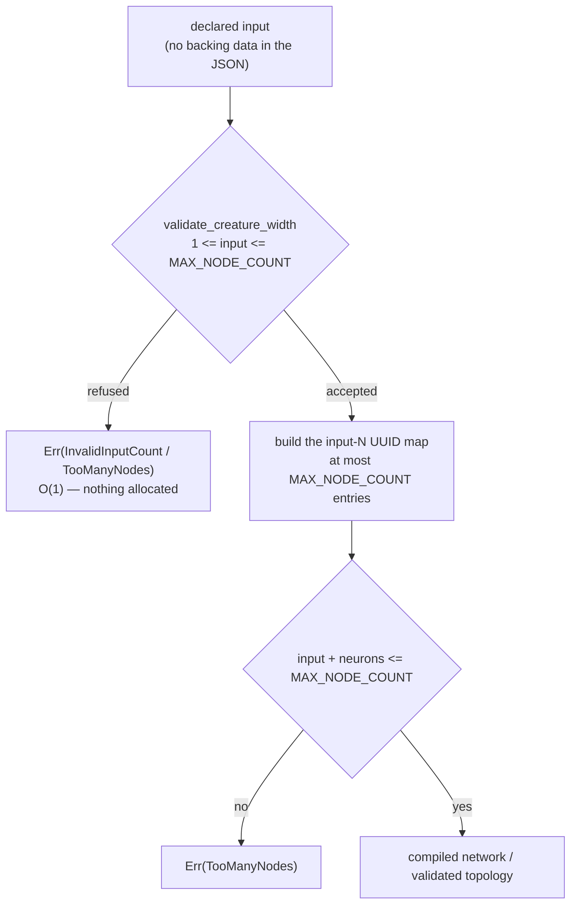

## Summary

`CreatureExport::input` is a **declared** count with no backing data in the JSON
— input neurons are deliberately not listed in `neurons` — yet three entry
points turned it into one owned `String` UUID per declared input *before*
anything bounded it against `MAX_NODE_COUNT` (65 536):

- `compile_creature` (`neat-core/src/creature.rs`) — the `input-N` map, with the
  `num_neurons > MAX_NODE_COUNT` check ~30 lines further down;
- `index_map` (`neat-core/src/if_graft.rs`), reached from
  `validate_creature_topology` and so from every `graft_*` helper — which had no
  node ceiling at all;
- `Engine::check_references` (`neat-core/src/prune_cleanup.rs`), reached from
  `cleanup_creature_with` — the third site, not named in the issue but the same
  root cause.

So `{"input": 100000000, …}` — under 100 bytes — bought 100 million map entries
before any gate spoke, and at `"input": 17179869180` the `with_capacity` aborted
the process instead of returning.

The fix is one line of policy in the documented single home of the width rule.
`validate_creature_width` already floors the widths; it now **ceilings `input`
as well**, and because all three sites (plus `parse_creature_json`,
`creature_to_json` and `creature_to_json_pretty`) call it first, the width is
bounded before anything is sized by it. A declared `input` above
`MAX_NODE_COUNT` is `CreatureError::TooManyNodes { count }` — the existing typed
error, carrying the same declared node count (`input` plus the listed neurons)
it carries on the post-compilation path, so the shared `Display` text stays
true.

`output` gets no companion bound: it sizes no allocation, and the output neurons
it declares are counted from `neurons`, so an unreachable value is already
`OutputCountMismatch`. `creature_validate` walks the width the same way but is
deliberately **not** a caller — it owes NEAT-AI's rule wording rather than a
typed width error — so its ceiling stays at its own JSON boundary
(`oversized_detail` / `MAX_REQUEST_NEURONS`), which every WASM and `prune_json`
request already passes through. The docs now say that explicitly rather than
implying blanket coverage.

Closes #622.

### Original trigger closed, no trivial bypass

The issue's payload (`"input": 100000000`) is refused by
`validate_creature_width` before a single map entry exists, on every path that
walks the declared width. The bound is a plain `>` against `MAX_NODE_COUNT` on a
`usize` — there is no cast, no arithmetic and no narrowing to slip past, and
#606 already closed the `u32` narrowing half of the same path. Reaching a walk
without passing the check would mean adding a **new** caller of the walk: all
existing routes were traced and every one goes through
`validate_creature_width` first — `compile_creature` and
`validate_creature_topology` call it directly; `place_and_build` is reached only
from `graft_if_node` / `graft_relay_node` / `graft_if_nodes` / `graft_if_tree` /
`graft_if_correction`, each of which calls `validate_creature_topology` first;
`sort_synapses_canonically` is `pub(crate)` and reached only from
`cleanup_creature_with` (which calls the check at its own boundary) and from
`decision_tree`'s own fixtures. `creature_validate` is the one public walk that
is not a caller, and it is bounded at its JSON boundary as described above —
unchanged by this PR and not a bypass of the fixed paths.

## Evidence

Backend library change with no web interface, so the evidence is test output,
not a screenshot.

### Red against the unfixed code, green after

`neat-core/tests/creature_width_allocations.rs` is the regression oracle: a
counting global allocator totals the bytes handed out while each entry point
refuses an oversized declaration. Removing the new ceiling from
`validate_creature_width` and re-running:

```
---- topology_validation_refuses_an_oversized_declared_input_without_paying_for_it stdout ----
panicked at neat-core/tests/creature_width_allocations.rs:146:5:
a declared input of 1000000 must be refused

---- compiling_refuses_an_oversized_declared_input_without_paying_for_it stdout ----
panicked at neat-core/tests/creature_width_allocations.rs:157:5:
compile_creature allocated 81217543 B refusing a declared input of 1000000
(budget 2097152 B, ceiling 65536); the declared width is being walked before it
is bounded

test result: FAILED. 0 passed; 2 failed
```

81 MB spent on a 1,000,000-wide declaration — and `validate_creature_topology`
did not refuse it at all. With the ceiling restored:

```
test compiling_refuses_an_oversized_declared_input_without_paying_for_it ... ok
test topology_validation_refuses_an_oversized_declared_input_without_paying_for_it ... ok
test result: ok. 2 passed; 0 failed
```

The oracle deliberately does **not** rest on a magic byte figure. It takes two
readings of the same refusal — at the declared width and at four times it — and
fails if the cost *moves*, which is what "the width is not walked" means and
which holds on any machine. The absolute budget beside it is derived, not
picked: refusing an impossible width must cost less than *accepting* the widest
creature the `u16` index space allows.

### Where the check sits



### Gate

`./quality.sh` was run. Every Rust and Deno stage is green: `cargo fmt --check`,
`cargo clippy --workspace --all-targets --all-features -- -D warnings`,
`cargo check`, `cargo test --workspace --lib --tests --all-features` (68 test
binaries, 0 failures), doctests, `RUSTDOCFLAGS="-D warnings" cargo doc`,
`cargo deny check` (advisories/bans/licenses/sources ok), the TypeScript,
Mermaid, WASM-parity and JSR supply-chain gates, `codespell`, and the release
build.

The **bats** leg fails 109 of 448 cases in this container, every one of them
with `ModuleNotFoundError: No module named 'yaml'` — PyYAML is not installed and
there is no `pip`. Those cases only read `.github/workflows/*.yml`, which this
PR does not touch, so the failures are environmental and pre-existing; CI runs
the same suite on the PR.

### Breaking-change signal

Per `RELEASING.md`, refusing payloads that were previously accepted is a change
to documented runtime behaviour at six public entry points, so commit `416f6de`
carries a `BREAKING CHANGE:` footer and `scripts/detect-breaking.sh` reports
`true` for the branch — the `version-increment` job will take the minor bump.

## Acceptance Criteria

<!-- vibe-spec-review inputs="diff+issue-body" -->

- **met** — Neither `index_map` nor `compile_creature` allocates or iterates on a declared width before that width is bounded — evidence: `neat-core/src/creature.rs` (`validate_creature_width` ceiling, called by `compile_creature` before the UUID loop and by `validate_creature_topology` before `index_map`); all `index_map` / `place_and_build` / `sort_synapses_canonically` call sites traced — reviewer: met
- **met** — A creature declaring `"input": 100000000` is refused with a typed error, not by allocation cost — evidence: `neat-core/tests/creature_width_contract.rs::parse_rejects_a_declared_input_past_the_node_ceiling`, `::compile_rejects_a_declared_input_past_the_node_ceiling`, `::neither_serialiser_writes_a_declared_input_past_the_node_ceiling`, and `neat-core/tests/if_graft.rs::gate_rejects_a_declared_input_past_the_node_ceiling` — reviewer: met
- **met** — Regression tests for both entry points; `./quality.sh` green — evidence: `neat-core/tests/creature_width_allocations.rs::compiling_refuses_an_oversized_declared_input_without_paying_for_it` and `::topology_validation_refuses_an_oversized_declared_input_without_paying_for_it`; the reviewer independently mutation-checked the oracle and watched both go red — reviewer: met — reason: the reviewer judged the gate from the stages it could run; the bats leg's 109 pre-existing PyYAML failures are recorded above rather than claimed green
- **unrequested** — `parse_creature_json`, `creature_to_json` and `creature_to_json_pretty` now refuse a wide declaration too — reviewer: unrequested — reason: unavoidable consequence of putting the ceiling in the single home of the width rule, which the issue named as the preferred placement and flagged as changing all four call sites; kept rather than special-cased, and signalled as a breaking change
- **unrequested** — `neat-core/tests/creature_width_contract.rs::a_declared_input_at_the_node_ceiling_is_still_accepted` — reviewer: unrequested — reason: the off-by-one guard the new bound owes, pinning the ceiling as inclusive
- **unrequested** — README and AGENTS.md prose plus two Mermaid diagrams — reviewer: unrequested — reason: both documents state the width contract as a rule, so a change to that rule owes a docs change

## Standards Review

<!-- vibe-standards-review inputs="diff+CODING-STANDARDS.md" -->

There is no `CODING-STANDARDS.md` in this repository; the reviewer was pointed
at `AGENTS.md`, which is the repo's standards document (TDD, oracle-integrity
and mutation-evidence rules, "what not how" tests, Australian English).

- **violation** — the allocation tests asserted `outcome.is_err()`, an untyped oracle any unrelated refusal would satisfy — evidence: `neat-core/tests/creature_width_allocations.rs:130` — reason: fixed here; both tests now match `CreatureError::TooManyNodes` / `GraftError::Creature(TooManyNodes)`
- **violation** — `REFUSAL_BUDGET_BYTES = 64 * 1024` was a magic threshold, and a single-point measurement cannot demonstrate an O(1) cost — evidence: `neat-core/tests/creature_width_allocations.rs:77` — reason: fixed here; the budget is derived from `MAX_NODE_COUNT * BYTES_PER_WALKED_INPUT` (the widest legitimate walk) and the load-bearing assertion is now a two-reading growth comparison at W and 4W
- **violation** — the `index_map` precondition doc claimed every caller arrives via `validate_creature_topology`, untrue for two of three call sites — evidence: `neat-core/src/if_graft.rs:567` — reason: fixed here; the doc now names both routes (`validate_creature_topology`, and `cleanup_creature_with` via `sort_synapses_canonically`)
- **violation** — a 96-character doc line, and an inserted sentence that separated "The last of those…" from its antecedent — evidence: `neat-core/src/if_graft.rs:589` — reason: fixed here; the width paragraph is now its own block and every line wraps under 80
- **violation** — "abort the module on the allocation" is ungrammatical and inconsistent with README's "abort the process" for the same rule — evidence: `AGENTS.md:440` — reason: fixed here; both documents now say "process"
- **violation** — `TooManyNodes`'s shared Display reads "Creature has {count} nodes", but the new path passed the declared *input* alone — evidence: `neat-core/src/creature.rs:454` — reason: fixed here; the width path now reports `input + neurons.len()` (saturating), so `count` means one thing on both paths, pinned by `neat-core/tests/creature_width_contract.rs::the_width_ceiling_error_reads_as_a_node_count`
- **violation** — the ceiling was pinned at parse, compile and `creature_to_json`, but not `creature_to_json_pretty`, while AGENTS.md states this file pins the rule at all four sites — evidence: `neat-core/tests/creature_width_contract.rs:325` — reason: fixed here; the test covers both writers and is renamed `neither_serialiser_writes_a_declared_input_past_the_node_ceiling`
- **violation** — refusing previously-accepted payloads is breaking under `RELEASING.md`, and the branch carried no breaking marker — evidence: commit `b8bcdc9` — reason: fixed here; commit `416f6de` carries a `BREAKING CHANGE:` footer and `scripts/detect-breaking.sh origin/Develop..HEAD` now reports `true`
- **clean** — TDD and mutation evidence are real (the reviewer independently removed the bound and watched both allocation tests go red); behaviour-named tests with no source-grep or private-field assertions; the single-home rule holds, with the comparison inlined at no boundary; Australian English throughout (`serialise`, `behaviour`, `modelled`; no `-ize`/`color`/`behavior` in the added lines); every `GlobalAlloc` impl carries a `// SAFETY:` note and no `unsafe` was added to library code; no `unwrap`/`expect`/`panic!` outside test targets; the load-bearing doc claims were each verified against the code; both Mermaid diagrams pass the gate; no hidden, secret or stray files staged

## Test Plan

Added:

- `neat-core/tests/creature_width_allocations.rs` — new allocation-regression
  target with its own counting global allocator:
  - `compiling_refuses_an_oversized_declared_input_without_paying_for_it`
  - `topology_validation_refuses_an_oversized_declared_input_without_paying_for_it`

  Both assert the typed `TooManyNodes` refusal, that the refusal stays under the
  derived budget, and that quadrupling the declared width does not move the
  cost. Both were observed failing against the unfixed code (81 MB spent, and
  the topology gate not refusing at all) and passing after the fix.

- `neat-core/tests/creature_width_contract.rs` — the width rule's existing home:
  - `parse_rejects_a_declared_input_past_the_node_ceiling`
  - `compile_rejects_a_declared_input_past_the_node_ceiling`
  - `neither_serialiser_writes_a_declared_input_past_the_node_ceiling`
  - `the_width_ceiling_error_reads_as_a_node_count`
  - `a_declared_input_at_the_node_ceiling_is_still_accepted`

- `neat-core/tests/if_graft.rs`:
  - `gate_rejects_a_declared_input_past_the_node_ceiling`

No existing test was removed, commented out or weakened. The full workspace
suite (68 test binaries) and the doctests are green.
