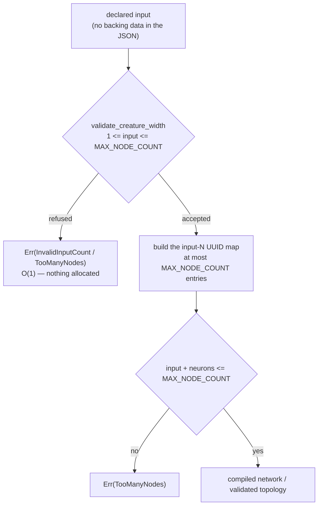

## Summary

`CreatureExport::input` is a **declared** count with no backing data in the JSON
— input neurons are deliberately not listed in `neurons` — yet three entry
points turned it into one owned `String` UUID per declared input *before*
anything bounded it against `MAX_NODE_COUNT` (65 536):

- `compile_creature` (`neat-core/src/creature.rs`) — the `input-N` map, with the
  `num_neurons > MAX_NODE_COUNT` check ~30 lines further down;
- `index_map` (`neat-core/src/if_graft.rs`), reached from
  `validate_creature_topology` and so from every `graft_*` helper — which had no
  node ceiling at all;
- `Engine::check_references` (`neat-core/src/prune_cleanup.rs`), reached from
  `cleanup_creature_with` — the third site, not named in the issue but the same
  root cause.

So `{"input": 100000000, …}` — under 100 bytes — bought 100 million map entries
before any gate spoke, and at `"input": 17179869180` the `with_capacity` aborted
the process instead of returning.

The fix is one line of policy in the documented single home of the width rule.
`validate_creature_width` already floors the widths; it now **ceilings `input`
as well**, and because all three sites (plus `parse_creature_json`,
`creature_to_json` and `creature_to_json_pretty`) call it first, the width is
bounded before anything is sized by it. A declared `input` above
`MAX_NODE_COUNT` is `CreatureError::TooManyNodes { count }` — the existing typed
error, carrying the same declared node count (`input` plus the listed neurons)
it carries on the post-compilation path, so the shared `Display` text stays
true.

`output` gets no companion bound: it sizes no allocation, and the output neurons
it declares are counted from `neurons`, so an unreachable value is already
`OutputCountMismatch`. `creature_validate` walks the width the same way but is
deliberately **not** a caller — it owes NEAT-AI's rule wording rather than a
typed width error — so its ceiling stays at its own JSON boundary
(`oversized_detail` / `MAX_REQUEST_NEURONS`), which every WASM and `prune_json`
request already passes through. The docs now say that explicitly rather than
implying blanket coverage.

Closes #622.

### Original trigger closed, no trivial bypass

The issue's payload (`"input": 100000000`) is refused by
`validate_creature_width` before a single map entry exists, on every path that
walks the declared width. The bound is a plain `>` against `MAX_NODE_COUNT` on a
`usize` — there is no cast, no arithmetic and no narrowing to slip past, and
#606 already closed the `u32` narrowing half of the same path. Reaching a walk
without passing the check would mean adding a **new** caller of the walk: all
existing routes were traced and every one goes through
`validate_creature_width` first — `compile_creature` and
`validate_creature_topology` call it directly; `place_and_build` is reached only
from `graft_if_node` / `graft_relay_node` / `graft_if_nodes` / `graft_if_tree` /
`graft_if_correction`, each of which calls `validate_creature_topology` first;
`sort_synapses_canonically` is `pub(crate)` and reached only from
`cleanup_creature_with` (which calls the check at its own boundary) and from
`decision_tree`'s own fixtures. `creature_validate` is the one public walk that
is not a caller, and it is bounded at its JSON boundary as described above —
unchanged by this PR and not a bypass of the fixed paths.

## Evidence

Backend library change with no web interface, so the evidence is test output,
not a screenshot.

### Red against the unfixed code, green after

`neat-core/tests/creature_width_allocations.rs` is the regression oracle: a
counting global allocator totals the bytes handed out while each entry point
refuses an oversized declaration. Removing the new ceiling from
`validate_creature_width` and re-running:

```
---- topology_validation_refuses_an_oversized_declared_input_without_paying_for_it stdout ----
panicked at neat-core/tests/creature_width_allocations.rs:157:5:
a declared input of 1000000 must be refused

---- compiling_refuses_an_oversized_declared_input_without_paying_for_it stdout ----
panicked at neat-core/tests/creature_width_allocations.rs:168:5:
compile_creature allocated 81206344 B refusing a declared input of 1000000
(budget 2097152 B, ceiling 65536); the declared width is being walked before it
is bounded

test result: FAILED. 0 passed; 2 failed
```

81 MB spent on a 1,000,000-wide declaration — and `validate_creature_topology`
did not refuse it at all. With the ceiling restored:

```
test compiling_refuses_an_oversized_declared_input_without_paying_for_it ... ok
test topology_validation_refuses_an_oversized_declared_input_without_paying_for_it ... ok
test result: ok. 2 passed; 0 failed
```

The oracle counts bytes **per thread**, not process-wide. That is not a detail:
with a global counter the two tests bill each other for their allocations under
`quality.sh`'s `--test-threads=2`, and the suite failed on this branch for
exactly that reason before the counter was made thread-local and
`const`-initialised (a `const` init matters because the first touch of a lazy
thread-local happens *inside* the allocator). The re-worked oracle was
mutation-checked again afterwards, under `--test-threads=2`, and still reports
the 81 MB walk.

The oracle deliberately does **not** rest on a magic byte figure. It takes two
readings of the same refusal — at the declared width and at four times it — and
fails if the cost *moves*, which is what "the width is not walked" means and
which holds on any machine. The absolute budget beside it is derived, not
picked: refusing an impossible width must cost less than *accepting* the widest
creature the `u16` index space allows.

### Where the check sits



### Gate

`./quality.sh` was run. Every Rust and Deno stage is green: formatting
(`rustfmt --edition 2024 --check`), lint
(`RUSTC_WORKSPACE_WRAPPER=clippy-driver cargo check --workspace --all-targets
--all-features` under `-D warnings`), `cargo check`,
`cargo test --workspace --lib --tests --all-features -- --test-threads=2`
(0 failures), doctests, `RUSTDOCFLAGS="-D warnings" cargo doc`,
`cargo deny check` (advisories/bans/licenses/sources ok), the TypeScript,
Mermaid, WASM-parity and JSR supply-chain gates, `codespell`, and the release
build.

Two container caveats, stated rather than papered over:

- The lint and format stages could not be invoked as `cargo fmt` / `cargo
  clippy` — this container has no `rustup` default toolchain, so those two
  shims exit with "rustup could not choose a version". `rustfmt` and
  `clippy-driver` themselves are present, so the same checks were run directly
  through them, over the same files and with the same `-D warnings`.
- The **bats** leg fails 110 of 495 cases here, every one of them with
  `ModuleNotFoundError: No module named 'yaml'` — PyYAML is not installed and
  there is no `pip`. This was confirmed **pre-existing** rather than assumed:
  stashing the whole branch and re-running the gate on a clean tree produces the
  identical 110 failures. Those cases only read `.github/workflows/*.yml`, which
  this PR does not touch; CI runs the same suite on the PR.

### Breaking-change signal

Per `RELEASING.md`, refusing payloads that were previously accepted is a change
to documented runtime behaviour at six public entry points, so commit `416f6de`
carries a `BREAKING CHANGE:` footer and `scripts/detect-breaking.sh` reports
`true` for the branch — the `version-increment` job will take the minor bump.

## Acceptance Criteria

<!-- vibe-spec-review inputs="diff+issue-body" -->

The Spec reviewer was given the diff and the issue body and nothing else. It
judged commit `9707129`; the two commits after it are the fixes for what it and
the Standards reviewer found, and each is named below.

- **met** — Neither `index_map` nor `compile_creature` allocates or iterates on a
  declared width before that width is bounded — evidence:
  `neat-core/src/creature.rs:680` (the one new comparison, above every caller);
  the reviewer independently traced all three `index_map` routes —
  `validate_creature_topology` (`if_graft.rs:683`), `place_and_build` behind
  every `graft_*` entry point, and `sort_synapses_canonically` behind
  `prune_cleanup.rs:475` and `decision_tree`'s own fixtures — reviewer: met —
  reason: the reviewer notes the property holds at `index_map` by documented
  precondition rather than by construction, so a *new* caller could still bypass
  it; recorded rather than fixed, because making it structural means changing
  `index_map`'s signature at three already-validated call sites, which is a
  larger change than this issue asked for
- **met** — A creature declaring `"input": 100000000` is refused with a typed
  error, not by allocation cost — evidence:
  `neat-core/tests/creature_width_contract.rs::compile_creature_refuses_a_declared_input_past_the_node_ceiling`
  and its five `CEILING_SITES` siblings, plus
  `::the_issues_exact_payload_is_refused_rather_than_walked` on the issue's
  literal JSON — reviewer: met — reason: the reviewer additionally ran the
  issue's abort-scale literal (`"input": 17179869180`) against the branch and
  got `TooManyNodes { count: 17179869181 }` instantly, with no abort
- **met** — Regression tests for both entry points; `./quality.sh` green —
  evidence:
  `neat-core/tests/creature_width_allocations.rs::compiling_refuses_an_oversized_declared_input_without_paying_for_it`
  and `::topology_validation_refuses_an_oversized_declared_input_without_paying_for_it`
  — reviewer: met — reason: the reviewer mutation-checked the oracle itself
  (disabling the ceiling: 81 206 344 B against a 2 MiB budget, and the topology
  case degrading to *accepting* the 1 M-wide creature), and ran every gate stage
  it could; the stages it did not run — `cargo deny`, `codespell`, the release
  build and the bats leg — were run here and are recorded under **Gate** above
- **unrequested** — `TooManyNodes.count` on the width path means
  `input + neurons.len()`, a saturating sum, rather than the width alone —
  reviewer: unrequested — reason: the issue asked only for "the existing typed
  error"; choosing what `count` means is an added decision, taken so the shared
  `Display` ("Creature has N nodes…") stays true whichever check spoke, and
  pinned by `::the_width_ceiling_error_reads_as_a_node_count`
- **unrequested** — `validate_creature_topology` and `cleanup_creature_with`
  inherit the new contract, beyond the four call sites the issue enumerated —
  reviewer: unrequested — reason: inherent to putting the ceiling in the single
  home of the width rule, which is the placement the issue named as preferred;
  `cleanup_creature` is covered by the `CEILING_SITES` table so the extra site
  is tested rather than merely inherited
- **unrequested** — the ceiling on `input` now runs before the `output < 1`
  floor, so a creature that is both over-wide and output-less reports
  `TooManyNodes` where it used to report `InvalidOutputCount` — reviewer:
  unrequested — reason: the reviewer found no test pinned either precedence;
  the order is deliberate (`input` is the value that can never be recovered, so
  both its checks come first) and is now pinned by
  `neat-core/tests/creature_width_contract.rs::the_input_ceiling_is_reported_before_the_output_floor`
- **unrequested** — a 202-line allocator-instrumented test binary,
  `neat-core/tests/creature_width_allocations.rs` — reviewer: unrequested —
  reason: heavier than "the typed error in bounded time" asks for, but it is the
  only thing that catches a re-ordering regression, and `topology_ops_allocations.rs`
  is the existing precedent; the reviewer said it would keep it
- **unrequested** — README, AGENTS.md and this PR summary — reviewer:
  unrequested — reason: both documents state the width contract as a rule, so a
  change to that rule owes a docs change; `docs/archive/pr-summaries/` is the
  repo's established home for the third

### Residual of the same class, deliberately not fixed here

Both reviewers independently landed on the same out-of-scope finding:
`creature_validate` walks the declared width identically
(`neat-core/src/creature_validate.rs::neuron_views` builds one `NeuronView` per
declared input) and is **not** a caller of `validate_creature_width` — it owes
NEAT-AI's own rule wording for a violation rather than a typed `CreatureError`,
so it cannot simply call the helper. Its JSON and WASM routes are bounded by
`MAX_REQUEST_NEURONS` (`creature_validate_json::oversized_detail`,
`prune_json`), so the exposure is limited to direct Rust callers. The issue
named two entry points and this is a third with its own design question, so it
is filed as **stSoftwareAU/NEAT-AI-core#639** rather than folded in here.

## Standards Review

<!-- vibe-standards-review inputs="diff+CODING-STANDARDS.md" -->

There is no `CODING-STANDARDS.md` in this repository; the reviewer was pointed
at `AGENTS.md`, which is the repo's standards document (TDD, oracle-integrity
and mutation-evidence rules, "what not how" tests, Australian English), plus the
local surfaces it links — `README.md`, `RELEASING.md`, `SECURITY.md`.

Two independent standards passes ran over this branch, at different tips. Both
are recorded; every violation either was fixed here or carries its reason.

Second pass (tip `a551a87`):

- **violation** — `AGENTS.md`'s Issue #555 section still said the declared
  `input` / `output` / node counts are bounded against `u32::MAX` first, which
  only `output` still reaches through a creature — evidence: `AGENTS.md:430` —
  reason: fixed here; the paragraph now names the narrower `MAX_NODE_COUNT`
  ceiling as the one that answers first
- **violation** — the same stale claim in `README.md`, plus "the gate bounds the
  declared counts against that index space **first** — before the UUID map" —
  evidence: `README.md:690` — reason: fixed here, in the same wording as
  AGENTS.md so the two cannot drift again
- **violation** — "Every caller of this helper turns that count into one owned
  `String` UUID per declared input" is untrue of three of the six callers, and
  contradicted the caller list three lines above it — evidence:
  `neat-core/src/creature.rs:649` and the same sentence at `README.md:485` —
  reason: fixed here; both now say three of the callers walk the width and name
  what the other three take the ceiling for
- **violation** — the two adapted Issue #606 tests kept names describing a
  mechanism neither can now reach, breaching the "name tests after the
  behaviour" rule — evidence: `neat-core/tests/if_graft.rs:636`, `:664` —
  reason: fixed here; renamed to
  `gate_refuses_..._rather_than_narrowing_it` / `..._rather_than_wrapping_it`,
  and the doc above each now says what it still adds beside the 100-million case
- **violation** — this PR summary claimed "No existing test was removed,
  commented out or weakened" while two existing tests had been rewritten, and
  its Test Plan listed only the added one; its quoted red-run line numbers were
  stale and it did not record the oracle's thread-local rework — evidence:
  `docs/archive/pr-summaries/pr-summary-622.md:191` — reason: fixed here; the
  Test Plan now carries a "Modified" section naming both tests, both renames and
  the rework, and the quoted output was re-captured

First pass (tip `b8bcdc9`), all fixed in `416f6de` before the second pass:

- **violation** — the allocation tests asserted `outcome.is_err()`, an untyped
  oracle any unrelated refusal would satisfy — evidence:
  `neat-core/tests/creature_width_allocations.rs:130` — reason: fixed; both now
  match `CreatureError::TooManyNodes` / `GraftError::Creature(TooManyNodes)`
- **violation** — `REFUSAL_BUDGET_BYTES = 64 * 1024` was a magic threshold, and
  one measurement cannot demonstrate an O(1) cost — evidence:
  `neat-core/tests/creature_width_allocations.rs:77` — reason: fixed; the budget
  is derived from `MAX_NODE_COUNT * BYTES_PER_WALKED_INPUT` and the load-bearing
  assertion is a two-reading growth comparison at W and 4W
- **violation** — the `index_map` precondition doc claimed every caller arrives
  via `validate_creature_topology`, untrue for two of three call sites —
  evidence: `neat-core/src/if_graft.rs:567` — reason: fixed; the doc names both
  routes
- **violation** — a 96-character doc line, and an inserted sentence separating
  "The last of those…" from its antecedent — evidence:
  `neat-core/src/if_graft.rs:589` — reason: fixed; every line wraps under 80
- **violation** — "abort the module on the allocation" is ungrammatical and
  inconsistent with README's "abort the process" — evidence: `AGENTS.md:440` —
  reason: fixed; both documents say "process"
- **violation** — `TooManyNodes`'s shared `Display` reads "Creature has {count}
  nodes", but the new path passed the declared *input* alone — evidence:
  `neat-core/src/creature.rs:454` — reason: fixed; the width path reports
  `input + neurons.len()` (saturating), pinned by
  `creature_width_contract.rs::the_width_ceiling_error_reads_as_a_node_count`
- **violation** — the ceiling was pinned at parse, compile and
  `creature_to_json` but not `creature_to_json_pretty` — evidence:
  `neat-core/tests/creature_width_contract.rs:325` — reason: fixed, and since
  superseded by the `CEILING_SITES` table, which pins all six routes
- **violation** — refusing previously-accepted payloads is breaking under
  `RELEASING.md`, and the branch carried no breaking marker — evidence: commit
  `b8bcdc9` — reason: fixed; `416f6de` carries a `BREAKING CHANGE:` footer and
  `scripts/detect-breaking.sh` reports `true`

- **clean** — the areas the second pass checked and found compliant: Australian
  English throughout the added lines (`serialise`, `behaviour`, `modelled`,
  `defence`; no `-ize`/`color`/`behavior`), `codespell` clean over all eight
  files; tests assert observable outcomes only — typed errors, the verbatim
  `Display` string, and heap bytes through a `#[global_allocator]` — with no
  source greps, line counts or private-field access; oracle rule 1, the
  allocator shares no code path with `validate_creature_width`; oracle rule 3,
  every threshold derived with its derivation beside it and the accepting edge
  pinned so the branch cannot pass vacuously; oracle rule 5, `bounded_counts`'
  now-unreachable legs are covered directly in-module at both edges; mutation
  evidence reproduced independently by the reviewer; the Issue #550 single-home
  rule holds, with no `> MAX_NODE_COUNT` inlined at any boundary; no `unsafe`
  added to library code and every test `GlobalAlloc` block carries a `// SAFETY:`
  note; no hidden, secret or stray file staged; `rustfmt --check`, clippy under
  `-D warnings`, `RUSTDOCFLAGS="-D warnings" cargo doc`, `markdownlint-cli2` and
  the Mermaid gate all clean.

## Test Plan

Added:

- `neat-core/tests/creature_width_allocations.rs` — new allocation-regression
  target with its own counting global allocator:
  - `compiling_refuses_an_oversized_declared_input_without_paying_for_it`
  - `topology_validation_refuses_an_oversized_declared_input_without_paying_for_it`

  Both assert the typed `TooManyNodes` refusal, that the refusal stays under the
  derived budget, and that quadrupling the declared width does not move the
  cost. Both were observed failing against the unfixed code (81 MB spent, and
  the topology gate not refusing at all) and passing after the fix.

- `neat-core/tests/creature_width_contract.rs` — the width rule's existing home.
  One named-case table, `CEILING_SITES`, drives every route that accepts or
  emits a creature and then trusts the declared width, so a *new* entry point
  cannot be added with the floor wired up and the ceiling forgotten:
  - `parse_creature_json_refuses_a_declared_input_past_the_node_ceiling`
  - `compile_creature_refuses_a_declared_input_past_the_node_ceiling`
  - `creature_to_json_refuses_a_declared_input_past_the_node_ceiling`
  - `creature_to_json_pretty_refuses_a_declared_input_past_the_node_ceiling`
  - `validate_creature_topology_refuses_a_declared_input_past_the_node_ceiling`
  - `cleanup_creature_refuses_a_declared_input_past_the_node_ceiling`

  Plus, beside the table:
  - `the_issues_exact_payload_is_refused_rather_than_walked` — the issue's
    literal JSON, byte for byte
  - `the_width_ceiling_error_reads_as_a_node_count` — the shared `Display` text
  - `a_declared_input_at_the_node_ceiling_is_still_accepted` and
    `every_entry_point_accepts_the_widest_addressable_declaration` — the
    accepting edge, so the bound cannot pass by refusing everything
  - `the_input_ceiling_is_reported_before_the_output_floor` — the check order,
    which the ceiling changed for a creature that is both over-wide and
    output-less

- `neat-core/tests/if_graft.rs`:
  - `gate_rejects_a_declared_input_past_the_node_ceiling`

Modified, with the reason documented in place at each test — no test was
removed, commented out or weakened:

- `neat-core/tests/if_graft.rs::gate_refuses_an_input_width_past_the_u32_index_space_rather_than_narrowing_it`
  and
  `::gate_refuses_a_node_count_past_the_u32_index_space_rather_than_wrapping_it`
  (was `gate_rejects_an_input_width_past_the_u32_index_space` /
  `gate_rejects_a_node_count_past_the_u32_index_space`). These Issue #606 tests
  declare an `input` past `u32::MAX`. The new ceiling is **narrower**
  (65 536 ≪ `u32::MAX`) and runs first, so both creatures are now refused as
  `GraftError::Creature(CreatureError::TooManyNodes)` rather than
  `CountNotRepresentable`: every width they used to refuse is still refused,
  sooner and more cheaply. The assertions were updated to the earlier refusal
  and both were renamed, because the old names promised a mechanism the creature
  can no longer reach. What they still add beside the 100-million case is the
  *magnitude* — a count past the `u32` index space is refused whole, never
  narrowed to the `1` its low 32 bits hold, and never wrapped by the
  `input + neurons.len()` sum. `bounded_counts` keeps its own direct coverage of
  both legs at their accepting and rejecting edges in `if_graft`'s in-module
  tests (`an_input_width_past_the_index_space_is_refused`,
  `a_node_count_one_past_the_index_space_is_refused`), per AGENTS.md oracle
  rule 5.

- `neat-core/tests/creature_width_allocations.rs` — the byte counter moved from
  a process-wide `AtomicUsize` behind a mutex to a `const`-initialised
  thread-local `Cell`. Under `quality.sh`'s `--test-threads=2` the two tests ran
  concurrently and each was billed for the other's set-up allocations, so the
  target failed in the gate while passing when run alone. Per-thread counting is
  exact and needs no lock. Re-mutation-checked afterwards under
  `--test-threads=2`: removing the ceiling still reports the 81 MB walk.

Mutation evidence for the bound itself, run in both directions:

- remove the `input > MAX_NODE_COUNT` check → both allocation tests fail
  (81 206 344 B against a 2 MiB budget) and every `CEILING_SITES` case fails;
- weaken it to `>=` → `every_entry_point_accepts_the_widest_addressable_declaration`
  and `a_declared_input_at_the_node_ceiling_is_still_accepted` fail, so the
  inclusive edge is pinned from both sides.

The full workspace suite and the doctests are green under the gate's own
`--test-threads=2`.
