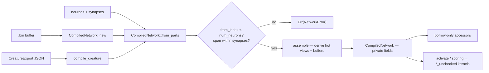

# CompiledNetwork holds the SIMD index invariant by construction

## Summary

`CompiledNetwork`'s forward and batched-scoring paths call the
`simd::*_unchecked` kernels and discharge their index contract from the
load-time `NetworkError::InvalidSynapseIndex` check in `new`. Every field was
`pub`, so safe code could rewrite `synapses` / `hot_from` / `activations` after
that check and turn the next `activate()` into an out-of-bounds read — Issue
#613 wrote the invariant down as a discharged `# Safety` contract, but nothing
enforced it past construction.

This takes **Option 1** from the issue: every field is private, and consumers
read the same state through borrow-only accessors that hand out `&[T]` and never
`&mut`. `CompiledNetwork::from_parts` is the one way to build a network from
parts already in memory; it re-runs the index check and also rejects a neuron
whose `start_synapse + num_synapses` overruns the synapse table
(`NetworkError::InvalidSynapseSpan`) — the span half of the same kernel contract,
which `new` could never violate but a caller-supplied span could. `new`,
`from_parts` and `compile_creature` all route through that one validated path.

Closes #625.

## Evidence

Backend/library change with no web interface, so there is no screenshot to
capture. The evidence is the compiler refusing the issue's own reproducer, plus
the test suite.

**The gate is a `compile_fail` doctest pair** on `CompiledNetwork`
(`neat-core/src/network.rs`). A doctest is compiled as its own crate linking
`neat_core`, so it *is* an out-of-crate safe caller — the exact threat model.
One half performs the issue's mutation and must not compile; the other reads the
same fixture through the accessors and compiles **and runs**, so a refusal can
never come from a broken fixture rather than from the privacy rule (AGENTS.md
oracle rule 5). Both run under `cargo test --doc`, which `quality.sh` and the CI
Rust job execute.

**Mutation evidence** (AGENTS.md oracle rule 2) — a green `compile_fail` test is
worth nothing unless it can go red, so both halves were mutated and observed
failing, then reverted:

| Mutation | `compile_fail` (write) | `compile_fail` (literal) |
|---|---|---|
| none — committed tree | ok | ok |
| `synapses` + `hot_from` back to `pub` | **FAILED** | ok |
| every field back to `pub` | **FAILED** | **FAILED** |

An earlier revision put this gate in `tests/scripts/compiled_network_encapsulation.bats`.
The independent spec review found it **could never have run in CI**: the
`scripts-and-spelling` job (`.github/workflows/ci.yml:490`) installs only
shellcheck, bats and codespell — no Rust toolchain, no cargo cache — and the
probe crate path-depends on `neat-core` (so `serde`/`serde_json`), which
`--offline` cannot resolve on a cold cache. The cited precedent
(`rust_build_profiles.bats`) is safe only because its probe has zero
dependencies. The bats file was deleted and the check moved to the doctests,
which need no new CI wiring.

**Quality gate.** `./quality.sh` aborts at its bats stage with 109 failures that
are a **byte-identical set to `origin/Develop`** — environmental in this
container (no python `yaml` module, no `actionlint`), verified by running
`bats tests/scripts` on a clean `origin/Develop` worktree and diffing the failure
lists. No gate regressed. Every stage after bats was run individually and passes:
`cargo fmt`, `cargo clippy --workspace --all-targets --all-features -- -D warnings`,
`cargo test --workspace --lib --tests --all-features` (67/67 binaries),
`cargo test --workspace --doc --all-features`,
`RUSTDOCFLAGS="-D warnings" cargo doc`, `cargo build --workspace --release`,
`cargo deny check`, codespell, the Mermaid gate and the TypeScript gate.

**Not run:** `cargo check -p neat-core --target wasm32-unknown-unknown`, which
AGENTS.md makes the manual pre-merge check for wasm-only code. `rustup` is absent
from this container and the target is not installed, so it could not be run here;
CI's wasm job covers it. The wasm-facing part of this diff is the removal of 12
`#[cfg_attr(target_family = "wasm", wasm_bindgen(skip))]` attributes that became
redundant (bindgen only generates accessors for `pub` fields), plus
`wasm-bench/src/lib.rs`, which is `exclude`d from the workspace — it was checked
for the host target instead.

## Reproduction

- **symptom** — safe code writes `net.synapses[0].from_index = 60_000` on a
  network that passed `CompiledNetwork::new`, and the next `activate()` reaches
  `get_unchecked` out of bounds: an abort on debug, a silent out-of-bounds read
  on release
- **status** — `verified` — an out-of-crate probe built against `origin/Develop`
  compiled and died with
  `index out of bounds: the len is 2 but the index is 60000`
  (`neat-core/src/simd/scalar.rs:54`; the reporter saw it at
  `simd_native.rs:615` — same safe-write→unchecked-read path, a different kernel
  on this aarch64 host). The same probe no longer compiles against this branch,
  and the regression gate was observed failing before the fix and passing after
- **regression test** — `neat-core/src/network.rs::CompiledNetwork` `compile_fail`
  doctest (the write probe), with
  `neat-core/tests/compiled_network_encapsulation.rs::from_parts_refuses_a_source_index_past_the_last_neuron`
  covering the same attack value on the one remaining construction path

## Acceptance Criteria

<!-- vibe-spec-review inputs="diff+issue-body" -->

- **met** — A safe caller cannot reach an unchecked read by writing `CompiledNetwork`'s fields after `new`, by whichever option is chosen (recorded in the PR summary) — evidence: `neat-core/src/network.rs` (all fields `pub(crate)`, accessors return `&[T]` with no `&mut`), Option 1 recorded here and in the `BREAKING CHANGE:` footer — reviewer: met
- **met** — A regression test in `neat-core/tests/` mutates a validated network in safe code and asserts the outcome is refused rather than read out of bounds — evidence: `neat-core/tests/compiled_network_encapsulation.rs::from_parts_refuses_a_source_index_past_the_last_neuron` and the `compile_fail` doctest in `neat-core/src/network.rs` — reviewer: partial — reason: the reviewer judged this "satisfied by proxy" because the Rust test mutates the parts *before* validation and the mutation-of-a-validated-network case sits outside `neat-core/tests/`. Recorded as met because Option 1 makes the literal form unwriteable — the criterion's own "by whichever option is chosen" wording anticipates this — and the reviewer's second objection (the substitute gate was CI-broken) was a real defect that is now fixed by moving it to a doctest
- **met** — Any consumer break is called out explicitly, with the semver bump it needs — evidence: `RELEASING.md` §`0.12.0`, `README.md` "Consumer break", `SECURITY.md` — reviewer: partial — reason: the reviewer found the break described only in README with `RELEASING.md`'s breaking-change log untouched and its `0.9.0` entry still showing now-impossible struct-literal construction. Fixed in this branch: a `0.12.0` entry naming both consumers and the migration, a retrospective `0.11.0` entry the repo's own completeness gate demanded, and the `0.9.0` snippet marked superseded
- **unrequested** — `CompiledNetwork::from_parts`, a new public constructor — reviewer: unrequested — reason: closing the fields removes struct-literal construction, which 17 out-of-crate fixtures and both consumers' test paths relied on; without a validated replacement the change is not landable
- **unrequested** — `NetworkError::InvalidSynapseSpan` and the span check — reviewer: unrequested — reason: `from_parts` accepts a caller-supplied `start_synapse`/`num_synapses`, which `new` never could; without this check the new constructor would reopen the very hole this issue closes, through the other half of the kernels' contract
- **unrequested** — `CompiledNetwork::assemble`, collapsing the buffer-sizing rule shared by `new` / `from_parts` / `compile_creature` — reviewer: unrequested — reason: three verbatim copies of that rule existed; leaving a fourth would have been the DRY breach the standards reviewer separately flagged
- **unrequested** — `CreatureError::InvalidNetwork(NetworkError)` — reviewer: unrequested — reason: added after review so `compile_creature` routes through the validated `from_parts` too, making "the load-time check is the only way in" true of all three construction paths instead of two
- **unrequested** — the drift fail-loud test moved from `neat-core/tests/hot_synapse_soa.rs` to `loss::interleaved_mse_parity` — reviewer: unrequested — reason: it drifted the view by writing the then-public field from outside the crate, which no longer compiles; it now drifts in-crate, the only level where drift is still expressible. The reviewer also flagged an entry-point swap that left `mse_sum_batch_packed`'s guard call unpinned — reverted, it drives the original entry point again
- **unrequested** — `README.md` construction-path Mermaid diagram, and the `AGENTS.md` / `SECURITY.md` / `docs/research/wasm-gather4-unchecked-loads.md` rewrites — reviewer: unrequested — reason: those three documents asserted the fields were public and the hole open; a code change owes the docs change. The diagram is the repo's documented preference for architecture changes
- **unrequested** — retrospective `RELEASING.md` §`0.11.0` entry — reviewer: unrequested — reason: not flagged by either reviewer; `tests/scripts/releasing_breaking_change_log.bats` fails once a `0.12.0` entry gives the pre-existing `0.11.0` gap a newer neighbour, so this branch cannot be green without it

## Standards Review

<!-- vibe-standards-review inputs="diff+CODING-STANDARDS.md" -->

- **violation** — AGENTS.md left self-contradictory: its Issue #533 section still read "the fields are public, so a caller can still assemble a `CompiledNetwork` literal … or mutate `synapses` afterwards", contradicting text the same diff added — evidence: `AGENTS.md:576` — reason: fixed here; the paragraph now describes private fields, `from_parts` deriving the hot view, and points at the relocated guard test
- **violation** — DRY: the `from_index >= num_neurons` scan and its `InvalidSynapseIndex` construction existed as two verbatim copies, in a section whose own text says the check is "guarded **once**, at load time" — evidence: `neat-core/src/network.rs:598` — reason: fixed here; `new` delegates to `from_parts` rather than re-inlining the scan
- **violation** — the added AGENTS.md claim "the check is the only way in" did not hold for `compile_creature`, which called the infallible `assemble` and rested on a prose argument — evidence: `neat-core/src/creature.rs:859` — reason: fixed here; `compile_creature` routes through `from_parts` and maps the failure to the new `CreatureError::InvalidNetwork`
- **violation** — RELEASING.md is the single source of truth for release policy and its breaking-change log records every major-equivalent bump; no `0.12.0` entry was added and the migration snippet went to README instead — evidence: `RELEASING.md:151` — reason: fixed here; `0.12.0` and the missing `0.11.0` entries added, `0.9.0` marked superseded
- **violation** — oracle rule 3 (no vacuous assertions) and "name the test after the outcome": `a_loaded_network_exposes_its_state_read_only` asserted nothing about read-only-ness and re-asserted the span and hot-view properties `from_parts` had just validated on the value it returned `Ok` for — evidence: `neat-core/tests/compiled_network_encapsulation.rs:127` — reason: fixed here; replaced by `the_deserialiser_exposes_the_loaded_values_through_the_accessors`, which asserts against the values the fixture buffer declares rather than re-deriving them from the network under test
- **violation** — AGENTS.md makes `cargo check -p neat-core --target wasm32-unknown-unknown` the load-bearing manual check before touching wasm-only code, and `wasm-bench` is excluded from the workspace so no gate compiles it — evidence: `neat-core/src/network.rs:237`, `wasm-bench/src/lib.rs:80` — reason: **stands**. `rustup` is absent from this container and the wasm target is not installed, so the check could not be run; `wasm-bench` was checked for the host target instead, and the residual risk is the `wasm_bindgen` macro path only (private fields are simply skipped by bindgen). Called out under Evidence rather than left silent
- **clean** — TDD and a green suite; the characterisation-test exception correctly applied to the N-copy struct-literal collapse into `assemble`; gate self-test independence (the refusing probe is paired with a companion that compiles *and* runs the same fixture — rules 4 and 5); unsafe/SIMD invariants (no field widened back to `pub`, no `&mut` accessor, both halves of the `*_unchecked` contract checked, `debug_assert_hot_soa` retained with its fail-loud test relocated to where drift is still expressible); fail-loud error handling with typed `NetworkError` variants and `Display`/`source` arms; tests call real code rather than grepping source; ownership fence untouched; Australian English throughout; no hidden paths staged; clippy `--all-targets` warning-free; the semver break correctly signalled by the Conventional Commit `!` marker and `BREAKING CHANGE:` footer

## Test Plan

Added:

- `neat-core/tests/compiled_network_encapsulation.rs` — six tests over the
  validated construction path: `from_parts` activates a well-formed network,
  derives the hot view and buffers rather than accepting them, refuses the
  issue's `from_index = 60_000` with `InvalidSynapseIndex`, still accepts the
  boundary index `num_neurons - 1`, refuses an overrunning span with
  `InvalidSynapseSpan`, and exposes a deserialised network's loaded values
  through the accessors.
- `neat-core/src/network.rs` — three doctests on `CompiledNetwork`: two
  `compile_fail` (the issue's field write; struct-literal construction) and one
  that compiles and runs the same fixture through the accessors.
  `doc_fixture_bytes` is shared by all three so the halves cannot drift.

Modified:

- `neat-core/tests/wasm_bindgen_surface.rs` —
  `compiled_network_public_fields_remain_accessible` asserted the fields were
  `pub`, which is the write path this issue closes. **Business-logic change,
  documented in the test body:** renamed to
  `compiled_network_state_remains_readable_by_native_consumers` and rewritten to
  pin the same data through the accessors. No test was commented out or deleted
  to make the suite pass.
- `neat-core/src/loss.rs` —
  `a_drifted_hot_view_fails_loud_instead_of_scoring_wrong_numbers` moved in-crate
  from `neat-core/tests/hot_synapse_soa.rs`. It drifted the hot view by writing
  the then-public `synapses` field from outside the crate; that no longer
  compiles, so it now drifts in-crate, which is the only level at which drift is
  still expressible. Same entry point (`mse_sum_batch_packed`) and same
  `#[should_panic(expected = "Issue #533")]` oracle.
- 17 test/bench fixture helpers that built `CompiledNetwork` struct literals now
  call `from_parts`, and field reads across the tests, benches and `wasm-bench`
  became accessor calls.
- `neat-core/benches/common/mod.rs::build_network` re-asserts the spec's declared
  node count against the built one, a cross-check the struct literal used to make
  implicitly.

Results: `cargo test --workspace --lib --tests --all-features` — 67/67 test
binaries pass (275 lib tests plus every integration target);
`cargo test --workspace --doc --all-features` passes including the two
`compile_fail` gates; `bats tests/scripts` failure set is identical to
`origin/Develop`.
