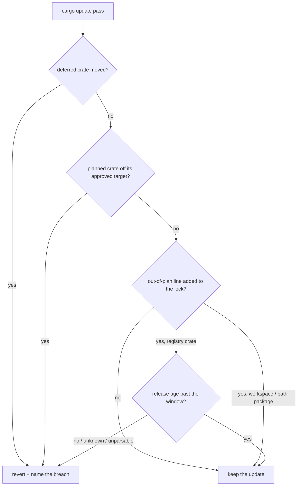

## Summary

`bump-deps.sh` age-checked only the crates the `cargo update --dry-run` plan
named. `quarantine_breach` then held deferred and planned crates to their
approved versions but allowed **all** out-of-plan transitive movement — so a
crate the plan never named could be dragged onto a version published minutes
ago, and the run exited 0 with a version the 24h quarantine never approved in
`Cargo.lock`.

The check now covers every `"<name> <version>"` line an update added to the
lockfile. One exemption, by exact name **and** version rather than by crate
name: a planned crate on its approved target, which was age-checked when the
plan was read. A version inside the window, one whose release age the registry
would not name, and one whose publish time will not parse each revert the
update that produced it — the same revert path a planned-crate breach already
took. Lookups are memoised for the run, so a large resolution change costs one
query per version rather than one per update.

Workspace members and path dependencies are exempt, because crates.io has no
release age for them. That carve-out is load-bearing, not cosmetic: `ci.yml`'s
*version-increment* step rewrites `neat-core`'s version in `Cargo.toml` and
then runs `bump-deps.sh`, so the first `cargo update` carries that version into
`Cargo.lock`. Without the exemption the lookup 404s, the run calls it
unverifiable, and **every** bump on the PR path reverts.

Closes #627.

## Evidence

Backend/CLI only — no web interface to screenshot. The evidence is the test
suite: `bats tests/scripts/bump_deps.bats` is 53/53 green with the fix, and the
six new behaviour tests are red against the unfixed `bump-deps.sh` (verified by
running the new `.bats` file against `git show ccc6a04:bump-deps.sh`).

`./quality.sh` was run in full. It reports 110 failures — an identical set to
the one a pristine `ccc6a04` worktree produces, all from `ModuleNotFoundError:
No module named 'yaml'` in this container's `python3`. Diffing the two failure
sets is empty, so this change adds none. `shellcheck bump-deps.sh` is clean,
`markdownlint-cli2` reports 0 issues, `scripts/check_mermaid.ts` passes.

## Reproduction

- **symptom** — with a publish fixture timestamping `bumpalo 3.1.0` seconds
  ago, a `cc` update that drags `bumpalo 3.0.0 -> 3.1.0` keeps the fresh
  version and the run exits 0
- **status** — `verified` — the regression tests were observed failing against
  the unfixed `bump-deps.sh` and passing after the fix
- **regression test** —
  `tests/scripts/bump_deps.bats::external: per-crate update dragging a transitive crate to a fresh version is reverted`
  (and its grouped-retry twin at
  `tests/scripts/bump_deps.bats::external: grouped retry dragging a transitive crate to a fresh version is reverted`)

## Acceptance Criteria

<!-- vibe-spec-review inputs="diff+issue-body" -->

- **met** — diff the lockfile after an update and collect every crate that
  moved but was not in the plan — evidence: `bump-deps.sh:424-425` (single
  `awk` pass over the before/after snapshots) — reviewer: met
- **met** — age-check each new version through `crate_published_at` /
  `is_older_than_hours`, batching or caching the lookups — evidence:
  `bump-deps.sh:228-250` (`crate_published_at_cached`) and
  `tests/scripts/bump_deps.bats::external: a transitive release-age lookup is made once per version`
  — reviewer: met
- **met** — treat a within-window transitive version as a breach: revert and
  report it exactly as a planned-crate breach is handled today — evidence:
  `bump-deps.sh:443-447`, reported through the unchanged caller revert paths —
  reviewer: met
- **met** — decide what happens when the age lookup itself fails; refuse the
  update rather than keep an unverified version — evidence:
  `bump-deps.sh:435-437` and `:448-452` —
  reviewer: met
- **met** — update the named grouped-retry bats test to assert the new rule,
  and `SECURITY.md`'s quarantine section — evidence:
  `tests/scripts/bump_deps.bats:603` (old transitive version still kept, now
  with an explicit ancient fixture), its fresh-reverts twin, and
  `SECURITY.md` "Dependency bump quarantine" — reviewer: met
- **unrequested** — pass 0 (plan reading) switched from `crate_published_at`
  to the memoised variant — reviewer: unrequested — reason: one memo rather
  than two lookup paths keeps the caching the issue asked for DRY; the only
  behaviour change is that a failed lookup is remembered run-wide, which is
  the refuse-by-default direction the issue's point 4 chose
- **unrequested** — trap consolidated into `cleanup_run_files` so the memo
  file is cleaned up — reviewer: unrequested — reason: the run now creates two
  scratch files and the previous `trap "rm -f '$RUN_LOCK_BACKUP'"` cleaned up
  only one; the reviewer's follow-on note that the memo was created
  unconditionally was fixed in `a3204d9`
- **unrequested** — a Mermaid diagram in `SECURITY.md` — reviewer:
  unrequested — reason: the repo's coding standards ask for a diagram where it
  aids understanding of a decision flow, and this section now has four
  outcomes
- **unrequested** — three tests beyond the issue's point 5 (a crate new to the
  lockfile, `--quarantine-hours 0`, the memo count) — reviewer: unrequested —
  reason: they pin the boundaries of the new rule — that it catches a newly
  added crate, that the emergency override still collapses it, and that the
  caching the issue asked for actually happens
- **unrequested** — workspace / path packages exempted, plus its regression
  test and `README.md`'s deferral enumeration — reviewer: unrequested —
  reason: not in the issue, but without it the new check reverts every bump on
  the `version-increment` PR path (see Summary); found by the Spec reviewer as
  a latent risk and confirmed live against `.github/workflows/ci.yml:161-170`

## Standards Review

<!-- vibe-standards-review inputs="diff+CODING-STANDARDS.md" -->

The repo has no `CODING-STANDARDS.md`; the reviewer used `AGENTS.md` and the
`quality.sh` gate as the authority.

- **violation** — three added assertions used bare `! grep -q …` mid-test-body,
  which never trips bats' errexit and so could not fail — evidence:
  `tests/scripts/bump_deps.bats:755`, `:777`, `:814` — reason: confirmed
  empirically (`@test { ! true; true; }` passes on the installed Bats 1.14.0),
  then fixed in `a3204d9` by switching to `[ "$(grep -c …)" -eq 0 ]`, which
  does fail. `quality.sh` shellchecks only `*.sh`, so `.bats` files are never
  linted and SC2314 never fired
- **violation** — a comment described a guard the same diff had deleted —
  evidence: `bump-deps.sh:379-380` — reason: rewritten to describe the
  `${arr[@]+…}` expansion that replaced it
- **violation** — `README.md` enumerates the causes of a deferral and did not
  gain the new revert cause, while `SECURITY.md` did — evidence:
  `README.md:1522-1524` — reason: enumeration updated in `a3204d9`
- **violation** — a reflow left an orphaned half-line breaking the file's
  uniform comment wrap — evidence: `bump-deps.sh:311-312` — reason: rewrapped
- **violation** — the new block restated `SECURITY.md`'s rationale nearly
  verbatim, against the repo's "policy lives once, linked never restated"
  posture — evidence: `bump-deps.sh:362-368` — reason: trimmed to a pointer at
  the `SECURITY.md` section
- **clean** — Australian English throughout (`memoised`, `honouring`,
  `behaviour`; zero US spellings in added lines, `codespell` exits 0);
  bash 3.2 / macOS compatibility (empty arrays via `${arr[@]+…}`, no
  associative arrays, no `mapfile`, POSIX/BSD-safe `grep -qxF`, `awk -v`,
  `mktemp … XXXXXX`); shellcheck clean, and the diff *removes* an
  `SC2064` disable by switching to a function trap; fail-loud design
  (unknown age reverts, `quarantine_breach` still returns 0 so the caller's
  command substitution cannot trip `set -e`, trap armed before the file it
  cleans up is created); tests call real code through the stub-cargo harness
  and none grep the source; no hidden or secret files staged; docs updated
  alongside the code

Two further findings came from the Spec reviewer rather than the Standards
one, and both were fixed in `a3204d9`: `comm` exits 1 on input it thinks
unsorted, which under `set -e` would kill the command substitution
`quarantine_breach` runs inside — the one thing its own contract comment
promises never to happen — so it is now a single `awk` pass with no such exit;
and an unparsable publish time was reported as "within the quarantine window",
which misnames the fault, so it now has its own message.

## Test Plan

Added to `tests/scripts/bump_deps.bats` (53/53 green; the six marked ✗ are red
against the unfixed script):

- ✗ `external: per-crate update dragging a transitive crate to a fresh version is reverted`
- ✗ `external: grouped retry dragging a transitive crate to a fresh version is reverted`
- ✗ `external: a transitive crate of unknown release age reverts the update`
- ✗ `external: a transitive crate new to the lockfile is age-checked too`
- ✗ `external: an unparsable transitive publish time is named as such`
- ✗ `external: a transitive release-age lookup is made once per version`
- `external: --quarantine-hours 0 keeps a freshly published transitive version`
  — the emergency override still collapses the window for transitive crates,
  so this is one window and not a second one
- `external: the workspace crate's own version moving does not revert the run`
  — red against the intermediate implementation, green after the local-package
  exemption

Modified (both already asserted the *keep* half of the new rule; each now
writes an explicit ancient publish fixture so the "old transitive version is
still kept" intent is pinned rather than incidental to a missing fixture):

- `external: grouped retry keeps a group that also moves a transitive crate`
- `external: per-crate update moving an out-of-plan transitive crate is kept`

Test harness: `write_fake_lock` now emits the `source = "registry+…"` line a
real `Cargo.lock` carries, and a new `append_local_package` helper adds a
sourceless package, so the registry-versus-local distinction the fix depends on
is representable in fixtures.

No tests were removed or commented out.
