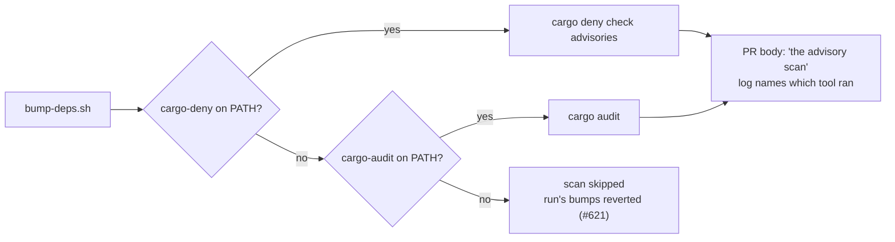

## Summary

Three statements inside `.github/workflows/` still described the pre-#598
advisory contract of `bump-deps.sh` — cargo-audit as a hard requirement, and a
generated PR body crediting `cargo audit` for a scan `cargo deny check
advisories` may have run. The workflows' *behaviour* was correct; only the prose
had drifted. Corrected all three and added a regression test that fails if they
drift back or if the script's contract changes underneath them. Closes #629.

What `bump-deps.sh` actually does today (`./bump-deps.sh --help`): prefers
`cargo deny check advisories`, falls back to `cargo audit` (#598), and with
neither scanner installed **skips** the scan and reverts the run's bumps rather
than failing the run (#621).

| File | Was | Now |
| --- | --- | --- |
| `.github/workflows/ci.yml:84` | "cargo-audit is required by bump-deps.sh" | names cargo-audit as the *fallback*, cites the prefer/fallback/skip contract and why this runner installs it |
| `.github/workflows/upgrade-dependencies.yml:38` | step name "Install cargo-audit (required by bump-deps.sh)" | "Install cargo-audit (advisory-scan fallback for bump-deps.sh)", with the same contract in the comment |
| `.github/workflows/upgrade-dependencies.yml:88` | PR body: "have passed `cargo audit`" | "have passed the advisory scan (`cargo deny check advisories`, falling back to `cargo audit`)", plus a pointer to the `audit tool:` line in the pasted log, which names whichever scanner ran |

Both jobs were checked before the comments were written: neither installs
cargo-deny, so the fallback really is what carries the scan there, and ci.yml
invokes `bump-deps.sh … --skip-build` (not `--skip-audit`), so the scan does run
on that path.

### The push blocker is gone

#614/#615/#628 deferred this work because the Vibe Coder token had no GitHub
`workflow` scope, so a push touching `.github/workflows/` was rejected. That is
no longer true — `gh auth status` reports scopes
`gist, read:org, repo, user, workflow`, and this branch, which touches two
workflow files, pushed cleanly. No human hand-edit was needed.

## Evidence

Backend/CI-only change: no web interface to screenshot. Evidence is command
output.

- `actionlint -no-color -ignore 'SC2016'` (exactly what the `actionlint` job
  runs) → **clean**.
- New tests, run locally: 3 of 4 pass; the fourth is blocked by the container's
  missing PyYAML (see below), and its behaviour was verified by hand instead —
  the real `Build summary` step body, extracted and executed with a stubbed
  `upgrade.log`, now emits:

  ```text
  Bumps applied via `bump-deps.sh` honour the
  `VIBE_BUMP_QUARANTINE_HOURS` release-age quarantine
  and have passed the advisory scan (`cargo deny check advisories`,
  falling back to `cargo audit`) plus dual native/wasm builds.
  The `audit tool:` line in the log below names the scanner that ran.
  ```

  Before the change the same step emitted ``and have passed `cargo audit` plus
  dual native/wasm builds.``



### Full-gate status

`./quality.sh` exits non-zero in this container at the bats stage, for reasons
that pre-date this change: `python3` here has no PyYAML, so every helper that
parses workflow YAML fails. The failure set is **identical before and after this
diff** — 113 failures with the tests present against the unfixed workflows, 111
after, and a name-by-name diff shows the only change is the two assertions this
fix turns green:

```text
$ diff before.txt after.txt
33d32
< each cargo-audit install step names the cargo-deny preference and the fallback
60d58
< no workflow describes cargo-audit as required by bump-deps.sh
```

The stages `quality.sh` runs after bats (TypeScript, Mermaid, Deno supply chain,
and every Rust stage) never execute locally because of that exit; the Mermaid
and TypeScript gates were run directly instead, and this diff contains no Rust.
CI runs the full set on this PR. The environment gap is filed separately as
#642.

## Test Plan

- Added `tests/scripts/workflow_advisory_scan_docs.bats` (4 tests):
  - `bump-deps.sh prefers cargo deny, falls back to cargo audit, skips without either`
    — the premise, taken from the script's own `--help` output rather than
    trusted prose.
  - `no workflow describes cargo-audit as required by bump-deps.sh` — red before
    the fix, green after.
  - `each cargo-audit install step names the cargo-deny preference and the fallback`
    — red before, green after.
  - `the generated PR body credits the advisory scan rather than cargo audit alone`
    — extracts and **executes** the real `Build summary` step and asserts on the
    body it writes to `$GITHUB_OUTPUT`, not on source text. Needs PyYAML, so it
    runs on CI, not in this container; verified by hand as shown above.
- Whole suite re-run before and after to confirm no other test moved.
