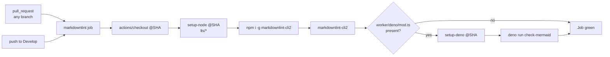

## Summary

Aligns the Markdown Lint workflow's `push` trigger with this repo's
default branch — `Develop` — as required by issue #63. The workflow
file, `.markdownlint-cli2.jsonc`, the SHA-pinned actions, and the bats
gate all landed earlier via PR #66 (which closed #56); this change
narrows the gap between the merged workflow and what #63 actually
specified.

Closes #63.

## Evidence

CLI-only change — no UI surface. Verified by re-running the bats suite
that exercises the workflow file:

```text
$ bats tests/scripts/markdown_lint_workflow.bats
1..9
ok 1 markdown-lint workflow file exists
ok 2 markdown-lint workflow is valid YAML
ok 3 markdown-lint workflow triggers on PRs and on pushes to Develop
ok 4 markdown-lint workflow exposes a markdownlint job that runs markdownlint-cli2
ok 5 markdown-lint workflow pins third-party actions to commit SHAs
ok 6 markdown-lint workflow gates Mermaid validation on a Deno worker module
ok 7 markdownlint config file exists and is valid JSONC
ok 8 markdownlint-cli2 passes against the current tree
ok 9 markdownlint-cli2 rejects a known-bad Markdown file
```

`./quality.sh < /dev/null` passes end-to-end (shellcheck, bats, cargo
fmt/clippy/deny/test/doc/release build).



## Test Plan

- Added a new TDD case to `tests/scripts/markdown_lint_workflow.bats`:
  `markdown-lint workflow triggers on PRs and on pushes to Develop`.
  The case parses the workflow YAML and asserts `pull_request` is
  present and `push.branches` contains `Develop`. It fails against the
  pre-fix workflow (which listed `[main, master]`) and passes after
  the trigger is corrected.
- Re-ran the full eight existing cases plus the new case — all 9 pass.
- `./quality.sh < /dev/null` passes.

## Notes

- Scope is limited to the `push.branches` list in the workflow plus
  the new bats case. The config file, SHA pins, and Mermaid-gating
  step were already correct from PR #66 and are untouched.
- Per the change-scope rule, no other Markdown files were reformatted
  — `markdownlint-cli2` already returns clean against the current tree.
