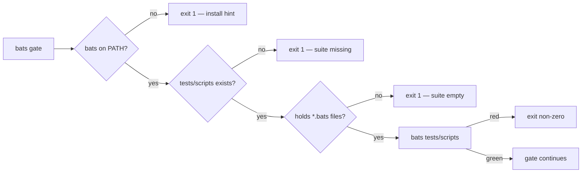

# quality.sh: the bats shell-harness gate now fails loud (Issue #631)

## Summary

`quality.sh` ran the `tests/scripts` bats suite only when `bats` was on PATH and
warned-and-continued when it was not, so on a host without `bats` every
`tests/scripts/*.bats` file — the argument-injection guards from #608 included —
went unenforced while the run still printed `✅ All quality checks passed!`. A
missing or empty `tests/scripts` passed the same way, vacuously.

The block now fails loud in the shape of the `shellcheck` block above it: a
missing `bats`, a missing `tests/scripts`, or a directory holding no `*.bats`
files each exits 1 with the reason, and the install hint names both documented
routes. `tests/scripts/quality_bats_gate.bats` pins the behaviour by extracting
the real block from `quality.sh` and running it. Closes #631.

CI is unaffected: `.github/workflows/ci.yml` installs `bats` and runs
`bats tests/scripts` directly, and no workflow invokes `quality.sh`
(`tests/scripts/docs_pipeline_accuracy.bats`), so the blast radius is local runs.



## Evidence

Backend/CLI change — no web interface to screenshot. Evidence is command output.

Symptom before the fix (the block extracted, run with an emptied PATH, the
success line appended):

```text
🧰 Running bash helper tests (bats)...
⚠️  bats not installed — skipping shell helper tests
   Install with: brew install bats-core  (or your package manager)
✅ All quality checks passed!
exit=0
```

After: `bats is required — install: brew install bats-core (or your package
manager, e.g. sudo apt-get install -y bats)`, exit 1, no success line.

Each guard was mutation-tested — reverting it turns the named case red:

| Mutation to `quality.sh` | Case that goes red |
|---|---|
| warn-and-continue bats guard restored | `a missing bats fails the gate…` |
| `tests/scripts` existence + emptiness guards removed | the two suite-shaped cases |
| install hint gutted to `install: nope` | `…names both documented install routes` |
| `bats tests/scripts \|\| true` | `a red suite fails the gate` |
| `# >>> bats-gate` marker renamed | `setup` aborts every case |

Full suite: `bats tests/scripts` → 526 ok, 0 failures. `shellcheck -s bash
quality.sh` clean. `cargo test --workspace --lib --tests --all-features` green
(no Rust changed).

## Reproduction

- **symptom** — with `bats` absent, `quality.sh`'s shell-harness gate is skipped
  with a warning and the run still ends `✅ All quality checks passed!`
- **status** — `verified` — the extracted block was observed exiting 0 and
  printing the success line against the unfixed script (output above), and the
  new cases were observed failing against that same unfixed block before the
  guards were added
- **regression test** —
  `tests/scripts/quality_bats_gate.bats::a missing bats fails the gate rather than skipping the shell tests`

## Acceptance Criteria

<!-- vibe-spec-review inputs="diff+issue-body" -->

- **met** — `quality.sh` exits non-zero when `bats` is unavailable, naming how to
  install it — evidence: `quality.sh:48-51`, pinned by
  `tests/scripts/quality_bats_gate.bats::a missing bats fails the gate rather than skipping the shell tests`
  — reviewer: met
- **met** — `quality.sh` exits non-zero when `tests/scripts` is missing or empty
  — evidence: `quality.sh:52-59`, pinned by the two suite-shaped cases in
  `tests/scripts/quality_bats_gate.bats` — reviewer: met
- **met** — a bats case pins both, and fails if either guard is removed —
  evidence: the mutation table above; the reviewer independently reproduced it
  ("Mutation-verified … Unmutated: 6/6 pass") — reviewer: met
- **partial** — `shellcheck` and `./quality.sh` green — evidence:
  `shellcheck -s bash quality.sh` clean; `./quality.sh` clears every stage
  through `cargo deny` and fails at `🪄 Auto-formatting code…` with `rustup
  could not choose a version of cargo-fmt` — reviewer: partial — reason: the
  sandbox has no default rustup toolchain, reproduced with this diff stashed on
  an unmodified tree, so it is environmental and not attributable to the change;
  CI runs the same stages with a toolchain present
- **unrequested** — README's `quality.sh` row gains the "bats is required"
  rationale and the install commands — reviewer: unrequested — reason: a code
  change owes a docs change; `quality.sh` stopped being runnable without `bats`,
  so the row that lists it had to say so
- **unrequested** — `# >>> bats-gate` / `# <<< bats-gate` extraction markers in
  `quality.sh` — reviewer: unrequested — reason: the issue asks for the block
  "extracted and run", and delimiting it is what lets the test execute the real
  code verbatim rather than a paraphrase
- **unrequested** — the stub `bats` shim and the two positive-control cases —
  reviewer: unrequested — reason: without a case proving the gate still runs a
  present suite, all four guards could be satisfied by an unconditional `exit 1`

## Standards Review

<!-- vibe-standards-review inputs="diff+CODING-STANDARDS.md" -->

- **violation** — vacuous oracle: the install-hint assertion passed on the word
  "install" alone — evidence: `tests/scripts/quality_bats_gate.bats:68` (as
  reviewed) — reason: fixed here; the case now asserts both `bats-core` and
  `apt-get`, and is mutation-proven against `install: nope`
- **violation** — no case pinned that a red suite fails the gate, so
  `bats tests/scripts || true` stayed green — evidence:
  `tests/scripts/quality_bats_gate.bats:36-38` (as reviewed) — reason: fixed
  here; the stub reports `GATE_STUB_EXIT` and `a red suite fails the gate`
  covers it
- **violation** — "the only gate over the repository's shell scripts" was
  inaccurate; `bash -n` and `shellcheck` also gate them — evidence:
  `quality.sh:40`, `README.md:117` — reason: fixed here, reworded to the only
  gate over their *behaviour*
- **violation** — the success line was a hand copy of `quality.sh`'s and could
  drift — evidence: `tests/scripts/quality_bats_gate.bats:14` (as reviewed) —
  reason: fixed here; `setup` now reads the real line out of `quality.sh` and
  fails loud if it is absent
- **violation** — DRY: the last case duplicated the `run_gate_with_stub_bats`
  helper — evidence: `tests/scripts/quality_bats_gate.bats:102-103` (as
  reviewed) — reason: fixed here, it calls the helper after `cd "$REPO_ROOT"`
- **violation** — SC2164: unguarded `cd` in `setup`/`teardown` — evidence:
  `tests/scripts/quality_bats_gate.bats:41` (as reviewed) — reason: fixed here,
  all three now use `cd … || return 1`
- **violation** — `-type f` made a symlinked `*.bats` file read as an empty
  suite — evidence: `quality.sh:56` — reason: fixed here, `! -type d` accepts
  symlinks while `-maxdepth 1` still matches what `bats tests/scripts` runs
- **violation** — the gate lives inline behind extraction markers rather than as
  `scripts/bats-gate.sh` called by `quality.sh`, the convention
  `scripts/typescript-check.sh` follows — evidence: `quality.sh:44-61` — reason:
  stands. The issue asks for the guard "in the same shape as the `shellcheck`
  block immediately above it", which is inline, and extracting a script is a
  larger refactor than this issue scopes. The cost is that the suite pins the
  block, not the whole script — a change *outside* the markers that neutered it
  would go unseen
- **clean** — Australian English throughout; cross-platform bash 3.2 / BSD-safe
  (`find -maxdepth 1 ! -type d -name`, `mktemp -d`, `command -v`, no GNU-only
  flags); tests call real code rather than grepping source text; the harness
  fails loud when the marker block or the success line disappears; no hidden
  paths staged; file size 130 lines, within suite norms; markdownlint and CI
  unaffected

## Test Plan

Added `tests/scripts/quality_bats_gate.bats` (7 cases, all executing the real
block extracted from `quality.sh`):

- `a missing bats fails the gate rather than skipping the shell tests`
- `the missing-bats message names both documented install routes`
- `a missing tests/scripts directory fails the gate rather than passing vacuously`
- `an empty tests/scripts directory fails the gate`
- `a red suite fails the gate`
- `a populated tests/scripts suite is run and the gate passes`
- `the repository's own shell-harness suite satisfies the gate`

No existing test was modified or removed. `bats tests/scripts` → 526 ok, 0
failures.
