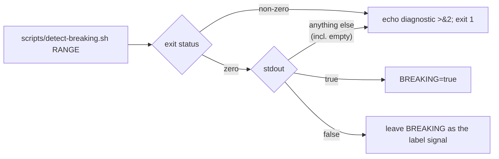

# Both CI callers now fail loud when `detect-breaking.sh` fails

## Summary

Both `ci.yml` callers of `scripts/detect-breaking.sh` captured its stdout inside
a `[ … ]` test, which discards the exit status. A non-zero exit — a bad range, a
git failure, the missing-argument usage error, or the option-shaped-range guard
added by #608 — yielded an empty substitution, the comparison was false, and the
lane proceeded as "not breaking". A breaking change could therefore have shipped
on a patch bump because the detector *failed*, not because it answered `false`,
with the version gate that exists to prevent exactly that never firing.

Each call site now captures the answer and the exit status separately, fails the
step on a non-zero exit, and rejects any output that is not exactly `true` or
`false` (empty output with a zero exit lands in the same reject arm, closing the
original symptom on both axes). `RELEASING.md`, which documented the gap as
open, now documents the contract. Closes #634.

Before, the whole right-hand side collapsed into one edge: any status, any
output other than the literal `true`, meant "not breaking".

## Evidence

Backend/CI change with no web interface, so there is nothing to screenshot. The
evidence is the behaviour of the real step bodies under test.

- `bats tests/scripts/ci_detect_breaking_exit_status.bats` — 9/9 pass. The cases
  extract the live `run:` bodies from `.github/workflows/ci.yml` with the shared
  `extract_step` helper and execute them under the argv GitHub would use,
  against a stub `detect-breaking.sh` whose output and exit code the test sets.
- `bats tests/scripts` — 535/535 pass (the shell-harness gate `quality.sh` runs).
- `actionlint .github/workflows/ci.yml` — clean.
- `shellcheck -s bash` over every `*.sh`, and `bash -n` over every `*.sh` — clean.
- **Mutation evidence.** Reverting either call site to
  `if [ "$(scripts/detect-breaking.sh "$RANGE")" = "true" ]` turns that site's
  two failure cases red; deleting only the `*)` arm turns the junk-output case
  red; the four happy-path cases stay green throughout, so they are not what is
  doing the work. Independently reproduced by both reviewer agents, including a
  sneaky `$(… || echo false)` mutant that the shape-guard grep misses and the
  behavioural cases still catch.
- **`./quality.sh` did not complete in this container.** It passed the bash
  syntax, shellcheck, bats and `cargo deny` stages and the debug build, then
  stopped at `🪄 Auto-formatting code...` with
  `error: rustup could not choose a version of cargo-fmt to run, because one
  wasn't specified explicitly, and no default is configured.` — there is no
  rustup toolchain installed here (`~/.rustup/toolchains` does not exist), which
  is environmental and pre-existing. This diff contains no Rust and no `*.sh`
  changes, so the stages that could not run cover nothing it touches; CI runs
  them on the PR.

## Reproduction

- **symptom** — a `detect-breaking.sh` that exits non-zero (or prints anything
  other than `true`) was read by both CI lanes as a definite "not breaking", so
  the breaking-change version gate never fired
- **status** — `verified` — the four guard cases were observed failing against
  the unfixed `ci.yml` (exit-status and junk-output cases at both call sites,
  plus the shape guard: 5 red, 4 green) and passing after the fix
- **regression test** —
  `tests/scripts/ci_detect_breaking_exit_status.bats::version-increment step fails when detect-breaking.sh exits non-zero`
  and
  `tests/scripts/ci_detect_breaking_exit_status.bats::version gate step fails when detect-breaking.sh exits non-zero`

## Acceptance Criteria

<!-- vibe-spec-review inputs="diff+issue-body" -->

- **met** — both `ci.yml` call sites fail the step when `detect-breaking.sh`
  exits non-zero, instead of reading the empty output as "not breaking" —
  evidence: `.github/workflows/ci.yml:137-140` and `.github/workflows/ci.yml:254-257`
  — reviewer: met
- **met** — an output that is neither `true` nor `false` also fails the step —
  evidence: the `case` `*)` arm at `.github/workflows/ci.yml:141-147` and
  `.github/workflows/ci.yml:258-264` — reviewer: met
- **met** — a bats case pins both, driving the extracted step body against a
  failing stub, and fails if either guard is removed — evidence:
  `tests/scripts/ci_detect_breaking_exit_status.bats::version-increment step fails when detect-breaking.sh exits non-zero`
  (and its three siblings), verified non-vacuous by mutation — reviewer: met
- **partial** — `shellcheck`, `actionlint` and `./quality.sh` green — evidence:
  shellcheck, `bash -n`, actionlint and `bats tests/scripts` (535/535) all green
  — reviewer: met — reason: departing from the reviewer, which judged the
  criterion on the diff alone; `./quality.sh` stopped at `cargo fmt` because this
  container has no rustup toolchain, so the Rust stages were not run. The diff
  contains no Rust or `*.sh` changes and CI runs those stages on the PR.
- **unrequested** — `RELEASING.md` paragraph rewritten — reviewer: unrequested —
  reason: it documented this gap as *open* ("that caller-side gap is tracked
  separately as #634"); leaving it would have shipped a doc asserting the bug
  still exists.
- **unrequested** — `RANGE="origin/$BASE_BRANCH..HEAD"` hoisted into a variable
  in the version-gate step — reviewer: unrequested — reason: behaviour-neutral;
  it lets the two new diagnostics name the range that failed.
- **unrequested** — four happy-path bats cases beyond the one failing-stub case
  the issue asked for — reviewer: unrequested — reason: they are what
  distinguishes "the guard fired" from "the step is broken", and they keep the
  arm-only mutants distinguishable.

## Standards Review

<!-- vibe-standards-review inputs="diff+CODING-STANDARDS.md" -->

- **violation** — DRY: the capture-and-validate block is duplicated across the
  two steps — evidence: `.github/workflows/ci.yml:137-150` and the near-identical
  copy at `:254-267` — reason: it stands. The issue prescribes the inline shape
  at both call sites, and the alternative (a new `scripts/` wrapper) adds a
  public script and its own suite for 13 duplicated lines inside one file, while
  still leaving each caller responsible for not swallowing the wrapper's status.
  Both copies are pinned by their own behavioural cases, so a silent drift
  between them fails the suite.
- **violation** — no `docs/archive/pr-summaries/pr-summary-634.md` in the diff —
  evidence: the reviewer read the diff before this file existed — reason: fixed
  here; this is that file.
- **clean** — tests run the real extracted step bodies and assert observable
  outcomes (exit status, the `Breaking change signalled:` / `breaking=` lines,
  marker files proving the step stopped before `version-bump-needed.sh` /
  `check-version-bump.sh`); shared helpers reused via `load helpers`; fail-loud
  error handling with a stderr diagnostic naming the range and the offending
  value; docs updated alongside the code with `RELEASING.md` still the single
  source for version policy; Australian English; no hidden or secret paths
  staged.

## Test Plan

New: `tests/scripts/ci_detect_breaking_exit_status.bats` — 9 cases.

- version-increment step fails when `detect-breaking.sh` exits non-zero
- version-increment step fails when `detect-breaking.sh` prints an unexpected value
- version-increment step treats a `false` answer as not breaking
- version-increment step treats a `true` answer as breaking
- version gate step fails when `detect-breaking.sh` exits non-zero
- version gate step fails when `detect-breaking.sh` prints an unexpected value
- version gate step treats a `false` answer as not breaking
- version gate step treats a `true` answer as breaking
- no `ci.yml` call site captures `detect-breaking.sh` inside a test expression
  (shape guard over the live workflow, backed by — not replacing — the eight
  behavioural cases)

Modified: none. No existing test was changed, disabled or removed.
