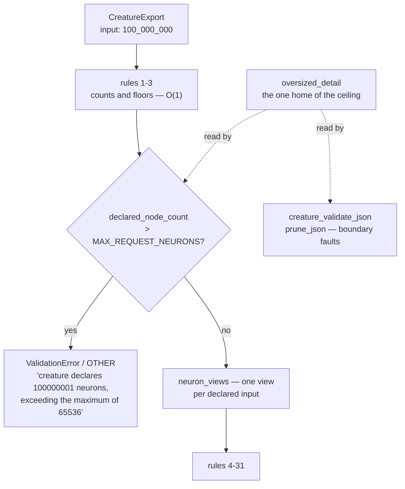

## Summary

`creature_validate` derived one `NeuronView` per **declared** observation width
before the first rule ran, so a native Rust caller handing it
`CreatureExport { input: 100_000_000, .. }` — a payload under 100 bytes — bought
a hundred million views. That is the Issue #622 amplification at an entry point
#622 deliberately excluded, because `creature_validate` owes NEAT-AI's own rule
vocabulary rather than a typed `CreatureError` and so cannot call
`validate_creature_width`.

It now refuses an over-wide declaration **ahead of the walk**, as a rule of its
own: `ValidationError` / `OTHER` carrying the sentence
`creature_validate_json::oversized_detail` already owns, so the ceiling
(`MAX_REQUEST_NEURONS == MAX_NODE_COUNT`) is read from its single home rather
than restated. The refusal runs after the allocation-free rules 1–3, which are
the ported TypeScript's first word on a width, so the ported rule order is
unchanged. `validate_synapse_and_memetic_rules` — the same walk, publicly
callable on its own — takes the same guard.

The declared node count itself had been written out in four places; it is now
one `declared_node_count` helper in `creature.rs` that every ceiling reads.

Closes #639.

## Evidence

Backend/library change with no web interface to screenshot. The evidence is the
allocation oracle and the typed-outcome tests below, plus a green `./quality.sh`
(fmt, clippy `-D warnings`, `cargo test --workspace --all-features`, doctests,
`RUSTDOCFLAGS="-D warnings" cargo doc`, release build, bats shell harness) after
the final edit.

**The unfixed code, measured.** Against the code before the fix,
`creature_validate_refuses_a_declared_input_past_the_node_ceiling` did not
merely fail — the test process ran for over 60 seconds and was `SIGKILL`ed
allocating for the declared width. After the fix the same suite finishes in
0.03s.

**Per-call-site mutation evidence** (each guard removed on its own, then
restored — independently reproduced by the standards reviewer):

| Mutation | Test that goes red |
|---|---|
| drop `refuse_oversized_declared_width` in `creature_validate` | `creature_validate_refuses_an_oversized_declared_input_without_paying_for_it` |
| drop it in `validate_synapse_and_memetic_rules` | `the_synapse_half_refuses_an_oversized_declared_input_without_paying_for_it` |

Neither test is vacuous, and neither call site is covered only by the other.

## Reproduction

- **symptom** — `creature_validate(&CreatureExport { input: 100_000_000, .. })`
  allocates one `NeuronView` per declared input before any rule runs; the
  declaration, not the payload, decides the memory spent, and a large enough
  literal aborts the process
- **status** — `verified` — the regression tests were observed failing against
  the unfixed code (the 100 000 000 case ran > 60 s and was `SIGKILL`ed mid
  allocation; the 1 000 000 allocation-oracle case failed its refusal
  assertion) and pass after the fix
- **regression test** — `neat-core/tests/creature_width_allocations.rs::creature_validate_refuses_an_oversized_declared_input_without_paying_for_it`

## Security

The `security` label's evidence contract, discharged:

- **Regression test added in this branch**, failing before and passing after:
  `neat-core/tests/creature_width_allocations.rs::creature_validate_refuses_an_oversized_declared_input_without_paying_for_it`
  reproduces the flaw (a per-thread counting global allocator asserts the cost
  of the refusal does not move when the declared width is quadrupled) and
  `neat-core/tests/creature_width_contract.rs::creature_validate_refuses_a_declared_input_past_the_node_ceiling`
  pins the typed outcome.
- **The original trigger is closed with no trivial bypass.** The issue's exact
  input — `CreatureExport { input: 100_000_000, .. }` handed straight to
  `creature_validate` — now returns on the ceiling comparison at
  `neat-core/src/creature_validate.rs`, which sits between rules 1–3 and
  `neuron_views`. Everything reachable before it is O(1): rules 1–3 compare
  three numbers and allocate only a `format!` on the failure path. The
  equivalent bypasses were closed with it: the standalone synapse half
  (`validate_synapse_and_memetic_rules`) takes the same guard; a width at
  `usize::MAX` cannot wrap the node count back under the ceiling because the
  sum saturates (`declared_node_count`); and the width cannot be re-inflated
  after the check, because `neuron_views` is the only walk sized by it and both
  of its non-test callers now pass the guard first.
- **One residual, recorded not hidden.** `MemeticExport::prune_to` (and so
  `CreatureExport::prune_memetic`) walks the same width and answers with `()`,
  so refusing needs a public signature change under the three-phase flow in
  `RELEASING.md`. It is Issue #650, cross-referenced from the precondition note
  on `neuron_views`, from `AGENTS.md` and from `README.md`. Every route that
  reaches it inside this crate comes through a boundary that bounded the width
  first.

## Acceptance Criteria

<!-- vibe-spec-review inputs="diff+issue-body" -->

- **met** — `creature_validate` does not allocate or iterate on a declared width before that width is bounded — evidence: `neat-core/src/creature_validate.rs` (`refuse_oversized_declared_width` runs ahead of `neuron_views`; the only earlier step, `validate_declared_widths`, is O(1)) — reviewer: met
- **met** — a `CreatureExport` declaring `input: 100000000` handed straight to `creature_validate` is refused in bounded time, in that function's own failure vocabulary — evidence: `neat-core/tests/creature_width_contract.rs::creature_validate_refuses_a_declared_input_past_the_node_ceiling` — reviewer: met — reason: the reviewer noted the *message* is the JSON boundary's sentence rather than TypeScript rule wording; that is the issue's own "reuse `oversized_detail`, do not re-inline" instruction winning over its "NEAT-AI's wording" phrasing, and the class/reason (`ValidationError` / `OTHER`) are the validator's own vocabulary
- **met** — the ceiling is not re-inlined; it reuses the single home it already has — evidence: `neat-core/src/creature_validate.rs` calls `crate::creature_validate_json::oversized_detail` — reviewer: met — reason: the reviewer's nit that the *declared-count expression* was still written in four places is fixed in this branch by `declared_node_count` (`neat-core/src/creature.rs`), now read by all four
- **met** — regression tests, including an allocation oracle; `./quality.sh` green — evidence: `neat-core/tests/creature_width_allocations.rs` (two new oracle cases) and `neat-core/tests/creature_width_contract.rs` (five new typed cases); `./quality.sh` run green after the final edit — reviewer: partial — reason: the reviewer judged the commit it saw, where `cargo doc -D warnings` failed on a private intra-doc link; that link is fixed in this branch and the full gate now passes
- **unrequested** — `validate_synapse_and_memetic_rules` takes the same guard, with its own oracle and typed test — reviewer: unrequested — reason: the issue names `creature_validate`, but this is the identical unbounded walk behind a second public re-export with no internal callers; leaving it open would have reproduced #639 verbatim at a fourth entry point
- **unrequested** — `declared_node_count` extracted in `neat-core/src/creature.rs` and adopted by `creature_validate_json` and `prune_json` — reviewer: unrequested — reason: both reviewers flagged the derivation being restated four times inside a change whose argument is that the ceiling has one home; the helper is the DRY fix and touches no behaviour
- **unrequested** — accepting-edge, rule-order and `usize::MAX` overflow tests (`creature_width_contract.rs`) — reviewer: unrequested — reason: they pin the claims this change's own docs make (the ceiling is inclusive, rules 1–3 speak first, the sum saturates); without them the documented behaviour would be unenforced

## Standards Review

<!-- vibe-standards-review inputs="diff+CODING-STANDARDS.md" -->

- **violation** — a fourth public entry point, `MemeticExport::prune_to`, still walks the declared width unbounded, so the invariant the docs assert is not yet true — evidence: `neat-core/src/creature_validate.rs:1901` (reviewer's line numbers, at the commit reviewed) — reason: stands, deliberately and now visibly: it answers with `()`, so a refusal is a public-API change under `RELEASING.md`'s three-phase flow rather than a guard. Filed as Issue #650 and named in the `neuron_views` precondition note, `AGENTS.md` and `README.md`
- **violation** — the oracle module doc and `README.md` overstated the fix as closing every entry point #622 left out — evidence: `neat-core/tests/creature_width_allocations.rs:19`, `README.md:516` — reason: fixed here; both now name `prune_to` as the outstanding route and cite Issue #650
- **violation** — `neuron_views` gained guarded callers but no precondition note, the pattern `if_graft::index_map` established for exactly this hazard — evidence: `neat-core/src/creature_validate.rs:1022` — reason: fixed here; `neuron_views` now carries the same "**Precondition:** … A new caller owes the same check" note, naming both guarded callers and the unguarded one
- **violation** — the expected-message helper's comment claimed it derived the wording from the ceiling's single home, and that every boundary reports through `oversized_detail` (the packed boundary restates it) — evidence: `neat-core/tests/creature_width_contract.rs:497` — reason: fixed here; the comment now says the opposite and correct thing — the wording is written out so the oracle stays independent of the code under test, per the AGENTS.md oracle rule
- **violation** — the new cases sit outside `CEILING_SITES`, whose stated purpose is that no entry point is added with the ceiling forgotten — evidence: `neat-core/tests/creature_width_contract.rs:505` — reason: partially fixed. The table's `fn(usize) -> Option<usize>` shape assumes a typed `CreatureError` and cannot carry a `ValidationFailure`, so instead of a risky widening the table's doc now points at the validator section and says a new entry point belongs in one of the two, never in neither
- **violation** — `input.saturating_add(neurons.len())` restated in a change arguing for one home, and applied inconsistently (`neuron_views` and `validate_neuron_rules` kept a plain `+`) — evidence: `neat-core/src/creature_validate.rs:707` — reason: fixed here; `declared_node_count` is the one derivation and all five sites read it
- **violation** — the allocation oracle's predicate returned a bare `false` for both "accepted" and "refused for the wrong reason", so a regression would panic with a misleading message before reaching the byte assertions — evidence: `neat-core/tests/creature_width_allocations.rs:221` — reason: fixed here; `refused_for_being_oversized` fails loud naming the actual answer
- **violation** — public functions now refuse creatures they previously accepted, which `RELEASING.md` lists as breaking, with no phase split — evidence: `RELEASING.md:50` — reason: stands, and is flagged for the maintainer. The narrowing only bites a declared width past 65 536, which no consumer can compile or score, and it matches the precedent this issue descends from: #622 shipped the identical narrowing on `parse_creature_json` / `compile_creature` in one PR
- **clean** — the ceiling value and its node-count meaning match the `TooManyNodes` sites; the ordering claim ("rules 1–3 allocate nothing") verified against `validate_declared_widths`; the accepting edge is exactly `MAX_NODE_COUNT` nodes; the runtime and packed shapes genuinely need no rule (both size their walk from neurons the payload carries); all new tests are "what" tests asserting observable outcomes and named for behaviour; the counting-allocator oracle compares two readings rather than an absolute constant; Australian English throughout; ownership fence, build profiles and `unsafe`/SIMD invariants untouched; `# Errors` sections present; no hidden paths staged

## Test Plan

Added to `neat-core/tests/creature_width_allocations.rs` (the #622 allocation
oracle — a per-thread counting global allocator asserting the refusal cost does
not move when the declared width is quadrupled):

- `creature_validate_refuses_an_oversized_declared_input_without_paying_for_it`
- `the_synapse_half_refuses_an_oversized_declared_input_without_paying_for_it`
- `refused_for_being_oversized` — a shared predicate that fails loud naming the
  actual answer instead of collapsing "accepted" and "refused for the wrong
  reason" into `false`

Added to `neat-core/tests/creature_width_contract.rs` (typed outcomes):

- `creature_validate_refuses_a_declared_input_past_the_node_ceiling` — class,
  reason, exact message and both `None` indices
- `the_synapse_half_refuses_a_declared_input_past_the_node_ceiling`
- `creature_validate_reports_the_allocation_free_rules_before_the_ceiling` —
  rules 1 and 2 still speak first
- `creature_validate_refuses_a_declared_width_that_would_overflow_the_node_count`
  — `usize::MAX` saturates rather than wrapping or panicking
- `creature_validate_accepts_the_widest_addressable_declaration` — the
  accepting edge, exactly `MAX_NODE_COUNT` nodes

No existing test was modified or removed. Full `./quality.sh` green.
