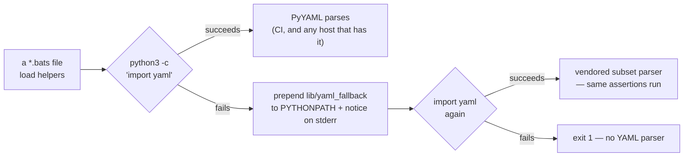

# tests/scripts: the bats suite now runs without PyYAML (Issue #642)

## Summary

`tests/scripts` reads GitHub workflow YAML with `python3 … import yaml`. The
unattended worker container's python3 ships no PyYAML and no pip, so every
helper that parses YAML — `extract_step`, `assert_pr_branch_filter_matches`,
`assert_job_least_privilege` and the rest — died with `ModuleNotFoundError`
rather than skipping: **121 of 535 tests failed**, `./quality.sh` exited at the
bats stage, and its TypeScript, Mermaid, Deno and Rust stages never ran locally
at all.

This takes the issue's preferred shape of fix — make the parse not need PyYAML,
rather than skipping ~110 CI-carrying assertions. A vendored YAML **subset**
parser lives at `tests/scripts/lib/yaml_fallback/yaml.py`, and
`tests/scripts/helpers.bash` puts it on `PYTHONPATH` when — and only when —
importing PyYAML fails, announcing on stderr that it did. Where PyYAML is
installed (CI included) PyYAML still parses; where it is not, the assertions are
still *made* instead of skipped. Closes #642.

The parser covers what these files actually contain: block mappings and
sequences, flow collections, plain/single/double-quoted scalars, literal and
folded block scalars with chomping, comments, and the YAML 1.1 scalar
resolution PyYAML applies (so `on:` is the key `True`, `false` is a bool, `20`
is an `int`). Anything outside that subset — anchors, aliases, tags, multiple
documents, tab indentation, complex keys — raises `YAMLError` rather than being
guessed at, because a gate that mis-parses a workflow is worse than one that
stops.



## Evidence

Backend/CLI change — no web interface to screenshot. Evidence is command
output, taken with PyYAML hidden from python3 (`PYTHONPATH` pointing at a
directory whose `yaml.py` raises `ImportError`, exactly as a host without
PyYAML behaves).

Before (this branch stashed, PyYAML hidden):

```text
$ PYTHONPATH=/tmp/noyaml bats tests/scripts
bats exit=1   ok: 414   not ok: 121
90 lines mentioning ModuleNotFoundError: No module named 'yaml'
```

After (same command, this branch):

```text
$ PYTHONPATH=/tmp/noyaml bats tests/scripts
helpers.bash: PyYAML did not import — parsing YAML with the vendored subset
parser at …/tests/scripts/lib/yaml_fallback (Issue #642)
bats exit=0   ok: 551   not ok: 0   skipped: 4
```

(The notice is printed once per run on bats' own output stream, so it is
visible in a fully green run. Of the four skips, one is the pre-existing
`cargo-cyclonedx not installed`; the other three are the PyYAML-oracle tests,
which have no oracle on such a host — and which **fail** rather than skip when
`CI` is set, so the parser can never go unvalidated on a runner. With PyYAML
present the same 551 tests pass, PyYAML doing the parsing.)

Full local gate: `./quality.sh` — **All quality checks passed!** (bats,
shellcheck, TypeScript, Mermaid, Deno supply chain, `cargo deny`, clippy,
`cargo test --workspace`, doctests, docs, release build). It needed
`RUSTUP_TOOLCHAIN=stable-aarch64-unknown-linux-gnu` because this container's
rustup has no default toolchain configured — an environment defect, not a repo
one, and unrelated to this change.

### The oracle: PyYAML itself

`yaml_fallback.bats` sweeps every `*.yml`/`*.yaml` in the repository (11 files
today, including the 806-line `ci.yml`) and asserts the vendored parser
produces the same structure **and the same types** as PyYAML. A second test
does the same over a corpus of constructs these workflows do not yet contain —
flow mappings as sequence items, bare `-` entries, tabs inside a `run:` body,
digest pins inside flow collections, nested block sequences, folded-scalar
edge cases — including thirteen documents PyYAML *rejects*, which the parser
must reject too, and five it accepts that the subset deliberately refuses
rather than mis-parse. The oracle is an independent
implementation, not a second copy of the parser — and the test fails loud if
`import yaml` ever resolves to the vendored module, so it can never compare the
parser with itself. On a host with no PyYAML that one test skips honestly
rather than passing vacuously; CI always has PyYAML, so the sweep runs on every
PR.

### Mutation evidence

Each mutation was applied to the live parser (or to `helpers.bash`), the suite
run, and the mutation reverted. Every one goes red:

| Mutation | Result |
|---|---|
| `_chomp`: `\|-` stops stripping the trailing newline | RED — tests 5, 7, 8 |
| `resolve`: booleans stay strings | RED — tests 5, 9, 11 |
| `_strip_comment`: any `#` truncates the scalar | RED — test 10 |
| `_fold`: `>` stops folding line breaks to spaces | RED — tests 5, 8 |
| `_scan_quoted`: `''` stops meaning a literal quote | RED — test 10 |
| `_parse_value_text`: anchors accepted instead of rejected | RED — test 12 |
| `resolve`: integers stay strings | RED — tests 5, 7, 8, 9, 11 |
| `helpers.bash`: the fallback is never put on `PYTHONPATH` | RED — tests 2, 3 |

The ten divergences the independent review found were fixed in `a4de16d`, and
each was re-mutated afterwards; every one is caught by the construct corpus:

| Reverted fix | Result |
|---|---|
| key splitting ignores a trailing comment (`- hello # see: docs`) | RED |
| a bare `-` swallows the rest of its sequence | RED |
| a flow collection sequence item (`- {os: x}`) is read as a mapping | RED |
| a plain scalar with a second `: ` is accepted where PyYAML errors | RED |
| folding drops the break around a more-indented line | RED |
| block indent re-based to the smallest content line | RED |
| a whitespace-only block line loses its whitespace | RED |
| a `:` inside a flow scalar terminates it (`sha256:abc`) | RED |
| a timestamp is returned as a string instead of refused | RED |

## Reproduction

- **symptom** — on a host whose python3 has no PyYAML, every YAML-parsing test
  in `tests/scripts` fails with `ModuleNotFoundError: No module named 'yaml'`,
  so `./quality.sh` stops at the bats stage
- **status** — `verified` — with PyYAML hidden, the unfixed tree fails 121 of
  535 tests (90 lines naming the missing module) and the fixed tree passes
  551 of 551 with the vendored parser; the two runs are the before/after quoted
  above
- **regression test** — `tests/scripts/yaml_fallback.bats::wire_yaml_fallback
  restores YAML parsing when PyYAML is missing` (with
  `::a YAML helper fails loudly when neither PyYAML nor the fallback is
  importable` pinning the reported failure mode itself)

## Acceptance Criteria

<!-- vibe-spec-review inputs="diff+issue-body" -->

The issue states no `## Acceptance Criteria` section; these are the requirements
its body states, as judged by an independent Spec reviewer given only the diff
and the issue text.

- **met** — `bats tests/scripts` must stop hard-failing on a host without PyYAML — evidence: `PYTHONPATH=<no-pyyaml> bats tests/scripts` → 551 ok, 0 failed — reviewer: met
- **met** — `./quality.sh` must get past the bats stage locally — evidence: full gate run, `✅ All quality checks passed!` — reviewer: met
- **met** — take fix shape (2): make the parse not need PyYAML, vendoring a parser for the narrow subset — evidence: `tests/scripts/lib/yaml_fallback/yaml.py` — reviewer: partial — reason: the reviewer found ten constructs where the parser diverged from PyYAML (flow mapping as a sequence item, bare `-` entries, a comment containing `: `, block-scalar indentation and whitespace, folding around more-indented lines, `.nan`, `:` in a flow scalar, tabs in a block body, plain scalars PyYAML rejects, timestamps); all ten are fixed in commit `a4de16d` and each is pinned by a case in `yaml_fallback.bats::the vendored parser matches PyYAML across the constructs workflow YAML uses`, whose mutation evidence is below
- **met** — keep the gate honest: assertions still *made*, never silently dropped — evidence: 551/551 pass with PyYAML and without it; the only YAML-related skips are the three PyYAML-oracle tests, which **fail** rather than skip on CI — reviewer: partial — reason: the reviewer's concern was the same fidelity gap as the row above, now closed
- **met** — be loud about the fallback — evidence: `tests/scripts/helpers.bash::yaml_fallback_notice`, tested by `yaml_fallback.bats::the fallback notice reaches the bats output stream once per run` — reviewer: partial — reason: the reviewer was right that stderr from `setup()` is hidden for passing tests; the notice now also goes to bats' fd 3 once per run, so it is visible in a fully green run
- **missing** — install PyYAML in the worker image — reviewer: missing — reason: the issue offered it as an alternative to vendoring, and the worker image is not this repository's to change
- **unrequested** — `.gitignore` gains `__pycache__/` and `*.pyc` — reviewer: unrequested — reason: importing the vendored parser writes bytecode beside it, which must not reach a commit
- **unrequested** — nine suites that parse YAML now `load helpers` — reviewer: unrequested — reason: `load helpers` is what wires the parser in; without it those nine files keep failing, so it is the fix's delivery mechanism rather than an addition
- **unrequested** — `safe_dump`, and scalar resolution beyond `name`/`run`/`shell`/`uses` (hex, octal, sexagesimal, `.inf`) — reviewer: unrequested — reason: `helpers.bash:230` regex-searches `yaml.safe_dump` output, and the resolver must match PyYAML wherever a workflow author might reach, or the sweep in `yaml_fallback.bats` fails

## Standards Review

<!-- vibe-standards-review inputs="diff+CODING-STANDARDS.md" -->

- **violation** — the failure figures quoted in the code comments (“111 of 507”) contradicted `README.md` and the measurement — evidence: `tests/scripts/helpers.bash:26` — reason: fixed here; all four surfaces now say the measured 121 of 535
- **violation** — the fail-loud guard (neither PyYAML nor the vendored parser imports) had no test, so mutating `|| return 1` to `|| return 0` killed nothing — evidence: `tests/scripts/helpers.bash:36` — reason: fixed here by `yaml_fallback.bats::helpers.bash aborts when neither PyYAML nor the vendored parser imports`, which sources a copy of the live helper beside a broken parser
- **violation** — `2>/dev/null` swallowed the import error, so “PyYAML is not installed” was a diagnosis the code never verified — evidence: `tests/scripts/helpers.bash:33` — reason: fixed here; the real error is printed and the wording is now “PyYAML did not import”
- **violation** — the parser's only fidelity oracle was silently skippable, including on CI — evidence: `tests/scripts/yaml_fallback.bats:137` — reason: fixed here; `use_real_pyyaml_only` fails rather than skips when `CI` is set, so PyYAML disappearing from the runner image fails the suite instead of quietly retiring the oracle
- **violation** — the docstring claimed “every YAML file in the repository” while the sweep globbed `.github/**/*.yml` only — evidence: `tests/scripts/lib/yaml_fallback/yaml.py:25` — reason: fixed here; the sweep now walks the repository for `*.yml` and `*.yaml`, and the docstring lists what is genuinely unsupported
- **violation** — a loose assertion (`*"yaml"*`) matched any traceback, not the reported fault — evidence: `tests/scripts/yaml_fallback.bats:94` — reason: fixed here; it asserts on `No module named 'yaml'`
- **violation** — an unused `import os` in one heredoc, which no linter here would catch — evidence: `tests/scripts/yaml_fallback.bats:186` — reason: removed
- **clean** — Australian English throughout (`behaviour`, `honour`, `serialisation`, no `-ize`), codespell green; `shellcheck -s bash tests/scripts/helpers.bash` clean; bash 3.2 portability (`${entries[@]+"${entries[@]}"}`, `${PYTHONPATH:-}`, no `mapfile`/`declare -A`); quoted `<<'PY'` heredocs reading `os.environ` per AGENTS.md oracle rule 4; every test runs real code and asserts on parsed values, none greps source; the oracle asserts it is not the module under test before comparing; no function-name collisions introduced by the nine new `load helpers` calls

## Test Plan

- **Added** `tests/scripts/yaml_fallback.bats` — 16 tests: the reported failure
  and its fix through the real helpers (`assert_job_least_privilege`,
  `assert_pr_branch_filter_matches`, `extract_step`), the loud fallback notice,
  PyYAML staying in charge where it exists, the PyYAML equivalence sweep over
  every `.github/**/*.yml`, and the parser construct by construct — literal and
  folded block scalars with all three chomping modes, comment handling, quoting
  and escapes, flow collections, YAML 1.1 scalar resolution, the rejection of
  unsupported input, and `safe_dump` keeping a multi-line `run:` body
  searchable. Three more came out of the independent review: the differential
  corpus above, the abort when neither parser imports (a copy of the live
  `helpers.bash` sourced beside a broken parser), and the once-per-run
  visibility of the fallback notice.
- **Added** `tests/scripts/lib/yaml_fallback/yaml.py` — the parser under test.
- **Modified** `tests/scripts/helpers.bash` — `wire_yaml_fallback` (fails loud
  if neither parser imports); the nine YAML-parsing suites that did not
  `load helpers` now do, which is what wires the parser in for them.
- **Unchanged behaviour elsewhere**: the full suite passes 551/551 both with
  PyYAML installed and with it hidden, and `./quality.sh` completes.
