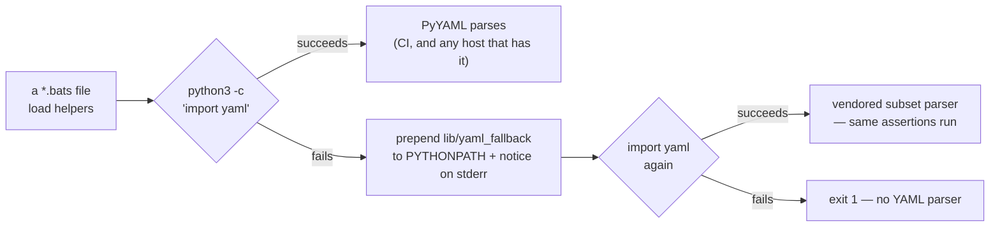

# tests/scripts: the bats suite now runs without PyYAML (Issue #642)

## Summary

`tests/scripts` reads GitHub workflow YAML with `python3 … import yaml`. The
unattended worker container's python3 ships no PyYAML and no pip, so every
helper that parses YAML — `extract_step`, `assert_pr_branch_filter_matches`,
`assert_job_least_privilege` and the rest — died with `ModuleNotFoundError`
rather than skipping: **121 of 535 tests failed**, `./quality.sh` exited at the
bats stage, and its TypeScript, Mermaid, Deno and Rust stages never ran locally
at all.

This takes the issue's preferred shape of fix — make the parse not need PyYAML,
rather than skipping ~110 CI-carrying assertions. A vendored YAML **subset**
parser lives at `tests/scripts/lib/yaml_fallback/yaml.py`, and
`tests/scripts/helpers.bash` puts it on `PYTHONPATH` when — and only when —
importing PyYAML fails, announcing on stderr that it did. Where PyYAML is
installed (CI included) PyYAML still parses; where it is not, the assertions are
still *made* instead of skipped. Closes #642.

The parser covers what these files actually contain: block mappings and
sequences, flow collections, plain/single/double-quoted scalars, literal and
folded block scalars with chomping, comments, and the YAML 1.1 scalar
resolution PyYAML applies (so `on:` is the key `True`, `false` is a bool, `20`
is an `int`). Anything outside that subset — anchors, aliases, tags, multiple
documents, tab indentation, complex keys — raises `YAMLError` rather than being
guessed at, because a gate that mis-parses a workflow is worse than one that
stops.



## Evidence

Backend/CLI change — no web interface to screenshot. Evidence is command
output, taken with PyYAML hidden from python3 (`PYTHONPATH` pointing at a
directory whose `yaml.py` raises `ImportError`, exactly as a host without
PyYAML behaves).

Before (this branch stashed, PyYAML hidden):

```text
$ PYTHONPATH=/tmp/noyaml bats tests/scripts
bats exit=1   ok: 414   not ok: 121
90 lines mentioning ModuleNotFoundError: No module named 'yaml'
```

After (same command, this branch):

```text
$ PYTHONPATH=/tmp/noyaml bats tests/scripts
bats exit=0   ok: 548   not ok: 0   skipped: 1
helpers.bash: PyYAML is not installed — parsing YAML with the vendored subset
parser at …/tests/scripts/lib/yaml_fallback (Issue #642)
```

(The single skip is the pre-existing `cargo-cyclonedx not installed` one. With
PyYAML present the same 548 tests pass, PyYAML doing the parsing.)

Full local gate: `./quality.sh` — **All quality checks passed!** (bats,
shellcheck, TypeScript, Mermaid, Deno supply chain, `cargo deny`, clippy,
`cargo test --workspace`, doctests, docs, release build). It needed
`RUSTUP_TOOLCHAIN=stable-aarch64-unknown-linux-gnu` because this container's
rustup has no default toolchain configured — an environment defect, not a repo
one, and unrelated to this change.

### The oracle: PyYAML itself

`yaml_fallback.bats` sweeps every `*.yml` under `.github/` (11 files, including
the 806-line `ci.yml`) and asserts the vendored parser produces the same
structure **and the same types** as PyYAML. The oracle is an independent
implementation, not a second copy of the parser — and the test fails loud if
`import yaml` ever resolves to the vendored module, so it can never compare the
parser with itself. On a host with no PyYAML that one test skips honestly
rather than passing vacuously; CI always has PyYAML, so the sweep runs on every
PR.

### Mutation evidence

Each mutation was applied to the live parser (or to `helpers.bash`), the suite
run, and the mutation reverted. Every one goes red:

| Mutation | Result |
|---|---|
| `_chomp`: `\|-` stops stripping the trailing newline | RED — tests 5, 7, 8 |
| `resolve`: booleans stay strings | RED — tests 5, 9, 11 |
| `_strip_comment`: any `#` truncates the scalar | RED — test 10 |
| `_fold`: `>` stops folding line breaks to spaces | RED — tests 5, 8 |
| `_scan_quoted`: `''` stops meaning a literal quote | RED — test 10 |
| `_parse_value_text`: anchors accepted instead of rejected | RED — test 12 |
| `resolve`: integers stay strings | RED — tests 5, 7, 8, 9, 11 |
| `helpers.bash`: the fallback is never put on `PYTHONPATH` | RED — tests 2, 3 |

## Reproduction

- **symptom** — on a host whose python3 has no PyYAML, every YAML-parsing test
  in `tests/scripts` fails with `ModuleNotFoundError: No module named 'yaml'`,
  so `./quality.sh` stops at the bats stage
- **status** — `verified` — with PyYAML hidden, the unfixed tree fails 121 of
  535 tests (90 lines naming the missing module) and the fixed tree passes
  548 of 548 with the vendored parser; the two runs are the before/after quoted
  above
- **regression test** — `tests/scripts/yaml_fallback.bats::wire_yaml_fallback
  restores YAML parsing when PyYAML is missing` (with
  `::a YAML helper fails loudly when neither PyYAML nor the fallback is
  importable` pinning the reported failure mode itself)

## Test Plan

- **Added** `tests/scripts/yaml_fallback.bats` — 13 tests: the reported failure
  and its fix through the real helpers (`assert_job_least_privilege`,
  `assert_pr_branch_filter_matches`, `extract_step`), the loud fallback notice,
  PyYAML staying in charge where it exists, the PyYAML equivalence sweep over
  every `.github/**/*.yml`, and the parser construct by construct — literal and
  folded block scalars with all three chomping modes, comment handling, quoting
  and escapes, flow collections, YAML 1.1 scalar resolution, the rejection of
  unsupported input, and `safe_dump` keeping a multi-line `run:` body
  searchable.
- **Added** `tests/scripts/lib/yaml_fallback/yaml.py` — the parser under test.
- **Modified** `tests/scripts/helpers.bash` — `wire_yaml_fallback` (fails loud
  if neither parser imports); the nine YAML-parsing suites that did not
  `load helpers` now do, which is what wires the parser in for them.
- **Unchanged behaviour elsewhere**: the full suite passes 548/548 both with
  PyYAML installed and with it hidden.
