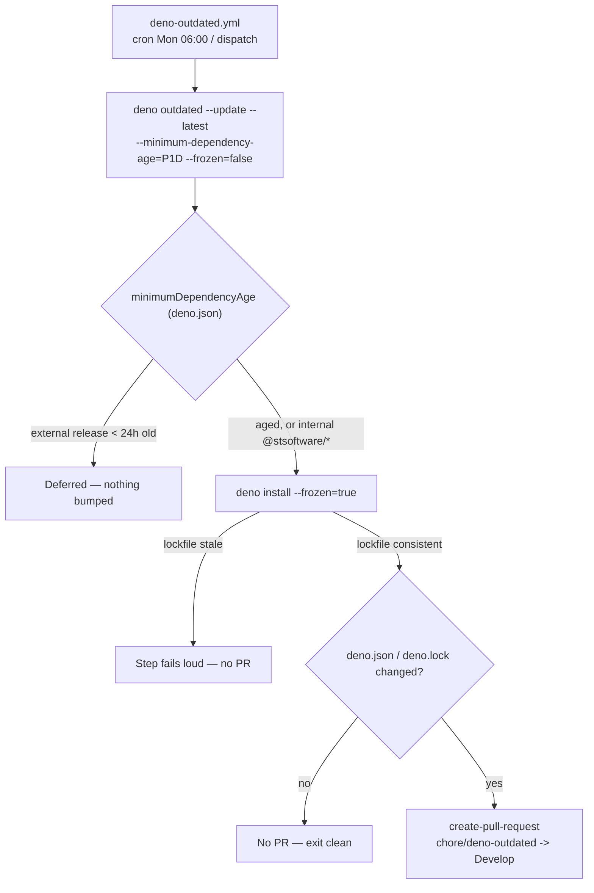

## Summary

Adds `.github/workflows/deno-outdated.yml`, the JSR counterpart of the weekly
Cargo lane in `upgrade-dependencies.yml`: every Monday (and on
`workflow_dispatch`) it runs Deno's own updater under the `deno.json`
release-age quarantine, verifies the refreshed lockfile against the frozen
gate, and opens a PR touching `deno.json` and `deno.lock` only. Closes #646.

The issue's template was adapted rather than pasted, because two silent failure
modes would have made it a workflow that ran green weekly and bumped nothing:

1. **`deno outdated` only sees dependencies declared in `deno.json`.** This
   repository's `.ts` gates carried inline `jsr:@std/assert@1` specifiers and
   the config had no `imports` map, so the updater had nothing to update —
   confirmed by running `deno outdated` against a fixture pinned to `1.0.10`
   with the latest at `1.0.19`: it reported nothing. The versions now live in
   `deno.json`'s `imports` map and the eight `.ts` gates import the mapped name
   `@std/assert`.
2. **The lockfile is frozen.** Without `--frozen=false` the update rewrites
   `deno.json` and then *refuses* to write `deno.lock` (`error: The lockfile is
   out of date`), leaving a tree whose every Deno gate fails — while the step
   still exits 0. The refresh step passes `--frozen=false` and then re-verifies
   with `deno install --frozen=true`, so a stale lockfile fails the run instead
   of arriving as a red PR.

Other deviations from the template, all deliberate: the action SHAs are the ones
this repository already vets (`actions/checkout@v6.0.2`,
`denoland/setup-deno@v2.0.5`, `peter-evans/create-pull-request@v7.0.11`) rather
than new unvetted pins; `deno-version` is pinned exactly, as in `ci.yml`, so the
updater cannot change underneath the bump it proposes; the PR targets `Develop`
and commits `deno.json`/`deno.lock` only, so the run's log never lands in the
tree.

One supporting fix: `deno check` discovers its config from the **cwd**, not from
the files it is handed, so `scripts/typescript-check.sh` now names the tree's own
`deno.json`. Without it the gate failed from any other cwd the moment the import
map existed (`TS2307: Import "@std/assert" not a dependency`) — caught by the
existing `typescript_check.bats` case "the repository's own TypeScript sources
pass the gate", which went red and is green again.

## Evidence

Backend/CI change — no web interface to screenshot. The evidence is the
workflow's own refresh step, extracted from the committed YAML and executed for
real against a throwaway workspace built from this repository's `deno.json` and
`deno.lock`.

Both load-bearing assertions were mutation-checked against the committed
workflow:

| Mutation | Result |
|---|---|
| drop `--frozen=false` from the update command | `not ok 4 the refresh step updates an outdated JSR dependency and rewrites the frozen lockfile` |
| drop the `deno install --frozen=true` verification | `not ok 7 a lockfile left out of date by the update fails the refresh step` |

The new import-map gate was checked the same way: reverting one source file to
`jsr:@std/assert@1` fails it with `tests/wasm_arch_parity_test.ts imports
jsr:@std/assert@1`.

Gate output:

- `bats tests/scripts` — 560 tests, 0 failures.
- `deno test --allow-read --allow-write --allow-run=deno tests/deno_supply_chain_test.ts`
  — 7 passed.
- `actionlint -no-color -ignore 'SC2016'` — clean.
- `./quality.sh` — `✅ All quality checks passed!` (76s).

## Test Plan

Added `tests/scripts/deno_outdated_workflow.bats` (10 tests). The behavioural
ones extract the workflow's real refresh step and run it under the shell GitHub
would use:

- the step updates a down-pinned `@std/assert` and leaves a lockfile that
  passes `deno check` under the frozen gate;
- the step captures the updater's output to the log the PR body pastes;
- a `deno` that exits non-zero fails the step, rather than opening an empty PR;
- a lockfile the update left out of date fails the step;
- the workflow runs on the Monday cron and `workflow_dispatch`, never on a
  pull request;
- the job holds `contents: write` + `pull-requests: write` and nothing more;
- `create-pull-request` authenticates with `ACTIONS_PUSH || GITHUB_TOKEN`, sets
  `base: Develop`, and commits `deno.json`/`deno.lock` only;
- `deno-version` is an exact release matching `ci.yml`.

Added to `tests/deno_supply_chain_test.ts` (7 tests total, 2 new):

- every JSR dependency the sources import is declared in `deno.json` — asserted
  through Deno's own resolver (`deno info --json` over a barrel importing every
  repository `.ts` file), so an inline `jsr:`/`npm:` specifier that `deno
  outdated` cannot update is named with the file that carries it;
- `deno.json`'s import map pins exact `jsr:`/`npm:` versions, which is what
  `deno outdated --update --latest` rewrites.

Existing suites cover the rest: `typescript_check.bats` (the cwd-independence
regression above), and the repo-wide workflow sweeps — SHA pinning, job
timeouts, checkout credentials, script injection — which the new workflow
passes unchanged.
