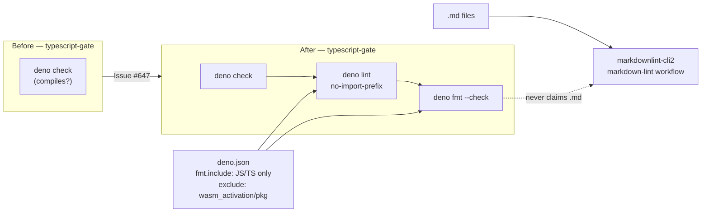

# Complete the Deno Lint and Format workflow (Issue #647)

## Summary

`.github/workflows/ci.yml` type-checked the committed TypeScript helpers
(`typescript-gate` → `scripts/typescript-check.sh` → `deno check`) but nothing
linted or format-checked them. The gap was real, not an auditor false positive:
run against the tree at `origin/Develop`, `deno lint` reported **8 problems**
and `deno fmt --check` reported **11 unformatted files of 17**. Closes #647.

The gate is now complete, and the tree conforms to it:

- **`deno lint`** — added to the `typescript-gate` job and to `./quality.sh`.
  All 8 problems were the same rule, `no-import-prefix`: eight test helpers
  imported an inline `jsr:@std/assert@1` (one `@^1`) URL. `deno.json` now maps
  the bare specifier `@std/assert` → `jsr:@std/assert@1` and the helpers import
  that, so the range is declared in exactly one place and the lint rule stops a
  second, unquarantined one being reintroduced. `deno.lock` records the
  workspace dependency the import map introduces, so the lockfile stays
  frozen-clean and no re-resolution happens on the runner.
- **`deno fmt --check`** — added to the same two places, and `deno fmt` applied
  to the tree. `fmt.include` in `deno.json` gives the formatter JavaScript and
  TypeScript only. That fence is load-bearing: unfenced, `deno fmt` claims
  Markdown too and would fight markdownlint-cli2, which already owns every `.md`
  file here via `.markdownlint-cli2.jsonc` and the `markdown-lint` workflow —
  two formatters over one file, each undoing the other. One capability, one
  implementation owner.
- **Generated code is fenced out.** `scripts/build-wasm-bundle.sh` writes
  wasm-bindgen glue to `neat-core/wasm_activation/pkg/`, which `.gitignore` does
  not cover. Unfenced, both new gates went red on that generated `.d.ts`/`.js`,
  so `./quality.sh` — which `AGENTS.md` makes mandatory before every commit —
  failed for anyone who had built the bundle, on code nobody wrote. A top-level
  `exclude` in `deno.json` drops it, and a test pins that.
- **`scripts/typescript-check.sh`** — `deno check` now runs from inside the tree
  it is checking. Deno discovers `deno.json`, and with it the import map, by
  walking up from the **current directory**, not from the files named on the
  command line; called from anywhere else, every bare specifier failed as
  `TS2307: Import "@std/assert" not a dependency`. This was caught by the
  existing `typescript_check.bats` test, which runs the gate from a temp cwd.

The issue's suggested template also carries `deno test --coverage` plus a
Codecov upload. That is not one of the two capabilities the issue reports as
missing, and this is a Rust crate whose coverage story is Cargo's, so it is
deliberately not adopted here.



## Evidence

Backend/CI change with no web interface, so there is no screenshot to capture.
The evidence is the gate going from red to green on the committed tree.

Against `origin/Develop` (before):

```text
$ deno lint          → Found 8 problems / Checked 20 files
$ deno fmt --check   → error: Found 11 not formatted files in 17 files
```

After this change, both are clean — and clean under the **exact Deno pin CI
uses**, not just the local build. Verified with `deno 2.9.3`, the version
`denoland/setup-deno` installs in `ci.yml`, as well as the local `2.9.6`:

```text
$ deno-2.9.3 fmt --check   → Checked 20 files   (exit 0)
$ deno-2.9.3 lint --quiet  → (no output)        (exit 0)
```

`./quality.sh` ran green through every stage that covers this diff — bash
syntax, shellcheck, **559 bats tests, 0 failures**, `deno check`, the new
`deno lint` and `deno fmt --check`, the Mermaid gate, and the native/WASM prune
parity record:

```text
🧾 Checking TypeScript sources (deno check)...
typescript-check: checking 17 TypeScript file(s) with deno check
typescript-check: all TypeScript files passed basic validity
🧹 Linting TypeScript sources (deno lint)...
Checked 20 files
🎨 Checking TypeScript formatting (deno fmt --check)...
Checked 20 files
```

The run then stopped at `cargo fmt --all` with
`error: rustup could not choose a version of cargo-fmt to run … no default is
configured`. That is a limitation of this container, not of the diff, and it is
independent of the repository: `cargo fmt` fails identically on a freshly
created empty crate (`cargo new --lib /tmp/fmtprobe && cargo fmt --all`).
`cargo clippy` fails the same way. This diff contains **no Rust**, so those
stages have nothing of this change to gate; CI runs them on the PR.

All 90 Deno tests pass after the reformat
(`deno test --allow-read --allow-write --allow-run=deno --allow-env tests/` →
`ok | 90 passed | 0 failed`), which is what proves the formatting change was
behaviour-preserving.

## Acceptance Criteria

<!-- vibe-spec-review inputs="diff+issue-body" -->

- **met** — Linting (`deno lint`) is implemented — evidence:
  `.github/workflows/ci.yml:564-565`, `quality.sh:89-90`, and
  `tests/scripts/deno_style_gate.bats::deno lint reports no problems in this
  repository` — reviewer: met
- **met** — Formatting (`deno fmt --check`) is implemented — evidence:
  `.github/workflows/ci.yml:567-568`, `quality.sh:91-92`, fence at
  `deno.json` (`fmt.include`), and
  `tests/scripts/deno_style_gate.bats::deno fmt --check reports no unformatted
  files in this repository` — reviewer: met
- **met** — Type checking (`deno check`) still present and passing — evidence:
  `.github/workflows/ci.yml:553-557` → `scripts/typescript-check.sh`,
  `tests/scripts/typescript_check.bats` 10/10 — reviewer: met
- **met** — "Review `ci.yml` and confirm whether each capability is genuinely
  missing" — evidence: both were genuinely missing; `deno lint` returned 8
  problems and `deno fmt --check` 11 unformatted files against `origin/Develop`
  — reviewer: met
- **missing** — the suggested template's `deno test --coverage` +
  `codecov-action` steps — reviewer: missing — reason: the reviewer's own words
  were "not required … the issue's criterion set is its 'Capabilities not
  detected' list (lint, fmt); coverage/codecov appear only in the parenthetical
  template. Absent by design; I do not count it as a gap." Recorded as
  `missing` rather than dropped, because it is text in the issue body that this
  diff does not implement: this is a Rust crate with 17 TypeScript helpers, and
  its coverage story is Cargo's.

The Spec reviewer reported **no untraceable changes** — it traced the import-map
migration to `no-import-prefix` (the lint rule cannot be added without it), the
`cd -- "$root"` fix to Deno's cwd-based config discovery, and the new bats file
to the added gate. Two of its "implemented but wrongly" findings — the stale
`ci.yml` prose and the generated wasm-pack output reddening `./quality.sh` —
were fixed after it reported; see the Standards block below, which raised the
same two.

## Standards Review

<!-- vibe-standards-review inputs="diff+CODING-STANDARDS.md" -->

Inputs were the diff and **`AGENTS.md`** — this repository has no
`CODING-STANDARDS.md`; `AGENTS.md` is its documented standards file, and it
defers family-wide policy to `NEAT-AI/docs/ENGINEERING_PRINCIPLES.md`.

- **violation** — the `typescript-gate` job's own comment still read "Basic
  validity only — this is not a style or lint gate" and the job was still named
  "TypeScript validity gate", while the same commit added lint and fmt steps to
  it; the sentence was removed from `README.md` but not from the workflow —
  evidence: `.github/workflows/ci.yml:522` — reason: fixed here; the comment now
  describes the widened gate and the job is "TypeScript validity and style
  gate".
- **violation** — the new gate failed on generated code the repo does not own:
  `scripts/build-wasm-bundle.sh` writes wasm-bindgen glue to
  `neat-core/wasm_activation/pkg/`, which `.gitignore` does not cover, so
  `deno fmt --check` and `deno lint` went red for any contributor who had built
  the bundle — and `AGENTS.md` makes `./quality.sh` mandatory before commit —
  evidence: `quality.sh:84` — reason: fixed here with a top-level `exclude` in
  `deno.json`, matching the convention `scripts/typescript-check.sh` already
  sets, plus a regression test that plants the generated file and asserts the
  gate stays green.
- **violation** — the `quality.sh` parity test was a source grep, which
  `AGENTS.md` names as a "how" test, and could not tell a live line from one
  parked in a never-taken branch — evidence:
  `tests/scripts/deno_style_gate.bats:79` — reason: fixed here; the block is now
  delimited in `quality.sh` (`# >>> deno-style-gate`) and the test extracts and
  **executes** it against a stub `deno`, following the `quality_bats_gate.bats`
  precedent. Two added cases assert the gate fails loud — a failing `deno lint`
  aborts before `deno fmt` runs, and a failing `deno fmt --check` fails the
  block.
- **violation** — two tests ran bare `deno lint` / `deno fmt --check` against
  the caller's cwd rather than the repository, so invoking the suite by absolute
  path from outside the repo graded unrelated files — evidence:
  `tests/scripts/deno_style_gate.bats:32` — reason: fixed here; both now anchor
  to `$REPO_ROOT`, verified by running the suite from `/tmp` (8/8 pass).
- **clean** — mutation evidence for the new gate: stubbing out the CI
  `deno lint` step, neutering `deno lint` in `quality.sh`, and widening
  `fmt.include` to `**/*.md` each turn the suite red.
- **clean** — TDD cover for the `cd -- "$root"` change: deleting the line turns
  the existing `typescript_check.bats` "the repository's own TypeScript sources
  pass the gate" red, so the behaviour change is pinned by a test that can fail.
- **clean** — oracle rule 4 (quoted `<<'PY'` heredoc reading `sys.argv`); the
  fmt-fence test copies the *committed* `deno.json`/`deno.lock` rather than a
  private restatement of the config.
- **clean** — supply chain: `deno.lock` stays frozen with the new
  `workspace.dependencies` entry, the quarantine block is untouched, and
  `tests/deno_supply_chain_test.ts` passes 5/5 with the bare specifiers.
- **clean** — the bulk reformatting across `scripts/*.ts`, `tests/*.ts` and
  `wasm-bench/*.mjs` is mechanical `deno fmt` output with no semantic edits
  (byte-identical when reproduced from the `origin/Develop` files).
- **clean** — workflow hygiene: `docs_pipeline_accuracy.bats`,
  `docs_ci_blind_spots.bats`, `docs_single_source.bats`, `ci_workflow.bats`,
  `ci_typescript_gate_permissions.bats`, `workflow_job_timeouts.bats`,
  `workflow_pipefail.bats` and `actionlint_workflow.bats` all green; the new
  steps are unconditional, inherit the job's `contents: read`, and are single
  commands so the pipefail rule does not bite.
- **clean** — Australian English, no hidden paths staged, no Rust or
  `neat-core/` source touched, so the ownership fence, unsafe/SIMD invariants
  and the three-phase public-API flow are not engaged.

## Test Plan

New: `tests/scripts/deno_style_gate.bats` — eight "what" tests, each driving a
real `deno` subprocess or executing the real gate block, none grepping source
for implementation detail:

- `deno lint reports no problems in this repository` — red before (8 problems),
  green after.
- `deno fmt --check reports no unformatted files in this repository` — red
  before (11 files), green after.
- `the committed fmt config checks TypeScript and leaves Markdown to
  markdownlint` — copies the committed `deno.json` beside a misformatted `.ts`
  and a misformatted `.md` in a throwaway tree and asserts the run names the
  `.ts` and not the `.md`. **Mutation evidence:** deleting the `fmt` block from
  `deno.json` turns this red on the `notes.md` assertion.
- `generated wasm-pack output does not fail the style gate` — plants the
  generated `neat_core.d.ts` and asserts both gates stay green. **Mutation
  evidence:** dropping the top-level `exclude` turns it red with
  `Found 1 not formatted file in 21 files`.
- `the CI typescript-gate job runs deno lint and deno fmt --check` — parses
  `ci.yml` and asserts on the job's real step bodies.
- `quality.sh runs deno lint and deno fmt --check` — extracts the delimited
  block from `quality.sh` and executes it against a stub `deno`, asserting on
  the invocations it observes. **Mutation evidence:** removing the fmt line from
  the block turns this red.
- `a failing deno lint fails quality.sh instead of falling through to fmt` —
  fail-loud: a red lint aborts the block and `deno fmt` is never reached.
- `a failing deno fmt --check fails quality.sh` — fail-loud on the second half.
  **Mutation evidence:** removing the fmt line turns this red too.

Modified: none removed or commented out. `tests/scripts/typescript_check.bats`
was already asserting `the repository's own TypeScript sources pass the gate`
from a temp cwd; it went red on the import-map change and is what drove the
`cd -- "$root"` fix in `scripts/typescript-check.sh`. It is green again.

Full suite: `bats tests/scripts` → **559 tests, 0 failures**, from inside the
repository and from `/tmp`.
