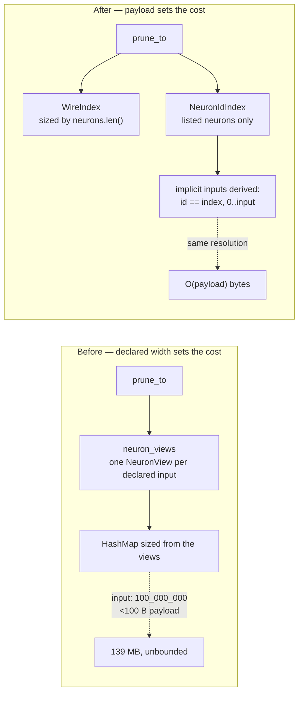

# Bound `MemeticExport::prune_to` by the payload, not the declared width

## Summary

`MemeticExport::prune_to` — and so `CreatureExport::prune_memetic`, which calls
it — built its id→index lookup from `neuron_views(creature)`, which materialises
one `NeuronView` per **declared** input. `CreatureExport::input` is a declared
count no payload backs, so a native Rust caller handing in
`CreatureExport { input: 100_000_000, .. }` — under 100 bytes — bought a hundred
million views before any bound was consulted. This is the #622/#639
amplification at the one entry point that answers with `()` and therefore has
nowhere to report a refusal.

Fixed by the issue's option 2 — **bound the walk, not the caller** — so no
public signature changes and the three-phase flow in `RELEASING.md` does not
apply:

- New private `NeuronIdIndex` stores only the **listed** neurons and derives the
  implicit input range **arithmetically**: an implicit input neuron is its own
  runtime id, so that half of the map is the identity function. The cost now
  follows the payload, and the prune needs no ceiling of its own.
- The listed-neuron id derivation (outputs numbered `-(outputIndex + 1)`,
  otherwise the declared or hashed id) is extracted to `listed_neuron_ids`, so
  `neuron_views` and `NeuronIdIndex` cannot drift on an id — a drift would make
  the same memetic reference resolve differently depending on which route the
  caller took.
- Rule 31's own path (`memetic_rules`) is migrated onto the same index via
  `NeuronIdIndex::from_views`, which switches the arithmetic half off
  (`input: 0`), so that already-bounded path is unchanged.
- `NeuronIdIndex::build` refuses a walk index past `u32::MAX` rather than
  truncating it into an index that aliases another neuron, and sums with
  `saturating_add` — the declaration is untrusted and this route is deliberately
  unbounded.

Closes #650.



## Evidence

Backend/library change with no web interface, so no screenshot applies. The
evidence is the allocation oracle and the workspace suite.

Measured by the counting global allocator in
`neat-core/tests/creature_width_allocations.rs`, refusing/pruning the identical
fixture:

| declared `input` | before | after |
|---|---|---|
| 1 000 000 | 139 651 848 B | within the 2 MiB budget |
| 4 000 000 (quadrupled) | ~4× the above | unmoved (≤ 4 KiB slack) |

The pre-fix failure, verbatim:

```
CreatureExport::prune_memetic allocated 139651848 B against a declared input of
1000000 (budget 2097152 B, ceiling 65536); the declared width is being walked
before it is bounded
```

**Mutation evidence** (AGENTS.md rule 2 — a refactor that collapses N copies
must kill every former site). All mutations reverted:

| mutation | result |
|---|---|
| `listed_neuron_ids`: `-(output_index + 1)` → `+ 2` | red at **both** former sites — `neuron_views` (lib `creature_validate::tests`) and the index sites (`creature_memetic_prune`, `creature_memetic_weight_forms`, `creature_validate_conformance`, `creature_validate_synapse_rules`) |
| `index_of_id`: `self.input` → `self.input.saturating_sub(1)` | red — both new correctness tests |
| `NeuronIdIndex::build`: materialise the input range | red — `allocated 71303412 B … budget 2097152 B` |

`./quality.sh` green (fmt, clippy `-D warnings`, workspace tests, doctests,
bats, markdownlint, mermaid, docs, release build).

**Original trigger closed, no trivial bypass.** The trigger was a `pub` call —
`prune_memetic` / `prune_to` on a `CreatureExport` with a large declared
`input` — reaching `neuron_views`, whose cost is `O(creature.input)`. After this
change neither function calls `neuron_views` at all: `prune_to` allocates only
`WireIndex` (`HashMap::with_capacity(neurons.len())`), `NeuronIdIndex.listed`
(`HashMap::with_capacity(neurons.len())`) and `pairs` (one entry per synapse) —
every one sized from a vector the payload actually carries. `creature.input` is
read only as a scalar comparison inside `index_of_id`. There is no second
declared-width walk left on the path to bypass to, and the equivalent input —
any width, in either the wire (`input-N`) or id (`N`) vocabulary — is answered
by the same arithmetic in constant time.

## Acceptance Criteria

<!-- vibe-spec-review inputs="diff+issue-body" -->

- **met** — `MemeticExport::prune_to` and `CreatureExport::prune_memetic` do not allocate or iterate on a declared width that no bound has passed — evidence: `neat-core/src/creature_validate.rs` `prune_to` (no `neuron_views` call; `NeuronIdIndex`/`WireIndex` both sized by `neurons.len()`), oracle `neat-core/tests/creature_width_allocations.rs::pruning_a_memetic_record_does_not_walk_the_declared_input_width` — reviewer: met
- **met** — no fault is swallowed; an over-wide creature is refused loudly or costed by the payload, never silently skipped — evidence: `neat-core/tests/creature_memetic_prune.rs::prune_resolves_implicit_inputs_across_a_wide_declared_width` and `::prune_resolves_implicit_input_ids_in_the_map_form` — a reference to input 999 999 under `input: 1_000_000` still resolves in both vocabularies, one past the width still does not — reviewer: met
- **met** — allocation-oracle regression test, plus a typed-outcome test — evidence: `neat-core/tests/creature_width_allocations.rs::pruning_a_memetic_record_does_not_walk_the_declared_input_width` (the oracle, which also asserts the surviving keys inside the measured helper so a prune that did nothing cannot read as a cheap pass) and the two `creature_memetic_prune.rs` outcome tests above — reviewer: met — reason: the reviewer noted a literal *typed* outcome is inapplicable under option 2, which returns no `Result`; the outcome assertions stand in its place
- **met** — the residual note on `neuron_views` and the module doc of `creature_width_allocations.rs` are updated; `./quality.sh` green — evidence: `neat-core/src/creature_validate.rs:1035-1039`, `neat-core/tests/creature_width_allocations.rs:19-31`, full gate run after the final edit — reviewer: partial — reason: the reviewer marked it partial because `AGENTS.md` still described `prune_to` as the unbounded residual and the oracle as refusal-only; both sentences were rewritten in `bcf4a3d` and `896b849` after its verdict, so it is met at HEAD
- **unrequested** — `neuron_views` rewritten to consume the extracted `listed_neuron_ids` — reviewer: unrequested — reason: DRY; without one home for the id rule, `neuron_views` and `NeuronIdIndex` could resolve the same reference differently — behaviour-preserving, and the mutation evidence above proves both sites are still reached
- **unrequested** — the already-bounded rule-31 path migrated onto `NeuronIdIndex::from_views` — reviewer: unrequested — reason: `resolve_memetic_reference` is the single home of the id-then-wire rule and takes one lookup type; a second parallel type there would be the drift this fix exists to prevent — internal only, no public API change
- **unrequested** — oracle helper generalised (`assert_cost_does_not_follow_the_width`, `REFUSAL_BUDGET_BYTES` → `WIDTH_BUDGET_BYTES`) — reviewer: unrequested — reason: the existing helper hard-coded "refusal", and the prune succeeds; `assert_width_is_not_walked` is kept as a wrapper so the four pre-existing tests are unchanged
- **unrequested** — `README.md` and `AGENTS.md` paragraphs on the width ceiling rewritten — reviewer: unrequested — reason: both named `prune_to` as the outstanding unbounded route, which the code no longer is; "a code change owes a docs change"

## Standards Review

<!-- vibe-standards-review inputs="diff+CODING-STANDARDS.md" -->

- **violation** — AGENTS.md still described `prune_to` as the unbounded residual, contradicting the code it documents — evidence: `AGENTS.md:507` — reason: fixed here in `bcf4a3d`
- **violation** — silent narrowing on a deliberately unbounded declaration: `listed.insert(id, (creature.input + i) as u32)` (AGENTS.md's Issue #606 rule — never a silent narrowing) — evidence: `neat-core/src/creature_validate.rs:1122` — reason: fixed here in `bcf4a3d` with `u32::try_from(creature.input.saturating_add(i))`, matching `index_of_id`'s treatment of the arithmetic half
- **violation** — the AGENTS.md sentence describing the allocation oracle still said it asserts only that *a refusal* costs O(1) bytes, though the file now also measures a successful prune — evidence: `AGENTS.md:516` — reason: fixed here in `896b849`
- **clean** — Australian English throughout the added lines; "what not how" tests (surviving keys, surviving rows/ids, bytes allocated — no source greps, names describe outcomes); no vacuous oracles (hand-derived literals, `WIDTH_BUDGET_BYTES` keeps its `MAX_NODE_COUNT * BYTES_PER_WALKED_INPUT` derivation, the measured helper asserts the prune actually pruned); oracle independence (expectations written from the documented id rule, not re-derived through `NeuronIdIndex`); mutation evidence killing every former site (table above, reproduced independently by the reviewer); public API stability — no `pub` item added, removed, renamed or re-signed, `NeuronIdIndex`/`listed_neuron_ids` are private, `scripts/detect-breaking.sh "3e54dd3...HEAD"` reports `false`, so the three-phase flow does not apply and no consumer registry change is needed; no hidden files staged; docs updated in step with the code

## Test Plan

Added:

- `neat-core/tests/creature_width_allocations.rs::pruning_a_memetic_record_does_not_walk_the_declared_input_width`
  — the allocation-oracle regression test. It **fails against the unfixed code**
  (`allocated 139651848 B … budget 2097152 B`) and **passes after the fix**;
  its `cost_of_pruning` helper asserts the surviving biases and rows inside the
  measured call, so a prune that silently did nothing cannot pass it cheaply.
- `neat-core/tests/creature_memetic_prune.rs::prune_resolves_implicit_inputs_across_a_wide_declared_width`
  — outcome test over the wire and id vocabularies at a declared width of one
  million: a reference to the last declared input survives, one past it does not,
  and a row naming an existing input with no synapse to the target is dropped.
- `neat-core/tests/creature_memetic_prune.rs::prune_resolves_implicit_input_ids_in_the_map_form`
  — the same arithmetic through the id-keyed `ById` weight form, covering both
  the map key and the `toId`.

Changed:

- `neat-core/tests/creature_width_allocations.rs` — the two assertions extracted
  into `assert_cost_does_not_follow_the_width` so a succeeding entry point can be
  measured the same way; `assert_width_is_not_walked` retained as the refusal
  wrapper. The four pre-existing tests are unmodified and still pass.

No existing test was removed, disabled or weakened. `cargo test --workspace`:
all suites green.
