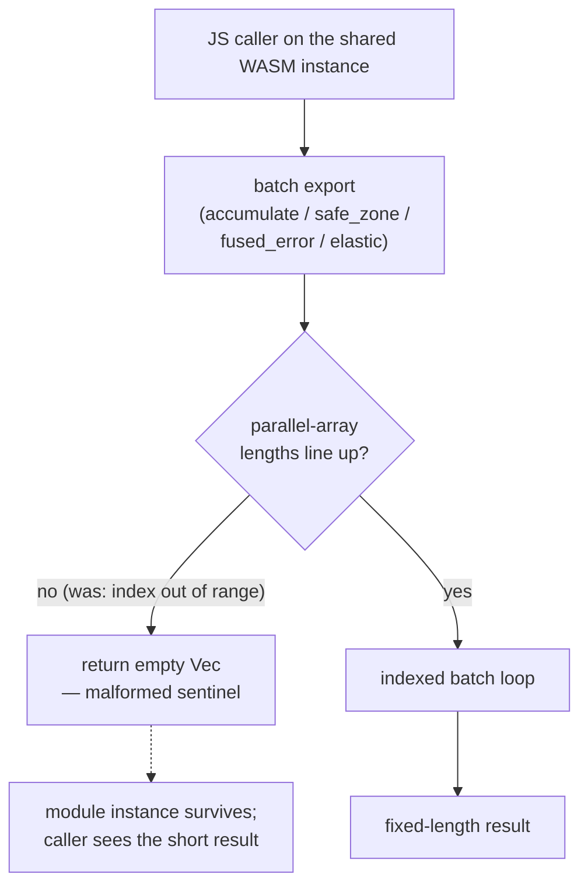

# Guard parallel-array lengths on the WASM-exported batch functions

## Summary

Nine `#[wasm_bindgen]`-reachable batch entry points in `neat-core/src` took two
or more slices that the body walks with a single loop index, and none of them
checked the slices lined up. A caller passing a shorter secondary array indexed
out of range — and per this crate's own documented WASM contract
(`neat-core/src/wasm_exports.rs`, "a panic here aborts the module and
`catch_unwind` is unavailable on wasm") that panic tears down the whole module
instance for the rest of the page session, losing any evolution or training
state held in WASM linear memory.

Each function now validates its parallel-array lengths up front and answers a
malformed call with an **empty `Vec`** — a sentinel a successful call can never
produce, since every one of these functions returns a fixed non-empty length on
success. That mirrors the pattern the sibling parsing surfaces already use:
`topology_ops::validate_topology_typed`'s `MALFORMED_BUFFER`, `loss.rs`'s
`packed_layout(...) -> Option<_>`, and `propagate_codec::decode_propagate_buffer`.

Guarded functions and the length rule each one enforces:

| Function | File | Rule |
| --- | --- | --- |
| `accumulate_weight_batch_4way` | `accumulate.rs` | all three slices ≥ 4 |
| `accumulate_weight_batch_8way` | `accumulate.rs` | all three slices ≥ 8 |
| `accumulate_bias_batch_4way` | `accumulate.rs` | all three slices ≥ 4 |
| `accumulate_bias_batch_8way` | `accumulate.rs` | all three slices ≥ 8 |
| `calculate_weight_batch_4way` | `accumulate.rs` | `packed_state` ≥ 32 (8-value stride × 4) |
| `calculate_bias_batch_4way` | `accumulate.rs` | `packed_state` ≥ 12 (3-value stride × 4) |
| `apply_safe_zone_adjustment_batch` | `safe_zone.rs` | `raw_inputs`, `weights` ≥ `squash_types.len()` |
| `apply_fused_error_distribution` | `fused_error.rs` | the three upstream slices ≥ `upstream_squash_types.len()` |
| `apply_distribute_elastic_error` | `elastic_distribution.rs` | `safe_zone_factors`, `weights` ≥ `activations.len()` |

The guard on `apply_distribute_elastic_error` also covers the SIMD helper
`score_pass_simd`, which is only reachable through it and reads
`safe_zone_factors[base..base + 3]` four lanes at a time.

Two deliberate boundaries:

- **A minimum length, not strict equality.** Every input that works today still
  works — a longer-than-needed slice is accepted exactly as before. Only the
  inputs that currently panic are rejected, so no working caller changes
  behaviour and the public signatures are untouched (the `downstream-consumers`
  gate compiles unchanged).
- **`calculate_bias_batch_4way`'s `no_change_flags` is left alone.** It is
  already read defensively via `.get(i).copied().unwrap_or(0)` and cannot panic;
  tightening it would break callers that legitimately pass a short flags array.

Closes #658.

## Evidence

Backend/library change with no web interface to screenshot. Evidence is the
regression suite below, run against the unfixed and the fixed code.

**Red, against the unfixed code** — `cargo test -p neat-core --test batch_length_validation`:

```
test result: FAILED. 2 passed; 12 failed; 0 ignored; 0 measured; 0 filtered out

failures:
    accumulate_bias_batch_4way_rejects_a_short_parallel_slice
    accumulate_bias_batch_8way_rejects_a_short_parallel_slice
    accumulate_weight_batch_4way_rejects_a_short_parallel_slice
    accumulate_weight_batch_8way_rejects_a_short_parallel_slice
    calculate_bias_batch_4way_rejects_a_short_packed_state
    calculate_weight_batch_4way_rejects_a_short_packed_state
    distribute_elastic_error_rejects_a_short_parallel_slice
    distribute_elastic_error_rejects_a_short_slice_when_the_error_is_not_finite
    distribute_elastic_error_rejects_a_short_weights_slice_on_the_fallback_path
    fused_error_distribution_rejects_a_short_parallel_slice
    fused_error_distribution_rejects_a_short_slice_on_the_zero_error_path
    safe_zone_adjustment_batch_rejects_a_short_parallel_slice
```

The failures are the panics the issue describes, e.g.

```
thread 'distribute_elastic_error_rejects_a_short_weights_slice_on_the_fallback_path'
panicked at neat-core/src/elastic_distribution.rs:175:21:
index out of bounds: the len is 4 but the index is 4
```

**Green, after the fix** — same command: `test result: ok. 14 passed; 0 failed`.

**Full gate** — `./quality.sh < /dev/null` ends `✅ All quality checks passed!`
(clippy `-D warnings`, `cargo check --all-targets --all-features`, the whole
`cargo test --workspace` suite, doctests, `cargo deny`, the Deno/Mermaid gates
and the release build).



## Trigger closed

The issue's exploit sketch calls
`distribute_elastic_error(error, activations, safe_zone_factors, weights, plank_constant)`
with `activations.length = 8` and `weights.length = 4`. That call now returns
before any indexing: `apply_distribute_elastic_error` computes
`count = activations.len()` and immediately returns `Vec::new()` when
`safe_zone_factors.len() < count || weights.len() < count`, so neither the
scoring pass, the weight fallback branch (`denom <= plank_constant`, where the
sketch lands) nor the residue pass is reached.

There is no trivial bypass, by static reasoning over the changed code path:

- The guard is the **first** statement after `count` is bound, ahead of every
  early return in each function — the non-finite-`error` return in
  `apply_distribute_elastic_error`, the `count == 0` and `error == 0.0` returns
  in `apply_fused_error_distribution`. Two tests
  (`distribute_elastic_error_rejects_a_short_slice_when_the_error_is_not_finite`,
  `fused_error_distribution_rejects_a_short_slice_on_the_zero_error_path`) pin
  that ordering, so no input value can route around it.
- Every indexing site in these functions is bounded by the same `count` (or the
  fixed arity 4/8, or the fixed stride 32/12) that the guard checks, so a
  passing guard makes each read in-range. The SIMD path reads at most
  `base + 3` within `chunks = count / 4` full chunks, i.e. strictly below
  `count`.
- The `#[wasm_bindgen]` wrappers (`wasm_safe_zone_adjustment_batch`,
  `wasm_fused_error_distribution`, `distribute_elastic_error`) are thin
  delegations to the guarded `apply_*` functions, so the JS-reachable surface
  and the Rust surface are covered by the same check — there is no second entry
  point that skips it.
- The guard reads only slice lengths, so it cannot itself panic or overflow.

## Test Plan

New file `neat-core/tests/batch_length_validation.rs` — 14 tests, each driving
the real exported function with a deliberately short parallel slice and
asserting the empty sentinel comes back:

- `neat-core/tests/batch_length_validation.rs::accumulate_weight_batch_4way_rejects_a_short_parallel_slice`
  — reproduces the flaw for `accumulate_weight_batch_4way`; fails against the
  unfixed code (index out of bounds) and passes after the fix. It sweeps each of
  the three slices at every short length 0–3, so a guard covering only one
  parameter stays red.
- `...::accumulate_weight_batch_8way_rejects_a_short_parallel_slice`
- `...::accumulate_bias_batch_4way_rejects_a_short_parallel_slice`
- `...::accumulate_bias_batch_8way_rejects_a_short_parallel_slice`
- `...::calculate_weight_batch_4way_rejects_a_short_packed_state` — 0/1/8/24/31
  packed values against the 32 the stride needs
- `...::calculate_bias_batch_4way_rejects_a_short_packed_state` — 0/3/11 against 12
- `...::safe_zone_adjustment_batch_rejects_a_short_parallel_slice`
- `...::fused_error_distribution_rejects_a_short_parallel_slice`
- `...::fused_error_distribution_rejects_a_short_slice_on_the_zero_error_path`
  — the guard fires ahead of the zero-error early return
- `...::distribute_elastic_error_rejects_a_short_parallel_slice`
- `...::distribute_elastic_error_rejects_a_short_weights_slice_on_the_fallback_path`
  — the exact branch of the issue's exploit sketch (zero activations force the
  weight fallback)
- `...::distribute_elastic_error_rejects_a_short_slice_when_the_error_is_not_finite`
  — the guard fires ahead of the non-finite early return

Anti-over-tightening cover, so the guards cannot be made to reject valid input:

- `...::accumulate_weight_batch_4way_still_serves_well_formed_input`, plus a
  well-formed length assertion inside each of the 8-way, `calculate_*`,
  `safe_zone`, `fused` and `elastic` cases — every one asserts the full result
  length (28 / 56 / 12 / 24 / 4 / 4 / 4 / 9 / 8) still comes back.
- `...::empty_input_is_not_treated_as_malformed` — an all-empty call is a
  well-formed no-op, not a length mismatch.

No existing test was modified or removed. The whole prior suite, including
`neat-core/tests/batch_wrapper_entry_points.rs` (which exercises these same
wrappers against their scalar siblings), stays green.
