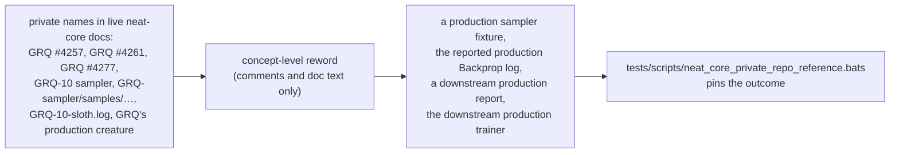

# Reword GRQ issue-number references in neat-core source comments to concept level

## Summary

NEAT-AI-core is a **public** repository, but the live rustdoc and comment text
of its primary crate named the **private** trainer repository's issue numbers
("GRQ #4257", "GRQ #4261", "GRQ #4277") and its internal artefact paths
("GRQ-10 sampler", "GRQ-sampler/samples/…", "GRQ-10-sloth.log") directly. Those
are the module- and function-level docs a public reader — or docs.rs — surfaces
first, so they pointed every external reader at material they cannot open and
disclosed the existence and internal layout of a private production system
(check 3 of the private-repo-reference audit, `severity:medium`).

This change rewords each mention to **concept level**, following the pattern
that closed #374/#375/#376/#378, with **no logic or behaviour change** —
comments, doc comments and Markdown prose only:

| Before | After |
| --- | --- |
| "Exact float parsing (GRQ #4261)" | "Exact float parsing" |
| "Two memetic weight forms (GRQ #4257)" | "Two memetic weight forms" |
| "…, GRQ #4257 (both memetic weight forms), GRQ #4261 (exact float parsing)." | "… Two further contracts came from downstream production defects rather than issues here: both memetic weight forms, and exact float parsing." |
| "the GRQ-10 sampler fittest creature" | "a production sampler fixture's fittest creature" |
| "`GRQ-sampler/samples/GRQ-10-1.json`" | "a production sampler fixture creature" |
| "The exact failure from `GRQ-10-sloth.log`" | "The exact failure from the reported production Backprop log" |
| "GRQ #4277 reads as though same-role fan-in …" | "A downstream production report reads as though same-role fan-in …" |
| "# GRQ #4261 - `float_roundtrip` is not optional" (Cargo.toml) | "# Exact float parsing - `float_roundtrip` is not optional" |
| "on GRQ's 4 272-neuron, 22 928-synapse production creature" | "on the downstream production trainer's 4 272-neuron, 22 928-synapse production creature" |

The technical explanations the issue asked to keep — float round-trip
exactness, the two memetic-weight wire forms, the same-role fan-in rule — are
untouched.

Files touched: `neat-core/src/creature.rs`,
`neat-core/src/creature_validate.rs`,
`neat-core/tests/creature_float_roundtrip.rs`,
`neat-core/tests/creature_memetic_weight_forms.rs`,
`neat-core/tests/creature_validate_synapse_rules.rs`, `neat-core/Cargo.toml`,
`neat-core/benches/BASELINE.md`, plus the new guard
`tests/scripts/neat_core_private_repo_reference.bats`.

Closes #661.

## Scope note — `BASELINE.md:118`

The enumerated `BASELINE.md:118` hit is
`tests/bench_fixtures.rs::production_exact_matches_committed_grq_topology` — a
**snake_case identifier** naming this repository's own live test function, not a
private issue slug or path. It is deliberately left unchanged, consistent with
the decisions already recorded in `pr-summary-376.md` (scope note) and
`pr-summary-378.md`: renaming it would dangle the references in
`pr-summary-286.md` and `pr-summary-376.md`, and the repo's existing private-repo
guards already match the private name on word boundaries (`grep -w`) precisely so
embedded-letter identifiers are not flagged. The new guard uses the same
word-boundary convention and documents the exception in its header.

## Evidence

Docs/comments-only change with no web interface to screenshot. Verification is
the new bats guard (red before, green after) plus the existing Rust suites and
the full local gate.

- **Guard red against the unreworded sources**: `bats
  tests/scripts/neat_core_private_repo_reference.bats` before the reword →
  `not ok 2`, `not ok 3`, `not ok 4` (only the existence test passed).
- **Guard green after the reword**: same command → `1..4`, all four `ok`.
- **No private-repo token remains** in the enumerated files:
  `grep -rniw 'GRQ' neat-core/` → no matches (the only remaining case-insensitive
  hits are the two snake_case test-name occurrences covered by the scope note
  above).
- **Rust tests over the touched files still pass**:
  `cargo test -p neat-core --test creature_float_roundtrip --test
  creature_memetic_weight_forms --test creature_validate_synapse_rules` →
  all pass (32 in the synapse-rules suite alone; 0 failed across the three).
- **`cargo fmt --check`** → clean; the reflowed doc comments are canonical.
- **Full gate**: `./quality.sh < /dev/null` → **✅ All quality checks passed!**

## Test Plan

- Added `tests/scripts/neat_core_private_repo_reference.bats` — four "what"
  tests over the committed artefacts, asserting the observable outcome for the
  seven enumerated files: all present; no private-repo token on word boundaries;
  no private repository path or issue slug (`stSoftwareAU/GRQ`, `GRQ #NNNN`,
  `GRQ-N`); and none of the private trainer's internal artefact paths
  (`GRQ-sampler`, `GRQ-10-*.json`, `*-sloth.log`). Observed failing against the
  pre-reword sources and passing after — it is a real regression guard, not a
  tautology. It runs inside `./quality.sh` via the existing `bats tests/scripts`
  gate.
- Re-ran the three Rust test suites whose doc comments changed to confirm no
  behaviour moved.
