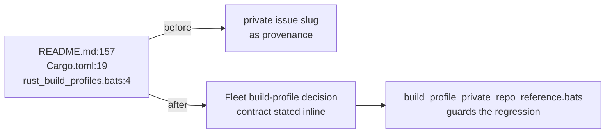

# Reword the build-profile provenance slug to concept level

## Summary

`README.md`, the root `Cargo.toml` and `tests/scripts/rust_build_profiles.bats`
each cited a private orchestration repository's issue slug as the provenance of
the Rust build-profile decision. NEAT-AI-core is public and that repository is
not, so a public reader following the slug from the front page, the crate
manifest or the committed test suite hits a link they cannot open — and the
mention discloses the private repository's existence without giving the reader
anything actionable (private-repo-reference audit, check 3). Closes #662.

All three now read **"Fleet build-profile decision"** and state the dev/release
contract inline — dev builds compile as fast as possible, release builds produce
the most optimised artefact possible and compile time is irrelevant. Comment and
prose text only: no behaviour, no profile setting and no gate assertion changed.

## Evidence

Documentation/comment-only change with no web interface to screenshot. Evidence
is the new bats guard, which fails against the pre-fix text and passes after the
reword, plus the unchanged build-profile gate and the full quality gate.

```text
$ bats tests/scripts/build_profile_private_repo_reference.bats   # before the reword
not ok 2 build-profile artefacts name no private orchestration repository
not ok 3 build-profile artefacts reference no private repository path or issue slug

$ bats tests/scripts/build_profile_private_repo_reference.bats \
        tests/scripts/rust_build_profiles.bats                  # after the reword
1..12  … all ok

$ ./quality.sh < /dev/null
✅ All quality checks passed!
```



Scope note: the same slug survives in `docs/archive/pr-summaries/pr-summary-546.md`.
That archive is covered by #664, which reworks the archived audit-fix summaries
as a set — it is deliberately left untouched here.

## Test Plan

- Added `tests/scripts/build_profile_private_repo_reference.bats` — "what" tests
  over the three committed artefacts:
  - each artefact is present;
  - none names the private orchestration repository (word-boundary match on
    the repository-name token);
  - none carries a private path or issue slug (`stSoftwareAU/<private-repo>`,
    `<private-repo>#N` absent);
  - the concept-level contract wording survives in all three (README keeps both
    halves of the dev/release contract, `Cargo.toml` keeps the dev-build
    rationale, the gate keeps the contract it enforces).
  - Tests 2 and 3 were observed failing against the pre-reword text and passing
    after it.
- Re-ran `tests/scripts/rust_build_profiles.bats` — all 6 tests pass, so the
  comment reflow left the build-profile contract gate intact.
- `./quality.sh` passes cleanly (bats suite, Rust fmt/clippy/tests/doctests,
  TypeScript and Markdown gates).
