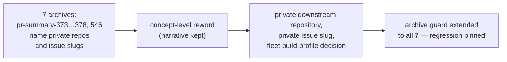

# Reword private-repo mentions in the seven audit-fix archives to concept level

## Summary

NEAT-AI-core is a **public** repository, but seven archived PR summaries still
named the **private** downstream production-trainer and worker-orchestration
repositories while describing how those names were removed from elsewhere:
`pr-summary-373.md` … `pr-summary-378.md` (the records of the earlier
private-repo-reference reword fixes) and `pr-summary-546.md` (which cited a live
private issue slug as the provenance of the fleet build-profile decision). A
record of a reword is still a public page naming a private repository — the same
class of direct reference the fixes it describes were meant to remove (check 3
of the private-repo-reference audit, finding `BP-0d874b5eea84`).

This change states the "before" side of each of those records at **concept
level**, keeping the historical narrative of what changed and why intact:

| Before | After |
| --- | --- |
| the private trainer's `owner/repo` slug, its name as a bare token, and its telemetry-archive and cluster siblings | "the private downstream repository", "its telemetry-archive sibling", "the private cluster repository" |
| private issue slugs (`repo#NNNN` / `repo #NNNN`) quoted in before/after tables | "a private issue slug", "two private orchestration issue slugs" |
| private host identifiers and the host class named after that repository | "a private host identifier", "its host class" |
| quoted `grep` patterns spelling the private token (`\bGRQ\b`, `'GRQ\|node\.sh'`) | "a word-boundary grep for the private repository's name" |
| quoted guard test names that embed the private token | the test described by what it asserts |
| the fleet build-profile decision cited as `owner/repo#NNNN` (`pr-summary-546.md`) | "the fleet build-profile decision" |
| two headings naming a private repository (`pr-summary-376.md`, `pr-summary-377.md`) | "private-cluster provenance", "worker-orchestration issue references" |

`pr-summary-378.md`'s scope note claimed the 373…377 records "must quote the old
strings to stay meaningful" and excluded them; that exclusion is now closed and
the note records it, so the archive does not contradict the tree.

Deliberately unchanged, both consistent with the existing scope notes:

- `production_exact_matches_committed_grq_topology` in `pr-summary-376.md` and
  `pr-summary-378.md` — this repository's own live test-function name. Renaming
  it in an archive would dangle against the test suite, and the guard matches on
  word boundaries so a snake_case identifier embedding the letters is not
  flagged.
- Internal script paths (`worker/learn.sh`, `memory_calc.sh`, `node.sh`) — the
  issue scoped this sweep to repository names and issue slugs.

Closes #664.

## Evidence

Docs-and-test-only change — no runtime code, no web interface to screenshot, so
no Playwright evidence applies. Verification is the extended bats guard plus the
existing gates.

- `bats tests/scripts/archive_pr_summaries_private_repo_reference.bats` —
  **20/20 pass**. Observed **red first**: with the seven archives added to the
  guard and the prose unchanged, the three private-name assertions failed
  (tests 2, 3 and 4); they pass after the reword.
- A word-boundary, case-insensitive grep of the seven archives for either private
  repository's name returns no matches.
- `deno run --allow-read scripts/check_mermaid.ts .` — all Mermaid blocks pass
  (four diagrams were reworded).
- `./quality.sh < /dev/null` — see the gate result recorded in the PR.

## Test Plan

Extended the existing guard
`tests/scripts/archive_pr_summaries_private_repo_reference.bats` rather than
adding a parallel one — it already owns "no private-repo reference in an archived
PR summary", so a second file would have split that single source of truth.

- Added `pr-summary-373.md` … `pr-summary-378.md` and `pr-summary-546.md` to the
  guarded set, so the three existing private-name assertions (bare token,
  orchestration token, `owner/repo` path and `repo#N` slug) now cover them.
- Added seven narrative-survival assertions, one per newly guarded archive, so
  the reword cannot silently degrade into deletion: the README lane (d) reword
  (373), the lane (d) doc rename (374), the constrained-host `3865 MB` sizing
  case (375), the `21,513 synapses` fixture topology (376), the quarantine
  window contract (377), the thirteen-archive sweep (378) and the
  `line-tables-only` dev-profile change (546).
- No existing test was removed or weakened; the file-name and snake_case
  identifier assertions are unchanged.
