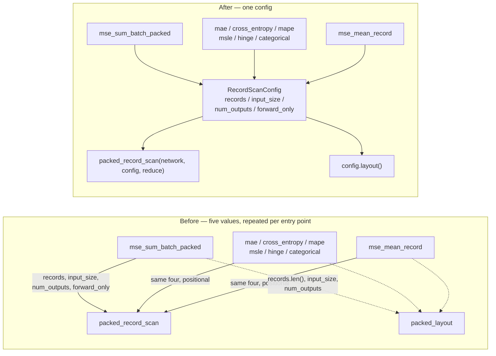

## Summary

The five-value group `network` / `records` / `input_size` / `num_outputs` /
`forward_only` travelled as a flat positional list through every packed batch
entry point in `neat-core/src/loss.rs` on its way to the shared
`packed_record_scan`. Issue #444 gave the scan *loop* one home; what stayed
duplicated was the *shape of the call*.

The four record-describing values now travel as one internal
`RecordScanConfig<'a>`, built once per entry point and used for both
`config.layout()` (the `packed_layout` guard each wrapper repeated) and the scan
itself. A future sixth "what travels together" value is added to one struct
rather than to nine parameter lists, and a mis-ordered internal call is no longer
expressible.

The public `#[cfg_attr(target_family = "wasm", wasm_bindgen)]` signatures are
**unchanged** — the flat JS/WASM calling convention is a deliberate boundary
constraint, as the issue notes, so this is internal plumbing only. No public API
change, so the three-phase downstream flow (`RELEASING.md`) does not apply.

Closes #671.

## Evidence

Backend Rust refactor with no web interface, so there is nothing to screenshot.
The evidence is the characterisation suite plus the mutation sweep below.

### Behaviour preservation — the characterisation suite

`AGENTS.md` ("Characterisation-test exception — pure extractions only") governs
here: collapsing a repeated parameter list adds no behaviour for a failing-first
test to describe, so the existing Issue #444 suite is the oracle and must stay
green through the extraction.

`neat-core/tests/packed_record_scan.rs` (7 tests) drives all eight packed entry
points with real networks and asserts observable numbers — trailing partial
records ignored, zero without a whole record, a buffer's total equal to the sum
of its records scanned singly, per-record target reads, and the conditional
`reset_state()`. It was green before the change and is green after it, unmodified.

`cargo test --workspace --lib --tests --all-features -- --test-threads=2`: all
suites pass, 0 failures.

### Mutation evidence — every former site still dies

`AGENTS.md` rule 2 requires proof the suite reaches each of the nine sites rather
than passing blind. Each site was mutated one at a time — the `input_size` it
contributes replaced with `input_size.saturating_sub(1)`, which shifts both the
record stride and the target start — and the covering suite was run. Every
mutation was reverted afterwards; the working tree matches the commit.

| # | Site | Before the refactor | After the refactor |
|---|------|--------------------|-------------------|
| 1 | `mse_sum_batch_packed` | RED | RED |
| 2 | `mae_sum_batch_packed` | RED | RED |
| 3 | `cross_entropy_sum_batch_packed` | RED | RED |
| 4 | `mape_sum_batch_packed` | RED | RED |
| 5 | `msle_sum_batch_packed` | RED | RED |
| 6 | `hinge_sum_batch_packed` | RED | RED |
| 7 | `categorical_error_sum_batch_packed` | RED | RED |
| 8 | `mse_mean_record` | RED | RED |
| 9 | `mse_mean_streaming` (→ `mse_sum_batch_packed`) | RED (`tests/mse_streaming.rs`) | RED (`tests/mse_streaming.rs`) |

No blind spot: all nine die on both sides of the change, so the green result
after the refactor is worth something.

### Scope

`mse_mean_streaming` is listed in the issue as the ninth carrier of the clump,
but it reaches the scan through the **public** `mse_sum_batch_packed` (to keep
the fused SIMD path), not through `packed_record_scan`. Its call therefore stays
flat — changing it would mean changing a public signature, which the issue
explicitly rules out. Its site is still covered by the mutation sweep above.

The `*_8way` / `*_scattered` SIMD helpers keep their own parameter lists: they
take `values_per_record` and `num_records` rather than the config's four values,
and the issue names the `packed_record_scan` plumbing only.

## Test Plan

- No test file changed. `neat-core/tests/packed_record_scan.rs` (unmodified) is
  the characterisation oracle for the extraction; `neat-core/tests/mse_streaming.rs`
  covers the streaming site.
- `cargo test -p neat-core --test packed_record_scan --test mse_streaming` — 16 + 7 passing.
- `cargo test --workspace --lib --tests --all-features -- --test-threads=2` — all green.
- `./quality.sh` — run before the PR.
- Mutation sweep over all nine sites, before and after, recorded above.

## Docs

`AGENTS.md` "One packed-record scan for every loss entry point (Issue #444)"
gains a paragraph naming `RecordScanConfig` as the bundle and restating that the
`wasm_bindgen` signatures stay flat by design.
