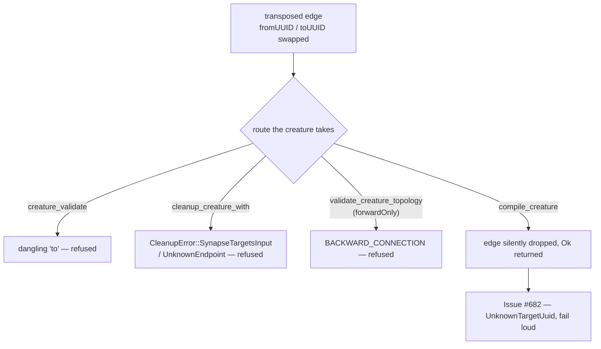

## Summary

Issue #672 asked for a transparent `NeuronUuid(String)` newtype over
`SynapseExport::from_uuid` / `to_uuid`, and explicitly invited the maintainer
to disagree. **It is declined**, and this PR records why — plus the fail-loud
defect the investigation did turn up. Closes #672.

Two deliverables, no behaviour change:

1. `docs/research/uuid-endpoint-newtypes.md` — the decision record, following
   the `docs/research/` convention already used for
   `wasm-gather4-unchecked-loads.md`.
2. A short note on `SynapseExport`'s own doc comment
   (`neat-core/src/creature.rs:157`) pointing at it, so the next scan finds the
   answer where the code is rather than re-filing the finding.

### Why the newtype is declined

- **One newtype for both endpoints catches nothing.** Both fields would hold
  the same type, so `SynapseExport { from_uuid: b, to_uuid: a, .. }` still
  type-checks. Issue #672 concedes this itself: the transposition becomes a
  type mismatch "only if the two ever diverge into distinct newtypes".
- **Distinct `SourceUuid` / `TargetUuid` are unworkable in a graph.** Every
  target UUID is some other edge's source UUID — in `input-0 → h-1 → out-0`,
  `h-1` is the `toUUID` of the first edge and the `fromUUID` of the second.
  Both resolution sites read the pair against one table for that reason
  (`creature.rs:870`, `creature_validate.rs:1238`), so distinct types would
  need a conversion at each, moving the swap one level down.
- **It is twelve public items, not one.** The pair is public on
  `SynapseExport`, `MemeticWeightRowExport`, two `CreatureError` variants,
  `SynapseKeyJson`, `WeightShareJson`, `SynapseKey`, two `CleanupError`
  variants, `WeightShare`, and two `PruneError` variants — enumerated with
  line numbers in the research note.
- **It is breaking across five registered consumers.** `RELEASING.md` lists
  struct-field type changes as breaking, so this is the three-phase flow over
  twelve items. A `gh` code search over `scripts/downstream-consumers.txt`
  found `from_uuid`/`to_uuid` files in NEAT-AI-scorer (7),
  NEAT-AI-Backpropagation (8), NEAT-AI-Rebase (6), NEAT-AI-Forests (3) and
  NEAT-AI-Ockham (23); NEAT-AI-Lamarck was not sampled (search API
  rate-limited).
- **The `if_graft.rs` half of the finding does not hold.** `GraftEdge` carries
  a **single** `uuid` — "the neuron at the other end of the edge"
  (`if_graft.rs:101`) — with direction coming from which list it sits in. There
  is no endpoint pair there to transpose.

### What the investigation did find — filed as #682

Issue #672 says the only backstop against a transposed edge is downstream
validation. Probing that turned out to be optimistic for one route:
`compile_creature` groups synapses by `to_uuid` (`creature.rs:906-912`) and
reads them back **per listed neuron** (`creature.rs:924`), so an edge whose
destination is not a listed neuron is never looked up and is **silently
dropped** — with `Ok` returned. Its mirror case, an unresolvable *source*, is
`CreatureError::UnknownSourceUuid`.

Measured against `Develop` at `89b61b1` with a throwaway probe (removed before
commit): a two-synapse creature compiled to `Ok(2)`; the same creature with one
edge transposed onto `input-0` compiled to `Ok(1)`; an edge with a typo'd
destination likewise `Ok(1)`.

That asymmetry is a fail-loud defect, not a typing one — no newtype would have
caught it, since a transposed edge swaps two values of the same kind. It is
**out of scope here**: adding `CreatureError::UnknownTargetUuid` is a breaking
change on two counts (the enum is not `#[non_exhaustive]`, and refusing input
that used to be accepted is a documented-behaviour change), needing the
breaking signal, a minor bump and a breaking-change log entry. Filed as a
single follow-up issue, **stSoftwareAU/NEAT-AI-core#682**, with the
reproduction above.

## Evidence

Backend/library change with no web interface, so no screenshot applies. This PR
adds documentation only — no Rust behaviour changes, so there is nothing new to
regression-test.

What was run:

- `./quality.sh < /dev/null` — **passed** end to end (shellcheck, bats,
  `deno check`/`lint`/`fmt`, the Mermaid gate, the WASM prune-parity record,
  the JSR supply-chain gate, codespell, `cargo deny`, `cargo fmt`,
  `cargo clippy -D warnings`, `cargo check`, `cargo test --workspace`,
  doctests, `cargo doc` under `RUSTDOCFLAGS="-D warnings"`, release build).
  `cargo doc` covers the new `SynapseExport` doc paragraph.
- `markdownlint-cli2 docs/research/uuid-endpoint-newtypes.md` — 0 issues.
- `deno run --allow-read scripts/check_mermaid.ts .` — all blocks passed,
  including the new diagram.

The gate left `wasm-bench/Cargo.lock` rewritten (a pre-existing `0.16.0` →
`0.16.1` lag its `cargo deny` pass refreshes); it is unrelated to this issue
and was reverted rather than folded in.

Where a transposed edge is and is not caught today:

## Test Plan

No tests added or modified. The change is a decision record plus a doc comment;
there is no new code path to cover, and pinning the current
`compile_creature` silent-drop as expected behaviour would be wrong — #682
fixes it, and the regression test belongs with that fix.

Existing coverage was re-run green by `./quality.sh`, including the doctest and
`cargo doc` passes that compile the edited `SynapseExport` documentation.
