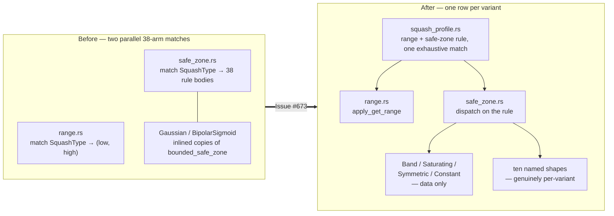

# One per-variant data list for range and safe zone (Issue #673)

## Summary

`SquashType` is matched exhaustively in seven modules. Six of those matches are
staying: the forward value (`squash.rs`), the derivative (`derivative.rs`), the
inverse (`unsquash.rs`), the error curve (`error.rs`) and the aggregate
reductions (`batch_scoring.rs`) are genuinely **different algorithms** that
share nothing but the tag — the issue itself says a table is the wrong tool for
them, and they are untouched here.

The other two were not algorithms at all. The **output range**
(`range.rs::apply_get_range`) and the **safe-zone rule**
(`safe_zone.rs::apply_safe_zone_adjustment`) are per-variant *values*, and each
carried its own 38-arm `match`. They now share one declarative row per variant
in the new `neat-core/src/squash_profile.rs`, so adding an activation function
is **one row** rather than one arm in each of two files. Closes #673.

The safe-zone rule travels as data — `Band` (fourteen types share the linear
fade), `Saturating` (three), `Symmetric` (three), `Constant` (eight) — plus ten
named shapes for the types whose rule really is its own algorithm. That closed
shape set is what keeps the dispatch **exhaustively compiler-checked without a
second membership list**, and it avoids function-pointer/vtable dispatch, which
the issue rightly rules out for this crate's SIMD hot paths.

Two genuine copy-paste duplications fell out with it:

- `Gaussian` and `BipolarSigmoid` each carried a hand-inlined copy of
  `bounded_safe_zone` with their constants baked in. Both are now `Band` rows,
  verified bit-exact against the copies they replace.
- `weight_is_recovering` is now the one home of the "defer to a weight the error
  is already correcting" guard that `bounded_safe_zone`, `Sine`, `Cosine` and
  `Tan` each restated inline.

`squash.rs`, `derivative.rs`, `unsquash.rs`, `error.rs` and `batch_scoring.rs`
are deliberately unchanged — see the **scope** note below.

## Evidence

Backend-only change to a Rust library; there is no web interface to screenshot.
The evidence is a differential parity suite, a mutation sweep, compile-time
probes and a benchmark A/B.

### Behaviour is unchanged — differential oracle

`neat-core/tests/squash_profile_parity.rs` keeps the **verbatim pre-change**
implementations of `apply_get_range` and `apply_safe_zone_adjustment` in the
test module (AGENTS.md "Oracles and mutation evidence", rule 1: an oracle must
not share the code path under test). Every one of the 38 `SquashType` variants
is swept **bit-exactly** (`f32::to_bits`) against them over 109 raw inputs
straddling every documented band edge, 7 error values and 15 weights including
`NaN` and both sides of the `[1e-3, 1e3]` guard — 445 thousand comparisons, all
equal.

That suite was written first and run **green against the unmodified source**
before any `src/` change, then kept green through the extraction — the
characterisation-test path AGENTS.md prescribes for a pure extraction.

### Mutation sweep — the tests really can fail

Each mutation applied on its own to the new table and reverted afterwards:

| Mutation | Result |
| --- | --- |
| `Band` row: `Gaussian` band min `-3.0` → `-3.1` | ✅ red — `beyond_band_fades_linearly_to_zero` |
| `Band` row: `BipolarSigmoid` fade `4.0` → `5.0` | ✅ red — `beyond_band_fades_linearly_to_zero` |
| `Saturating` row: `HardTanh` recovery `(-1.0, 1.0)` → `(-0.9, 0.9)` | ✅ red — parity sweep |
| `Constant` row: `Complement` `1.0` → `0.0` | ✅ red — parity sweep |
| Range: `LogSigmoid` high `0.0` → `F32_LARGE` | ✅ red — `test_get_range_special_bounds` |
| Range: `Cube` unbounded → non-negative | ✅ red — `test_limit_range_unbounded_infinity_clamping` |
| Shared guard: `MIN_WEIGHT` `1e-3` → `1e-4` | ✅ red — `inside_band_defers_to_a_correcting_tiny_weight` |

The `HardTanh` row is the one that most deserved a mutation: it is the only
`Saturating` type whose recovery thresholds (`±1.0`) differ from its safe band
(`±0.9`), so a table that collapsed the two fields would have compiled and
passed everything except the parity sweep.

### Compile-time exhaustiveness is preserved

The property the issue names as the mitigating factor — a missed arm is a build
failure, not a silent bug — still holds, and now covers the new shape set too:

| Probe | Result |
| --- | --- |
| Delete the `SquashType::Mean` row from the table | `error[E0004]: non-exhaustive patterns: SquashType::Mean not covered` |
| Add a new `SquashType::Probe` variant with no row | `error[E0004]: non-exhaustive patterns: SquashType::Probe not covered` |
| Give it a row naming a new shape, but no `safe_zone.rs` arm | `error[E0004]: non-exhaustive patterns: SafeZoneRule::Probe not covered` |

All three probes were reverted; `cargo check` is clean on the committed tree.

### Benchmarks — no regression, and backpropagation got faster

Not a performance task, but `apply_get_range` sits in the batched scoring loop
and `apply_safe_zone_adjustment` in the backprop loop, so an A/B was run anyway:
`cargo bench -p neat-core --bench hot_paths`, same filter and settings both
sides, pre-change tree saved as the `before` baseline.

| Benchmark | Before | After | Change |
| --- | --- | --- | --- |
| `backprop/small_50` | 15.20 µs | 8.57 µs | **−45.1%** |
| `backprop/medium_500` | 219.1 µs | 130.0 µs | **−40.7%** |
| `backprop/large_5000` | 2.532 ms | 1.936 ms | **−23.0%** |
| `backprop/production` | 52.93 µs | 50.33 µs | −5.0% |
| `backprop/production_2x` | 131.5 µs | 128.8 µs | −3.1% |
| `backprop/production_exact` | 81.28 µs | 81.67 µs | −1.3% |
| `forward_pass/production_exact` | 13.88 µs | 12.89 µs | −6.1% |
| `batched_scoring/mse_sum_8records/production_exact` | 52.85 µs | 34.36 µs | −19.4% |

Every line is faster or unchanged (`p < 0.05`), and the backprop figures
reproduced across two independent runs. The plausible cause is code size:
`apply_safe_zone_adjustment` was a ~500-line `#[inline(always)]` body expanded
at every call site, and is now a small dispatch over separately-inlinable arms.
No claim is made beyond "no regression" — the gain is a side effect, not the
goal.

### Quality gate

`./quality.sh` run in full on the final tree — see the run log in the PR
conversation.

## Scope

The issue asks for the static-table pattern **only** where an operation is a
per-variant *value*, and says explicitly that where the match bodies are
genuinely different algorithms "a table is the wrong tool here and this finding
does not apply — leave those as separate functions". So:

- **Changed**: `range.rs` (pure value table) and the per-variant data in
  `safe_zone.rs`.
- **Unchanged by design**: `squash.rs::apply_squash`, `derivative.rs`,
  `unsquash.rs`, `error.rs`, and the four `batch_scoring.rs` matches — the last
  of which dispatch aggregate *reductions* (min/max/if/hypot/mean over a synapse
  range), not values.
- `SquashType`'s public API, the `range.rs` public constants and every exported
  signature are untouched, so no downstream consumer sees a change and the
  three-phase public-API flow does not apply. `squash_profile` is a private
  module.

## Test Plan

- **New** `neat-core/tests/squash_profile_parity.rs` — four tests:
  - `get_range_matches_the_pre_change_implementation_for_every_squash_type`
  - `safe_zone_matches_the_pre_change_implementation_for_every_squash_type`
  - `safe_zone_rejects_non_finite_raw_inputs_for_every_squash_type`
  - `limit_and_validate_range_still_ride_on_the_table_bounds`
- **Extended** `neat-core/tests/safe_zone_bounded.rs` — `BOUNDED_ARMS` grows
  from twelve to fourteen entries so the behavioural suite that pins the shared
  bounded rule now also covers `Gaussian` and `BipolarSigmoid`, whose inlined
  copies this change removed. All seven of its tests exercise the two new rows.
- **Unchanged and still green**: `neat-core/tests/range.rs`,
  `neat-core/tests/aggregate_squash_set.rs`, `neat-core/tests/derivative.rs`,
  `neat-core/tests/unsquash.rs`, `neat-core/tests/error_calculate.rs` and the
  rest of `cargo test --workspace`.
- **Documentation**: `AGENTS.md` gains a **One per-variant data list for range
  and safe zone (Issue #673)** section, beside the sibling #441/#443/#446 rules,
  recording which matches were collapsed, which were deliberately left alone,
  and why function-pointer dispatch is not the answer here. The stale
  "37-arm range `match`" wording in `range.rs` was corrected in the same change.
