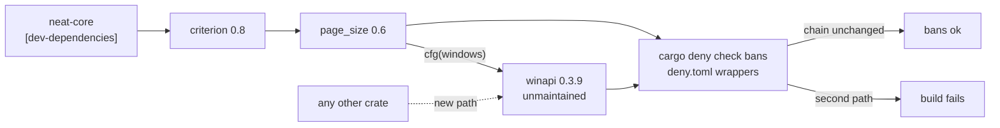

## Summary

`winapi` (unmaintained since `0.3.9`, 2020-06-26; superseded by `windows-sys`)
cannot be removed from this repository's graph, and the issue's two suggested
levers do not work — both were checked against the registry index, not assumed:

- **criterion `0.8.x` declares `page_size ^0.6` as a plain dependency** —
  `optional: false`, `kind: normal`, no `target` — so no feature set, including
  dropping `html_reports`, drops `page_size`. (criterion `0.7.0` has no
  `page_size` edge at all, but moving there is a downgrade, and `tinytemplate`
  — issue #677 — is equally non-optional in both.)
- **No `page_size` release has ever used `windows-sys`** — `0.1.0` through the
  current `0.6.0` all depend on `winapi` under `cfg(windows)`.

So there is no version or feature move here that removes the edge. What the
finding actually rests on is *containment* — dev-dependency only, Windows-target
only — and nothing enforced that. This PR makes it an enforced invariant instead
of an assumption: `deny.toml` `[bans]` denies `winapi` except through
`page_size` and `page_size` except through `criterion`, so `cargo deny check`
(already run by `quality.sh` and the CI `deny` job) fails the build the moment a
second path appears — which is the only way a dev-only, Windows-only crate could
reach the shipped library or the wasm bundles. A new gate fails if that policy
is dropped, if `Cargo.lock` grows a new dependent of either crate, or if
`criterion` stops being a dev-dependency, and `SECURITY.md` records the chain
plus the upstream condition that deletes it. Closes #676.

## Evidence

Backend/supply-chain change — no web interface to screenshot. The evidence is
the gate behaviour, captured live in this run.

**The ban fires.** With the wrapper deliberately pointed at the wrong crate,
`cargo deny check bans` fails rather than passing quietly:

```text
error[banned]: crate 'winapi = 0.3.9' is explicitly banned
43 │     { crate = "winapi", wrappers = ["tempfile"] },
   │                ━━━━━━ banned here
bans FAILED
```

With the committed wrappers (`page_size`, `criterion`), the same command reports
`bans ok`.

**The gate is red without the policy.** `tests/cargo_orphan_containment_test.ts`
was written first and run against the unmodified `deny.toml`:
`deny.toml [bans] must deny winapi except through page_size` failed
(`undefined` vs `["page_size"]`); the other six passed. After the `deny.toml`
entries: `ok | 7 passed | 0 failed`.

**Full gate.** `./quality.sh < /dev/null` → `✅ All quality checks passed!`
(includes `cargo deny check` over both lockfiles, `deno lint`/`fmt`, the bats
suites, clippy, tests and doctests).



## Test Plan

Added `tests/cargo_orphan_containment_test.ts` (7 tests, run by `quality.sh` and
the CI `typescript-gate` job):

- `Cargo.lock reaches winapi through page_size and nothing else` — real
  lockfile, reverse-dependency set equals `["page_size"]`.
- `Cargo.lock reaches page_size through criterion and nothing else`.
- `criterion is declared as a dev-dependency only, so winapi never ships` —
  real `neat-core/Cargo.toml`.
- `deny.toml pins the winapi wrapper chain so cargo deny fails on a new path` —
  the test that was red before the policy landed.
- `dependentsOf reports a second path into a denied crate` — synthetic lockfile
  with a second dependent, proving the check detects a violation rather than
  only confirming today's shape.
- `parseBanDenyEntries reports an unwrapped ban` — synthetic `deny.toml` with a
  ban carrying no wrappers.
- `sectionsDeclaring separates a shipped dependency from a dev one` — synthetic
  manifest with the same crate in a target table and in `[dev-dependencies]`.

No existing test was modified or removed.
