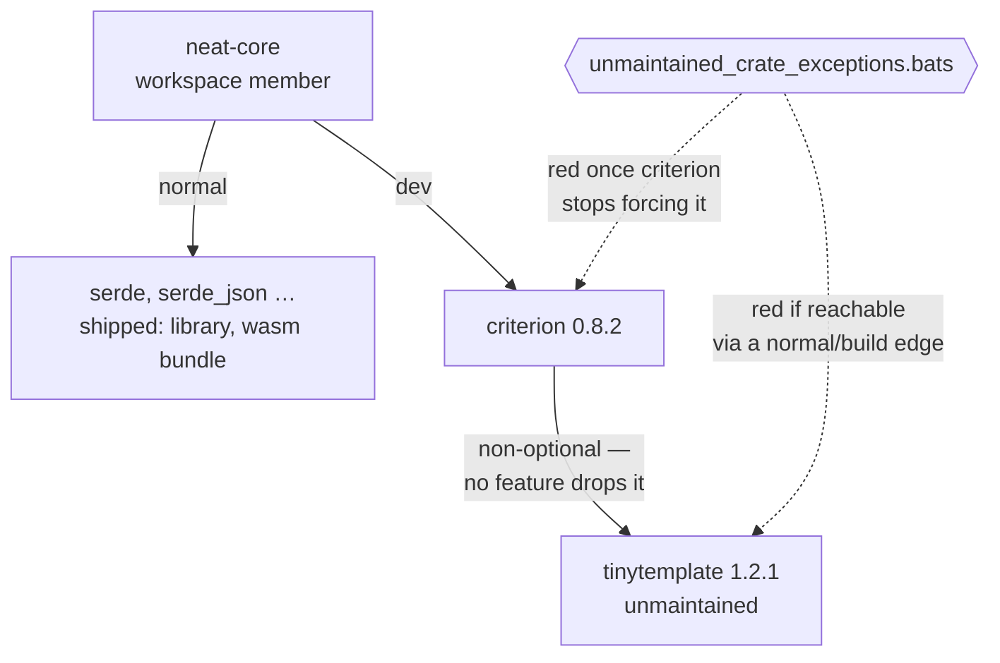

## Summary

The finding is right about the crate and wrong about the cure. `tinytemplate`
is unmaintained — 1.2.1 published 2021-03-04, nothing since, with "Project
dead?", "Maintenance?" and an unanswered CVE report still open upstream — but
it cannot be dropped by turning off `criterion`'s `html_reports` feature:
`criterion 0.8.2` declares `tinytemplate` as a **non-optional** dependency, so
no feature selection removes it. Making that change would have cost the
developer local HTML benchmark reports and left the resolved graph identical.

What *is* defensible is the boundary the finding itself uses to justify
`severity:low`: `tinytemplate` reaches `cargo test`/`cargo bench` on a
developer's machine and never the library, the wasm bundle or anything this
repository ships. Nothing held that boundary — RustSec files no advisory for
the crate (so `cargo audit` is silent) and `cargo deny` can only ban a crate
the graph can do without. This change makes the boundary a gate:
`tests/scripts/unmaintained_crate_exceptions.bats` walks the graph cargo
resolves, for every lockfile in the tree, and fails if a tolerated
unmaintained crate is reachable from a workspace member through a normal or
build edge. It fails again the moment `criterion` stops forcing the crate, so
the exception is deleted rather than inherited forever. SECURITY.md carries the
row and the exit condition; `neat-core/Cargo.toml` points at it from the
`criterion` line that causes it. Closes #677.

## Evidence

Backend change with no web interface to screenshot. The evidence is the
resolved dependency graph, the new gate, and the mutation record below.

**The premise, checked rather than assumed** — `criterion 0.8.2`'s own
manifest, as cargo reports it:

```
$ cargo metadata --format-version 1 | jq '… criterion → tinytemplate'
criterion 0.8.2 -> tinytemplate optional= False kind= None

$ cargo tree -p neat-core -e normal -i tinytemplate
warning: nothing to print.          # never on a shipped path

$ cargo tree -p neat-core -e normal,dev -i tinytemplate
tinytemplate v1.2.1
└── criterion v0.8.2
    [dev-dependencies]
    └── neat-core v0.20.1
```

`optional = false` is why the suggested fix cannot work, and
`html_reports = []` in criterion's feature table is a plain flag that gates
report *generation*, not the dependency. No RustSec advisory exists for the
crate either — the vendored advisory database holds no `tinytemplate` entry,
and `cargo deny check advisories` is green.



**Full gate:** `./quality.sh` → `✅ All quality checks passed!` in 75s
(shellcheck, `bash -n`, 644 bats tests, codespell, Mermaid, Deno gates, clippy,
`cargo test`, doctests, `cargo deny`, release build).

## Test Plan

Added `tests/scripts/unmaintained_crate_exceptions.bats` (4 tests). The
tolerated-crate list is defined once, in `setup()`, and read by every test and
by the SECURITY.md cross-check, so an exception cannot be half-removed.

- **every unmaintained-crate exception stays off the shipped path** — sweeps
  every manifest that resolves its own lockfile (root workspace and
  `wasm-bench`, discovered from the lockfiles rather than hard-coded) and fails
  if the crate is reachable from a workspace member through a normal or build
  edge.
- **the shipped-graph reader tells a shipped crate from a dev-only one** — the
  oracle for that sweep: `serde` must be in the shipped set, `criterion` must
  not, and `criterion` must still be in the full resolved graph. A reader that
  returned nothing would pass the sweep on every graph; this fails it.
- **every unmaintained-crate exception is still forced by its carrier** — the
  exception is only defensible while `criterion` leaves no choice, so this
  reads the carrier's declared dependency and fails when it becomes optional or
  disappears, naming the crate to drop.
- **SECURITY.md documents every unmaintained-crate exception** — the list and
  the "Unmaintained transitive crates" section stay in step.

Graph reads use `cargo metadata --locked`: a test must never rewrite a
committed lockfile, and a stale lockfile fails loudly instead of being silently
repaired mid-suite.

**Mutation evidence** — each assertion was driven red before being trusted,
and every mutation reverted:

| Mutation | Test | Result |
| --- | --- | --- |
| `criterion` moved from `[dev-dependencies]` to `[dependencies]` | stays off the shipped path | red — `./Cargo.toml ships the unmaintained crate tinytemplate` |
| exception list points at `rayon` (an *optional* criterion edge) | still forced by its carrier | red — `criterion 0.8.2 no longer requires rayon unconditionally — drop rayon and delete the exception` |
| `shipped_crates` gutted to print nothing | tells a shipped crate from a dev-only one | red — the `serde` assertion fails |
| SECURITY.md section absent (its pre-change state) | SECURITY.md documents every exception | red — `SECURITY.md has no 'Unmaintained transitive crates' section` |

No existing test was modified or removed; the suite went from 640 to 644 tests.
