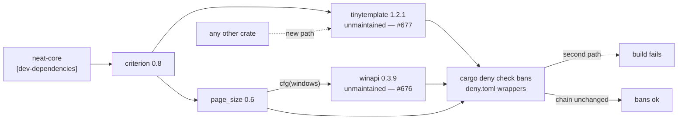

# Bound the unmaintained `tinytemplate` with the existing orphan-containment gate (Issue #677)

## Summary

`tinytemplate` is unmaintained — `1.2.1` published 2021-03-04, nothing since,
with *"Project dead?"*, *"Maintenance?"* and a `CVE-2023-38497` report all still
open and unanswered upstream — and it is in this repository's resolved graph.

**The mitigation the finding suggested does not work.** Dropping `criterion`'s
`html_reports` feature removes nothing: `criterion 0.8.2` declares
`tinytemplate` as a plain, non-optional dependency, and `html_reports` carries
an **empty** feature list, so the feature controls whether the reports are
*rendered*, not whether the crate is *resolved*. Verified against the graph
cargo actually resolves:

```
$ cargo metadata --format-version 1 --locked | …
criterion 0.8.2
  page_size     optional= False kind= None target= None
  tinytemplate  optional= False kind= None target= None
 features html_reports: []
```

Turning the feature off would therefore cost the local HTML benchmark reports
and leave the crate exactly where it was. So the exposure is **bounded** rather
than removed, using the mechanism already in the tree.

**This reuses the Issue #676 gate instead of adding a second one.** #676 landed
on `milestone/scan-20260911` while this branch was in flight, covering the same
class of finding — `winapi`, also forced in by `criterion` — with `deny.toml`
`[bans]` wrappers, `tests/cargo_orphan_containment_test.ts`, and a SECURITY.md
section. An earlier commit on this branch had invented a parallel `bats` suite
for the identical concern; merging the base collapsed the two into one gate.
`tinytemplate` is now a third wrapper entry, not a second mechanism.

Closes #677.

## Evidence

Backend/dependency-policy change with no web interface, so no screenshot
applies. The evidence is the gate behaving as claimed in both directions.

**The ban fires on any path other than `criterion`** — the wrapper temporarily
pointed at a crate that is not the real parent, which is what a second path into
`tinytemplate` would look like to `cargo deny`:

```
$ cargo deny check bans     # { crate = "tinytemplate", wrappers = ["iai"] }
warning[unmatched-wrapper]: direct parent 'criterion = 0.8.2' of banned crate
  'tinytemplate = 1.2.1' was not marked as a wrapper
error[banned]: crate 'tinytemplate = 1.2.1' is explicitly banned
```

**And passes on the real chain:**

```
$ cargo deny check bans
bans ok
```

**The Deno gate is red without the policy** — with the `deny.toml` entry removed
and nothing else changed:

```
$ deno test --allow-read tests/cargo_orphan_containment_test.ts
deny.toml pins both wrapper chains so cargo deny fails on a new path => FAILED
  [Diff] Actual / Expected
  +   [ "criterion" ]
  -   undefined
FAILED | 7 passed | 1 failed
```

**Green with it, and the full gate passes:**

```
$ deno test --allow-read tests/cargo_orphan_containment_test.ts
ok | 8 passed | 0 failed

$ ./quality.sh < /dev/null
✅ All quality checks passed!
```



## Scope — what was deliberately left out

Two things were reverted from this branch when the base was merged, because
neither is what #677 asks for:

- A parallel `tests/scripts/unmaintained_crate_exceptions.bats` suite. It gated
  the same invariant the #676 Deno gate already gates; keeping both would have
  left two competing sources of truth for one policy.
- A `version-increment` re-lock CI step and a lockfile-freshness `bats` gate.
  These addressed a genuine but **pre-existing** defect on the base branch —
  `wasm-bench/Cargo.lock` still names `neat-core 0.20.1` while the workspace is
  at `0.21.0`, because the auto-bump re-locks the root lockfile only. That is a
  CI-job change with its own blast radius, so it is filed as **#695** rather
  than folded in here.

## Test Plan

Extended `tests/cargo_orphan_containment_test.ts` (7 → 8 tests), run by
`quality.sh` and the CI `typescript-gate` job:

- **Added** `Cargo.lock reaches tinytemplate through criterion and nothing else`
  — fails if the committed lockfile grows a second dependent.
- **Extended** `deny.toml pins both wrapper chains so cargo deny fails on a new
  path` — now also asserts `tinytemplate` is denied except through `criterion`.
  Confirmed red with the entry removed (output above).
- **Extended** `criterion is declared as a dev-dependency only, so neither crate
  ships` — unchanged assertion, renamed because it now guards two crates.

No test was commented out, removed or weakened. The two deleted `bats` files
were added earlier **on this branch** and never existed on the base.

Documentation updated in the same change: SECURITY.md *"Orphaned transitive
crates"* now covers both crates and both exit conditions, and the README row and
`quality.sh` comment that named only `winapi` were corrected along with the moved
section anchor.

One wording fix could not be pushed: the CI step is still named *"Cargo
orphan-containment gate (winapi wrapper chain)"* though it now runs the gate for
both crates. This run's token carries no `workflow` scope, so any push touching
`.github/workflows/` is rejected outright — `.github/workflows/ci.yml` is
therefore left byte-identical to the base branch. The step **runs the right
test** (`deno test --allow-read tests/cargo_orphan_containment_test.ts`, which
now has the `tinytemplate` assertions), so this is a stale label on a working
gate, not a coverage gap. A reviewer with `workflow` scope can rename it in one
line.
