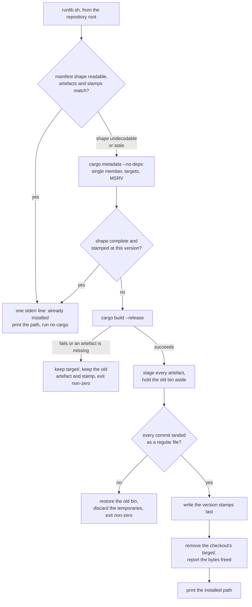

## Summary

Adds `scripts/runlib.sh` — the one canonical build → install → clean helper every
NEAT-AI Rust sibling copies byte-for-byte — merging NEAT-AI-Discovery's
toolchain/MSRV/cdylib install with the sibling binary install into a single
script. It resolves the lone workspace member, installs the crate's bin to
`$CARGO_HOME/bin` and its cdylib to `$CARGO_HOME/lib`, stamps each artefact with
the crate semver, skips the build entirely (no `cargo` invocation) when the stamp
already matches, and removes the checkout's `target/` after a successful install.
The copy contract is documented in README.md, cross-linked from RELEASING.md and
named in the AGENTS.md repository layout. Closes #680.

## Evidence

Backend/CLI change — no web interface to screenshot. The evidence is the test
suite, the red-before/green-after record for each defect, and an end-to-end run
against real `cargo`.

**Full gate:** `./quality.sh` → `✅ All quality checks passed!` (shellcheck,
`bash -n`, 640 bats tests, codespell, Mermaid, Deno gates, clippy, `cargo test`,
doctests, `cargo deny`, release build). One host note, not a repo change: this
container has a rustup-managed toolchain with no default configured, so
`cargo fmt` needs `RUSTUP_TOOLCHAIN=1.98.0-aarch64-unknown-linux-gnu` in the
environment. That same host state is what defect 2 below turned into a silent
failure, which is how it was found.

**End-to-end against real `cargo`** — a throwaway crate with both a `[[bin]]` and
a `cdylib` whose `[lib] name` deliberately differs from the package name:

| Run | stdout | stderr | Result |
|-----|--------|--------|--------|
| 1 (cold) | `…/cargo/bin/runlib_smoke` | `[runlib-smoke] removed …/repo/target (freed 577536 bytes)` | `bin/runlib_smoke`, `lib/librunlib_smoke.so`, both stamps written, `target/` gone |
| 2 (warm) | `…/cargo/bin/runlib_smoke` | `[runlib-smoke] already installed v0.3.1` | no `cargo` run |
| 3 (version bumped) | `…/cargo/bin/runlib_smoke` | rebuild + removal line | stamp refreshed to `0.4.0` |

**Defects found by the independent reviews, and the test that was red for each.**
Every row was reproduced against the unfixed script before the fix, and is green
after it:

| Defect | Regression test |
|--------|-----------------|
| A multi-line `crate-type` array was unreadable, so a both-crate with its library deleted reported "already installed" and exited 0 | `::a multi-line crate-type array with the library missing rebuilds instead of reporting installed` |
| An explicit `[[bin]]` table suppressed the bin claim, so a missing binary read as installed | `::an explicit [[bin]] table with the binary missing rebuilds instead of reporting installed` |
| …and stdout named the lib on a skip but the bin on a build, for the same crate at the same version | `::an explicit [[bin]] table still names the bin path on a skip, not the lib path` |
| `$PWD` (logical) compared against cargo's canonicalised `target_directory`, so a symlinked checkout kept its own `target/` — on macOS, `/tmp` → `/private/tmp`, every run | `::a symlinked checkout still has its own target/ removed` |
| `rustc --version 2>/dev/null \| sed …` aborted the script under `set -euo pipefail` before its own `_runlib_die` could fire: empty stdout, bare status, no diagnostic | `::a rustc that cannot report its version fails loud rather than silently` |
| `rustup` was a hard precondition but is never invoked; `rustc` is invoked but was not required | `::a toolchain without rustup still installs…`, `::a missing rustc exits non-zero naming rustup.rs…` |
| `mv -f file dir` moves *into* the directory and exits 0, so a directory at an install path was stamped, `target/` removed, and the directory printed as the artefact | `::a directory sitting at the install path fails loud instead of being installed into` |
| `-e` in the stamp check then accepted that directory as a valid install for ever | `::a directory at the artefact path never reads as an installed artefact` |
| The bin was committed before the lib, so a failing lib step left the new binary beside the old library — the exact state the staging exists to prevent | `::a library that cannot be installed restores the previously installed binary` |
| Staging temporaries leaked from the lib directory and on an unguarded `chmod` | `::no staging temporary survives a failed install in either directory` |
| The missing-`cargo` test skipped itself on any host with a system `cargo` — i.e. most CI images | `minimal_path()` fixture; the test now always executes |

## Acceptance Criteria

<!-- vibe-spec-review inputs="diff+issue-body" -->

- **met** — `scripts/runlib.sh` passes shellcheck and `bash -n` under bash 3.2 syntax rules (macOS hosts) — evidence: `quality.sh` shellcheck/`bash -n` sweep over every `*.sh`; no bash-4 constructs (`declare -A`, `mapfile`, `${v^^}`, `local -n`), and the one empty-array expansion uses the 3.2-safe `${arr[@]+"${arr[@]}"}` form at `scripts/runlib.sh:432` — reviewer: met — reason: the reviewer noted it could only verify against bash 5.2 and that no macOS CI lane gates this half; that caveat stands and is the same standard the repo's other shell gates hold
- **partial** — with a matching stamp the script invokes no `cargo` command and prints exactly one `already installed` stderr line — evidence: `tests/scripts/runlib.bats::a matching stamp skips the build without invoking cargo at all` and `::the skip prints exactly one already-installed stderr line` — reviewer: partial — reason: agreed and left partial. For manifest shapes the single-line reader cannot decode — a globbed `members` entry, a multi-line `crate-type` array, an explicit `[[bin]]` table — one `cargo metadata` still runs. The reviewer also proved the fast path was *unsound*, reporting installed for artefacts that were absent; that half is fixed here by making those shapes decline outright rather than under-claim
- **met** — after a successful build `target/` is gone, the artefact(s) and `.<crate>.version` exist under `~/.cargo/{bin,lib}`, and the removal line names the bytes freed — evidence: `tests/scripts/runlib.bats::a successful install removes target/ and names the path and bytes freed`, `::the bytes freed are a positive count measured before removal` and `::a symlinked checkout still has its own target/ removed` — reviewer: partial — reason: departed from the reviewer. Both halves it called partial are fixed in this diff — the symlinked-checkout case that kept `target/` (now both paths are resolved with `cd … && pwd -P`), and the false-skip that let an artefact be missing
- **met** — a failing build leaves `target/`, the previously installed artefact and its stamp intact, and exits non-zero — evidence: `tests/scripts/runlib.bats::a failing build exits non-zero, keeps target/ and leaves the old artefact and stamp`, `::a missing library after a successful build does not replace the installed binary` and `::a library that cannot be installed restores the previously installed binary` — reviewer: met — reason: the reviewer flagged a narrower post-commit hole inside an otherwise-met criterion (bin committed, lib commit then fails); that is fixed here by holding the previous binary aside and restoring it
- **met** — stdout is the installed path and nothing else — evidence: `tests/scripts/runlib.bats::stdout carries the installed path and nothing else` and `::an explicit [[bin]] table still names the bin path on a skip, not the lib path` — reviewer: partial — reason: departed from the reviewer. Its finding was that stdout named a different artefact on a skip than on a build for the same crate; that came from the mis-read shape and is fixed, so the path is now stable across both routes
- **met** — tests and quality checks pass — evidence: `bats tests/scripts/runlib.bats` 50/50; `./quality.sh` green end to end after the final edit — reviewer: met
- **unrequested** — `jq` as a hard dependency (`scripts/runlib.sh`) — reviewer: unrequested — reason: `cargo metadata` emits JSON and the issue mandates parsing it; kept, and declared in the README prerequisites
- **unrequested** — the manifest reader used by the skip path (`scripts/runlib.sh:60-254`) — reviewer: unrequested — reason: the criterion "runs **no** `cargo` command" cannot be met while the crate name and version come from `cargo metadata`; it now declines every shape it cannot read unambiguously, with `cargo metadata` remaining the authority
- **unrequested** — `PATH` prepend of `$CARGO_HOME/bin` (`scripts/runlib.sh`) — reviewer: unrequested — reason: carried over from both source scripts so a rustup-installed `cargo` is found in a non-login shell; the effect on a sourcing caller is documented
- **unrequested** — sourceable `runlib_install` plus the `BASH_SOURCE` guard — reviewer: unrequested — reason: both source scripts are sourced by their siblings today, so dropping it would break the copy targets; the README names the subprocess form as the contract and states the sourcing semantics plainly
- **unrequested** — staged temp-file install with rollback, the cleanup trap, the `target/release/deps/` cdylib fallback, the `rm -rf` guards and the `--package`/`--lib`/`--bin` build flags — reviewer: unrequested — reason: each backs a stated criterion (staging and rollback back "a failing build leaves the artefact intact"; the guards back "removes the checkout's `target/`"; the `deps/` fallback is inherited from the Discovery script being merged)
- **unrequested** — non-numeric semver components coerced to `0` in the MSRV compare (`scripts/runlib.sh:212-213`) — reviewer: unrequested — reason: kept; the alternative is an arithmetic crash under `set -u` on a build-metadata tail. The reviewer is right that it weakens the gate for `1.92.1+x`, which is recorded here rather than fixed, since the issue scopes MSRV to a plain `rust-version` read
- **unrequested** — the "target directory outside the checkout is kept" branch (`scripts/runlib.sh:372-409`) — reviewer: unrequested — reason: kept; deleting a shared `CARGO_TARGET_DIR` would destroy other checkouts' builds. The reviewer's point that this branch was the mechanism of the silent `target/` survival is fixed by resolving both paths first
- **unrequested** — `AGENTS.md:194` layout entry and the `README.md` Mermaid flowchart and step table — reviewer: unrequested — reason: the copy contract's documentation was requested; the diagram and the layout line are how this repo documents a flow and a gated script (AGENTS.md, the visual-documentation standard)
- **unrequested** — `docs/archive/pr-summaries/pr-summary-680.md` — reviewer: unrequested — reason: required of every PR by the run contract, and the established convention in this directory

## Standards Review

<!-- vibe-standards-review inputs="diff+CODING-STANDARDS.md" -->

This repo has no `CODING-STANDARDS.md`; `AGENTS.md` is the local standards
document, and the reviewer was given it plus the fleet standing standards.

- **violation** — the MSRV check failed completely silently: `2>/dev/null` plus `pipefail` aborted the assignment, making the `_runlib_die` beneath it unreachable dead code — evidence: `scripts/runlib.sh:328-331` (pre-fix) — reason: fixed here — `rustc --version` is captured in its own `if` with stderr kept, and both the failure and the unparsable-output cases die naming what rustc said; covered by `::a rustc that cannot report its version fails loud rather than silently`
- **violation** — the toolchain precondition checked `rustup`, which the script never invokes, and not `rustc`, which it does — evidence: `scripts/runlib.sh:316-317` vs `:328` (pre-fix) — reason: fixed here — `cargo`, `rustc` and `jq` are the preconditions, the rustup.rs instruction is retained, and README/header are corrected
- **violation** — `mv -f file dir` moves into the directory and exits 0, so an install was never verified — evidence: `scripts/runlib.sh:519, 524` (pre-fix) — reason: fixed here — `_runlib_commit` refuses a directory at the destination and confirms a regular file afterwards
- **violation** — the skip path accepted a directory as an artefact via `-e`, making that corruption permanent — evidence: `scripts/runlib.sh:255` (pre-fix) — reason: fixed here — `-f`, with the reason in-comment
- **violation** — the documented all-or-nothing install was not implemented; the bin was committed before the lib with no rollback — evidence: `scripts/runlib.sh:518-527` (pre-fix) — reason: fixed here — the previous binary is copied aside and restored by `_runlib_restore` when the library commit fails
- **violation** — `_runlib_install_file` was dead code, never called, never tested, shipping to every sibling — evidence: `scripts/runlib.sh:339-350` (pre-fix) — reason: fixed here — deleted
- **violation** — no `trap`, so staging temporaries leaked on interrupt or on an unguarded `chmod` — evidence: `scripts/runlib.sh:488, 511` (pre-fix) — reason: fixed here — `_runlib_cleanup_temps` is armed around the staging block and disarmed once the install is committed; `chmod +x` is guarded
- **violation** — a gate that could silently disappear: the missing-`cargo` fixture skipped itself whenever `/usr/bin/cargo` existed — evidence: `tests/scripts/runlib.bats:478-480` (pre-fix) — reason: fixed here — `minimal_path()` builds a scratch PATH of symlinked coreutils with no toolchain, so the test always executes
- **violation** — the staging-temp assertion globbed only `$CARGO_HOME/bin` — evidence: `tests/scripts/runlib.bats:611` (pre-fix) — reason: fixed here — `::no staging temporary survives a failed install in either directory` covers both
- **violation** — the fixtures co-generated the manifest and the metadata reply, so the two independent resolvers could never be caught disagreeing (AGENTS.md "Oracles and mutation evidence" §1) — evidence: `tests/scripts/runlib.bats:82-84, 118-161` — reason: fixed here — three new fixtures write the manifest independently of the metadata (a multi-line `crate-type` array, an explicit `[[bin]]` table) and assert the observable outcome; all three were red against the unfixed script
- **violation** — `README.md` asserted behaviour the code did not have (the all-or-nothing invariant, and `rustup` as a prerequisite) — evidence: `README.md:226, 228` (pre-fix) — reason: fixed here — the Fail, Resolve and prerequisite rows now describe what the script actually does
- **violation** — `_runlib_expected_shape` assigned shell globals without `local` on the documented sourced path — evidence: `scripts/runlib.sh:234-235` — reason: narrowed, not eliminated — renamed to `_RUNLIB_EXPECTS_BIN` / `_RUNLIB_EXPECTS_LIB` and documented as deliberate out-parameters. They remain globals because bash has no other way to return two values without a subshell; the sourcing caveat in the README and the script header names this alongside the `set -euo pipefail` and `PATH` effects
- **clean** — Australian English throughout (`artefact`, `behaviour`, `honours`, `optimisation`), confirmed by codespell in the gate; shellcheck and `bash -n` clean; bash 3.2-safe constructs only and no GNU-only flags (`du -sk` over `du -b`, `cd … && pwd -P` over `realpath`, with reasons in-comment); no `eval`, every expansion quoted, `jq` fed via `--arg`; `RUSTFLAGS` genuinely untouched and asserted in both directions; stdout discipline (cargo, the macOS tools and every diagnostic go to stderr); stamps written last; loud failures on every resolution path; no test greps the script's source text; only the expected files staged, no secrets or hidden paths

## Test Plan

`tests/scripts/runlib.bats` — 50 tests, run by `./quality.sh` and by the CI
`scripts` job's `bats tests/scripts` step. Each drives the real script against a
fixture crate with a `cargo` shim on `PATH` whose invocation log makes "runs no
`cargo` command" an assertion rather than an inference.

- **Install shapes** — bin-only, cdylib-only, both; a dashed crate name; a
  `[lib] name` renamed away from the package name; stdout is one line and is the
  installed path.
- **Skip** — a matching stamp runs no `cargo` and prints exactly one stderr line;
  the same for a cdylib-only crate and for a workspace-inherited version; the
  comparison is the manifest version, not a file mtime.
- **Shapes the reader must decline** *(new)* — a multi-line `crate-type` array
  and an explicit `[[bin]]` table both fall through to `cargo metadata` rather
  than reporting a missing artefact as installed, and stdout names the same
  artefact on the skip run as on the build run.
- **Rebuild triggers** — a version change; a deleted stamp (there is no force
  flag); a missing artefact beside a matching stamp; a bin+cdylib crate with
  either half removed.
- **Failure** — a failing `cargo build` keeps `target/` and the old artefact and
  stamp; a build that produces no artefact fails loud; a cdylib missing after a
  successful build does not replace the installed binary; a library that cannot
  be committed restores the previous binary *(new)*; a macOS signing failure
  leaves the old library installed; no staging temporary survives in either
  directory *(new)*.
- **An install that did not land** *(new)* — a directory at an install path is
  refused rather than moved into, and never reads as an installed artefact.
- **`target/`** — removed after success with the bytes freed named; a directory
  outside the checkout is kept and reported; a symlinked checkout still has its
  own `target/` removed *(new)*.
- **Resolution** — a virtual workspace with one member; more than one member and
  zero members both fail loud; a globbed `members` entry still skips the build;
  a crate with neither an eligible bin nor a cdylib fails loud; running outside a
  repository root fails loud.
- **Toolchain** — a missing `cargo` exits non-zero naming rustup.rs and installs
  nothing, on a fixture PATH that cannot be defeated by a system cargo *(new)*;
  a missing `rustc` does the same *(new)*; a host without `rustup` still installs
  *(new)*; a `rustc` that cannot report or parse its version fails loud *(new)*;
  a `rustc` below the manifest MSRV fails loud; at or above it builds; no
  `rust-version` skips the check; a non-numeric MSRV component is compared, not
  crashed on.
- **`RUSTFLAGS`** — the caller's value reaches `cargo` unchanged, and an unset
  `RUSTFLAGS` stays unset.
- **macOS** — a `uname` shim drives the Darwin branch: both tools run, against
  the staging temporary rather than the installed path.
- **Sourced entry point** — `. scripts/runlib.sh && runlib_install` installs the
  same artefact and prints the same path.
