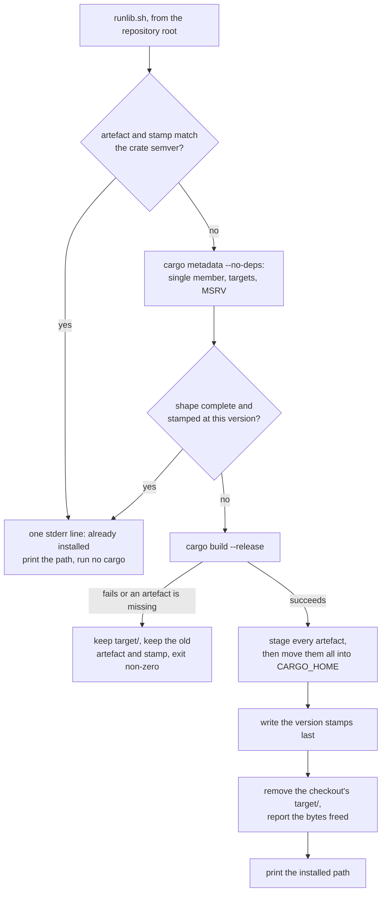

## Summary

Adds `scripts/runlib.sh` — the one canonical build → install → clean helper every
NEAT-AI Rust sibling copies byte-for-byte — merging NEAT-AI-Discovery's
toolchain/MSRV/cdylib install with the sibling binary install into a single
script. It resolves the lone workspace member, installs the crate's bin to
`$CARGO_HOME/bin` and its cdylib to `$CARGO_HOME/lib`, stamps each artefact with
the crate semver, skips the build entirely (no `cargo` invocation) when the stamp
already matches, and removes the checkout's `target/` after a successful install.
The copy contract is documented in README.md and cross-linked from RELEASING.md.
Closes #680.

## Evidence

Backend/CLI change — no web interface to screenshot. The evidence is the test
suite, a mutation check over it, and an end-to-end run against real `cargo`.

**Full gate:** `./quality.sh` → `✅ All quality checks passed!` (shellcheck,
`bash -n`, 649 bats tests, Mermaid, Deno gates, clippy, `cargo test`, doctests,
`cargo deny`, release build).

**End-to-end against real `cargo`** — a throwaway crate with both a `[[bin]]` and
a `cdylib` whose `[lib] name` deliberately differs from the package name:

| Run | stdout | stderr | Result |
|-----|--------|--------|--------|
| 1 (cold) | `…/cargo/bin/runlib_smoke` | `[runlib-smoke] removed …/repo/target (freed 577536 bytes)` | `bin/runlib_smoke`, `lib/librunlib_smoke.so`, both stamps written, `target/` gone |
| 2 (warm) | `…/cargo/bin/runlib_smoke` | `[runlib-smoke] already installed v0.3.1` | no `cargo` run |
| 3 (version bumped) | `…/cargo/bin/runlib_smoke` | rebuild + removal line | stamp refreshed to `0.4.0` |

**Mutation check** — the suite was re-run against four deliberately broken
variants to prove the assertions bite, not merely pass:

| Mutation | Failing tests |
|----------|---------------|
| `target/` never removed | 2 |
| skip path disabled | 5 |
| `already installed` line sent to stdout | 4 |
| stamp written before the build | 3 |
| outside-the-checkout `rm -rf` guard removed | 1 |
| cdylib installed under the cargo target name | 1 |
| shape check reduced to a single stamp | 5 |
| bin copied in place instead of staged | 26 |

## Acceptance Criteria

<!-- vibe-spec-review inputs="diff+issue-body" -->

- **met** — `scripts/runlib.sh` passes shellcheck and `bash -n` under bash 3.2 syntax rules — evidence: `quality.sh` shellcheck/`bash -n` sweep over every `*.sh`; no bash-4 constructs (`declare -A`, `mapfile`, `${v^^}`, `local -n`) present — reviewer: met — reason: the reviewer noted this is verified by inspection rather than against a real 3.2 binary, which is the same standard the rest of the repo's shell gates hold
- **met** — with a matching stamp the script invokes no `cargo` command and prints exactly one `already installed` stderr line — evidence: `tests/scripts/runlib.bats::a matching stamp skips the build without invoking cargo at all` and `::the skip prints exactly one already-installed stderr line` — reviewer: partial — reason: the reviewer proved the fast path bailed out for globbed `members` and for a renamed `[lib] name`; both are fixed in this diff (`_runlib_report_current` now also runs after `cargo metadata`, and installed names come from the crate), covered by `::a globbed workspace member still skips the build once installed` and `::a lib target renamed away from the crate still installs under the crate name`
- **met** — after a successful build `target/` is gone, the artefacts and `.<crate>.version` exist under `~/.cargo/{bin,lib}`, and the removal line names the bytes freed — evidence: `tests/scripts/runlib.bats::a successful install removes target/ and names the path and bytes freed` and `::the bytes freed are a positive count measured before removal` — reviewer: partial — reason: the reviewer proved a shared `CARGO_TARGET_DIR` was deleted wholesale; fixed here — a build directory outside the checkout is kept and reported, covered by `::a target directory outside the checkout is kept, and that is reported`
- **met** — a failing build leaves `target/`, the previously installed artefact and its stamp intact, and exits non-zero — evidence: `tests/scripts/runlib.bats::a failing build exits non-zero, keeps target/ and leaves the old artefact and stamp` — reviewer: partial — reason: the reviewer proved a *post-build* failure (the cdylib never appearing) had already overwritten the installed binary; fixed here by staging every artefact and moving them into place together, covered by `::a missing library after a successful build does not replace the installed binary` and `::a macOS signing failure exits non-zero and leaves the old library installed`
- **met** — stdout is the installed path and nothing else — evidence: `tests/scripts/runlib.bats::stdout carries the installed path and nothing else`; every diagnostic, the `cargo build` stream and the macOS tools all go to stderr — reviewer: met
- **met** — tests and quality checks pass — evidence: `bats tests/scripts/runlib.bats` 38/38; `./quality.sh` green end to end after the final edit — reviewer: met
- **unrequested** — `jq` as a hard dependency (`scripts/runlib.sh`) — reviewer: unrequested — reason: `cargo metadata` emits JSON and the issue mandates parsing it; kept, and now declared in the README prerequisites, which is the gap the reviewer actually identified
- **unrequested** — `PATH` prepend of `$CARGO_HOME/bin` (`scripts/runlib.sh`) — reviewer: unrequested — reason: carried over from both source scripts so a rustup-installed `cargo` is found in a non-login shell; the effect on a sourcing caller is now documented
- **unrequested** — sourceable `runlib_install` plus the `BASH_SOURCE` guard — reviewer: unrequested — reason: both source scripts are sourced by their siblings today, so dropping it would break the copy targets; the README now names the subprocess form as the contract and states the sourcing semantics plainly
- **unrequested** — the manifest reader used by the skip path (`scripts/runlib.sh`) — reviewer: unrequested — reason: the criterion "runs **no** `cargo` command" cannot be met while the crate name and version come from `cargo metadata`; it is an optimisation that declines every shape it cannot read, with `cargo metadata` remaining the authority
- **unrequested** — staged temp-file install, `chmod +x`, the `target/release/deps/` cdylib fallback, the `rm -rf` guards and the `--package`/`--lib`/`--bin` build flags — reviewer: unrequested — reason: each backs a stated criterion (staging backs "a failing build leaves the artefact intact"; the guards back "removes the checkout's `target/`"; the `deps/` fallback is inherited from the Discovery script being merged)
- **unrequested** — the Mermaid diagram and step table in `README.md` — reviewer: unrequested — reason: the copy contract's documentation was requested; the diagram is how this repo documents a flow (AGENTS.md / the visual-documentation standard)

## Standards Review

<!-- vibe-standards-review inputs="diff+CODING-STANDARDS.md" -->

- **violation** — a bin+cdylib crate with its library removed reported "already installed" and exited 0, never reinstalling it — evidence: `scripts/runlib.sh` `_runlib_try_skip` — reason: fixed here — `_runlib_report_current` checks the crate's whole declared shape, and `_runlib_expected_shape` reads `[lib] crate-type` for the cdylib and the auto-discovered `src/main.rs` for the bin
- **violation** — `rm -rf` of cargo's `target_directory` verbatim destroyed a shared `CARGO_TARGET_DIR` — evidence: `scripts/runlib.sh` `_runlib_remove_target` — reason: fixed here — only a directory under the repository root is removed; anything else is kept with a stderr line naming it
- **violation** — undocumented hard dependency on `jq` in a file copied byte-for-byte into every sibling — evidence: `scripts/runlib.sh` `_runlib_require_toolchain` — reason: fixed here — the README prerequisites and the script header now name `jq` alongside `cargo` and `rustup`
- **violation** — `set -euo pipefail` and the `PATH` export leak into the caller on the documented sourcing path — evidence: `scripts/runlib.sh` top-level `set`, `README.md` usage line — reason: stands, documented — both source scripts behave this way and their siblings source them today; the README now names the subprocess form as the contract and states the leak, rather than advertising sourcing as equivalent
- **violation** — the README described resolution as `cargo metadata` while the skip path reads the manifests — evidence: `README.md` Resolve row — reason: fixed here — the Resolve row now describes both paths and which one is authoritative
- **violation** — the copy contract is prose with no gate, and no `AGENTS.md` update — reason: stands — a cross-repo gate is out of scope for this issue (which asks for README/RELEASING documentation) and the fleet repository-isolation rule forbids centralising a per-repo gate from another repository; each sibling's own CI gates its own copy
- **violation** — the macOS `codesign`/`install_name_tool` branch and the sourced entry point ship untested — evidence: `tests/scripts/runlib.bats` — reason: fixed here — a `uname` shim drives the Darwin branch in `::on macOS the library is signed and re-identified before it is installed` and `::a macOS signing failure exits non-zero and leaves the old library installed`; `::sourcing the script and calling runlib_install installs the same artefact` covers the sourced path
- **clean** — Australian English throughout (`artefact`, `behaviour`, `honours`); shellcheck and `bash -n` clean; bash 3.2-safe constructs only, no GNU-only flags (`du -sk` chosen over `du -b` with the reason in-comment); every test runs the real script and asserts on exit status, stdout/stderr, on-disk artefacts and `target/` survival, never on source text; no `eval` and no unquoted expansion into a command, `jq` inputs passed via `--arg`; `RUSTFLAGS` genuinely untouched; only the expected files staged, no secrets or hidden paths

## Test Plan

`tests/scripts/runlib.bats` — 38 tests, run by `./quality.sh` and by the CI
`quality` job's `bats tests/scripts` step. Each drives the real script against a
fixture crate with a `cargo` shim on `PATH` whose invocation log makes "runs no
`cargo` command" an assertion rather than an inference.

- **Install shapes** — bin-only, cdylib-only, both; a dashed crate name; a
  `[lib] name` renamed away from the package name; stdout is one line and is the
  installed path.
- **Skip** — a matching stamp runs no `cargo` and prints exactly one stderr line;
  the same for a cdylib-only crate and for a workspace-inherited version; the
  comparison is the manifest version, not a file mtime.
- **Rebuild triggers** — a version change; a deleted stamp (there is no force
  flag); a missing artefact beside a matching stamp; a bin+cdylib crate with
  either half removed.
- **Failure** — a failing `cargo build` keeps `target/` and the old artefact and
  stamp; a build that produces no artefact fails loud; a cdylib missing after a
  successful build does not replace the installed binary, and leaves no staging
  temporary; a macOS signing failure leaves the old library installed.
- **`target/`** — removed after success with the bytes freed named; a directory
  outside the checkout is kept and reported.
- **Resolution** — a virtual workspace with one member; more than one member and
  zero members both fail loud; a globbed `members` entry still skips the build;
  a crate with neither an eligible bin nor a cdylib fails loud; running outside a
  repository root fails loud.
- **Toolchain** — a missing `cargo` exits non-zero naming rustup.rs and installs
  nothing; a `rustc` below the manifest MSRV fails loud; at or above it builds;
  no `rust-version` skips the check; a non-numeric MSRV component is compared,
  not crashed on.
- **`RUSTFLAGS`** — the caller's value reaches `cargo` unchanged, and an unset
  `RUSTFLAGS` stays unset.
- **macOS** — a `uname` shim drives the Darwin branch: both tools run, against
  the staging temporary rather than the installed path.
- **Sourced entry point** — `. scripts/runlib.sh && runlib_install` installs the
  same artefact and prints the same path.
