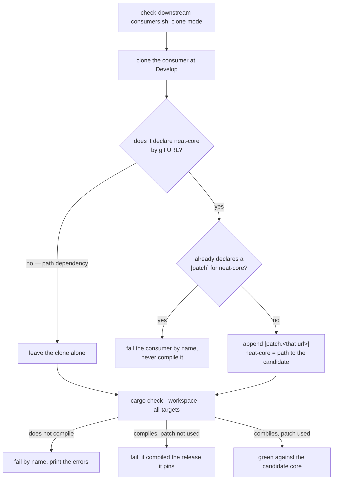

## Summary

Adds `scripts/family-pins.sh` — the canonical helper every NEAT-AI family
repository copies byte-for-byte, alongside `runlib.sh` — and teaches
`scripts/check-downstream-consumers.sh` to compile a git-tag-pinned consumer
against the candidate core through a cargo `[patch]` override.

Run from a consumer checkout, `family-pins.sh` finds every dependency declared
as `{ git = "https://github.com/stSoftwareAU/NEAT-AI-<x>", tag = "v<semver>" }`,
resolves that repository's newest **released** `v<major>.<minor>.<patch>` tag
with `git ls-remote --tags`, rewrites the pin when a newer release exists, runs
`cargo update --package <dep>` so `Cargo.lock` follows, and prints one stderr
line per pin moved. It is idempotent and fails loud — a remote that cannot be
listed, a remote with no released tag, a manifest that does not come back
rewritten, or a failing `cargo update` all exit non-zero rather than leaving a
pin silently stale.

The downstream gate now appends
`[patch."<the git url the consumer declares>"] neat-core = { path = "<candidate>/neat-core" }`
to each cloned consumer's root manifest before `cargo check`, and **fails the
consumer when cargo reports it did not use that patch** — a consumer that
compiled the release it pins must not be reported green for a core nothing
looked at. `--workspace` mode writes nothing into the sibling checkouts you
already have, so the local shape keeps working for consumers still on the path
dependency. Closes #681.

## Evidence

Backend/CLI change — no web interface to screenshot. The evidence is the two
bats suites, the mutation record below, and a real run against the live family
remote.

**Cargo `[patch]` assumption, verified first.** The issue flagged an assumption:
"cargo's `[patch]` accepts a path override for a git-source dependency declared
without a version requirement". Verified on a throwaway fixture before writing
the injection — `cargo check` reported
`Checking neat-core v0.15.9 (/tmp/.../candidate/neat-core)`, the path override,
for a dependency declared with `git`/`tag` and **no** `version`. No
`version = "=<x>"` is needed on the consumer side. Cargo does still *update* the
git repository metadata first, so the pinned tag must exist and the gate runner
needs network — it already clones the consumers over the network.

The same probe exposed the failure mode the gate now catches: when the patched
version does **not** satisfy a `version` requirement the consumer also declares,
cargo prints `warning: patch ... was not used in the crate graph`, compiles the
pinned release and exits 0.

**Real run against the live family remote.** A throwaway consumer pinning
`tag = "v0.15.9"` of the real `NEAT-AI-core`:

| Run | stderr | Result |
|-----|--------|--------|
| 1 | `[family-pins] neat-core v0.15.9 → v0.21.1 (app/Cargo.toml)` + `1 pin(s) moved; Cargo.lock updated` | manifest on `v0.21.1`; `Cargo.lock` source `git+…?tag=v0.21.1#8461eb0` |
| 2 | *(nothing)* | exit 0, no diff, no `cargo` invocation — idempotent |

**Full gate:** `./quality.sh` → `✅ All quality checks passed!` (bash syntax,
shellcheck, 668 bats tests, codespell, Mermaid, Deno gates, clippy, `cargo test`,
doctests, `cargo deny`, release build).

**Mutation evidence** — every assertion below was watched failing against a
deliberately broken script and passing against the shipped one:

| Mutation | Test that went red |
|----------|--------------------|
| `inject_core_patch` never called | `check_downstream_consumers.bats::a consumer pinning neat-core by git tag is compiled against the candidate core` |
| patch-not-used detection removed (pre-fix state) | `check_downstream_consumers.bats::a [patch] cargo ignored fails the gate…` |
| `--core` quote guard deleted | `check_downstream_consumers.bats::a --core path carrying a quote is refused…` |
| release-tag filter widened to `^v[0-9]` | `family_pins.bats::a pre-release tag is never what a pin is moved onto` |
| tag rewrite made a no-op | `family_pins.bats::an outdated inline pin moves to the newest release…` |
| `_fp_version_newer` replaced by a lexical compare | `family_pins.bats::versions are compared numerically, not lexically` (and the pre-release case) |
| equal-triple pre-release rule removed | `family_pins.bats::a pre-release pin moves onto the release of the same version` |
| `_fp_workspace_members` status swallowed again (`return 0`) | `family_pins.bats::a root manifest that cannot be read fails the run…` |

## Acceptance Criteria

<!-- vibe-spec-review inputs="diff+issue-body" -->

- **met** — `family-pins.sh` moves `tag = "v0.15.9"` to the newest `v*` tag of the fixture remote and updates `Cargo.lock`; an already-current pin produces no diff and exit 0 — evidence: `tests/scripts/family_pins.bats::an outdated inline pin moves to the newest release and Cargo.lock follows`, `::an already-current pin produces no diff, no cargo command and exit 0`, `::running it twice is idempotent` — reviewer: met
- **met** — `family-pins.sh` exits non-zero when the remote cannot be listed — evidence: `tests/scripts/family_pins.bats::a remote that cannot be listed fails the run instead of leaving the pin stale` — reviewer: met
- **met** — `check-downstream-consumers.sh` compiles a fixture consumer whose `neat-core` is a git-tag dependency against the local candidate core — evidence: `tests/scripts/check_downstream_consumers.bats::a consumer pinning neat-core by git tag is compiled against the candidate core` (the fixture consumer calls `candidate_only()`, a symbol only the candidate core defines) — reviewer: partial — reason: the reviewer saw the pre-fix diff and found that a `[patch]` cargo ignored still reported green; that hole is now failed loud and gated by `::a [patch] cargo ignored fails the gate rather than passing on the release the consumer pins`
- **met** — tests and quality checks pass (shellcheck, bash 3.2 syntax) — evidence: `./quality.sh` green after the final edit; `shellcheck -s bash` and `bash -n` clean on both scripts — reviewer: met — reason: the reviewer could confirm shellcheck/`bash -n` but noted no bash 3.2 binary exists here, so 3.2 compatibility is inspection-only (the same standard the existing `runlib.sh` gate is held to)
- **unrequested** — `README.md` gains a "Canonical `family-pins.sh`" section, a layout-table row and a flowchart; `AGENTS.md` gains the matching canonical-script entry — reviewer: unrequested — reason: the script's own header points at that section as its contract, and the repo's standing rule is that a code change owes its docs change
- **unrequested** — `--manifest FILE` (repeatable) and `-h/--help` — reviewer: unrequested — reason: `--manifest` is what lets the suite drive one fixture manifest at a time; both are gated
- **unrequested** — workspace-member manifest discovery — reviewer: unrequested — reason: every family consumer is a workspace whose pins live in a member manifest, so scanning only the root manifest would move nothing in practice
- **unrequested** — `[dependencies.<name>]` table-form pins are moved too — reviewer: unrequested — reason: silently skipping a pin shape a consumer legitimately uses is the stale-pin failure this script exists to prevent
- **unrequested** — pre-release tags are excluded and an equal-triple release supersedes a pre-release pin — reviewer: unrequested — reason: the issue's own wording is "the latest release"; pinning a consumer to an `-rc` tag is not that
- **unrequested** — a family pin spread over several lines is refused loudly rather than skipped — reviewer: unrequested — reason: a pin the reader cannot rewrite must not read as "already current"
- **unrequested** — resolved-tag caching, and a closing `N pin(s) moved` stderr line — reviewer: unrequested — reason: one `ls-remote` per remote rather than per pin; the summary line is stderr, so the "nothing on stdout" contract holds
- **unrequested** — the gate fails a consumer whose root manifest already declares a `[patch]` for `neat-core`, rejects a `--core` path containing a quote or backslash, and keys the patch on every core URL the consumer actually declares rather than one literal URL — reviewer: unrequested — reason: each is the fail-loud reading of "append the patch"; a patch that silently does not apply would make the gate green for a core it never compiled

## Standards Review

<!-- vibe-standards-review inputs="diff+CODING-STANDARDS.md" -->

- **violation** — the version comparator had no gate: replacing `_fp_version_newer` with a lexical compare left all 13 tests green — evidence: `scripts/family-pins.sh:190` — reason: fixed here; the fixture gained a remote tagged `v0.9.0`/`v0.10.0` and two tests (`::versions are compared numerically, not lexically`, `::a pre-release pin moves onto the release of the same version`), both mutation-verified
- **violation** — `_fp_workspace_members` ended in an unconditional `return 0`, so a reader whose awk died read as "this workspace has no members" and every member pin stayed stale at exit 0 — evidence: `scripts/family-pins.sh:91` — reason: fixed here; the status is returned and checked explicitly, gated by `::a root manifest that cannot be read fails the run rather than reporting no members`
- **violation** — new fail-loud guards and documented behaviours with no test: the `--core` quote/backslash rejection, a remote with no released tag, a `rev`/`branch` pin left alone, a manifest that cannot be rewritten, `--help` — evidence: `scripts/check-downstream-consumers.sh:167`, `README.md:291` — reason: fixed here; five tests added, `--core` guard mutation-verified
- **violation** — the multi-line-pin exit code was documented three ways (comment said exit 4, the run really exits 1) and the test asserted the loose `-ne 0` — evidence: `scripts/family-pins.sh:99` — reason: fixed here; the comment names the real exit and the test asserts `-eq 1`
- **violation** — the fixture's bare clone discarded its stderr, hiding a broken fixture remote — evidence: `tests/scripts/family_pins.bats:69` — reason: fixed here, `2>/dev/null` removed
- **violation** — `family-pins.sh` carries the same byte-for-byte copy contract as `runlib.sh` but was missing from the AGENTS.md canonical-script list — evidence: `AGENTS.md:194` — reason: fixed here
- **violation** — mutation evidence existed but was never written down — evidence: the squashed first commit — reason: fixed here; the Evidence section above records one row per mutation
- **clean** — Australian English throughout the added lines; `set -euo pipefail` and bash 3.2 compatibility (no `mapfile`, `declare -A`, `${x,,}`; parallel arrays stand in for associative ones; `${arr[@]+"${arr[@]}"}` where an array can be empty; no `sed -i`, `grep -P`, `sort -V` or `readlink -f`); "what" tests only — neither suite greps script source, and the compile oracle is a symbol only the candidate core defines; no secrets or hidden paths staged; registry, `RELEASING.md` and `README.md` cross-links mutually consistent

## Test Plan

- `tests/scripts/family_pins.bats` — 20 new tests driving the real script against a real local bare git remote (reached through a `url.<base>.insteadOf` rewrite, so tag resolution is genuine `git ls-remote` output) with a recording `cargo` shim: the move, `Cargo.lock` following, idempotence, pre-release exclusion, numeric version ordering, workspace members, the table form, commented-out and non-family declarations, `rev`/`branch` pins, a multi-line pin, an unlistable remote, a remote with no released tag, an unreadable root manifest, an unwritable manifest, a failing `cargo update`, `--manifest`, `--help` and an unknown argument.
- `tests/scripts/check_downstream_consumers.bats` — 5 new tests: a real `cargo check` of a cloned fixture consumer pinned by git tag against the candidate core, a `[patch]` cargo ignored failing the gate, a consumer that already patches `neat-core` failing without being compiled, `--workspace` mode leaving the developer's checkout byte-for-byte alone, and the `--core` quote guard. The 12 existing tests are unchanged and still pass.
- `./quality.sh` — full gate green.
