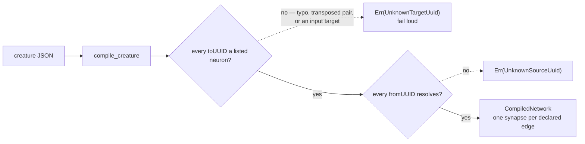

## Summary

`compile_creature` resolved a synapse's **source** through the UUID map and
refused an unresolvable one with `CreatureError::UnknownSourceUuid`. Its
**destination** had no check at all: synapses are grouped by `toUUID` and read
back *per listed neuron*, so a `toUUID` naming no entry in `creature.neurons`
was never looked up — the edge was **silently dropped** and `compile_creature`
returned `Ok` with a network one synapse smaller than the creature declared.
That is a fail-silent path in the one function that turns a creature into the
network the fleet scores: the two disagreed and nothing said so.

The destination now earns the mirror refusal,
`CreatureError::UnknownTargetUuid(String)`, raised over the whole synapse list
before the neuron walk — so it names the first offending row in **declaration
order** rather than whichever a hash map yielded, and it is what speaks when both
endpoints of a row dangle. Three shapes of edge are covered: a typo, a
transposed `fromUUID`/`toUUID` pair, and an edge pointing at an **input** neuron
(`input-N` resolves as a *source* but is never a listed neuron, so it can never
be a destination). Closes #682.

**Breaking**, on the two counts the issue names, so it ships as `0.19.0` with the
`BREAKING CHANGE:` footer, the minor bump and a `0.19.0` entry in
`RELEASING.md`'s breaking-change log:
`CreatureError` is not `#[non_exhaustive]` (a downstream exhaustive `match`
stops compiling), and input that used to be accepted is now refused. Nothing on
the JSON wire changed, and a creature whose every `toUUID` names a listed neuron
— every creature this crate and NEAT-AI emit — compiles exactly as before.

## Evidence

Backend library change: no web interface to screenshot. The evidence is the
tests below, the full `./quality.sh` run, and the `downstream-consumers` gate.

- **Quality gate** — `./quality.sh` passed end to end (bats, markdownlint,
  Mermaid, deno gates, codespell, `cargo deny`, `cargo fmt`, clippy under
  `-D warnings`, `cargo test --workspace`, doctests, `cargo doc`, release build).
  `cargo fmt` / `cargo clippy` needed `RUSTUP_TOOLCHAIN=stable` in this container
  — without it the rustup shims exit with "could not choose a version of
  cargo-fmt to run", a pre-existing environment quirk unrelated to this change.
- **Downstream consumers** — `scripts/check-downstream-consumers.sh` (clone
  mode): all **6** registered consumers compile against this core. Because the
  behavioural half of the break cannot be proven by `cargo check`, the four
  consumers that build creatures also had their own suites run against this core:
  Ockham, Forests and Rebase are fully green; Lamarck fails only
  `readme_contract::readme_mentions_no_unknown_lamarck_flags`
  ("README.md documents flags the binary does not accept: [\"--bin\"]"), which is
  its own README drift and untouched by this change.
- **Version policy** — `scripts/detect-breaking.sh` reads the footer as `true`,
  and `scripts/check-version-bump.sh 0.18.0 0.19.0 true` passes.

## Reproduction

- **symptom** — a two-synapse creature whose second edge names a destination the
  creature does not carry compiled to **one** synapse with no error:
  `compile_creature` returned `Ok`, both for a transposed pair targeting
  `input-0` and for a typo (`nope`)
- **status** — `verified` — run against the unfixed code, both cases printed
  `Ok(1)` where two edges were declared and the count assertion failed; after the
  fix each is refused with `UnknownTargetUuid` and the well-formed creature still
  compiles both edges
- **regression test** —
  `neat-core/tests/creature_compile_target_uuid.rs::a_destination_naming_no_listed_neuron_is_refused`
  and `::a_destination_that_is_an_input_neuron_is_refused`

## Test Plan

New file `neat-core/tests/creature_compile_target_uuid.rs` — six behaviour tests
over the public API, all asserting on returned values and typed errors:

- `a_well_formed_creature_compiles_every_edge_it_declares` — the oracle against
  over-refusal: `synapses().len() == 2`, one compiled synapse per declared edge,
  which is the count the silent drop lowered.
- `a_destination_naming_no_listed_neuron_is_refused` — the typo case, naming
  `nope`.
- `a_destination_that_is_an_input_neuron_is_refused` — the transposed pair from
  the issue, naming `input-0`.
- `the_refusal_names_the_first_unresolvable_destination_in_declaration_order` —
  two bad destinations answer with the earlier row, not a hash-map order.
- `an_unresolvable_destination_is_refused_before_an_unresolvable_source` — the
  check order when both endpoints of a row dangle.
- `the_refusal_reads_as_a_std_error_naming_the_uuid` — `Display` text and no
  `source()` chain, matching how `UnknownSourceUuid` behaves.

No existing test was modified, removed or commented out; `cargo test --workspace`
is green (all suites, plus doctests).

## Documentation

- `README.md` — new section "Both endpoints of a synapse must resolve
  (Issue #682)" with the refusal order as a Mermaid flowchart.
- `RELEASING.md` — `0.19.0` breaking-change log entry with the two counts and the
  `match`-arm migration.
- `neat-core/src/creature.rs` — the `compile_creature` doc comment now states
  that both endpoints must resolve, and the new variant carries its own doc.
