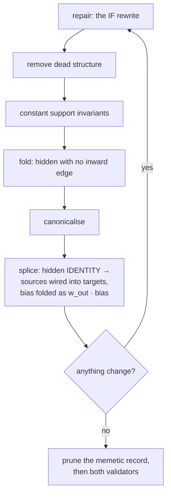

# Pruning splices out the `IDENTITY` pass-throughs it leaves behind (Issue #688)

## Summary

An `IDENTITY` hidden neuron forwards `bias + Σ w·a` and nothing else, so it can
be removed **exactly**: each `(source → target)` pair it sat between becomes the
one edge `w_in · w_out`, keeping the target-side role it replaces, and the
constant it contributed is folded into each summing target's bias as
`w_out · bias`. Nothing in `neat-core` did that, so the `IF` rewrite
(`flatten_static_if` under `IfRepair::Rewrite`) and the single-edge aggregate
conversion (Ockham #197) both left a pass-through behind that `Score.ts` charges
a whole hidden neuron for — ten times what it charges a synapse.

Cleanup now splices it out, inside its own fixed point, as a whole-creature
sweep, so a chain of relays — and an `IF` a splice has just made statically
decidable — collapse in the same call. `CleanupOptions::splice_identity`
switches it on; it is **off by default**, so `cleanup_creature`'s parity answer
and the `prune_fixtures` captures are byte for byte what they were, and **both**
pruning entry points switch it on alongside `IfRepair::Rewrite`. Every spliced
neuron is named on `CleanupOutcome::spliced_neurons` /
`PruneResult::spliced_neurons`, and `splicedNeurons` on the wire.

Closes #688.

## What changed

- **`prune_cleanup.rs`** — `CleanupOptions::splice_identity`,
  `CleanupOutcome::spliced_neurons`, the `MAX_NET_NEW_SYNAPSES_PER_SPLICE` (`9`)
  constant citing the `Score.ts` 10:1 ratio, and the step itself:
  `splice_identity_neurons` sweeps the creature in neuron order, `plan_splice`
  works out the whole rewire before any of it is applied, and `apply_splice`
  commits a plan already proved exact. Every refusal is found during planning,
  so a creature is never left half-rewired.
- **`prune_neuron.rs` / `prune_synapse.rs`** — both set `splice_identity: true`
  and carry `spliced_neurons` onto `PruneResult`. `transform_class` is
  untouched: the splice is exact, so it cannot move the label.
- **`prune_json.rs`** — `splicedNeurons`, skipped when empty like every other
  report list; the golden record was regenerated.
- **`README.md`** — the cleanup diagram gains the splice step, the
  every-rewrite-is-exact table gains its row, and a new section states the rule
  and the full refusal table.
- **`RELEASING.md`** — the `0.22.0` breaking-change log entry (see *Breaking
  change* below).

### Where the splice runs

The splice runs **last** in the pass, so it reads canonical edges — one row per
readable key, roles stripped where the target cannot tell them apart — and a
splice that fires re-enters the loop, where the `IF` rewrite gets its chance at
a condition the splice has just decided.

### When the neuron is kept instead

| Refusal | Why |
|---|---|
| a recurrent creature (`forwardOnly: false`) | a back edge is read one tick late, and the rewire would deliver the value in the same tick — a different function of the record stream |
| a relay on both ends of one edge | the rewire would name the neuron it has just removed |
| a target that does not sum its inward terms, unless the relay has exactly one inward edge and bias `0` | `MINIMUM`/`MAXIMUM`/`MEAN`/`HYPOT`/`HYPOTv2` reduce their whole inward range, so two terms — or one term plus a bias — cannot become one |
| an `IF` target and a bias, with no support constant to carry it | an `IF` adds its bias to **whichever** branch runs, so the relay's constant rides a **role-scoped** edge from a bias-`1` constant; with none present, minting a node to retire one is no gain |
| a collision `merge_weights` refuses | a `MEAN` reads its inward count and a `HYPOT` squares each term |
| a value the forward pass cannot carry | the compiled network computes in `f32`, so a product past that range reaches it as an infinity however finite the `f64` export looked |
| more than `MAX_NET_NEW_SYNAPSES_PER_SPLICE` (`9`) net new synapses | past nine the score's 10:1 ratio stops paying |

"Does this target sum its terms" is asked through the existing `merge_rule`
helper (`sums_inward_terms`), not a second exhaustive `match` over `SquashType`
— the Issue #673 constraint the issue named.

## Breaking change

Signalled with a `BREAKING CHANGE:` footer, so CI takes the minor bump, and
recorded in `RELEASING.md`'s breaking-change log as `0.22.0` — the same shape
`0.16.0` (Ockham #197) and `0.17.0` (Ockham #198) took for the same reason.
`prune_neuron` / `prune_synapse` return a different creature for the same
request (the same *function*, on every record), and four public structs gain a
field. `scripts/check-downstream-consumers.sh` was run locally: **all six**
registered consumers compile unchanged.

## Evidence

Backend-only; there is no web interface to screenshot. The evidence is the test
suite and the gates:

- `cargo test --workspace` — 78 test binaries, 0 failures.
- `./quality.sh` — passes (fmt, clippy `-D warnings`, workspace tests, doctests,
  `deno check`/`lint`/`fmt`, 643 bats cases, mermaid, docs, release build).
- `scripts/check-downstream-consumers.sh` — all six consumers green.
- `scripts/detect-breaking.sh origin/Develop..HEAD` → `true`.

The oracle throughout is the function itself: each creature is compiled and
activated on the same probe records before and after, within
`1e-6 · (1 + |expected|)` — the tolerance the existing prune tests use. A
refusal is asserted the other way round: the neuron is still there, named, and
the neuron and synapse counts have not moved.

## Reproduction

- **symptom** — an `IF` the prune rewrote to `IDENTITY` (the production sampler
  fixture's `forest-…-if1` case) was kept as a pass-through, so the creature
  carried a hidden neuron the score charges `growthCost` for and nothing else
  read.
- **status** — `verified` — `neat-core/tests/prune_splice.rs` was written first
  and run red against the unfixed crate (it did not compile: no
  `splice_identity`, no `spliced_neurons`), and the two defects independent
  review found were each reproduced red before being fixed —
  `a_relay_behind_a_back_edge_is_never_spliced` reported `["h-id"]`, and
  `a_relay_that_feeds_itself_is_never_spliced` reported
  `UnknownEndpoint { uuid: "h-1" }`.
- **regression test** —
  `neat-core/tests/prune_splice.rs::a_splice_that_decides_a_condition_flattens_that_if_in_the_same_call`
  for the reported symptom;
  `neat-core/tests/prune_splice.rs::pruning_a_recurrent_creature_still_answers_a_creature`
  for the review-found regression.

## Acceptance Criteria

<!-- vibe-spec-review inputs="diff+issue-body" -->

- **met** — a new `CleanupOptions` field switches the splice on, off by default, set by both prune entry points — evidence: `neat-core/src/prune_cleanup.rs` (`splice_identity`), `neat-core/tests/prune_splice.rs::the_parity_default_splices_nothing` and `::the_parity_default_leaves_every_typescript_capture_untouched` — reviewer: met
- **met** — splice step in cleanup's fixed point, whole-creature sweep, `w_in · w_out` edges keeping the target-side role — evidence: `neat-core/src/prune_cleanup.rs::splice_identity_neurons` / `plan_splice`, `neat-core/tests/prune_splice.rs::a_chain_of_identity_relays_collapses_in_one_call` and `::a_rewired_edge_keeps_the_if_role_it_replaces` — reviewer: met
- **met** — the relay's bias folded into each target as `w_out · bias` — evidence: `neat-core/tests/prune_splice.rs::a_relay_bias_is_folded_into_every_summing_target` and `::a_biased_relay_into_an_if_role_rides_a_support_constant` — reviewer: partial — reason: the reviewer saw the earlier commit, which refused any bias into an `IF`; it now splices, riding a role-scoped support constant, because an `IF` adds its bias to whichever branch runs (`network.rs`) and a plain fold would leak into the other branch. Two tests were added for that rule, and the one residual refusal (no constant to carry it) is documented in the refusal table
- **met** — aggregate qualification: one inward edge and bias `0`, decided through the existing `is_aggregate`/merge helpers (Issue #673) — evidence: `neat-core/src/prune_cleanup.rs::sums_inward_terms`, `neat-core/tests/prune_splice.rs::one_unbiased_edge_into_an_aggregate_target_is_spliced`, `::two_edges_into_an_aggregate_target_keep_their_relay`, `::a_biased_relay_into_an_aggregate_target_is_kept` — reviewer: met
- **met** — collisions merge where the target sums and refuse where `merge_weights` would be inexact — evidence: `neat-core/tests/prune_splice.rs::a_rewired_edge_that_collides_at_a_summing_target_merges_by_sum` and `::a_rewired_edge_that_would_merge_inexactly_keeps_its_relay` (`MEAN`, `HYPOT`, `HYPOTv2`) — reviewer: met — reason: the reviewer noted only `MEAN` was covered; `HYPOT`/`HYPOTv2` were added
- **met** — synapse-growth rule, `≤ 9` net new, as a named constant citing `Score.ts` — evidence: `MAX_NET_NEW_SYNAPSES_PER_SPLICE` in `neat-core/src/prune_cleanup.rs`, `neat-core/tests/prune_splice.rs::a_splice_that_adds_nine_net_synapses_is_made` and `::a_splice_that_would_add_ten_net_synapses_is_refused` — reviewer: met
- **met** — magnitude rule is count-only: finite accepted, non-finite refused, no `growthCost` and no comparison against the creature's largest weight — evidence: `neat-core/src/prune_cleanup.rs::representable`, `neat-core/tests/prune_splice.rs::a_large_but_finite_rewired_weight_is_spliced` and `::a_rewired_weight_that_overflows_keeps_its_relay` — reviewer: met — reason: the reviewer flagged that the `f64` check let a product past `f32` range through to the forward pass as an infinity; the check now asks finiteness in `f32`, which is still count-only
- **met** — recursion until a pass changes nothing — evidence: `neat-core/src/prune_cleanup.rs` fixed-point loop, `neat-core/tests/prune_splice.rs::a_splice_that_decides_a_condition_flattens_that_if_in_the_same_call` — reviewer: met
- **met** — applies to both entry points; the result stays `TransformClass::Exact` when the rest of the prune was exact — evidence: `neat-core/tests/prune_splice.rs::both_pruning_entry_points_splice_and_report_it` and `::a_splice_leaves_an_otherwise_exact_prune_exact` — reviewer: partial — reason: the reviewer proved `Exact` does not hold across a back edge in a recurrent creature; the splice is now refused outright for `forwardOnly: false`, which is the issue's own stated assumption, and `::a_relay_behind_a_back_edge_is_never_spliced` pins it
- **met** — reporting as `spliced_neurons` / `splicedNeurons`, separate from the cascade lists, omitted when empty — evidence: `neat-core/src/prune_json.rs`, `neat-core/tests/prune_json.rs::corner_case_8_an_aggregate_left_with_one_edge_becomes_identity` — reviewer: met
- **met** — the golden record gains `splicedNeurons` on a case that splices, and the WASM bundle answers the same bytes — evidence: `neat-core/tests/golden/prune_wasm_parity.json` (three cases), `neat-core/tests/prune_json.rs` required-payload list, `tests/wasm_prune_parity_test.ts` — reviewer: met — reason: the reviewer could not run the bundle leg; `scripts/check_wasm_prune_parity.ts` compares key sets generically and runs in the `wasm-bundle` workflow
- **met** — the TDD corner-case list, each asserting activations within `1e-6 · (1 + |expected|)` and the expected neuron and synapse counts — evidence: `neat-core/tests/prune_splice.rs` (24 cases) — reviewer: partial — reason: the reviewer found two tests without a functional-equivalence assertion and several asserting weights rather than counts; both were added
- **unrequested** — the splice is refused outright in a recurrent creature, and for a relay that feeds itself — reviewer: unrequested — reason: not in the issue's rule set, but its own Assumptions say "creatures are `forwardOnly`"; without the gate a recurrent prune silently lost a tick of delay, or failed with `UnknownEndpoint`
- **unrequested** — the merged weight is checked for representability as well as the product and the bias — reviewer: unrequested — reason: the issue names "a non-finite product or bias"; a merged sum is the third value the splice writes, and leaving it unchecked would put an infinity in the creature
- **unrequested** — the edges a splice consumed are not listed on `removed_synapses` / `cascadeSynapses` — reviewer: unrequested — reason: they are replaced, not removed, and listing removals without the matching additions would be half a story; stated in the doc comment and the README so a caller reconciling by edge lists is not surprised
- **unrequested** — `RELEASING.md` gains short `0.20.0` and `0.21.0` entries alongside the `0.22.0` one — reviewer: unrequested — reason: `tests/scripts/releasing_breaking_change_log.bats` requires the log to have no gap between its oldest and newest entry, and those two minors were never recorded; each says factually what the release covered and that it carried no break, rather than inventing one
- **unrequested** — `wasm-bench/Cargo.lock` picks up the `0.21.0 → 0.21.1` workspace version already on `Develop` — reviewer: unrequested — reason: regenerated by building the repo; committing it keeps the working tree clean rather than leaving permanent local drift

## Standards Review

<!-- vibe-standards-review inputs="diff+CODING-STANDARDS.md" -->

- **violation** — a public struct-literal break and a documented-behaviour change shipped as one PR without a breaking signal — evidence: `neat-core/src/prune_cleanup.rs` (`CleanupOptions::splice_identity`), `neat-core/src/prune_neuron.rs` (`splice_identity: true`) — reason: fixed here. The final commit carries a `feat(prune)!:` subject and a `BREAKING CHANGE:` footer (`scripts/detect-breaking.sh` → `true`), so CI takes the minor bump, and `RELEASING.md` gains the `0.22.0` entry. The three-phase flow does **not** apply: nothing is removed, renamed or narrowed, and `scripts/check-downstream-consumers.sh` shows all six registered consumers compiling unchanged — the same shape `0.16.0`/`0.17.0` took for the same kind of prune-behaviour change
- **violation** — a vacuous `assert!(…is_finite())` oracle, the shape AGENTS.md names as having shipped here before — evidence: `neat-core/tests/prune_splice.rs` (`a_large_but_finite_rewired_weight_is_spliced`) — reason: fixed here; it asserts the derived `1e30 · 1e8 == 1e38` and the neuron and synapse counts
- **violation** — an existing test weakened: `twelve_identity_neurons_prune_one_by_one_without_moving_the_mean_output` skipped eleven of its twelve steps — evidence: `neat-core/tests/prune_neuron.rs` — reason: fixed here; the mean-output oracle and `assert_valid` now run at **all twelve** steps, whether the step pruned or the relay had already been spliced
- **violation** — a fixture deleted and a case re-pointed, losing the single-inward-edge half of the aggregate-fold refusal — evidence: `neat-core/tests/prune_synapse.rs` (`an_aggregate_target_with_an_edge_left_is_never_given_a_bias_fold`) — reason: fixed here; the test now drives both shapes, the single-edge one through the existing `aggregate_json` helper rather than a re-added duplicate fixture. The deleted `AGGREGATE_TARGET_JSON` stays deleted: with one edge left the target is no longer an aggregate at all (Ockham #197 converts it), so the fixture could not exercise its own documented premise
- **violation** — `cargo fmt` drift in the new test file — evidence: `neat-core/tests/prune_splice.rs` — reason: fixed; `./quality.sh` (which runs `cargo fmt --all`) passes on the final tree and every commit was made after it
- **clean** — Australian English throughout (`canonicalise`, `normalise`, `behaviour`); DRY honoured — `sums_inward_terms` is built on the existing `merge_rule` rather than a second `SquashType` match (Issue #673), and the splice reuses `merge_weights`, `canonical_role`, `role_of`, `squash_map`, `kind_of`, `is_support_constant`; `missing_docs` satisfied on every new public item with a `# Errors` section on the fallible one; no `unsafe`, no SIMD, no `CompiledNetwork` field touched; fail-closed design — the plan is built in full and every refusal found before `apply_splice` mutates anything; `prune_splice.rs` is a "what" suite — behaviour-named tests, functional-equivalence oracles, boundaries asserted on both sides, refusals asserted positively; `splicedNeurons` registered in both the Rust and the TypeScript required-payload lists so the wasm bundle cannot silently stop grading it

## Test Plan

- **`neat-core/tests/prune_splice.rs`** (new, 24 cases) — the chain collapse; a
  splice that decides a downstream `IF`; bias folded into a summing target; bias
  ridden into an `IF` role on a support constant, and kept when there is none;
  collision merged at a summing target and refused into `MEAN`/`HYPOT`/`HYPOTv2`;
  one-edge bias-`0` into an aggregate spliced, two edges or a bias kept; the `IF`
  role kept on the rewired edge; the growth boundary at `+9` and `+10`; a
  constant source obeying the constant rules; the magnitude boundary on both
  sides; observation, output and constant neurons never spliced; a back edge and
  a self-feeding relay never spliced, and a recurrent prune still answering a
  creature; the parity default splicing nothing, on a spliceable creature and on
  every `PRUNE_PARITY_CASES` capture; both entry points reporting; an otherwise
  exact prune staying `Exact`.
- **`neat-core/tests/prune_neuron.rs` / `prune_synapse.rs`** — eleven existing
  cases updated in place, each with a comment naming the change, because the
  structure they asserted is what the splice now retires. No test was removed or
  commented out, and the aggregate-fold refusal regained the shape its deleted
  fixture used to cover.
- **`neat-core/tests/prune_json.rs`** — `splicedNeurons` added to the
  required-payload list; `corner_case_8` asserts the splice on the wire; the
  golden record regenerated with `UPDATE_PRUNE_GOLDEN=1`.
- **`tests/wasm_prune_parity_test.ts`** — `splicedNeurons` added to the payloads
  the golden record must carry, so the wasm bundle is graded on it.
