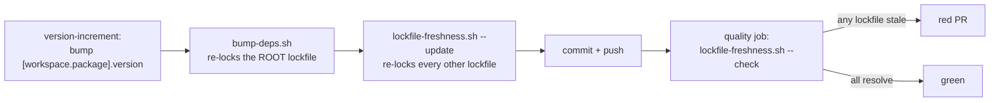

# Lockfile freshness: gate it, and re-lock the siblings the version bump stales

## Summary

The CI `version-increment` job rewrites `[workspace.package].version` and
`bump-deps.sh` re-locks the **root** lockfile only. Every lockfile outside that
workspace — `wasm-bench/Cargo.lock` today — records the same version for the
`neat-core` path dependency it resolves, so each merge left it naming a
superseded version and any `--locked` read of its manifest failed. The
staleness grew by one bump per merge.

This adds `scripts/lockfile-freshness.sh`, which sweeps every `Cargo.lock` in
the tree (`find . -name Cargo.lock`, never a hardcoded list) and either checks
or repairs it:

- `--check` fails while a lockfile no longer resolves against the manifest
  beside it. Wired into `quality.sh` and the CI `quality` job.
- `--update` re-locks them with `cargo update --workspace`, which re-resolves
  the local path packages and leaves remote versions alone — so the release-age
  quarantine (Issue #76) that chose them survives the re-lock. Wired into
  `version-increment`, after the bump and before the commit.

`wasm-bench/Cargo.lock` already names the current `0.22.0` on `Develop`, so no
lockfile edit was needed here; the new gate is what keeps it that way.

Closes #695.

## Evidence

This is a CI/CLI change with no web interface to screenshot. The evidence is
the reproduction below, the twelve bats cases, and the mutation runs recorded
in the Test Plan.



Before the fix, with the bump simulated on a clean tree:

```text
$ sed -i 's/^version = "0.22.0"/version = "0.23.0"/' Cargo.toml
$ cargo update --workspace                 # what bump-deps.sh re-locks
$ cargo metadata --format-version 1 --locked --manifest-path wasm-bench/Cargo.toml
error: cannot update the lock file .../wasm-bench/Cargo.lock because --locked
       was passed to prevent this
exit=101
```

After `scripts/lockfile-freshness.sh --update`, the same `--locked` read exits
`0`, and the only change to `wasm-bench/Cargo.lock` is the one line naming
`neat-core` — no remote version moved.

## Reproduction

- **symptom** — a version bump leaves `wasm-bench/Cargo.lock` naming a
  superseded `neat-core`, so `cargo metadata --locked --manifest-path
  wasm-bench/Cargo.toml` fails (exit 101)
- **status** — `verified` — the fault was reproduced on the working tree by
  simulating the bump (transcript above, exit 101), and the regression test was
  watched failing before `scripts/lockfile-freshness.sh` existed and passing
  after
- **regression test** —
  `tests/scripts/lockfile_freshness.bats::a bump that stales a sibling lockfile is reported, naming the lockfile`

## Acceptance Criteria

<!-- vibe-spec-review inputs="diff+issue-body" -->

The issue states no `## Acceptance Criteria` heading; its three "What a fix
looks like" items are treated as the criteria.

- **met** — re-lock `wasm-bench/Cargo.lock` to the current workspace version —
  evidence: `wasm-bench/Cargo.lock:31` records `0.22.0`, matching
  `Cargo.toml` `[workspace.package].version`, and
  `tests/scripts/lockfile_freshness.bats::the committed tree passes the freshness check`
  asserts it under `--locked` — reviewer: met — reason: the base branch was
  already fresh, so the criterion needed no diff hunk; the new gate is what
  holds it
- **met** — `version-increment` re-locks the siblings, after the bump and
  before the commit, using `cargo update --workspace` — evidence:
  `.github/workflows/ci.yml` (the `--update` call sits between `bump-deps.sh`
  and the commit step) and
  `tests/scripts/lockfile_freshness.bats::version-increment re-locks the siblings after the bump, before the commit`
  — reviewer: met
- **met** — gate it as a `find`-based sweep asserting every committed lockfile
  resolves with `--locked` — evidence: `scripts/lockfile-freshness.sh` (the
  `find . -name Cargo.lock` sweep plus `cargo metadata --locked` per lockfile),
  wired in `quality.sh` and the CI `quality` job, covered by
  `tests/scripts/lockfile_freshness.bats::a lockfile added later is swept without being wired in by hand`
  — reviewer: met
- **unrequested** — `quality.sh` runs the check as well as the CI job —
  reviewer: unrequested — reason: the repo mirrors every CI gate locally
  (`cargo deny` for both manifests already is), so a contributor sees the
  failure before the PR does
- **unrequested** — `--root <dir>`, plus fail-loud on an empty sweep and on a
  lockfile with no manifest beside it — reviewer: unrequested — reason:
  `--root` is what makes the bats fixtures hermetic, and a sweep that matched
  nothing must not report a pass
- **unrequested** — README, SECURITY.md and AGENTS.md entries for the new
  script — reviewer: unrequested — reason: a code change owes a docs change;
  SECURITY.md's supply-chain section otherwise implies lockfiles need
  per-lockfile wiring
- **unrequested** — a stub helper in
  `tests/scripts/ci_detect_breaking_exit_status.bats` — reviewer: unrequested —
  reason: that suite executes the real `version-increment` step body, which now
  shells out to the new script; without the stub it fails

## Standards Review

<!-- vibe-standards-review inputs="diff+CODING-STANDARDS.md" -->

`AGENTS.md` is this repository's standards document (there is no
`CODING-STANDARDS.md`); the reviewer was given the diff and that file.

- **violation** — the suite forced `CARGO_NET_OFFLINE=true`, which the two
  tests that read the real tree cannot satisfy on a cold registry — evidence:
  `tests/scripts/lockfile_freshness.bats:19` — reason: fixed here; the
  `scripts-and-spelling` job runs `bats tests/scripts` with no `rust-cache`, so
  those two would have gone red in CI. The path-only fixtures still pass
  `--offline` explicitly
- **violation** — a missing `cargo` skipped all eleven tests, reporting the
  gate's own suite green with zero coverage — evidence:
  `tests/scripts/lockfile_freshness.bats:22` — reason: fixed here; `setup` now
  fails loud, which is what Issue #631 requires of this suite
- **violation** — the `quality.sh` wiring assertion was a vacuous oracle (the
  `--check` group was optional, so it reduced to "the filename appears") —
  evidence: `tests/scripts/lockfile_freshness.bats:157` — reason: fixed here;
  every invocation must now carry `--check`, and the mutation run below
  confirms it fails without one
- **violation** — the CI re-lock reaches `cargo update` through a script, out
  of reach of the `ci_workflow_quarantine.bats` ban, with nothing pinning it to
  `--workspace` — evidence: `scripts/lockfile-freshness.sh:110` — reason: fixed
  here by a new test, "the re-lock never runs an unscoped cargo update",
  alongside the behavioural oracle that a fresh tree is byte-identical after
  `--update`
- **violation** — AGENTS.md was not updated, though README and SECURITY.md
  were, and both previous canonical-script additions added a layout bullet —
  evidence: `AGENTS.md:195` — reason: fixed here; a layout bullet and the
  PR-pipeline step were added
- **violation** — the byte-identical test copied whole directories, dragging in
  any local `wasm-bench/target` output — evidence:
  `tests/scripts/lockfile_freshness.bats:140` — reason: fixed here; it copies
  tracked files only
- **clean** — `set -euo pipefail`, bash 3.2 safety (no `mapfile`, empty-array
  expansion guarded), shellcheck and `bash -n` clean, fail-loud on every error
  path with the remedy named, Australian English, "what not how" behavioural
  tests that drive real cargo trees, and the `quality` job ordering
  (`needs: [version-increment, …]` plus `git pull`) that makes the check read
  the re-locked commit

## Test Plan

New: `tests/scripts/lockfile_freshness.bats` (12 cases) — real two-crate trees
whose path dependency's version is moved exactly as the bump moves it, with
cargo's own verdict as the oracle:

- the committed tree passes the check; a bump that stales a sibling is reported
  by name; `--update` repairs it and the check then passes
- a lockfile added later is swept without being wired in by hand, and every
  stale lockfile is reported rather than just the first
- a lockfile with no manifest, a tree with no lockfile at all, and an unknown
  argument each fail loud
- `--update` leaves an already-fresh tree byte-identical (the quarantine
  oracle), and never runs an unscoped `cargo update`
- `quality.sh`, the CI `quality` job and the `version-increment` ordering are
  each asserted against the committed files

Changed: `tests/scripts/ci_detect_breaking_exit_status.bats` — stubs the new
helper in the throwaway repo it executes the real step body inside. No test was
removed or weakened.

Mutation evidence (each mutation applied, suite run, mutation reverted):

| Mutation | Red |
| --- | --- |
| drop `--locked` from the check | stale-sibling and later-lockfile cases |
| hardcode the root lockfile instead of sweeping | four cases |
| let an empty sweep exit 0 | no-lockfile case |
| bare `cargo update` (quarantine bypass) | byte-identical and unscoped-update cases |
| drop `--check` from the `quality.sh` call | quality.sh wiring case |

Gates: `./quality.sh` passed end to end on the first commit, `bats tests/scripts`
(679 cases) is green, `codespell`, `markdownlint-cli2` and `actionlint` clean.
