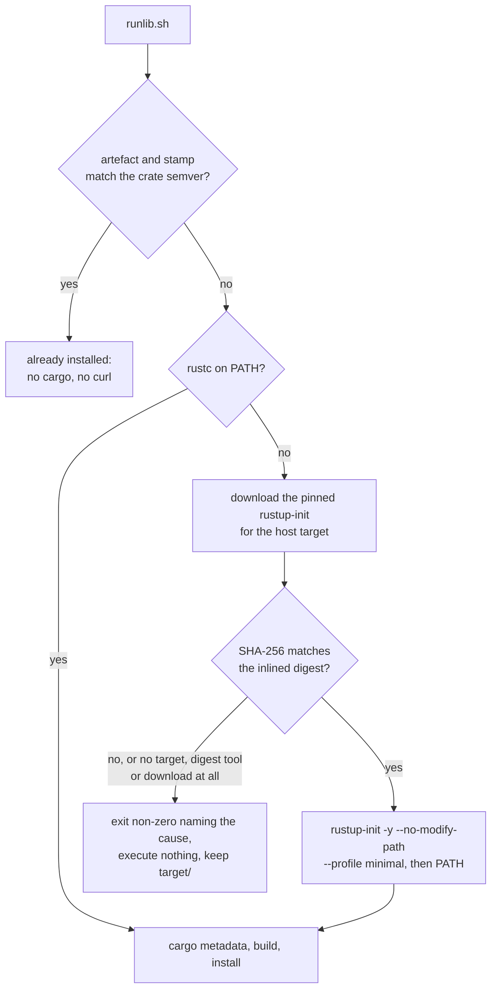

## Summary

`scripts/runlib.sh` — the canonical build → install → clean helper every NEAT-AI
Rust sibling copies byte-for-byte — no longer treats the Rust toolchain as a
precondition it can only complain about. With no `rustc` on `PATH` it now
bootstraps rustup itself, from the pinned `rustup-init` for the detected host
target, and executes that download **only** once its SHA-256 matches the digest
inlined in the script. It is never `curl https://sh.rustup.rs | sh`: that runs
whatever the distribution point served, and what it installs then compiles every
`build.rs` in the dependency graph.

Everything fails closed. An unknown OS/arch, no pinned digest for the target, no
`sha256sum`/`shasum`, a failed download, or a digest mismatch each exit non-zero
with one stderr line naming the cause — the mismatch line naming the URL and both
digests — having executed nothing and left `target/` in place. With `rustc`
already present nothing is downloaded at all, `rustup` is still never invoked, no
shell rc file is edited (the new toolchain reaches the run through `PATH` alone),
and `jq` stays a plain precondition. Closes #699.

## Evidence

Backend/CLI change — there is no web interface to screenshot. The evidence is the
bats suite (which drives the real script with shims, never the network), the
digest check against the published values, and the full gate.

**The six inlined digests equal the published values.** Each was fetched from
`https://static.rust-lang.org/rustup/archive/1.29.0/<target>/rustup-init.sha256`
and compared with `_runlib_pinned_rustup_digest <target>` from the committed
script:

| Target | Published `.sha256` = inlined digest |
|--------|--------------------------------------|
| `x86_64-unknown-linux-gnu` | `4acc9acc76d5079515b46346a485974457b5a79893cfb01112423c89aeb5aa10` ✓ |
| `aarch64-unknown-linux-gnu` | `9732d6c5e2a098d3521fca8145d826ae0aaa067ef2385ead08e6feac88fa5792` ✓ |
| `x86_64-unknown-linux-musl` | `9cd3fda5fd293890e36ab271af6a786ee22084b5f6c2b83fd8323cec6f0992c1` ✓ |
| `aarch64-unknown-linux-musl` | `88761caacddb92cd79b0b1f939f3990ba1997d701a38b3e8dd6746a562f2a759` ✓ |
| `x86_64-apple-darwin` | `33cf85df9142bc6d29cbc62fa5ca1d4c29622cddb55213a4c1a43c457fb9b2d7` ✓ |
| `aarch64-apple-darwin` | `aeb4105778ca1bd3c6b0e75768f581c656633cd51368fa61289b6a71696ac7e1` ✓ |

Stronger than the manifest comparison: the real `rustup-init` binary for this
host (`aarch64-unknown-linux-gnu`) was downloaded to `/tmp`, hashed and deleted —
never executed — and its `sha256sum` is
`9732d6c5e2a098d3521fca8145d826ae0aaa067ef2385ead08e6feac88fa5792`, the pinned
value. The pin is therefore checked against the served artefact, not only against
the digest file beside it.

**Full gate:** `./quality.sh < /dev/null` → `✅ All quality checks passed!`
(`bash -n`, shellcheck, bats, Deno gates, Mermaid, `cargo deny`, clippy,
`cargo test`, doctests, release build), with a clean working tree afterwards.
Re-run after the review fixes below; `bats tests/scripts` is 693/693.

**Mutation evidence** — a green test is not evidence (AGENTS.md § "Oracles and
mutation evidence"), so each guard was broken one at a time and the suite re-run.
Every mutation was reverted before the commit:

| Mutation | Suite |
|----------|-------|
| `_RUNLIB_RUSTUP_BASE_URL` → `http://attacker.example/…` | **red** — "…names the pinned version and target over pinned HTTPS", "…digest does not match is never executed" |
| `_RUNLIB_RUSTUP_VERSION` `1.29.0` → `1.28.0` | **red** — "…names the pinned version and target over pinned HTTPS" |
| drop `--proto "=https" --tlsv1.2` from the download | **red** — same test |
| the musl probe re-piped as `ldd --version 2>&1 \| grep -qi musl` (the `pipefail` bug) | **red** — "a musl host asks for the musl installer, not the gnu one" |
| delete the `command -v curl` pre-check | **red** — "no curl on PATH names curl rather than blaming the download" |
| delete the pre-download SHA-256 tool check | **red** — "no SHA-256 tool on PATH means no rustup install at all" |
| digest comparison made always-true | **red** — 4 tests, including the mismatch case (the fixture installer then runs) |
| truncate one pinned digest to 63 characters | **red** — "every pinned target carries a distinct 64-character lower-case digest", plus the mismatch case |
| drop `--no-modify-path` from the installer argv | **red** — "a matching digest installs rustup with a minimal profile…" |
| delete the post-bootstrap `cargo`/`rustc` checks | **red** — "a bootstrap that leaves no toolchain exits non-zero naming rustup.rs", "a missing cargo exits non-zero naming rustup.rs…" |
| `rm -rf` → `rm -f` in the cleanup trap | **red** — 3 tests, the temp-directory reaping among them |

One guard is deliberately **not** gated by the suite and is called out rather
than papered over: the digest *values* themselves. An in-suite oracle for them
would have to hold the same constants, and the issue requires the tests to stay
off the network — so replacing a pin wholesale with 64 valid hex characters
leaves the suite green. That value is verified out of band instead, by the two
live checks recorded above, and the header note ties the version and the digests
together as one pin so a bump cannot move only half of it.

## Acceptance Criteria

<!-- vibe-spec-review inputs="diff+issue-body" -->

- **met** — with `rustc`/`rustup` absent and the `curl` shim serving non-matching bytes, the script exits non-zero, names the expected and actual digests, and the served file is never executed — evidence: `tests/scripts/runlib.bats::a served rustup-init whose digest does not match is never executed` — reviewer: met — reason: the reviewer noted the stderr line also names the URL but no test asserted it; a `grep` for the archive URL was added to that test in response.
- **met** — with a matching digest the installer runs exactly once with `-y --no-modify-path --profile minimal`, `$CARGO_HOME/bin` is on PATH afterwards and the build proceeds to `cargo build` — evidence: `tests/scripts/runlib.bats::a matching digest installs rustup with a minimal profile and the build proceeds` (marker content, one `curl` call, `build --release` in the cargo log, stamp written) — reviewer: met — reason: the reviewer observed that the bootstrap's own PATH re-prepend is masked by the earlier prepend in `_runlib_require_toolchain`, so that one line is not independently gated; the line is what the issue asked for and the resulting PATH is asserted through the build, so it stands.
- **met** — unknown target, absent digest tool and failed download each exit non-zero naming the cause; nothing is installed and `target/` is kept — evidence: `tests/scripts/runlib.bats::a host target with no pinned rustup-init fails loud without downloading`, `::no SHA-256 tool on PATH means no rustup install at all`, `::a failed rustup-init download exits non-zero and executes nothing` — reviewer: partial — reason: the reviewer found the download-failure case omitted the `target/` assertion the other two made; it was added, and the no-digest-tool case now also asserts no `curl` call.
- **met** — with `rustc` present, no `curl` and no `rustup-init` call is made — evidence: `tests/scripts/runlib.bats::with rustc on PATH nothing is downloaded and no installer is run` (curl log empty, no marker) — reviewer: met
- **met** — the six inlined digests equal the published `rustup-init.sha256` values — evidence: the table in the Evidence section; both reviewers independently re-fetched all six and confirmed the match — reviewer: met
- **met** — `./quality.sh < /dev/null` passes — evidence: full gate run after the final edit, `✅ All quality checks passed!` — reviewer: partial — reason: the reviewer ran only the shell half of the gate (`bash -n`, shellcheck, 693 bats) because it had no reason to run the Rust half; the full gate was run here and passed.
- **met** — the script header and README § "Canonical `runlib.sh` (Issue #680)" describe the digest-verified bootstrap, with the bump-both note — evidence: `scripts/runlib.sh:35-52`, `README.md` § Canonical `runlib.sh` — reviewer: partial — reason: the reviewer found `README.md` still opening "It needs `cargo`, `rustc` and `jq`" without the bootstrap's own tools; `curl`, `mktemp` and `sha256sum`/`shasum` were added to that sentence.
- **unrequested** — `_runlib_cleanup_temps` now `rm -rf`s a tracked path that is a directory — reviewer: unrequested — reason: the issue asks for a `mktemp -d` the existing trap reaps, which `rm -f` cannot do; the branch is narrow and only ever sees paths this script created.
- **unrequested** — one stderr progress line, `runlib: installing rustup <version> for <target>` — reviewer: unrequested — reason: a silent multi-second download looks like a hang; stdout stays the installed path and nothing else.
- **unrequested** — `--retry-delay 2` beyond the curl flags the issue spelled out, and `chmod +x` with its own failure message — reviewer: unrequested — reason: the retry delay is what makes `--retry 3` more than three immediate attempts; the `chmod` is required to execute the verified installer at all.
- **unrequested** — a `command -v curl` pre-check, a named failure for `mktemp -d`, and six bats cases beyond the six enumerated (transport/URL pin, musl, darwin, digest-table shape, post-bootstrap preconditions, missing `curl`) — reviewer: unrequested — reason: added in response to the reviews; without them a lost transport flag, a wrong base URL, a broken musl probe or a deleted precondition left the whole suite green (see the mutation table).
- **unrequested** — two pre-existing tests renamed/re-pointed: "a missing cargo…" now supplies `rustc` so it reaches the `cargo` check, and "a missing rustc…" became "a missing rustc with no way to bootstrap…" — reviewer: unrequested — reason: both reviewers found they were passing through the new bootstrap refusal instead of the branch their names claimed. No test was removed or disabled; the change is documented in a comment above each.

## Standards Review

<!-- vibe-standards-review inputs="diff+CODING-STANDARDS.md" -->

- **violation** — the happy-path oracle stubs `_runlib_sha256_of` with `_runlib_pinned_rustup_digest`, so the digest side of that assertion shares the code path under test (AGENTS.md § "An oracle must not share the code path under test") — evidence: `tests/scripts/runlib.bats:1233` — reason: stands, and is what the issue prescribes. That test's subject is the installer argv and the build that follows, not the digest value; the digest value is checked by the two live fetches recorded above and by the mismatch test, whose oracle (fixture bytes ≠ pin) is independent.
- **violation** — the pinned digests were gated by nothing: replacing one with 64 valid hex characters left all tests green — evidence: `scripts/runlib.sh:367-383` — reason: partly fixed. A truncated or duplicated pin is now red ("every pinned target carries a distinct…"), and the version/target/transport are red on any change; a wholesale swap for valid hex remains out of reach of an offline suite and is called out explicitly in the Evidence section.
- **violation** — the transport hardening was untested: an `http://` base URL with `--proto`/`--tlsv1.2` deleted left every test green — evidence: `scripts/runlib.sh:478` — reason: fixed, `::the download names the pinned version and target over pinned HTTPS` asserts the argv (red for all three mutations).
- **violation** — "a missing rustc exits non-zero naming rustup.rs" and "a missing cargo…" passed through the new bootstrap refusal, not the branch they name, leaving both post-bootstrap preconditions covered by no test — evidence: `tests/scripts/runlib.bats:497`, `:998` — reason: fixed; both re-pointed, and `::a bootstrap that leaves no toolchain exits non-zero naming rustup.rs` covers the post-bootstrap checks (deleting them is now red).
- **violation** — `curl` was a new hard dependency with no pre-check, so a host without it died blaming the network — evidence: `scripts/runlib.sh:478` — reason: fixed, `command -v curl` beside the digest-tool check, with its own test.
- **violation** — `tmp_dir="$(mktemp -d)"` was unchecked, so a failure aborted under `set -e` with no `runlib:` line at all — evidence: `scripts/runlib.sh:486` — reason: fixed, it now dies naming the cause.
- **violation** — the gnu/musl libc branch had no test — evidence: `scripts/runlib.sh:405` — reason: fixed, `::a musl host asks for the musl installer, not the gnu one` (and a darwin case), driven by `uname`/`ldd` shims so the expectation does not depend on the host.
- **violation** — `README.md` still said the script needs "`cargo`, `rustc` and `jq`" while the bootstrap also needs `curl`, `mktemp` and a digest tool — evidence: `README.md:231` — reason: fixed in this diff.
- **violation** — the PR summary was left untracked and carried no mutation evidence — evidence: `docs/archive/pr-summaries/pr-summary-699.md` — reason: fixed; it is committed with the mutation table above.
- **violation** — `$CARGO_HOME/bin` is prepended twice on the bootstrap path (once in `_runlib_require_toolchain`, once at the end of the bootstrap), a DRY/KISS nit — evidence: `scripts/runlib.sh:503` — reason: stands. The re-prepend is what the issue asks for and it keeps the bootstrap correct in isolation; the duplicate entry is inert.
- **violation** — `_runlib_sha256_of` re-probes for the digest tool that the caller already required, an unreachable defensive branch — evidence: `scripts/runlib.sh:441` — reason: stands. The helper is the seam the happy-path test overrides and the only thing between an unhashable file and a comparison; a guard that cannot fire is cheaper than one that was removed.
- **clean** — Australian English throughout (no `-ize`/`-ization`, `artefact`/`behaviour`/`honoured` used correctly); bash 3.2 compatible (no GNU-only flags, `${_RUNLIB_TEMPS[@]+"${_RUNLIB_TEMPS[@]}"}` preserved, `shasum -a 256` fallback, `uname -m` handles `arm64`/`amd64`); shellcheck and `bash -n` clean; no hidden, credential or key files staged; the fail-closed ordering (digest tool required before any fetch); `rm -rf` limited to tracked directories; the marker assertions are non-vacuous because the happy path asserts the marker's exact content; the six digests verified genuine against the published endpoints.

## Test Plan

Seven cases added to `tests/scripts/runlib.bats`, all offline — a `curl` shim
serves a fixture to the `-o` path, and that fixture is a *fake* `rustup-init`
which writes a marker when executed, so "the download is never executed" is
asserted by the marker's absence rather than inferred:

- `a served rustup-init whose digest does not match is never executed` — exit
  non-zero, no marker, stderr names both digests, `target/` kept.
- `a failed rustup-init download exits non-zero and executes nothing`.
- `a host target with no pinned rustup-init fails loud without downloading` —
  via a `uname` shim, and the `curl` log stays empty.
- `no SHA-256 tool on PATH means no rustup install at all`.
- `a matching digest installs rustup with a minimal profile and the build
  proceeds` — the script is sourced in a subshell and `_runlib_sha256_of`
  redefined to report the pinned digest for this host (the one seam; the fixture
  bytes are not the real installer). Asserts the installer ran exactly once with
  `-y --no-modify-path --profile minimal`, that `$CARGO_HOME/bin` carried the new
  toolchain, and that the build reached `cargo build --release` and stamped the
  artefact.
- `the installed rustup-init and its temporary directory are not left behind`.
- `with rustc on PATH nothing is downloaded and no installer is run`.

No existing test was modified or removed; the whole suite (687 tests) is green.
