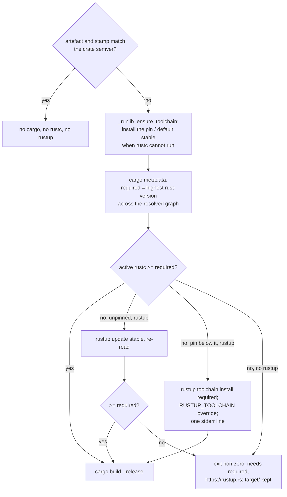

## Summary

`scripts/runlib.sh` gated the build on the crate's own `rust-version` alone, so
a **dependency** demanding a newer compiler was invisible to it: `cargo run
--example generate_snapshot` in NEAT-AI-Discovery stopped with `rustc 1.92.0 is
not supported … serial_test@4.0.1 requires rustc 1.93.1`, and no family crate
declares `rust-version` at all — `_runlib_check_msrv` could not have caught it.

The gate now takes the **highest `rust-version` across the resolved dependency
graph** (`cargo metadata --format-version 1 --filter-platform <host>`), the
crate's own included, and it is also the remedy rather than only the refusal:

- at or above the requirement → pass, no `rustup` call, never a downgrade;
- below it, unpinned → `rustup update stable`, re-read `rustc`, still below
  exits non-zero naming the version and <https://rustup.rs>;
- below it, `rust-toolchain.toml` pin satisfies it → pass (rustup's proxies
  honour the pin);
- below it, pin below it too → `rustup toolchain install <required>` plus a
  `RUSTUP_TOOLCHAIN` override for **this run's build alone**, the pin file left
  untouched, and exactly one stderr line naming the pin, the requirement and
  `rust-toolchain.toml` as the file to bump;
- below it with no `rustup` on `PATH` → exit non-zero naming the version and
  <https://rustup.rs>; a distro toolchain is never replaced.

A `rustc` that cannot run at all is repaired *before* the metadata calls — a
rustup proxy whose pinned toolchain is not installed cannot run `cargo` either
— by installing the pin, or `rustup default stable` when unpinned. Every value
handed to `rustup` is validated against `^[A-Za-z0-9][A-Za-z0-9._+-]*$` first:
`rust-toolchain.toml` and `cargo metadata` are repository input, not shell. The
graph resolve runs on the build path only, after the up-to-date check, so the
downstream production trainer's stamp-skip contract holds unchanged: a matching
stamp still runs no `cargo`, no `rustc` and no `rustup`.

Closes #700.

## Evidence

Backend/CLI change — there is no web interface to screenshot. The evidence is
`tests/scripts/runlib.bats`, which runs the **real** script against fixture
crates with `cargo`, `rustc` and `rustup` shims that log every invocation, so
"no rustup call on a pass", "no cargo call on a skip" and the
`RUSTUP_TOOLCHAIN` the build saw are assertions over logs rather than
inferences.

```
$ bats tests/scripts/runlib.bats
1..85
… ok 85 no curl on PATH names curl rather than blaming the download
```

Nine of the new cases were run against the pre-change script first and go red
there (`not ok 24, 27, 31, 34, 35, 37, 38, 39, 40`), which is what proves they
bind the new behaviour rather than restating the old.

`./quality.sh < /dev/null` → `✅ All quality checks passed!` (exit 0), covering
`bash -n`, shellcheck, the full bats suite, clippy, the Rust tests, doctests and
the release build.



## Acceptance Criteria

<!-- vibe-spec-review inputs="diff+issue-body" -->

- **met** — graph max `1.93.1`, rustc `1.92.0`, no rustup on `PATH`: exit non-zero, stderr names `1.93.1` and `https://rustup.rs`, nothing installed, `target/` survives — evidence: `tests/scripts/runlib.bats::a rustc below the graph maximum with no rustup on PATH fails loud` — reviewer: met
- **met** — same fixture, rustc `1.93.1` or `1.98.0`: build proceeds, rustup log empty — evidence: `tests/scripts/runlib.bats::a rustc equal to the graph maximum builds`, `::a rustc above the graph maximum builds without invoking rustup` — reviewer: met
- **met** — unpinned, rustc `1.92.0`, requirement `1.93.1`, rustup present: log shows `update stable`, build runs, exit 0 — evidence: `tests/scripts/runlib.bats::an unpinned crate below the requirement is updated and then builds` — reviewer: met
- **met** — pinned `1.92.0`, requirement `1.93.1`: log shows `toolchain install 1.93.1`, cargo saw `RUSTUP_TOOLCHAIN=1.93.1`, `rust-toolchain.toml` unchanged, exactly one stderr line names pin, requirement and file — evidence: `tests/scripts/runlib.bats::a pin below the requirement is overridden for this run, not rewritten` — reviewer: met — reason: the reviewer also found the override was `export`ed process-wide, contradicting "for this run's `cargo build` only" in the sourced form; fixed in `scripts/runlib.sh` (the value is recorded in `_RUNLIB_TOOLCHAIN_OVERRIDE` and prefixed onto the one `cargo build`) and now covered by `::the override is recorded but never exported into the caller's shell`
- **met** — pinned `1.98.0`, requirement `1.93.1`: exit 0, rustup log empty — evidence: `tests/scripts/runlib.bats::a pin above the requirement passes with no rustup call` — reviewer: met — reason: the reviewer found the neighbouring case wrong — a non-exact channel pin (`stable`, `nightly`, two-part `1.93`) compared as `0.0.0` and was overridden with an exact version; fixed by classifying only `X.Y.Z` as an exact pin and moving every channel with `rustup update <channel>`, covered by `::a channel pin below the requirement is updated, not replaced by a version` and `::a two-part version pin is treated as a channel, not as an exact pin`
- **met** — any rustup failure, or a rustc still below after the update, exits non-zero naming the required version and `https://rustup.rs`; nothing installed, `target/` kept — evidence: `tests/scripts/runlib.bats::a rustup update that fails exits non-zero naming the required version`, `::a pinned toolchain install that fails exits non-zero naming the required version` — reviewer: met — reason: the reviewer said "met (with a test gap)" — the update-failure case asserted only the version; the `https://rustup.rs` assertion was added to it in this diff, closing the gap
- **met** — a matching install stamp produces zero cargo, rustc and rustup shim invocations — evidence: `tests/scripts/runlib.bats::a matching stamp runs no cargo, no rustc and no rustup at all` — reviewer: met
- **met** — `./quality.sh < /dev/null` passes (`bash -n`, shellcheck, bats) — evidence: full gate run after the final edit, exit 0, `✅ All quality checks passed!` — reviewer: met
- **unrequested** — the gate runs after the *second* up-to-date check (`_runlib_report_current`), not immediately after the metadata calls — reviewer: unrequested — reason: the issue asks for the graph resolve "on the build path only" and "read only when a rebuild is due", which is exactly this position; a crate already current pays no graph resolve and the downstream production trainer's stamp-skip contract is untouched
- **unrequested** — progress lines on stderr the issue did not list (`rustc is not runnable — installing the pinned toolchain …`, `… — running: rustup update …`) — reviewer: unrequested — reason: a rustup invocation that changes the host's toolchain must not be silent; stdout is still only the artefact path, which `::a pin below the requirement is overridden for this run, not rewritten` asserts
- **unrequested** — `_runlib_ensure_toolchain` fails loud for an unrunnable `rustc` on every build path, where the old code only did so for a crate declaring `rust-version` — reviewer: unrequested — reason: it is the issue's ensure-toolchain bullet ("without `rustup` keep today's cannot-read-the-rustc-version fail-loud"); carrying a dead rustc into `cargo metadata` would fail with no cause named
- **unrequested** — a 15th bats case beyond the issue's 14 (`::a pinned toolchain install that fails exits non-zero naming the required version`) — reviewer: unrequested — reason: acceptance criterion 6 says "any rustup failure", and the issue's case list only covered the unpinned branch
- **unrequested** — `docs/archive/pr-summaries/pr-summary-700.md` — reviewer: unrequested — reason: the mandated PR-summary deliverable for this issue

## Standards Review

<!-- vibe-standards-review inputs="diff+AGENTS.md" -->

This repository has no `CODING-STANDARDS.md`; the reviewer was given the diff,
`AGENTS.md` and the fleet engineering standards it is held to.

- **violation** — a `rust-toolchain.toml` channel was fed to a semver comparator, so `stable` / `nightly` / `1.93` read as `0.0.0` and were "below the requirement": the run discarded a deliberate channel pin for an exact-version override and printed a diagnostic naming a cause that did not exist — evidence: `scripts/runlib.sh:694` (pre-fix) — reason: fixed here — `_runlib_is_exact_version` gates the comparison and `_runlib_update_channel` moves a channel instead; two regression tests added
- **violation** — `export RUSTUP_TOOLCHAIN` was never unset, so the documented sourced form left the caller's shell pinned to a toolchain it never asked for, contradicting "this run's build alone" in both the script and the README — evidence: `scripts/runlib.sh:701-702` (pre-fix) — reason: fixed here — the override is recorded, not exported, and prefixed onto the single `cargo build`; asserted by `::the override is recorded but never exported into the caller's shell`
- **violation** — silent fallback masking a fault: a `rustc -vV` with no `host:` line dropped `--filter-platform` with nothing on stderr, letting a foreign-platform dependency inflate the requirement, and the comment justifying it named a fail-loud that did not exist — evidence: `scripts/runlib.sh:626` (pre-fix) — reason: fixed here — the host read fails loud, the filter is unconditional, and the gate reads the active rustc version before resolving the graph so an unreadable rustc is named where it is found
- **violation** — a measured-below rustc was declared a pass on the strength of a *declared* pin, with no diagnostic — evidence: `scripts/runlib.sh:694-697` (pre-fix) — reason: partly stands: the pass is what acceptance criterion 5 mandates ("pinned 1.98.0, requirement 1.93.1 → exit 0, rustup log empty"), so it is kept, but it is no longer silent — one stderr line now says which toolchain is building
- **violation** — renamed behaviour left old names behind: the function is still `_runlib_check_msrv` and one bats case said "below the manifest MSRV" while testing the no-rustup refusal — evidence: `tests/scripts/runlib.bats:638` (pre-fix) — reason: the misleading test is renamed to `a rustc below the crate's own rust-version with no rustup fails loud`; the function name stands because the issue specifies reworking `_runlib_check_msrv` in place, and the remaining `MSRV` test names do test the crate's own `rust-version`
- **violation** — README rewrap artefact left `rustup` orphaned on its own line — evidence: `README.md:326-327` (pre-fix) — reason: fixed here
- **violation** — minor DRY: four similar `cannot read the rustc version …` die strings, and the README's "install mode prints only the artefact path on stdout" claim was unasserted — evidence: `scripts/runlib.sh:570, 575, 594, 606` — reason: the stdout claim is now asserted in the override test; the four strings stand — each names a *different* cause (no rustup to repair with, rustup could not repair it, unparsable output, gate context), and collapsing them would lose the cause the fail-loud rule exists to surface
- **clean** — tests exercise the real script (81 → 85 cases, none deleted or commented out), asserting exit codes, stderr, artefacts, the untouched pin file and shim logs; no source-grepping tests; Australian English throughout; every new `printf` and `rustup` call on stderr; `shellcheck -s bash` and `bash -n` clean; bash 3.2-safe (`[[ =~ ]]`, `local -a`, `read -r -a`, `<<EOF`, no GNU-only flags); every rustup argument validated by `_runlib_assert_toolchain_name` before use and passed as a single quoted argv word; the gate sits after `_runlib_report_current` so a matching stamp runs no cargo, rustc or rustup; README, the script header and `AGENTS.md` consistent with the new behaviour; no secrets or hidden paths staged

## Test Plan

New cases in `tests/scripts/runlib.bats` (all against the real script, no
network):

| Case | Asserts |
|------|---------|
| `a rustc below the graph maximum with no rustup on PATH fails loud` | exit non-zero, stderr names `1.93.1` and `https://rustup.rs`, nothing installed, `target/` survives, rustup log empty |
| `a rustc equal to the graph maximum builds` | build proceeds, rustup log empty |
| `a rustc above the graph maximum builds without invoking rustup` | build proceeds, rustup log empty |
| `the crate's own rust-version above every dependency is the requirement` | `1.95.0` wins over a `1.93.1` dependency |
| `a two-part rust_version is compared numerically, not as text` | `1.10` beats `1.9`, and compares as `1.10.0` |
| `a matching stamp runs no cargo, no rustc and no rustup at all` | all three shim logs empty |
| `a graph declaring no rust_version at all builds on any rustc` | no requirement means no gate |
| `an unpinned crate below the requirement is updated and then builds` | `update stable` logged, exit 0 |
| `an unpinned crate still below after the update fails loud` | exit non-zero naming the version and rustup.rs, `target/` kept |
| `a pin above the requirement passes with no rustup call` | pinned `1.98.0` vs `1.93.1`, rustup log empty |
| `a pin below the requirement is overridden for this run, not rewritten` | `toolchain install 1.93.1` logged, cargo saw `RUSTUP_TOOLCHAIN=1.93.1`, `rust-toolchain.toml` bytes unchanged, exactly one stderr line names pin + requirement + file |
| `a pinned toolchain that is not installed is installed before the build` | rustc fails until `toolchain install 1.98.0` has run |
| `a rustup update that fails exits non-zero naming the required version` | and names rustup.rs; nothing installed, `target/` kept |
| `a pinned toolchain install that fails exits non-zero naming the required version` | the same for the pinned branch |
| `a channel outside the toolchain-name allowlist is refused before rustup runs` | refusal before any rustup invocation, rustup log empty |
| `a channel pin below the requirement is updated, not replaced by a version` | `stable` pin → `update stable`, no `toolchain install`, no override, pin file unchanged |
| `a two-part version pin is treated as a channel, not as an exact pin` | `1.93` pin → `update 1.93`, no `toolchain install` |
| `the override is recorded but never exported into the caller's shell` | sourced run leaves `_RUNLIB_TOOLCHAIN_OVERRIDE=1.93.1` and `RUSTUP_TOOLCHAIN` unset, while the build saw it |
| `a build needing no override records an empty _RUNLIB_TOOLCHAIN_OVERRIDE` | the record is empty when the gate selected nothing |

Modified existing cases (documented, per the "do not weaken tests" rule):

- `a toolchain without rustup still installs, since the script never runs
  rustup` → **retired** in favour of `a satisfied toolchain without rustup
  still installs`, as the issue asks: rustup is no longer "never invoked", it is
  invoked only when the toolchain is missing or too old. The replacement also
  runs on a `PATH` with no rustup **at all** rather than merely deleting the
  shim — most CI images carry a real rustup, so the old fixture asserted
  nothing on them.
- `a rustc below the manifest MSRV fails loud without installing` → renamed to
  `a rustc below the crate's own rust-version with no rustup fails loud`, and
  run without rustup on `PATH`, because with a rustup to hand the script now
  updates rather than refusing. It still asserts the refusal names the version,
  nothing is installed and `target/` survives.

Shim changes: the `cargo` shim serves `RUNLIB_SHIM_GRAPH_METADATA` for a
`metadata` call without `--no-deps` and records `RUSTUP_TOOLCHAIN` on `build`;
the `rustup` shim logs its arguments and records installed toolchains; the
`rustc` shim logs its invocations, honours `RUSTUP_TOOLCHAIN`, reports
`RUNLIB_SHIM_RUSTC_AFTER_UPDATE` once `rustup update` has run, and fails while
`RUNLIB_SHIM_RUSTC_NEEDS` names an uninstalled toolchain.
