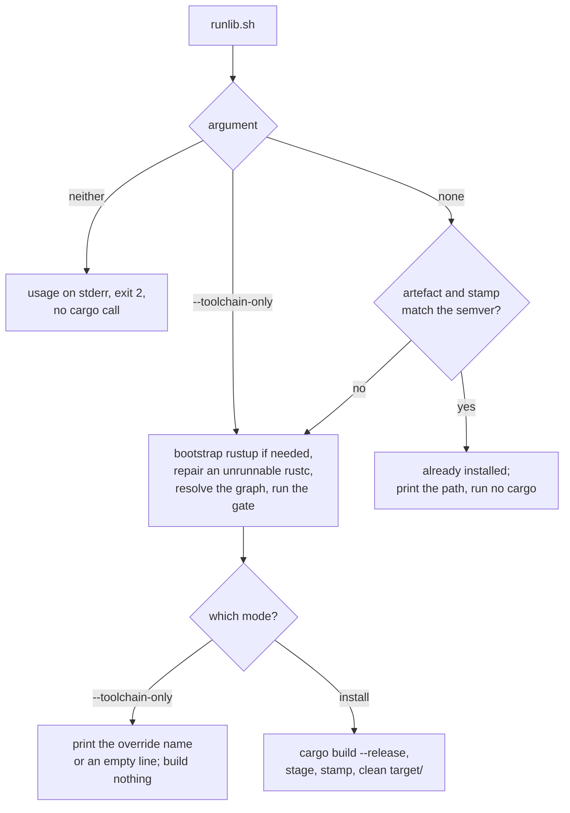

## Summary

`scripts/runlib.sh` gains a `--toolchain-only` entry point (sourced:
`runlib_ensure_toolchain`) that runs the same bootstrap → unrunnable-`rustc`
repair → dependency graph → toolchain gate chain install mode runs, builds and
installs nothing, and prints **only** the override toolchain the gate selected
on stdout — a bare name such as `1.93.1`, or an empty line when the active
toolchain already satisfies the requirement. That is for a caller which runs
`cargo` itself and exports the value as `RUSTUP_TOOLCHAIN`; the private
downstream trainer's snapshot-generation worker script runs `cargo run --release
--example generate_snapshot` inline and so cannot use install mode.

`argv` is now parsed in the `BASH_SOURCE == $0` block: no argument installs
exactly as before, `--toolchain-only` runs the gate, and anything else exits
`2` with a one-line usage on stderr **before any cargo call** — a downstream
copy that ignored its arguments would otherwise silently run a full build for a
caller that asked only for the gate. The already-installed skip is never
consulted in this mode: a caller running its own cargo needs a good toolchain
whatever the stamp says.

Closes #701.

## Evidence

Backend/CLI change — no web interface to screenshot. The evidence is the bats
suite, which runs the real script against fixture crates with `cargo`, `rustc`
and `rustup` shims on `PATH` and no network: 94/94 pass, 9 of them new. The 8
new tests that exercise the new code path were observed **red** against the
pre-change script (`git show HEAD~2:scripts/runlib.sh`) — `--toolchain-only`
was silently ignored, so the script ran a full install, and
`runlib_ensure_toolchain` did not exist. `./quality.sh < /dev/null` passes
(`bash -n`, shellcheck, bats, the Mermaid gate, clippy, cargo test, doc, release
build).

The two entry points and where they diverge:

## Acceptance Criteria

<!-- vibe-spec-review inputs="diff+issue-body" -->

- **met** — `--toolchain-only` on a satisfied toolchain: exit 0, stdout empty, no `build` in the cargo shim log, nothing installed under `$CARGO_HOME` — evidence: `tests/scripts/runlib.bats::--toolchain-only on a satisfied toolchain builds nothing and prints an empty line` — reviewer: met — reason: the reviewer noted stdout is one empty line (`0a`) rather than zero bytes; that is the issue body's own "or an empty line", and the documented caller shape `"$( )"` strips it, so the contract holds.
- **met** — pinned-below-requirement: stdout is exactly the required version and one stderr line names pin, requirement and `rust-toolchain.toml` — evidence: `tests/scripts/runlib.bats::--toolchain-only prints the required version when the pin is below it` — reviewer: met
- **met** — unknown argument: exit 2, zero cargo invocations — evidence: `tests/scripts/runlib.bats::an unknown argument exits 2 with a usage line and never calls cargo`, `scripts/runlib.sh:1114-1128` — reviewer: met
- **met** — a matching stamp still runs the gate in this mode (cargo shim log shows `metadata`) — evidence: `tests/scripts/runlib.bats::a matching stamp does not short-circuit --toolchain-only` — reviewer: met
- **met** — README and header describe the mode; the README Mermaid block renders — evidence: `README.md:222-249`, `scripts/runlib.sh:35-47`, and the repo's own gate `deno run --allow-read scripts/check_mermaid.ts .` reporting "all Mermaid blocks passed" — reviewer: met — reason: the reviewer verified the block by inspection only because it did not run the Mermaid gate; it was run here and passed.
- **met** — `./quality.sh < /dev/null` passes (`bash -n`, shellcheck, bats) — evidence: full gate run after the final edit, "✅ All quality checks passed!" — reviewer: partial — reason: the reviewer ran only the three legs the diff touches and could not confirm the cargo/deno legs; the full gate was run here and passed.
- **unrequested** — `_runlib_member_metadata` lifts the single-member `cargo metadata --no-deps` resolution out of `runlib_install` — evidence: `scripts/runlib.sh:893` — reviewer: unrequested — reason: DRY; both entry points need the same member manifest for the gate, `runlib_install`'s behaviour and messages are unchanged, and all 85 pre-existing tests still pass.
- **unrequested** — an argc rule: `runlib.sh ""` and `--toolchain-only <extra>` also exit 2 — evidence: `scripts/runlib.sh:1119`, `scripts/runlib.sh:1123` — reviewer: unrequested — reason: the strict reading of "anything else → exit 2"; an unrecognised argc must not fall through to a build.
- **unrequested** — a 9th test pinning that a sourced `runlib_ensure_toolchain` does not export `RUSTUP_TOOLCHAIN` into the caller's shell — evidence: `tests/scripts/runlib.bats::a sourced runlib_ensure_toolchain reports the override it selected` — reviewer: unrequested — reason: the mode's whole point is handing the name back for the caller to export, so "it is not exported for you" is the contract worth pinning.
- **unrequested** — `invoke_with_path` now forwards `"$@"` — evidence: `tests/scripts/runlib.bats:316` — reviewer: unrequested — reason: the no-rustup fixture has to pass `--toolchain-only`; every existing call site is unchanged.

## Standards Review

<!-- vibe-standards-review inputs="diff+CODING-STANDARDS.md" -->

The reviewer reports no `CODING-STANDARDS.md` exists in this repository and used
`AGENTS.md` and `README.md` as the documented standards.

- **violation** — the documented caller recipe ran without `set -euo pipefail`, so a failed gate left `override` empty and the next line ran cargo anyway — a silent fallback — evidence: `README.md:227` — reason: fixed here; the snippet now opens with `set -euo pipefail` and says why.
- **violation** — the gate's stderr line said "building this run with 1.93.1" on a mode that builds nothing — evidence: `scripts/runlib.sh:761` — reason: fixed here; both "building" lines are reworded to be true in either mode, still naming the pin, the requirement and `rust-toolchain.toml` on one line.
- **violation** — "no build" was proved by a failing `grep`, which also passes when the shim log does not exist — absence of a marker read as success — evidence: `tests/scripts/runlib.bats:265` — reason: fixed here; `cargo_build_invocations` fails loud on a missing log and the tests pair its counted zero with a positive `cargo_invocations > 0`.
- **violation** — the Mermaid rewrite carries `#700` detail (`--filter-platform`, the exact-pin branch, the channel-pin wording) beyond `#701` — evidence: `README.md:316-350` — reason: it stands; the issue asks in terms to "bring the section's Mermaid flow diagram up to the full #699/#700/this behaviour", so the reviewer could not see that it was requested.
- **clean** — Australian English throughout ("artefact", "behaviour", "honours"); `shellcheck -s bash` clean; cross-platform bash (no bashism past 3.2, no empty-array expansion, `wc -l | tr -d ' '` for BSD padding, portable `grep` flags); fail-loud preserved (`_runlib_member_metadata` dies inside the substitution and both callers declare `local` separately, so `set -e` propagates); argument dispatch closed and reachable only under the `BASH_SOURCE`/`$0` guard, so sourcing cannot exit the caller; tests call the real script and assert on observable outcomes, never on source text; no hidden or secret files staged.

## Test Plan

Added to `tests/scripts/runlib.bats` (all no-network, shim-driven):

- `--toolchain-only on a satisfied toolchain builds nothing and prints an empty line`
- `--toolchain-only prints the required version when the pin is below it`
- `--toolchain-only updates an unpinned channel and still prints an empty line`
- `--toolchain-only below the requirement with no rustup fails loud and prints nothing`
- `an unknown argument exits 2 with a usage line and never calls cargo`
- `an argument after --toolchain-only exits 2 and never calls cargo`
- `a matching stamp does not short-circuit --toolchain-only`
- `sourcing the script and calling runlib_ensure_toolchain behaves the same`
- `a sourced runlib_ensure_toolchain reports the override it selected`

Added helper `cargo_build_invocations`, which fails loud when the cargo shim log
is absent rather than reporting zero builds. `invoke_with_path` forwards
arguments; `invoke_args` runs the script with arguments on the shim `PATH`.

No existing test was modified or removed. The 85 pre-existing tests still pass,
which is what holds install mode byte-identical across the
`_runlib_member_metadata` extraction.
