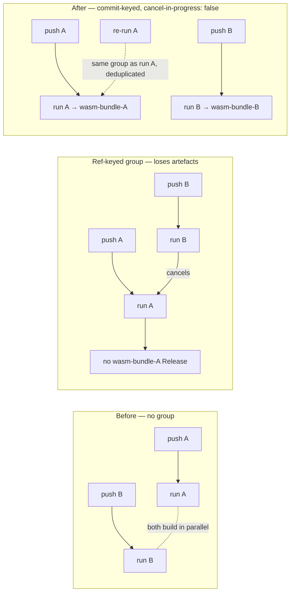

# Per-commit concurrency groups for the push-triggered publishers

## Summary

`release.yml` and `wasm-bundle.yml` both trigger on `push: branches:
[Develop]` and declared no `concurrency:` group, so two merges landing close
together queued a second full run — up to 60 minutes of wasm builds, parity
gates, SBOMs and attestations — on top of one still building. Both now declare
a top-level group. Closes #717.

**Deliberate departure from the suggested fix.** The issue proposed the
PR-gate pattern (`${{ github.workflow }}-${{ github.ref }}` with
`cancel-in-progress: true`). That would lose artefacts:

- Each of these workflows publishes **one Release per commit** —
  `wasm-bundle-<sha>` so NEAT-AI can pin `neatCore.rev` to any historical
  `Develop` SHA, and `v<version>` for each semver bump. Two pushes queue runs
  for *different* tags, so cancelling the earlier one means that commit never
  gets its artefact — the opposite of the invariant the workflow exists to hold.
- `cancel-in-progress: false` alone does not fix it: GitHub cancels a **pending**
  run when a newer one queues behind the same group, so a ref-keyed group drops
  commits either way.
- A `release.yml` run cancelled mid-`gh release create` can leave a tag whose
  release never appears, and its gate is idempotent in the wrong direction — it
  sees the tag, decides "already released", and never repairs it.
- The repo's own gate already encoded half of this rule:
  `tests/scripts/workflow_concurrency_groups.bats` (Issue #334) requires
  publishers **not** to cancel in progress.

Both therefore key on the commit as well as the ref
(`${{ github.workflow }}-${{ github.ref }}-${{ github.sha }}`) with
`cancel-in-progress: false`. Duplicate runs for the *same* SHA — a re-run racing
the original to create the same tag — are deduplicated, which is the race worth
preventing, and no run can cancel another commit's publish.

## Evidence

Backend/CI-only change: no web interface to screenshot. The evidence is the
gate, run red against the pre-fix workflows and green after (below), plus
`actionlint` passing on both modified workflows.



Red/green record for the two new gate tests (the two workflow files temporarily
restored to their pre-fix state, then the fix reapplied):

```text
=== RED RUN (pre-fix workflows) ===
not ok 4 every push-triggered workflow declares a concurrency group
not ok 5 publishing workflows key their concurrency group on the commit

=== GREEN RUN (fixed workflows) ===
ok 4 every push-triggered workflow declares a concurrency group
ok 5 publishing workflows key their concurrency group on the commit
```

## Test Plan

- Extended `tests/scripts/workflow_concurrency_groups.bats` (the existing
  Issue #334 gate — no new parallel gate, no new wiring) with:
  - `every push-triggered workflow declares a concurrency group` — discovers the
    `push` triggers from the YAML instead of a hand-kept filename list, so a
    push-triggered workflow added later cannot slip through; requires
    `github.workflow`, `github.ref` and an explicit `cancel-in-progress`.
  - `publishing workflows key their concurrency group on the commit` — requires
    `github.sha` in the group of `release.yml` and `wasm-bundle.yml`.
- `bats tests/scripts/workflow_concurrency_groups.bats` — 6 passed.
- `actionlint .github/workflows/release.yml .github/workflows/wasm-bundle.yml` —
  clean.
- Documented the policy where it is consumed, in the README's NEAT-AI bundle
  section.

## Quality gate

`./quality.sh` was run in full. It aborts inside the bats stage on **six
pre-existing failures unrelated to this diff**, all reproduced identically on
the parent commit (`git worktree add /tmp/base717 HEAD~1` → same five wasm64
failures) or caused by container tooling:

- `build_wasm_bundle_wasm64.bats` (5 tests) — the container has no nightly
  toolchain/`wasm-bindgen` for the `-Z build-std` lane; identical at `HEAD~1`.
- `markdownlint-cli2 passes against the current tree` — the 17 reported issues
  are all in the untracked `graft/` tooling directory (excluded via
  `.git/info/exclude`, which markdownlint does not read), none in a committed
  file; `markdownlint-cli2 README.md` is clean.

The stages after bats are Rust (`cargo build`/`clippy`/`test`) and this diff
contains no Rust; the TypeScript, style and Mermaid gates were run individually
and pass (`./scripts/typescript-check.sh`, `deno lint`, `deno fmt --check`,
`scripts/check_mermaid.ts`). CI runs the same checks on the PR.
