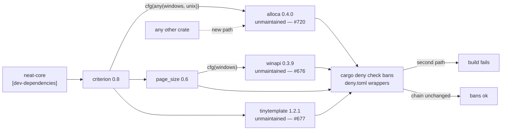

# Contain the unmaintained `alloca` with the existing orphan gate (Issue #720)

## Summary

`alloca 0.4.0` (last published January 2021, upstream repository dormant since
2023-08 with an undefined-behaviour report and a wasm32 build failure both open
and unanswered) is in this repository's resolved graph, forced in by the
`criterion` dev-dependency — the same shape as `tinytemplate ← criterion`
(#677) and `winapi ← page_size ← criterion` (#676). It was the one such edge
**not** named in the `deny.toml` `[bans]` wrapper list, so a second path into it
would not have failed `cargo deny check bans`.

No replacement is available to this manifest — the dependency is declared by
`criterion`, not here, and it is non-optional for `cfg(any(windows, unix))`, so
no feature or version choice in this tree removes it. This change therefore
extends the **existing** containment policy by one entry rather than adding a
mechanism: `deny.toml` wrapper, lockfile-path test, and doc parity in
`SECURITY.md`, `README.md` and the `quality.sh` comment.

Closes #720.

## Evidence

Dependency-policy and documentation change with no web interface, so no
screenshot applies. The evidence is the gate behaving as claimed in both
directions.

**Red before the fix** — the wrapper assertion added to
`tests/cargo_orphan_containment_test.ts`, run against the unchanged
`deny.toml`:

```
$ deno test --allow-read tests/cargo_orphan_containment_test.ts
deny.toml pins both wrapper chains so cargo deny fails on a new path => FAILED
  AssertionError: deny.toml [bans] must deny alloca except through criterion
  [Diff] Actual / Expected
  +   [ "criterion" ]
  -   undefined
FAILED | 8 passed | 1 failed
```

**Green after adding the `deny.toml` entry:**

```
$ deno test --allow-read tests/cargo_orphan_containment_test.ts
ok | 9 passed | 0 failed
```

The `alloca ← criterion` edge asserted by the new lockfile test is read from the
committed `Cargo.lock`: `criterion 0.8.2`'s dependency list names `alloca`, and
no other package in the lockfile does.



### Checks run, and what could not be run here

- `deno test --allow-read tests/cargo_orphan_containment_test.ts` — 9 passed.
- `deno fmt --check`, `deno lint`, `scripts/typescript-check.sh`,
  `deno run --allow-read scripts/check_mermaid.ts .` — all clean (the new
  mermaid block included).
- `markdownlint-cli2` over the tracked Markdown — 0 issues.
- `./quality.sh` was run and **stopped in its `bats` stage on failures that are
  pre-existing and environmental**, not caused by this change: five cases in
  `tests/scripts/build_wasm_bundle_wasm64.bats` (they need a nightly Rust
  toolchain this container lacks) and `markdownlint-cli2 passes against the
  current tree` (the worktree carries an untracked, git-excluded `graft/` index
  directory whose generated Markdown trips `MD037`). Both were confirmed
  identical on the parent commit `9867030` in a clean worktree — 5 failing
  `wasm64` cases there too, and 0 markdownlint issues once `graft/` is absent.
- `cargo deny check bans` could **not** be run: this container has no crates.io
  access and no registry cache, so `cargo metadata` cannot resolve the graph
  (`error: no matching package named criterion found … offline mode`). The
  `deny.toml` entry uses the identical `{ crate, wrappers }` form as the three
  entries already proven against `cargo deny` in #676/#677, and CI's `deny` job
  runs it on this PR.

## Test Plan

Extended `tests/cargo_orphan_containment_test.ts` (8 → 9 tests), run by
`quality.sh` and the CI `typescript-gate` job:

- **Added** `Cargo.lock reaches alloca through criterion and nothing else` —
  fails if the committed lockfile ever grows a second dependent of `alloca`.
- **Extended** `deny.toml pins both wrapper chains so cargo deny fails on a new
  path` — now also asserts `alloca` is denied except through `criterion`.
  Confirmed red without the `deny.toml` entry (output above).

No test was commented out, removed or weakened.

Documentation updated in the same change, per the code-change-owes-a-docs-change
rule: the `SECURITY.md` *"Orphaned transitive crates"* section now covers all
three crates (and its heading/anchor names #720, with the `README.md` link
updated to match), and the `quality.sh` comment that enumerated only two chains
now names all three.
