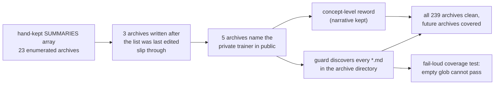

# Guard every archived PR summary against private-repo references, not a hand-kept list

## Summary

NEAT-AI-core is a **public** repository, but five archived PR summaries still
named the **private** downstream production trainer directly — by repository
name, by issue slug, or by an internal artefact path (`pr-summary-661.md` in its
title and throughout, `pr-summary-664.md`, `pr-summary-688.md`,
`pr-summary-700.md` and `pr-summary-701.md`). A public reader following one of
those pointers hits material they cannot open and learns the layout of a private
production system — check 3 of the private-repo-reference audit, finding
`BP-41043689d67d`.

Each mention is now stated at **concept level**, the precedent already set by
`pr-summary-373.md` … `pr-summary-378.md` and `pr-summary-546.md`: the private
trainer becomes "the private downstream trainer", its issue slugs become "a
private issue slug", and its internal paths become what they are ("the
production sampler fixture", "its Backprop logs"). Every historical narrative —
what changed, why, and what the numbers were — survives intact.

The guard is extended differently from the issue's literal suggestion. Rather
than appending these five names to the enumerated `SUMMARIES` array in
`tests/scripts/archive_pr_summaries_private_repo_reference.bats`, the guarded
set is now **discovered** from the archive directory: every `*.md` under
`docs/archive/pr-summaries/` is checked. That is the general fix. Three of the
five files were written *after* the previous two sweeps enumerated their lists —
a hand-kept array only ever covers what someone remembered to add the day it was
edited, so the same finding would return with the next archive. Discovery covers
all 239 archives today and every archive added tomorrow, including this one.

Discovery is only safe if it is pinned, so a new fail-loud test asserts the glob
found at least one file and that its count matches `find`. Without it an empty
or truncated glob would make every absence assertion vacuously pass — a silent
green over an unguarded archive.

Closes #722.

## Evidence

Docs-and-test-only change — no runtime code and no web interface, so there is
nothing to screenshot. What was tested is the committed archive content itself,
via the repository's existing bats guard.

- **Red first.** With the discovery guard in place and the five archives
  unreworded (`git stash push -- docs/archive/pr-summaries`), the run reports
  `1..25` with `not ok 2 archived PR summaries name no private
  production-trainer repository` (line 78), `not ok 4 archived PR summaries
  reference no private repository path or issue slug` (line 89) and `not ok 23
  pr-summary-688 still records the identity-splice symptom`. The first two are
  the finding itself; the third is the new narrative assertion for the passage
  the reword rewrote.
- **Green after.** `bats
  tests/scripts/archive_pr_summaries_private_repo_reference.bats < /dev/null` —
  **25/25 pass**, including `ok 1 discovery covers every archived PR summary on
  disk` (239 files discovered, 239 found on disk).
- A recursive, case-insensitive, word-boundary grep of
  `docs/archive/pr-summaries/` for either private repository's name returns no
  matches across all 239 archives.
- `deno run --allow-read scripts/check_mermaid.ts docs` — `check-mermaid: all
  Mermaid blocks passed` (the diagram in `pr-summary-661.md` was reworded).
- `./quality.sh < /dev/null` — see the gate result recorded in the PR.

## Test Plan

Extended `tests/scripts/archive_pr_summaries_private_repo_reference.bats`, which
already owns "no private-repo reference in an archived PR summary"; a second
file would have split that single source of truth.

- Replaced the enumerated `SUMMARIES` array with directory discovery in
  `setup()`. The loop body is an `if` with no `else`, so bats' `set -e` cannot
  trip on a non-matching final iteration, and `${arr[@]}` is never expanded
  while empty (bash 3.2 under `set -u`).
- Added `discovery covers every archived PR summary on disk` — a fail-loud
  coverage assertion: the discovered set must be non-empty and must match the
  `find` count. It replaces the old "every enumerated archived PR summary is
  present" test, which existed to catch a stale array entry and has no meaning
  once nothing is enumerated.
- Added five narrative-survival assertions, one per newly covered archive, so a
  reword cannot silently degrade into deletion of the passage that carried the
  private name: the float round-trip contract (661), the seven audit-fix archive
  sweep (664), the identity-splice symptom (688), the stamp-skip contract (700)
  and why the caller cannot use install mode (701).
- No existing test was removed or weakened. The three absence assertions, the
  `pr-summary-299` snake_case assertion, the file-name assertion and all 14
  pre-existing narrative-survival assertions are unchanged — they simply now run
  against the discovered set.

Deliberately unchanged: the scope note keeping this repository's own live
test-function name, which embeds the private repository's letters inside a
snake_case identifier. The guard matches on word boundaries, so it is not
flagged, and renaming it in an archive would dangle against the live test suite.
This summary describes the reword without reproducing the token or the grep
patterns that match it — the mistake two of the five archives made.
