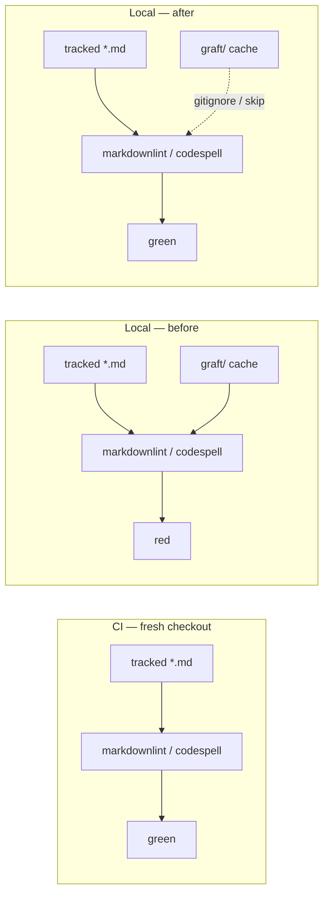

## Summary

The quality gate read red on an untouched default branch while every CI run on
the same commit was green. The cause was scope, not content: CI lints a **fresh
checkout** — tracked files only — whereas a local gate run lints **whatever sits
on disk**, including the `graft/` code-graph cache the tooling generates into the
worktree (156 Markdown files plus a JSON index). `markdownlint-cli2` and
`codespell` both swept that cache and failed on it.

Three changes make the two file sets agree, so a red gate again means a real
defect:

- `.markdownlint-cli2.jsonc` sets `"gitignore": true`, and `/graft/` is listed in
  the committed `.gitignore`. markdownlint-cli2 reads `.gitignore` only — never
  `.git/info/exclude`, which is worker-local — so the committed file is the only
  place an out-of-scope path can be declared.
- `.codespellrc` adds `./graft` to its `skip` list for the same reason.
- `tests/scripts/build_wasm_bundle_wasm64.bats` stubbed `cargo` writing to a
  hard-coded `target/`, while `scripts/build-wasm-bundle.sh` resolves
  `${CARGO_TARGET_DIR:-target}`. All five wasm64 assertions therefore failed on
  any machine exporting `CARGO_TARGET_DIR` (this container does). The stub now
  honours the same variable, and `run_build` pins it inside the throwaway work
  tree so one test's artefact cannot survive in a shared cache and satisfy the
  next test's fail-loud assertion.

Narrowing a gate's scope risks it going blind, so the narrowing is bounded by a
test of its own: `markdownlint-cli2 lints every tracked Markdown file the config
does not ignore` compares the linted count against `git ls-files '*.md'` minus
the config's explicit ignores, and the codespell tests prove an in-scope
misspelling is still caught.

Closes #728.

## Evidence

Backend/CLI change — no web interface to screenshot. The evidence is the gate
itself.

`./quality.sh` on the tip of this branch, in the same container that produced the
tracker:

```text
✅ All quality checks passed!
```

Before the change, on the untouched tree:

```text
markdownlint-cli2: Summary: 17 issues in 3 files
  graft/neat-core/src/creature_validate.md …
  graft/neat-core/src/training_bin_stream.md …
  graft/tests/scripts/lib/yaml_fallback/yaml.md …
codespell: ./graft/.cache/ask-index.json:1: 10 hits on truncated identifiers
bats: 5 failures in tests/scripts/build_wasm_bundle_wasm64.bats
  error: cargo produced no wasm64-unknown-unknown artefact at
  /var/tmp/vibe-cargo-target/NEAT-AI-core-50fbb018/wasm64-unknown-unknown/release/neat_core.wasm
```

The wasm64 failures were confirmed pre-existing by running that file from a
worktree at `HEAD~1`: 5 failures there too, so they are not a side effect of this
change.

File counts before and after, showing nothing tracked was dropped:

| Run | Files linted |
|---|---|
| Before (`.gitignore` not honoured) | 177 = 21 tracked + 156 generated `graft/` |
| After | 21 = every tracked `*.md` outside `docs/archive/pr-summaries/` |



## Test Plan

Added to `tests/scripts/markdown_lint_workflow.bats`:

- `markdownlint-cli2 skips Markdown under a git-ignored directory` — a malformed
  file inside a directory named by `.gitignore` no longer fails the run.
- `markdownlint-cli2 skips the graft code-graph cache under the committed
  gitignore` — replays the repository's own `.gitignore` against a `graft/` cache
  in a throwaway tree, so the result does not depend on whatever local
  `.git/info/exclude` a checkout happens to carry.
- `markdownlint-cli2 lints every tracked Markdown file the config does not
  ignore` — guards the narrowing against silently dropping a real file.

Added `tests/scripts/codespell_config.bats`:

- `codespell skips the graft code-graph cache`
- `codespell still catches a misspelling in a tracked file`
- `codespell passes against the current tree`

All three markdownlint tests and the two behavioural codespell tests were
observed failing against the unfixed config and passing after it. No existing
test was removed or weakened; `tests/scripts/build_wasm_bundle_wasm64.bats` keeps
all 11 of its assertions and now passes with or without an ambient
`CARGO_TARGET_DIR`.

Full gate: `./quality.sh` — 734 bats tests, cargo clippy/check/test/doctests and
the release build — passes.
