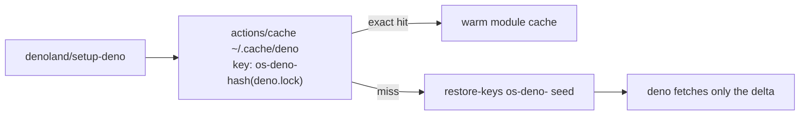

## Summary

Adds an `actions/cache` step after each of the five `denoland/setup-deno` steps
(`ci.yml` `typescript-gate` and `wasm64-memory64-smoke`, `deno-outdated.yml`,
`markdown-lint.yml`, `wasm-bundle.yml` `publish`). Each one caches
`~/.cache/deno` (the default `DENO_DIR`) under the hash-exact key
`${{ runner.os }}-deno-${{ hashFiles('deno.lock') }}`, with
`${{ runner.os }}-deno-` only as a `restore-keys` warm-start fallback. Closes #737.

`actions/cache` is pinned to `55cc8345863c7cc4c66a329aec7e433d2d1c52a9`, resolved
this run with `gh api repos/actions/cache/commits/v6.1.0` (the latest release),
with `# actions/cache@v6.1.0` as its version comment.

The earlier PR (#741) conflicted on the version files only; this branch merges
the current `Develop` and takes its `Cargo.toml` / `Cargo.lock` /
`wasm-bench/Cargo.lock` unchanged, so the diff is the workflows, the gate and
this summary.

## Evidence

CI-only change — no UI. `tests/scripts/workflow_deno_cache.bats` (7 tests)
parses every workflow as YAML and requires, in each job that runs
`denoland/setup-deno`, a later `actions/cache` step whose `path` includes
`~/.cache/deno`, whose `key` uses `hashFiles('deno.lock')`, and which sets
`restore-keys`. The checker has one definition, shared by the real-workflow sweep
and the synthetic good/bad literals (AGENTS.md oracle rule 4); the sweep must
find at least the five jobs the issue named, so it cannot pass vacuously.

Mutation check: deleting the cache step from `markdown-lint.yml` turns the sweep
red with `markdown-lint.yml job=markdownlint: no actions/cache of ~/.cache/deno
…`; restored before commit.

## Test Plan

- Added `tests/scripts/workflow_deno_cache.bats` — sweep over the live
  workflows, plus rejects for no cache, cache before `setup-deno`, a key that
  ignores `deno.lock`, the wrong path, missing `restore-keys`, and a vacuous
  sweep.
- `bats tests/scripts/*.bats` — all green, including `workflow_sha_pinning`,
  `actionlint_workflow`, `ci_workflow`, `deno_outdated_workflow` and
  `markdown_lint_workflow`.
- `./quality.sh < /dev/null` — run after the final edit.
