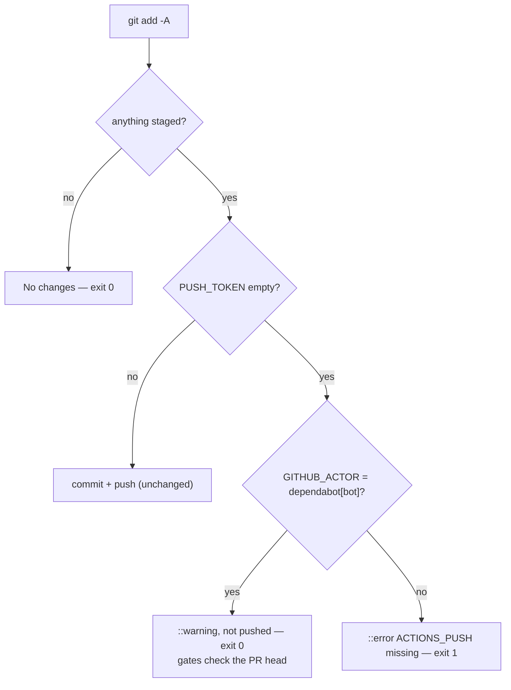

## Summary

Dependabot PR #744 (`wasm-bindgen` 0.2.128 → 0.2.129 in `/wasm-bench`) could
never go green: GitHub withholds Actions secrets from a run Dependabot
triggers, so `ACTIONS_PUSH` was empty in `version-increment`'s "Commit version
and dependency changes" step, the push failed (`remote: Invalid username or
token`, exit 128), and every job that `needs: [version-increment]` was skipped.
Closes #745.

The step now separates three cases when there is a bump to commit:

- token present → commit and push as before (whatever the actor);
- token empty **and** `GITHUB_ACTOR` is `dependabot[bot]` → leave the bump
  unpushed with a `::warning` annotation, so the gates run against the PR head
  as Dependabot wrote it (`scripts/check-version-bump.sh` already accepts an
  unchanged version for a non-breaking change);
- token empty for any other actor → `::error` and exit 1, because that is a
  missing secret.

Also created the missing `dependencies` repository label, which
`.github/dependabot.yml` asks for (Dependabot commented on #744 that the label
did not exist). That is a repository setting, so it is not part of the diff.

## Spec

### Intent and Rationale

- Dependabot PRs have to pass the same gates as other PRs. The bump is the only
  thing that needs the PAT, and the version gate does not require it for a
  non-breaking change, so the step skips the push and the gates still run.
- The alternatives were all worse. `pull_request_target` would hand an
  org-wide PAT to a run that executes PR-head scripts. Adding `ACTIONS_PUSH` as
  a Dependabot secret is an org-admin action outside the repo, and widens where
  the PAT is exposed.

### Essential Design Decisions

- The skip needs both an empty token **and** the Dependabot actor. A missing
  secret on any other run still fails loud, and a Dependabot run that does have
  a token still pushes.
- `GITHUB_ACTOR` is assigned by GitHub and cannot be chosen by a PR author.
  Matching it only suppresses a push; it grants nothing.
- The `git push "https://x-access-token:${PUSH_TOKEN}@…"` line is unchanged, so
  the Issue #483 just-in-time credential gate still applies to it.

### Undiscoverable Facts

- PR #687 (the previous `wasm-bench` Dependabot bump) only passed because a
  human merged `Develop` into its branch. That push ran CI as the human, with
  secrets. Likewise, a PR re-run started by a human keeps Dependabot as
  `github.actor`, so it still gets no secrets.
- PR #744 will only pick up this workflow on a new `pull_request` event once
  this lands, for example by commenting `@dependabot rebase` on it.

## Evidence

CI-only change, no UI. The failing run behind this is
<https://github.com/stSoftwareAU/NEAT-AI-core/actions/runs/37158239566>. Its log
shows `PUSH_TOKEN:` empty and then `fatal: Authentication failed`.

`tests/scripts/ci_dependabot_push.bats` pulls the real step body out of
`ci.yml` with `extract_step` and runs it with GitHub's shell in a throwaway
repository. A `git` shim on `PATH` records `push` calls instead of making them.

**Docs sweep** — grep: `version-increment`, `ACTIONS_PUSH`, "Dependabot",
"same CI gates"; section: `RELEASING.md#how-a-version-bump-happens`; updated:
`RELEASING.md`, `README.md` (Dependabot version-updates bullet), `AGENTS.md`
(CI / secrets `ACTIONS_PUSH` bullet); `SECURITY.md:160`, `SECURITY.md:213`,
`SECURITY.md:362`, `SECURITY.md:367`, `SECURITY.md:397` — still true because
the PAT scope, its just-in-time handling and the bump/re-lock order are
unchanged; `README.md:2041` — still true because `bump-deps.sh` still runs on
every PR; `RELEASING.md:837`, `RELEASING.md:838` — still true because the
bump computation is unchanged.

## Test Plan

- Added `tests/scripts/ci_dependabot_push.bats`, with four tests: a Dependabot
  run with no token warns and neither commits nor pushes; another actor with no
  token fails with the `::error` annotation; a Dependabot run with a token still
  pushes to the authenticated URL; no staged change is a no-op.
- No existing test edited; no assertion removed.
- Ran
  `bats tests/scripts/ci_dependabot_push.bats tests/scripts/ci_push_credential_persistence.bats tests/scripts/ci_workflow.bats tests/scripts/workflow_pipefail.bats tests/scripts/workflow_script_injection.bats`:
  18/18 passed. `actionlint .github/workflows/ci.yml` reported nothing.
- `./quality.sh < /dev/null` on the final tree: passed (758 bats `ok`, 0
  `not ok`; cargo fmt/clippy/test/doc/release build green).

**Branch outcomes:**

- `.github/workflows/ci.yml:221` — empty token + `dependabot[bot]` → warn, no
  push — `tests/scripts/ci_dependabot_push.bats::dependabot run with no push token leaves the bump unpushed and warns`
  — deleting the branch turned it red (fell through to the error branch).
- `.github/workflows/ci.yml:224` — empty token, any other actor → exit 1 —
  `tests/scripts/ci_dependabot_push.bats::non-dependabot actor with no push token fails loud`
  — deleting the branch turned it red (the step committed and exited 0).
- `.github/workflows/ci.yml:227` — token present → push (existing path) —
  `tests/scripts/ci_dependabot_push.bats::dependabot actor with a push token still pushes`.

🤖 Generated with [Claude Code](https://claude.com/claude-code)
