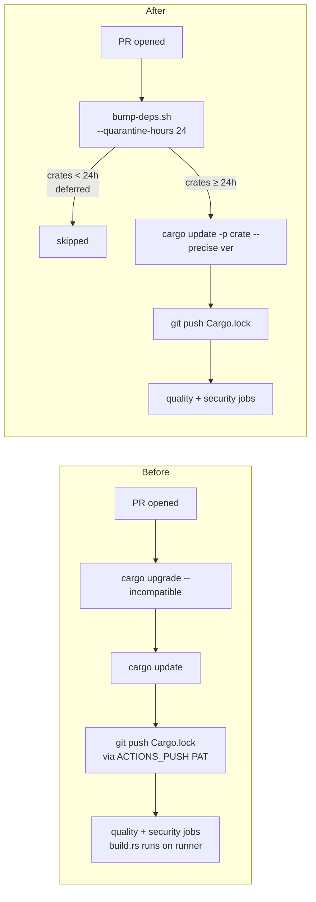

## Summary

Route every CI dependency-bump path through `bump-deps.sh` so the
`VIBE_BUMP_QUARANTINE_HOURS` (default 24h) release-age quarantine is honoured.
Closes #76.

Two workflows previously called `cargo upgrade` / `cargo update` directly,
bypassing the quarantine and pulling crates.io versions within minutes of
publish — exactly the supply-chain window `bump-deps.sh` was written to close:

- `.github/workflows/ci.yml` — `version-increment` job (runs on every PR,
  then pushes the rewritten `Cargo.lock` back to the PR branch using
  `ACTIONS_PUSH`).
- `.github/workflows/upgrade-dependencies.yml` — weekly cron + manual
  dispatch, opens an automated PR against `Develop`.

Both now invoke `./bump-deps.sh --quarantine-hours "${VIBE_BUMP_QUARANTINE_HOURS}"`.
The knob is fed from the `VIBE_BUMP_QUARANTINE_HOURS` repository variable
(falling back to `24`). Internal `stSoftwareAU/*` crates are unaffected —
`bump-deps.sh` only applies the quarantine to crates.io fetches.

A regression bats suite (`tests/scripts/ci_workflow_quarantine.bats`) asserts
the workflow files keep calling `bump-deps.sh` and never reintroduce a bare
`cargo upgrade` / `cargo update` — closing the "future edits silently
re-add the bypass" failure mode noted in the issue.

## Evidence

CLI-only change (workflow YAML + bats tests). Verified via:

- `bats tests/scripts/` → **56/56 pass** (8 new regression assertions plus
  the existing 48).
- `./quality.sh` → all stages green (shellcheck, codespell, deny, clippy,
  test, doc, release build).

### Flow change

## Test Plan

- `tests/scripts/ci_workflow_quarantine.bats` (new) — 8 assertions:
  - `ci.yml` invokes `bump-deps.sh` and references
    `VIBE_BUMP_QUARANTINE_HOURS`.
  - `upgrade-dependencies.yml` invokes `bump-deps.sh` and references
    `VIBE_BUMP_QUARANTINE_HOURS`.
  - Neither workflow contains an unguarded `cargo upgrade` or a bare
    `cargo update` (both bypass the quarantine).
- Existing `tests/scripts/bump_deps.bats` (12 cases) continues to pass —
  the quarantine helper itself is unchanged.
- `./quality.sh` runs the full Rust gate (clippy/test/doc/release) and
  passes cleanly.
