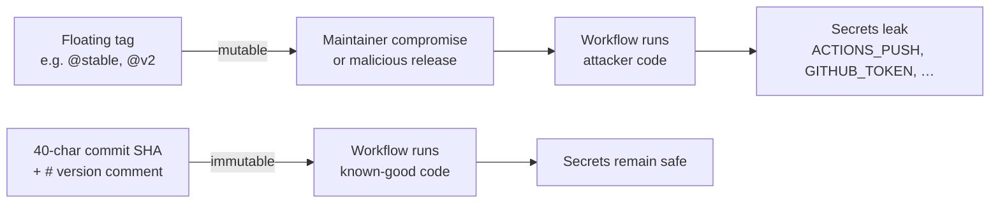

## Summary

Pinned every third-party GitHub Action across all CI workflows to a
40-character commit SHA, matching the pattern already used in
`.github/workflows/markdown-lint.yml`. Floating refs such as
`@v4`, `@v2`, or branch refs like `@stable` were a supply-chain risk:
a compromised maintainer account or a malicious release on any of the
referenced actions would have run inside our workflows with secrets
such as `ACTIONS_PUSH`, `GITHUB_TOKEN`, `GITLEAKS_LICENSE`, and
`SEMGREP_APP_TOKEN` available in `process.env`. Closes #77.

The human-readable version is preserved as a trailing comment on each
pinned step so Dependabot can still bump the pin and reviewers can see
which release is in use.

## Evidence

Bug-fix / CI-config change with no UI to screenshot. Evidence is the
new bats test suite plus the YAML diffs themselves.

### Workflow pinning flow

### Actions pinned (and the SHA chosen)

| Action | New SHA | Release |
| --- | --- | --- |
| `actions/checkout` | `34e114876b0b11c390a56381ad16ebd13914f8d5` | v4.3.1 |
| `dtolnay/rust-toolchain` | `29eef336d9b2848a0b548edc03f92a220660cdb8` | stable |
| `taiki-e/install-action` | `213ccc1a076163c093f914550b94feb90fab916d` | v2.79.2 |
| `Swatinem/rust-cache` | `c19371144df3bb44fab255c43d04cbc2ab54d1c4` | v2.9.1 |
| `codespell-project/actions-codespell` | `8f01853be192eb0f849a5c7d721450e7a467c579` | v2.2 |
| `rustsec/audit-check` | `69366f33c96575abad1ee0dba8212993eecbe998` | v2.0.0 |
| `actions/dependency-review-action` | `2031cfc080254a8a887f58cffee85186f0e49e48` | v4.9.0 |
| `peter-evans/create-pull-request` | `22a9089034f40e5a961c8808d113e2c98fb63676` | v7.0.11 |
| `gitleaks/gitleaks-action` | `ff98106e4c7b2bc287b24eaf42907196329070c7` | v2.3.9 |

Six workflow files updated:
`ci.yml`, `security.yml`, `upgrade-dependencies.yml`, `gitleaks.yml`,
`wasm-bundle.yml`, `semgrep.yml`. The reusable workflow call
`uses: ./.github/workflows/security.yml` in `ci.yml` is local and
correctly left as-is.

## Test Plan

- Added `tests/scripts/workflow_sha_pinning.bats` with three "what"
  tests:
  - `every action in every workflow is pinned to a 40-char commit SHA`
    — parses every `*.yml` under `.github/workflows/`, walks the
    `jobs[*].steps[*].uses` and job-level `uses:` keys, and fails if
    any external `uses:` does not match `^.+@[0-9a-f]{40}$`. Local
    reusable workflows (`./…`) are exempt.
  - `every SHA-pinned action has a version comment alongside it` —
    confirms each pinned step has either a trailing `#` comment or a
    nearby `#` comment within the step block so Dependabot and human
    reviewers can read the version.
  - `SHA-pin regex rejects floating tags and branch refs` —
    behavioural sanity check that the regex actually rejects
    `@v4`, `@v4.1.1`, `@stable`, etc. and accepts real 40-char SHAs.
- All 51 bats tests pass (`bats tests/scripts/`).
- `./quality.sh` passes cleanly (cargo fmt, clippy, deny, tests, doc,
  release build all green).
