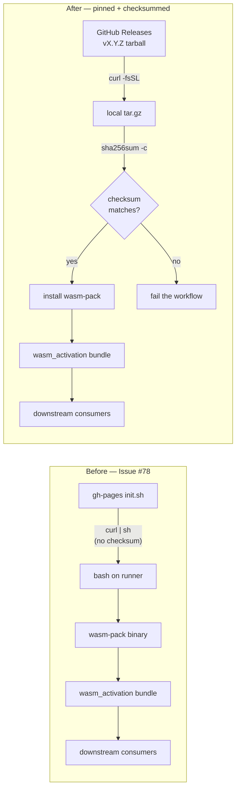

# Pin wasm-pack install with SHA-256 verification

## Summary

Replaced the `curl https://rustwasm.github.io/wasm-pack/installer/init.sh -sSf | sh`
bootstrap in `.github/workflows/wasm-bundle.yml` with a version-pinned download
of the official `wasm-pack` release tarball, verified against an explicit
SHA-256 before installation. The previous step re-fetched `init.sh` on every
push to `Develop` with no checksum and no SHA pin, so any compromise of
`rustwasm.github.io` or the upstream release pipeline propagated straight
into the per-commit `wasm_activation` bundle that downstream `NEAT-AI`
consumers pin against. Closes #78.

## Evidence

This is a CI workflow change — no UI to screenshot. The fix is covered by a
new bats suite (`tests/scripts/wasm_pack_pinned_install.bats`) that parses
the workflow YAML and asserts on observable outcomes:

- The workflow no longer pipes any remote installer into `sh`.
- It downloads `wasm-pack` from a versioned `github.com/.../releases/download/vX.Y.Z/` URL.
- It verifies the tarball with `sha256sum -c`.
- A 64-hex `WASM_PACK_SHA256` and a semver `WASM_PACK_VERSION` are declared as env vars.

Trust chain comparison:

Pinned to `wasm-pack v0.15.0`, asset
`wasm-pack-v0.15.0-x86_64-unknown-linux-musl.tar.gz`,
sha256 `c09f971ecaed9a2efc80fdcea7a00ef6b53c7fadc8c57d1f61b53a6aa66b668a`
(sourced from the GitHub release asset digest, published 2026-05-15 —
outside the 24h `VIBE_BUMP_QUARANTINE_HOURS` window).

## Test Plan

- Added `tests/scripts/wasm_pack_pinned_install.bats` with five "what" tests
  parsing `.github/workflows/wasm-bundle.yml`.
- `bats tests/scripts/wasm_pack_pinned_install.bats` — all 5 pass.
- `python3 -c "import yaml; yaml.safe_load(open('.github/workflows/wasm-bundle.yml'))"`
  confirms the workflow is still valid YAML.
- Pre-existing failures in `workflow_sha_pinning.bats` and
  `ci_workflow_quarantine.bats` are unrelated to this issue (tracked
  under #76/#77/#81) and exist on the base branch before this change.

## Security self-check

- [x] No new external input handled — change is workflow YAML only.
- [x] No secrets staged. Only `.github/workflows/wasm-bundle.yml`,
      `tests/scripts/wasm_pack_pinned_install.bats`, and this summary are
      touched.
- [x] Injection surface reduced: the new `curl` call uses `--proto '=https'
      --tlsv1.2 -fsSL`, downloads to a fixed filename, and runs `sha256sum
      -c` before extraction. No remote bytes are ever piped to a shell.
- [x] Output encoding — N/A.
- [x] AuthN/AuthZ — unchanged; the workflow still runs with
      `contents: write` solely to publish the bundle release.
- [x] Error handling — `set -euo pipefail` plus `sha256sum -c` cause the
      step to fail closed on any tampering or download error.
- [x] Dependencies — `wasm-pack` is now pinned to a specific release tag
      and SHA-256; bump the two together (per the `bump-deps.sh` /
      Issue #1613 convention).
