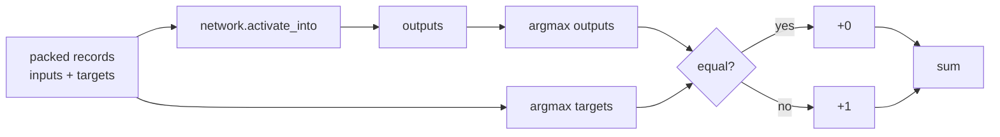

## Summary

Adds `categorical_error_sum_batch_packed` to `neat-core/src/loss.rs` and
re-exports it from the crate root. This is the seventh and final built-in
NEAT-AI cost function the native scorer needs (see
stSoftwareAU/NEAT-AI-scorer#119) — it mirrors the TypeScript
`CategoricalError` (argmax misclassification rate) and returns the count of
misclassified records, matching the `[inputs..., targets...]` packed-record
signature used by the existing `mse_/mae_/cross_entropy_/mape_/msle_/hinge_`
helpers so the scorer can dispatch all seven costs through a single
trait/enum. Closes #88.

Behaviour highlights:

- Per-record argmax comparison with first-index tie-breaking (matches the
  TS `a > b` convention on both target and output sides).
- Empty record set or `input_size + num_outputs == 0` returns `0.0`; a
  zero `num_outputs` also returns `0.0` (degenerate — no class to predict).
- Intentionally non-differentiable: this is a scoring / early-stop metric,
  not a gradient source.

## Evidence

Backend-only change — no UI to screenshot. Verified via `cargo test`,
`cargo clippy -- -D warnings`, and `RUSTDOCFLAGS=-D warnings cargo doc`.
All 5 new tests pass alongside the existing suite.



## Test Plan

New tests in `neat-core/src/loss.rs` (covers acceptance criteria one-to-one):

- `categorical_error_perfect_prediction_returns_zero` — three records where
  the target argmax matches the output argmax → `0.0`.
- `categorical_error_all_wrong_returns_record_count` — three records where
  every target argmax disagrees with the output argmax → `3.0`.
- `categorical_error_empty_input_returns_zero` — empty records, degenerate
  `input_size + num_outputs == 0`, and `num_outputs == 0` all return `0.0`.
- `categorical_error_ties_resolve_to_first_index` — three records share
  the 3-way-tied output `[1.0, 1.0, 1.0]`; tied targets verify first-index
  argmax on both target and output sides matches the TS reference.
- `categorical_error_mixed_batch_matches_reference` — six handcrafted
  records with annotated argmax expectations summing to `3.0`; also
  checks `forward_only=false` yields the same count on a stateless
  feed-forward creature.

Run locally:

```
cargo test -p neat-core --lib loss::tests::categorical
RUSTDOCFLAGS=-D warnings cargo doc --workspace --no-deps
```
