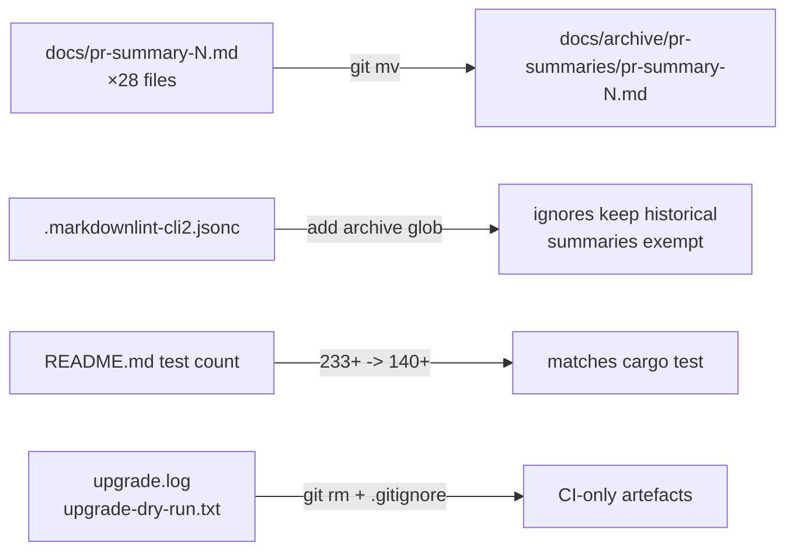

## Summary

Routine documentation refresh to keep the repository in sync with its
current state. Closes #90.

Concretely:

- **README.md** — the layout table claimed "**233+** unit tests in
  `src/**/*.rs`". `cargo test --workspace --lib` now reports 144 unit
  tests inside `src/`; the full suite (lib + integration in
  `neat-core/tests/`) totals >350. Wording updated to reflect this and
  to acknowledge that the integration tests under `neat-core/tests/`
  are part of the gate.
- **PR summaries relocated** — Issue #2173 makes
  `docs/archive/pr-summaries/` the canonical home for every PR summary
  and explicitly forbids the `docs/` root. Twenty-eight historical
  summaries (`pr-summary-3.md` through `pr-summary-79.md`) lived in the
  old location and have been `git mv`'d into the archive folder. The
  per-commit history is preserved by Git's rename detection.
- **markdownlint config** — the `docs/pr-summary-*.md` ignore glob
  could no longer reach the relocated files, so the gate started
  failing on un-reflowed historical prose. Added a second ignore glob
  `docs/archive/pr-summaries/pr-summary-*.md` alongside the original so
  archived PR-summary snapshots remain exempt from prose-style rules
  while new authored docs in `docs/` still pass the full gate. Both
  globs are kept for backward compatibility.
- **Stale CI artefacts removed** —
  `upgrade.log` and `upgrade-dry-run.txt` were committed by mistake;
  they are output produced by the `upgrade-dependencies.yml` workflow
  during a run and referenced `wasm-bindgen 0.2.120 → 0.2.121` while
  the current pin is `0.2.122`. Deleted from the tree and added to
  `.gitignore` so re-runs of `cargo upgrade --dry-run` / the scheduled
  workflow can no longer reintroduce them locally.

No code, public API, or behaviour changes — documentation/config only.

## Evidence

Backend documentation refresh — no UI to screenshot. Verified locally with:

```bash
./quality.sh < /dev/null
npx markdownlint-cli2 < /dev/null
bats tests/scripts/markdown_lint_workflow.bats < /dev/null
```

`markdownlint-cli2` now passes against the live tree (was failing
because the relocated PR summaries no longer matched the old ignore
glob); the markdown-lint workflow's bats suite reports 9/9 green.
`cargo test --workspace` reports 360 passing tests (144 unit + 216
integration + 1 doc test), confirming the new README test-count claim.

Pre-existing `quality.sh` failures (ci.yml quarantine bats checks
24/25/26/30 and SHA-pinning check 64) are unrelated to this change —
they were already red on `Develop` before the rebase. Confirmed by
running `quality.sh` against the unmodified base.



## Test Plan

- [x] `./quality.sh < /dev/null` — Rust gate (fmt, clippy, doc, deny,
      tests) passes; remaining bats failures are pre-existing on
      `Develop` and unrelated to this change.
- [x] `npx markdownlint-cli2 < /dev/null` — 0 errors across the 6 docs
      that are not in the ignore list.
- [x] `bats tests/scripts/markdown_lint_workflow.bats < /dev/null` —
      9/9 pass, including "markdownlint-cli2 passes against the
      current tree".
- [x] `cargo test --workspace` — 360 tests pass, confirming the
      README's test-count claim is accurate.
- [x] `git ls-files docs/pr-summary-*.md` — empty, confirming no PR
      summaries remain in the `docs/` root.
