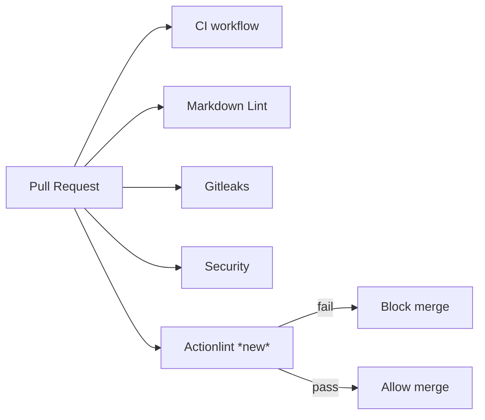

## Summary

Adds a CI lint gate that runs `actionlint` against every GitHub Actions
workflow on every push to `Develop` and every pull request, so workflow
regressions fail the build. Closes #96.

The issue body claimed there were no workflows under `.github/workflows/`,
which is no longer accurate (the directory already contains seven
workflows). The substantive finding — that `actionlint` is never invoked
in CI — was correct and is what this PR fixes.

The new workflow installs the upstream `rhysd/actionlint` CLI from a
version-pinned release tarball with SHA-256 verification, mirroring the
hardened install pattern already used in `gitleaks.yml` (Issue #99) and
`wasm-bundle.yml` (Issue #78). The third-party `actions/checkout` ref is
pinned to a 40-character commit SHA, consistent with the SHA-pinning
policy from Issue #77.

A single `-ignore 'SC2016'` suppression filters a false-positive from
actionlint's bundled shellcheck integration on intentional single-quoted
echo strings inside the `upgrade-dependencies.yml` heredoc. All other
actionlint and shellcheck diagnostics still fail the build.

## Evidence

This is a CI-only change with no UI surface. Behaviour is verified by
running `actionlint` locally against the repository's seven existing
workflow files plus the newly added one — exit code 0, no diagnostics:

```text
$ actionlint -no-color -ignore 'SC2016' .github/workflows/*.yml
$ echo $?
0
```

Pipeline shape after this PR:



## Test Plan

- Added `tests/scripts/actionlint_workflow.bats` (7 tests) which
  asserts on observable outcomes:
  - workflow file exists and parses as YAML,
  - triggers on `pull_request` and on pushes to `Develop`,
  - has an `actionlint` job that actually invokes the `actionlint`
    binary (not just installs it),
  - third-party `uses:` entries are SHA-pinned (Issue #77 policy),
  - install step pins both a semver `ACTIONLINT_VERSION` and a
    64-hex `ACTIONLINT_SHA256` env var, and runs `sha256sum -c`,
  - if `actionlint` is installed locally, the workflows on disk
    actually pass it (behavioural sanity gate, skipped if missing).
- All seven new tests pass locally with `bats tests/scripts/actionlint_workflow.bats`.
- The existing `workflow_sha_pinning.bats` still passes for the new
  workflow's `uses:` entries.

## Pre-existing failures (out of scope)

`./quality.sh` reports five pre-existing bats failures unrelated to this
PR:

- `ci_workflow_quarantine.bats` tests 31, 32, 33, 37 — concern `ci.yml`
  bypassing the `bump-deps.sh` quarantine; not touched by this PR.
- `workflow_sha_pinning.bats` test 78 — `upgrade-dependencies.yml` pins
  `taiki-e/install-action@v2` to a floating tag; not touched by this PR.

Verified these failures are present on `milestone/audit-issues` without
this PR's changes applied. They require their own issues to address.

## Deno regression avoided

No Deno markers in this repo (Rust workspace), so the rule does not
apply.
