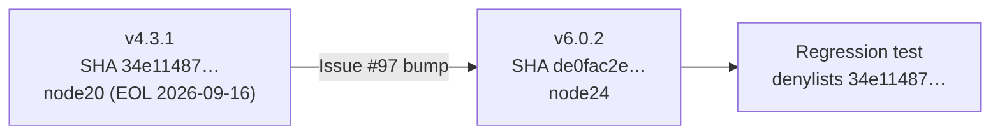

## Summary

Bumped `actions/checkout` from the deprecated v4.3.1 pin (SHA `34e114876b…`, runs on Node 20, EOL on GitHub-hosted runners 2026-09-16) to v6.0.2 (SHA `de0fac2e45…`, runs on Node 24) across every workflow in `.github/workflows/`. Added a regression test that denylists the deprecated SHA so a future revert is caught at quality-check time. Closes #97.

## Evidence

Backend/CI-only change — no UI to screenshot.

- `actions/checkout@v6.0.2` runtime confirmed as `node24` via the GitHub API:
  `gh api "repos/actions/checkout/contents/action.yml?ref=v6.0.2"` → `using: node24`.
- Every workflow under `.github/workflows/` now references the new SHA:

  ```
  $ grep -rn "actions/checkout@" .github/workflows/
  ci.yml, markdown-lint.yml, gitleaks.yml, wasm-bundle.yml,
  security.yml, upgrade-dependencies.yml, semgrep.yml
  → all pinned to @de0fac2e4500dabe0009e67214ff5f5447ce83dd  # v6.0.2
  ```

- Regression test (`tests/scripts/workflow_sha_pinning.bats`, new test "no workflow uses actions/checkout pinned to a deprecated Node runtime") was verified to **fail** against the pre-fix workflows and **pass** after the bump.



## Test Plan

- Added `tests/scripts/workflow_sha_pinning.bats::"no workflow uses actions/checkout pinned to a deprecated Node runtime"` — parses each workflow YAML and asserts no `uses:` ref ends with the deprecated SHA. Maintains a denylist keyed by SHA so future Node-runtime EOLs (e.g. node22) can be appended.
- Updated the existing `"SHA-pin regex rejects floating tags and branch refs"` test's positive example from the now-deprecated SHA to the new v6.0.2 SHA.
- `./quality.sh < /dev/null` passes the new test and shows the same 5 pre-existing failures as the milestone base branch (unrelated `cargo upgrade` quarantine checks in `ci.yml` and a pre-existing unpinned `taiki-e/install-action@v2` in `upgrade-dependencies.yml`) — no new failures introduced.

## Out of scope

- The pre-existing unpinned `taiki-e/install-action@v2` in `upgrade-dependencies.yml` and the `ci.yml` bare `cargo upgrade`/`cargo update` failures are tracked separately under the `github-actions-audit` milestone.
