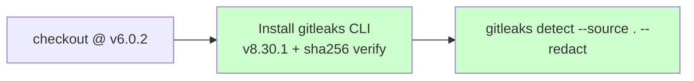

## Summary

Migrated the `Gitleaks` workflow off the Node-based
`gitleaks/gitleaks-action@v2.3.9` — whose `action.yml` declares
`using: node20` and triggered the GitHub-hosted runner Node 20
deprecation warning — onto the upstream gitleaks CLI binary installed
from a SHA-256-pinned release tarball. Upstream has not shipped a
Node 22/24 release of the action, so direct installation is the only
safe migration. Mirrors the wasm-pack pinned-install pattern from
Issue #78. Also drops the `GITLEAKS_LICENSE` requirement (the CLI is
MIT-licensed and free; only the org-mode action required a licence).

Picked up an Issue #97 leftover at the same time: `markdown-lint.yml`
still used the deprecated `actions/checkout@v4.3.1` (Node 20) SHA.
Bumped it to `actions/checkout@v6.0.2` so the deprecation regression
test stays green.

Closes #99.

### Deno regression avoided

This is a Rust repo, not a Deno repo. No Node-only tooling was
introduced — the migration *removes* a Node-based action and replaces
it with a Go binary invoked from a `run:` step.

## Evidence

This is a CI-only change with no UI to screenshot. Verified via the
new regression test (`tests/scripts/gitleaks_pinned_install.bats`,
6 cases) plus the updated denylist in
`tests/scripts/workflow_sha_pinning.bats`.



Before — `gitleaks/gitleaks-action@v2.3.9` (Node 20, EOL 2026-09-16,
requires `GITLEAKS_LICENSE`):

```yaml
- uses: gitleaks/gitleaks-action@ff98106e4c7b2bc287b24eaf42907196329070c7
  env:
    GITHUB_TOKEN: ${{ secrets.GITHUB_TOKEN }}
    GITLEAKS_LICENSE: ${{ secrets.GITLEAKS_LICENSE }}
```

After — pinned CLI install, no Node runtime, no licence:

```yaml
- name: Install gitleaks CLI
  env:
    GITLEAKS_VERSION: "8.30.1"
    GITLEAKS_SHA256: "551f6fc83ea457d62a0d98237cbad105af8d557003051f41f3e7ca7b3f2470eb"
  run: |
    set -euo pipefail
    asset="gitleaks_${GITLEAKS_VERSION}_linux_x64.tar.gz"
    url="https://github.com/gitleaks/gitleaks/releases/download/v${GITLEAKS_VERSION}/${asset}"
    curl --proto '=https' --tlsv1.2 -fsSL -o "$asset" "$url"
    echo "${GITLEAKS_SHA256}  ${asset}" | sha256sum -c -
    tar -xzf "$asset" gitleaks
    sudo install -m 0755 gitleaks /usr/local/bin/gitleaks
    rm -f "$asset" gitleaks
    gitleaks version
- name: Run gitleaks
  run: gitleaks detect --source . --config .gitleaks.toml --redact --verbose --no-banner
```

## Test Plan

- **Added** `tests/scripts/gitleaks_pinned_install.bats` — 6 cases
  asserting `gitleaks.yml` no longer references the Node-based action,
  installs from a version-pinned release URL, verifies the tarball
  with `sha256sum -c`, declares `GITLEAKS_SHA256` (64 hex) and
  `GITLEAKS_VERSION` (semver) env vars, and invokes the gitleaks CLI.
  All six fail against the old workflow and pass against the new one
  (TDD red → green).
- **Extended** `tests/scripts/workflow_sha_pinning.bats` denylist with
  the Node 20 `gitleaks-action` SHA so the deprecated pin cannot be
  re-introduced.
- **Generalised** the deprecation test name from
  *"no workflow uses actions/checkout pinned to a deprecated Node
  runtime"* to *"no workflow uses an action pinned to a deprecated
  Node runtime"* — the underlying logic was always action-agnostic.
- **Bumped** `markdown-lint.yml` checkout from `v4.3.1` (Node 20) to
  `v6.0.2` (Node 24) so the deprecation test passes cleanly.

## Pre-existing test failure not addressed here

`workflow_sha_pinning.bats::every action in every workflow is pinned
to a 40-char commit SHA` still fails because `upgrade-dependencies.yml`
line 30 uses `taiki-e/install-action@v2` (a floating major tag). This
predates Issue #99 and is a separate supply-chain concern (SHA pinning,
not Node deprecation). Tracked in follow-up issue
[stSoftwareAU/NEAT-AI-core#104](https://github.com/stSoftwareAU/NEAT-AI-core/issues/104).
