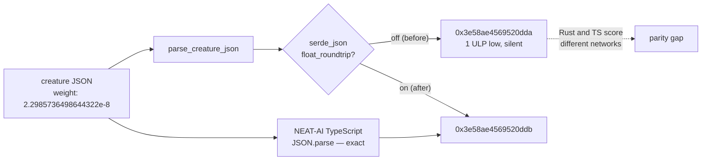

# Creature weights parsed 1 ULP off: `serde_json` built without `float_roundtrip`

## Summary

`neat-core` loaded creature synapse weights and neuron biases up to **1 ULP**
away from the value the JSON literal names, because `serde_json` was built
without its `float_roundtrip` feature. The default number parser is a fast
approximation; the exact algorithm is opt-in. JavaScript `JSON.parse` — and
Rust's own `f64::from_str` — are always exact, so the Rust engines
(NEAT-AI-Backpropagation, NEAT-AI-scorer, NEAT-AI-Lamarck) trained and scored a
*slightly different network* from the one NEAT-AI's TypeScript loaded. Unlike
the duplicate-synapse parity gap (#556) this failed silently: nothing errored,
the number was just marginally wrong.

It also made the `creature.rs` module contract untrue — "round tripping —
`parse -> serialise -> parse` — preserves every field" (Issue #30) — because a
weight that parsed to the wrong neighbour was re-emitted as that neighbour's
shortest text and never came back.

The fix is one line of manifest plus its gate: `neat-core/Cargo.toml` now
declares `serde_json = { version = "1", features = ["float_roundtrip"] }`. No
public API, no wire format and no serialised layout changes — the *write* side
was always exact (`serde_json` emits shortest-round-trip text). Values that
previously drifted now move to the correct `f64`, which is the direction of
TypeScript parity.

**Non-breaking, patch bump.** No public item is added, removed, narrowed or
re-typed, and the `.bin` training-stream format is untouched. The behaviour
change makes the crate match its own documented contract rather than departing
from it, so under `RELEASING.md` this is a patch (`0.10.0 → 0.10.1`), not a
major-equivalent. Consumers pinning a **bit-exact** score fixture may need to
re-baseline it — see "Consumer impact" below for what was actually measured.

## Evidence

Library change with no web interface to screenshot. The evidence is the reported
drift, reproduced on the real production creature and then cleared, plus a
side-by-side against the TypeScript parser this fix exists to agree with.



### The real sampler creature, before and after

A production sampler fixture at the sampler tip (2,602 neurons, 24,232
synapses, 3.0 MB), through `parse_creature_json -> creature_to_json ->
parse_creature_json`. Only `neat-core` differs between the two runs:

```text
# before — serde_json default parser
round_trip_equal=false
  synapse[10518] 0.000000022985736498644322 != 0.00000002298573649864432
weight_drift=1

# after — serde_json with float_roundtrip
round_trip_equal=true
weight_drift=0
```

That is exactly the issue's report — one synapse of 24,232, the
`input-542 -> neuron-1514601746` weight, adjacent `f64` values
`0x1.8ae4569520ddbp-26` vs `0x1.8ae4569520ddap-26`.

### Agreement with the TypeScript parser

The `f64` bit pattern each literal yields, straight out of
`parse_creature_json`, against `JSON.parse` under Deno (V8). Ten literals, all
ten previously wrong, all ten now identical to TypeScript:

| Literal | neat-core before | neat-core after | TypeScript `JSON.parse` |
|---|---|---|---|
| `2.2985736498644322e-8` | `0x3e58ae4569520dda` | `0x3e58ae4569520ddb` | `0x3e58ae4569520ddb` |
| `-0.20221894534048165` | `0xbfc9e24f766f3abe` | `0xbfc9e24f766f3abf` | `0xbfc9e24f766f3abf` |
| `-104913124.37877665` | `0xc19903639183de06` | `0xc19903639183de07` | `0xc19903639183de07` |
| `-187348849289.48602` | `0xc245cf6e4944be35` | `0xc245cf6e4944be36` | `0xc245cf6e4944be36` |
| `3.518437208883201171875e13` | `0x42c0000000000001` | `0x42c0000000000002` | `0x42c0000000000002` |
| `7.038531e-26` | `0x3ab5c87fafffffff` | `0x3ab5c87fb0000000` | `0x3ab5c87fb0000000` |
| `8.988465674311579e307` | `0x7fe0000000000000` | `0x7fdfffffffffffff` | `0x7fdfffffffffffff` |
| `2.2250738585072011e-308` | `0x0010000000000000` | `0x000fffffffffffff` | `0x000fffffffffffff` |
| `5.911867584488277e-25` | `0x3ae6ded47f967086` | `0x3ae6ded47f967087` | `0x3ae6ded47f967087` |
| `-2.3359371920453957e-123` | `0xa678b4fb909fceff` | `0xa678b4fb909fcf00` | `0xa678b4fb909fcf00` |

### How common the drift was

Shortest-form text of 199,894 pseudo-random finite `f64` values, re-parsed:

```text
before: checked=199894 mismatches=59253   (29.6%)
after:  checked=199894 mismatches=0
```

Roughly three in ten weights across the full exponent range. Real creature
weights cluster in a narrow band, which is why only one synapse of 24,232 drifts
in practice — but "one weight per creature is silently wrong" is still a network
neither engine agrees on.

### Cost

Parsing the same 3.0 MB creature, release build, best-of-25 on this host:

| | best | median |
|---|---|---|
| before | 5.37 ms | 6.61 ms |
| after | 6.12 ms | 7.44 ms |

~0.7 ms on a **one-off** creature load, against training runs measured in
minutes. `Cargo.lock` is unchanged — `float_roundtrip` pulls in no new
dependency, so there is no supply-chain or `cargo deny` surface to it.

### Consumer impact

Both Rust consumers were built and tested against the patched sibling
(`../../NEAT-AI-core/neat-core`) on this host:

- **NEAT-AI-Backpropagation** — `cargo test --workspace` green: 144 tests, 0
  failures across all ten targets, including `mse_surface_agreement`,
  `trained_creature_validation` and `forward_only_guard`. No score fixture
  needed re-baselining.
- **NEAT-AI-scorer** — `cargo build --release -p rust_scorer` green. Its
  **test** targets do not compile against `neat-core` `Develop`, but that
  predates this change and is unrelated to it: `rust_scorer/src/scoring.rs`
  builds `CreatureExport` / `NeuronExport` struct literals that are missing the
  `memetic` and `id` fields added by #559, and the repo's
  `neat-core.expected-version` baseline is still `0.9.0`. That acknowledgement
  is already tracked in the downstream production trainer's own backlog.

### Quality gates

- `./quality.sh` — `✅ All quality checks passed!` (bash syntax, shellcheck,
  bats, TypeScript gate, Mermaid gate, codespell, rustfmt, clippy `-D warnings`,
  `cargo test --workspace` 58 green targets, doctests, rustdoc, release build).
- `cargo check -p neat-core --target wasm32-unknown-unknown` **could not run on
  this host**: `error[E0463]: can't find crate for 'std'` — the target's std is
  not installed and there is no `rustup` on the box to add it. The change is
  target-agnostic: a Cargo feature on `serde_json`, no `cfg`, no `arch`, no SIMD
  and no new dependency (`Cargo.lock` unchanged).

## Test Plan

New file `neat-core/tests/creature_float_roundtrip.rs`, five tests. Every
oracle is independent of `serde_json`: either the `f64` bit pattern the test
itself started from, or `f64::from_str` over the same literal text.

- `synapse_weight_parses_to_the_f64_the_literal_names` — the ten literals above
  as a synapse weight.
- `neuron_bias_parses_to_the_f64_the_literal_names` — the same as a neuron bias.
- `memetic_weight_and_bias_parse_to_the_f64_the_literals_name` — `memetic`
  row weights and the `biases` map, the other two `f64` fields on the wire.
- `parse_serialise_parse_preserves_every_hard_weight` — the Issue #30 round-trip
  contract the module docs state, asserted on the whole `CreatureExport`.
- `shortest_form_text_of_any_f64_parses_back_to_that_f64` — the **general
  case**: a fixed-seed xorshift sweep of 4,000 `f64` values, each formatted to
  its shortest text and parsed back, asserted against the bit pattern it started
  from. This is what stops the fix being mistaken for a special case on the ten
  literals, and it carries a floor assertion (`checked > 3_000`) so it cannot
  skip its way to green.

### Mutation evidence

Every one of the five is red against the unfixed manifest and green with it —
verified by running the file both ways:

```text
# neat-core/Cargo.toml at `serde_json = "1"`
test result: FAILED. 0 passed; 5 failed

# with features = ["float_roundtrip"]
test result: ok. 5 passed; 0 failed
```

The failure messages name the drift directly, e.g.
`2.2985736498644322e-8: parsed 2.298573649864432e-8 (0x3e58ae4569520dda) but the
literal names 2.2985736498644322e-8 (0x3e58ae4569520ddb)`. Reverting the one
manifest line is the whole mutation, so there is no second site to sweep.

No existing test was removed, weakened or modified.

### Documentation

- `neat-core/src/creature.rs` — module docs gain an **Exact float parsing**
  paragraph beside the round-trip contract it repairs, and
  `parse_creature_json` states the guarantee.
- `README.md` — new section "Creature weights parse to the exact `f64`"
  beside the other cross-engine parity rules, with the measured
  numbers and a Mermaid diagram.
- `AGENTS.md` — a short durable note that the feature is load-bearing and must
  not be dropped as unused by a dependency-hygiene sweep, naming the test that
  guards it.
