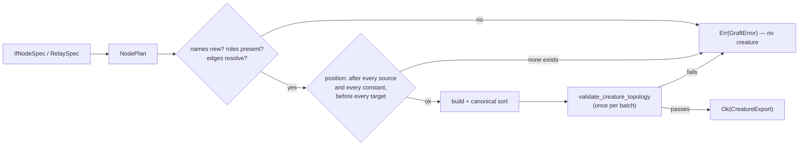

# if_graft: typed outward edges, batched grafts and the IDENTITY relay

## Summary

`if_graft` could only build one complete `IF` node at a time with untyped
outward edges, so two shapes NEAT-AI-Forests needs had to be hand-written there
instead (NEAT-AI-Forests #48):

1. **A nested tree.** `graft_if_node` requires every outward edge to name a
   neuron that already exists and refuses a node with none (`NoTargets`), so a
   post-order tree could not be grafted node by node — the child needs its
   parent as a target before the parent exists. `graft_if_tree` validates after
   every node, so it could not batch them either.
2. **A correction entering both branches of an `IF` destination.** An untyped
   synapse into an `IF` neuron feeds one branch only, and `with_target` emitted
   nothing else.

This adds:

- `GraftEdge::role` (`SynapseType`, `Standard` = untyped as before) and
  `IfNodeSpec::with_target_role` / `RelaySpec::with_target_role` — a **typed**
  outward edge that reaches one named branch. A role set on an *inbound* edge is
  refused (`InboundEdgeHasRole`) rather than ignored: an inbound edge takes its
  role from the branch it is listed under.
- `graft_if_nodes` — an all-or-nothing batch where a node may leave `targets`
  empty **provided** a later node in the same batch names it as a branch source.
  The assembled creature is validated once, at the end. A node nothing ever
  reads is still `NoTargets`.
- `RelaySpec` / `graft_relay_node` — an IDENTITY hidden neuron that passes its
  inbound sum on, so a node's value can reach a second branch of a destination
  it already feeds (a creature may not carry two synapses between the same
  ordered pair).
- Placement now lists a grafted node after **every** constant the creature
  carries, not merely after the last one it reads. Reading three of four
  constants used to land the node between them, leaving a constant behind a
  hidden neuron — `creature_validate` rule 11. Where no such position exists the
  new `ConstantAfterPosition` names the blocking constant instead of emitting a
  creature the validator rejects.

All four kinds of graft now reduce to one internal `NodePlan`, so the name,
finiteness, duplicate-edge, placement and ordering rules have a single home.

Additive: existing signatures, `GraftEdge::new`, and every previously accepted
spec behave as before.

## Evidence

`cargo test --workspace` is green (all suites), as are `cargo fmt --check` and
`cargo clippy --workspace --all-targets --all-features -D warnings`.

**Mutation evidence** — each new rule was mutated in turn and the suite went red
for it (all mutations reverted):

| Mutation | Test that died |
|----------|----------------|
| drop the "after every constant" clamp (`earliest.max(last + 1)` → `earliest`) | `a_grafted_node_is_listed_after_every_constant_the_creature_carries` |
| emit outward edges untyped (`synapse_type_name_from(edge.role)` → `None`) | `a_typed_outward_edge_reaches_the_named_branch_of_an_if_target`, `a_relay_carries_a_second_typed_edge_into_the_same_target` |
| never require targets in a batch (`!fed_to_a_later_node` → `false`) | `a_batched_graft_still_refuses_a_node_nothing_ever_reads` |

## Test Plan

Added to `neat-core/tests/if_graft.rs` (11 tests), each asserting on an
observable outcome — the returned creature, its compiled activations, or the
typed error:

- `a_typed_outward_edge_reaches_the_named_branch_of_an_if_target` — the
  correction lands only on the branch the `IF` output takes; the delta is
  derived from the spec, not read back from the graft.
- `an_outward_edge_with_no_role_stays_untyped` — the default is unchanged.
- `rejects_an_explicit_role_on_an_inbound_edge`.
- `a_batched_graft_wires_a_child_into_its_parents_branch` — nested tree
  activations against an independently written `tree_value`, plus child-before-
  parent order and the `positive` role on the child's edge.
- `a_batched_graft_still_refuses_a_node_nothing_ever_reads`.
- `a_batched_graft_is_all_or_nothing` — the source creature is untouched.
- `a_batched_graft_of_nothing_returns_the_creature_unchanged`.
- `a_grafted_node_is_listed_after_every_constant_the_creature_carries` — plus
  `creature_validate` acceptance.
- `a_relay_carries_a_second_typed_edge_into_the_same_target` — the correction
  applies on both branches of an `IF` output.
- `a_relay_with_no_source_or_no_target_is_refused`.
